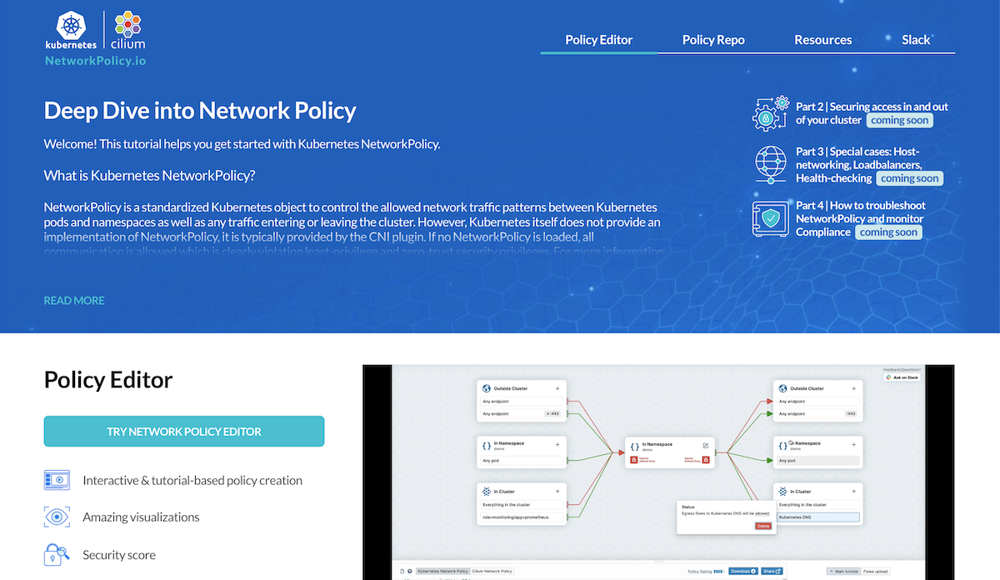
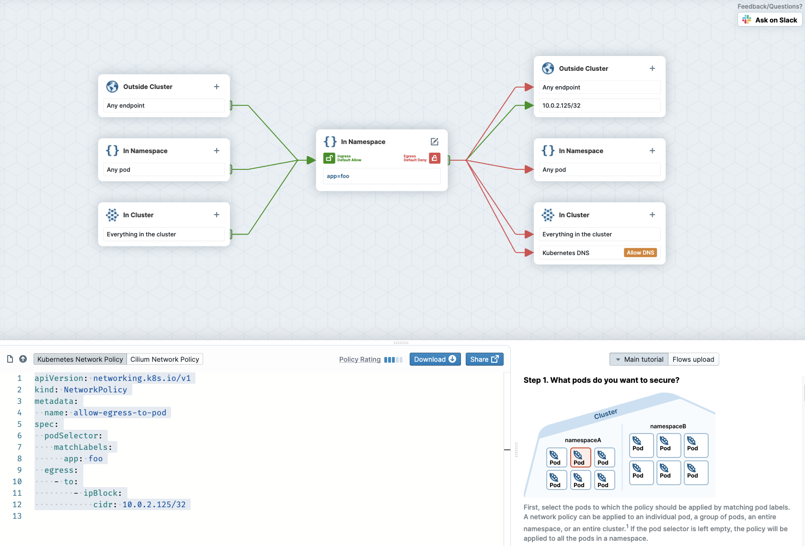

We’ve just launched a new community resource: <a href="https://networkpolicy.io" target="_blank">networkpolicy.io</a>, to help people learn how to apply Kubernetes network policies to protect their business-critical workloads. But why do we need network policies at all? Let’s consider why traditional network security approaches aren’t sufficient in the cloud native world, and see what advantages we can gain through network policies.

Network security isn’t a new concept. The term “firewall”in the context of IT was apparently coined by the scriptwriters of 1983 movie <a href="https://screenrant.com/80s-sci-fi-movies-predicted-the-future/" target="_blank">War Games</a>, and the technology <a href="https://docstore.mik.ua/univercd/cc/td/doc/product/iaabu/centri4/user/scf4ch3.htm#xtocid8" target="_blank">evolved</a> to become commonplace by the early 90s. It should be no surprise that the requirements on network security products have moved on quite a bit after thirty years! Kubernetes has proved to be quite the game-changer for many aspects of deploying and running software, and one of the changes it demands is a new approach to network security.

Fortunately, Kubernetes brings with it the built-in concept[^1] of Network Policy that takes us in the right direction. Even better, Network Policies can be the basis for even stronger, more granular network security than we enjoyed in the old days of monoliths and firewalls.

## IP addresses are in flux

The main reason we can’t just rely on old-fashioned firewalls is that Kubernetes deployments are dynamic. Pods appear and disappear frequently, and they get scheduled onto different machines across the deployment. Each pod gets assigned an IP address, but that IP address is ephemeral, like the pod itself, and the set of IP addresses being used across your application today might be very different tomorrow.

In the old days, firewall rules would be defined in terms of IP addresses and ports, but that makes no sense when IP addresses are constantly in flux.

## Application code is distributed across nodes

Another problem with traditional firewalls is that they don’t have visibility into traffic flowing within any given node. In the traditional approach, you would know what application code is running on each (virtual) machine in your deployment. You might have a set of machines handling the front end, another set handling the database and so on. A network firewall can police the traffic flowing into and out of each node, with rules that reflect the code that’s running on the machine in question.

But in the cloud native world, there is a much looser relationship between host machines and the code that runs on them. Kubernetes schedules each new pod to a suitable node in the cluster, such that any given node could have a variety of different pods running on it. A traditional firewall wouldn’t have visibility into the traffic between pods that happen to be co-located on the same machine.

## Network Policy objects

Kubernetes uses Network Policy to define rules about what traffic is allowed within a deployment. Instead of using IP addresses, the pods affected by rules are identified using <a href="https://kubernetes.io/docs/concepts/overview/working-with-objects/labels/#label-selectors" target="_blank">Label Selectors</a>, in much the same way that pods are assigned to services. All the pods with the defined label(s) match the policy at any given time, so there’s no need to change the policy to keep up to date with the comings and goings of different pods. And the rules apply wherever a pod lives in the cluster, even if traffic is flowing between pods on the same node.

The Kubernetes NetworkPolicy resource also lets us define what external traffic is permitted into (ingress) or out of (egress) a set of pods. In this situation, IP addresses can be useful - for example, other clusters or other sets of machines in your estate can be defined with an IP CIDR (a range of IP addresses).

Some network plugins extend the basic concepts of Kubernetes Network Policy to provide additional capabilities. One simple example is that Cilium lets you define egress rules in terms of DNS names. This means you can set up a policy to allow your pods to send messages to some-domain.com without needing to worry about the possibility of the domain moving to a different IP address.

## Increasing the granularity of security

The cloud native approach encourages us to architect applications in the form of services or even microservices, so that they can be developed, deployed and scaled independently. A useful corollary is that they can also be secured independently, and Network Policies give us a tool to help us do exactly that. We can build network policies that only permit the expected traffic to and from each microservice.

For example, in an e-commerce application, we expect to see a product search microservice to respond to requests from a frontend service, and look up information in a product database. There is no need to give the product search service the ability to make any other network connections except to that database. Then if an attacker does manage to compromise the product search app code (perhaps through a vulnerability in its code or one of its dependencies), it’s much harder for the attacker to move laterally from the product search pod to any other part of the system.

Fine-grained network policy definitions allow us to give minimal, least-privilege permissions to the different microservices in our application. This limits the possible blast radius of a successful exploit of any part of the system.

## Learning about Network Policies

We’ve just launched <a href="https://networkpolicy.io" target="_blank">networkpolicy.io</a> with lots of useful resources for learning about Network Policies. You’ll find the <a href="https://editor.cilium.io" target="_blank">Network Policy editor</a> is a helpful tool for visualizing the effects that a policy will have on traffic. Network policies can be notoriously tricky and one small mistake can lead to lots of mischief. Using the editor can help avoid these mistakes and give you the confidence to deploy new policies.

You might also be interested in the <a href="https://github.com/networkpolicy/tutorial" target="_blank">Network Policy tutorial</a> that walks you through different scenarios for policy rules.

[^1]: Kubernetes defines the NetworkPolicy object but it doesn’t enforce it within Kubernetes. You’ll need a networking plugin - for example Cilium - that does the work. If you use a networking plugin that doesn’t implement network policy, your policies will just be ignored.

  

    
      Author: <a href="https://twitter.com/lizrice">Liz Rice</a>. 
    
    
      Liz is Chief Open Source Officer at <a href="https://isovalent.com" target="_blank">Isovalent</a>, the company behind Cilium. She is also chair of the CNCF's Technical Oversight Committee, and the author of Container Security published by O'Reilly.
    
  

