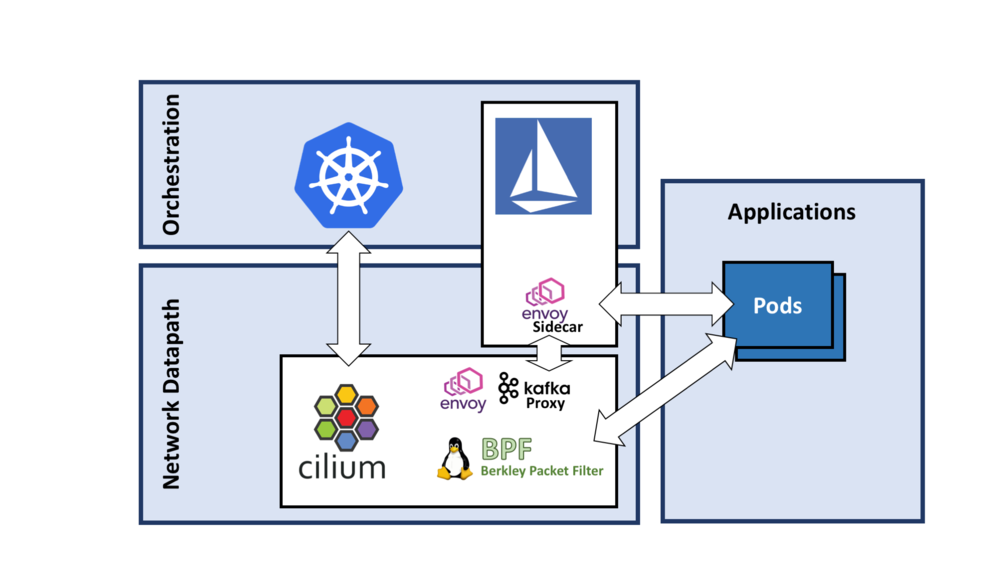
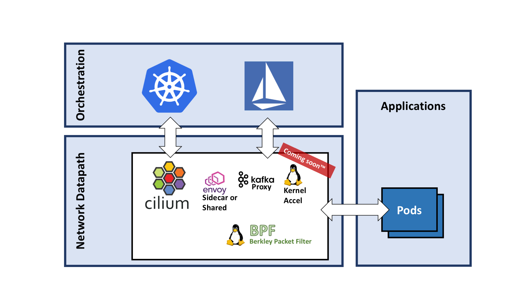
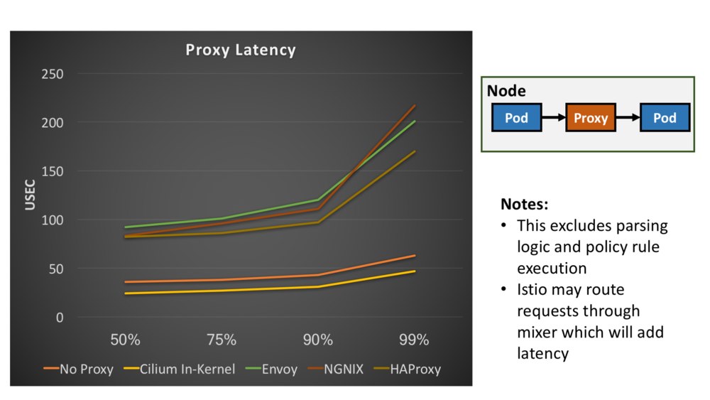

There is a lot of excitement around Istio this week at KubeCon. We are getting pinged multiple times a day with questions on how exactly Cilium and Istio relate to each other. This blog post serves to answer a couple of simple questions: How is Istio related to Cilium? Can I use both together? Will one benefit from the other?

Istio abstracts away a lot of networking specific complexity and provides visibility and control to application teams. We couldn't agree more with the move of networking to Layer 7 and the concept to provide the necessary instruments for efficient operation at the application protocol layer.

## What is Istio?

If you are new to Istio, take a moment and read the [Istio Overview](https://istio.io/latest/docs/concepts/what-is-istio/) in the Istio documentation to make yourself familiar with the goals and non-goals of Istio.

## What is Cilium?

Cilium comes in the form of a networking plugin and thus integrates at a lower level with the orchestration system. Cilium and Istio share a common goal though, both aim to move visibility and control to the application protocol level (HTTP, gRPC, Kafka, Mongo, ...). Cilium uses a combination of components to provide this functionality:

- An agent written in golang that runs on all nodes to orchestrate everything. This agent is integrated with orchestration systems such as Kubernetes.
- A datapath component that utilizes the BPF (Berkley Packet Filter) functionality in the Linux kernel for very efficient networking, policy enforcement, and load balancing functionality.
- A set of userspace proxies, one of them is [Envoy](https://github.com/envoyproxy/envoy), to provide application protocol level filtering while we are completing the in-kernel version of this. More on this below.

Istio itself is using [Envoy](https://github.com/envoyproxy/envoy) as well for the implementation of its datapath. The deployment model of Envoy is slightly different though. Istio currently runs Envoy in a sidecar configuration inside of the application pod. Cilium runs Envoy outside of the application pod and configures separate listeners for individual pods. There is no right or wrong in this model, both have advantages and disadvantages on a variety of aspects including operational complexity, security, resource accounting, total footprint. Cilium will likely allow running either model in the future. In short, we had to start somewhere.

## Can I run Cilium alongside Istio?

Absolutely. It is perfectly fine to run Cilium as a CNI plugin to provide networking, security, and loadbalancing and then deploy Istio on top.

If you want to give it a try right away, you can follow our getting started guide to get going:

- [Get Started Using Istio and Cilium](http://docs.cilium.io/en/stable/gettingstarted/istio/)

The following diagram shows how such an architecture will look like.

## How will Istio benefit from Cilium?

We are very excited about BPF and how it is changing how security and networking are done with Linux. You can read up on a lot of details in our [Concepts](http://docs.cilium.io/en/stable/concepts/) section of the docs. The rest of this blog will focus on how exactly that applies to the Istio architecture.

There are multiple levels of integration between Cilium and Istio that make sense for both projects. We'll go into some details for all of them but focus on the key point first to explain why you may care.

The above diagram shows how the Cilium datapath can be leveraged by Istio and Kubernetes at the same time. Istio and Kubernetes can both be used as orchestration planes in a collaborative manner. Neat, what does this give me?

We talked about BPF and our in-kernel work before. We have already merged the initial bits of this work into the upstream Linux kernel and are at the point where we can perform initial measurements of the benefits of implementing layer 7 functionality in the kernel.

The following graph lists latency measurements in microseconds for various proxies that are known to be high performing. The latencies are ranked by percentile. The setup is very simple: Two containers running in a pod each are talking to each other via one of the listed proxies. No policy rules, no routing rules, no iptables.

You should take these measurements with a big tablespoon of salt. These are early measurements done on one particular system. We have done these measurements to verify the initial implementation and to validate whether it makes sense to continue. It is not our goal to make one proxy look better than the other. What we are demonstrating here is that it is worth rethinking how and where to perform the datapath operations because the difference is an order of magnitude. The numbers are **very** promising as you can see and have reassured us to continue down this path. While we are measuring latency here, this obviously translates to the use of compute spent handling individual requests as well.

## Why is the In-kernel proxy faster than not running a proxy at all?

When changing how to approach a problem. Completely new solutions often present themselves. One of them is what we call socket redirect. The in-kernel proxy is capable of having two pods talk to each other directly from socket to socket without ever creating a single TCP packet. This is very similar to having two processes talk to each other using a UNIX domain socket. The difference is that the applications can remain unchanged while using standard TCP sockets.

The difference in the two lines between "No Proxy" and "Cilium In-Kernel" is thus the cost of the TCP/IP stack in the Linux kernel.

## How else can Istio and Cilium benefit from each other?

While the difference in datapath performance and latency is the key element of what Cilium can bring to Istio. Istio can enrich Cilium in various aspects:

- Use of Istio Auth and the concept of identities to enforce the existing Cilium identity concept. This would allow enforcing existing NetworkPolicy with the automatically generated certificates as provided by Istio Auth.
- Ability to export telemetry from Cilium to Istio.
- Potential to offload Istio Mixer functionality in Cilium

Let us know what else is on your mind and what other questions we can answer. We are very excited about the fast evoution of this new style of networking with awareness of application protocols and application context.

As usual, feel free to drop by our Slack channel if you have questions or want to provide feedback.

See you all at KubeCon this week.
