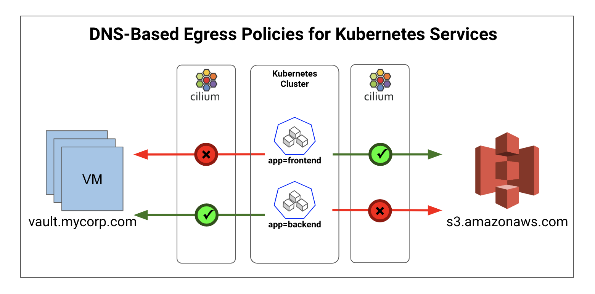
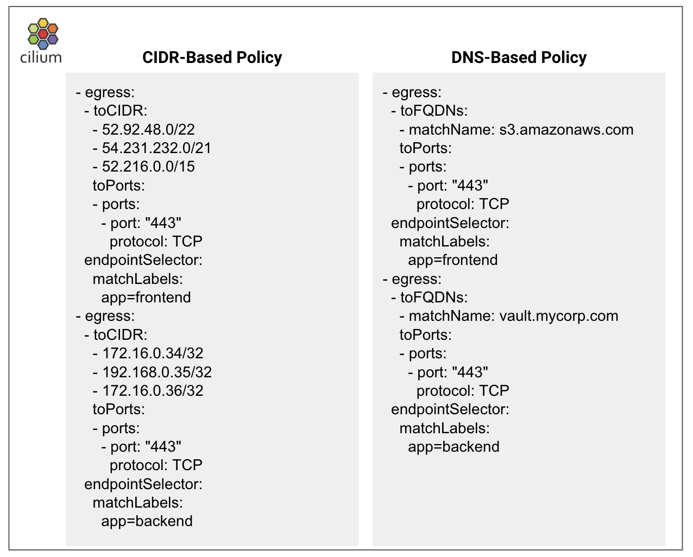

## The Need for Least Privilege Egress Filtering in Kubernetes

Cilium is a CNI plugin for Kubernetes that makes it easy to securely lock down the connectivity between your microservices. Cilium security policies are based on Kubernetes service identities (e.g., pod labels, service accounts). For example, a basic Kubernetes network policy might limit pods with label `app=frontend` to talk on port 80 to pods with label `app=backend`. Cilium is unique in that it can further lock down the communication between two services at the API-layer. For example, policy enforcing that pods with `app=frontend` can only make the `HTTP PUT /foo` API call to pods with label `app=backend`.

But no Kubernetes cluster is an island. Applications running on Kubernetes frequently need to interact with APIs, databases, and other services running outside the cluster. For example, if a particular `frontend` service needs to reach out to `https://s3.awsamazon.com`, we wouldn't want every pod in your cluster to be able to reach out to AWS S3. Instead, we’d want to enforce “least privilege” security and allow only the pods with label `app=frontend` to reach AWS S3 and then only on a specific port (e.g., TCP 443). Similarly, a service `backend` may need access to your corporate `vault.mycorp.com` service running as VMs on another VPC/subnet. And we want to only allow pods with label `app=backend` to reach the `vault` service identified by its DNS name.



No traditional firewall will be up to this task, as a traditional firewall between the Kubernetes cluster and the Internet will have no way to distinguish between traffic from `frontend` within the Kubernetes cluster and traffic from any other pod. This is not only because the IPs associated with `frontend` are in frequent flux as individual pods are created/destroyed, but also because a standard Kubernetes cluster will be configured to SNAT traffic going to the outside world, so the traditional firewall will see only the source IP of the Kubernetes worker node.

Thus, Kubernetes clusters are the only place that can distinguish traffic from `frontend` with all other traffic that might be sent to `s3.awsamazon.com`. Kubernetes network policies support “egress” filtering, meaning that we can create network policy that limits the traffic that can leave (i.e., egress) all pods with a given label like `app=frontend`. But how would the remote destination be specified in this case? The AWS S3 API is not running in Kubernetes, and so it cannot be specified using Kubernetes labels.

The [Kubernetes network policy spec](https://kubernetes.io/docs/concepts/services-networking/network-policies/) supported by Cilium and other CNI plugins has the notion of egress filtering to “IP-blocks”, which allows the specification of IP address ranges that should be whitelisted. The pods with specific identity labels are allowed to reach one or more CIDR blocks. CIDR-based policies are quite useful for scenarios that grant a pod access to a larger internal network in the same datacenter as the Kubernetes cluster, or for limiting access to VMs running in a particular AWS VPC. However, as we’ll see shortly, CIDR-based policies are both clunky and error-prone when used to identify individual APIs services.

## Why DNS-Awareness Matters?

- Service IP-addresses can change as the services scale up/down or change environments. This makes it very hard to synchronize the CIDR-based security policies with the service IPs. Out-of-sync, hard-coded IP-based policies can end up blocking legitimate flows while allowing traffic to destination IPs that are no longer associated with approved services.
- Another challenge is that there can be multiple CIDR-blocks associated with a service, for e.g. [the ip-ranges for AWS services](https://ip-ranges.amazonaws.com/ip-ranges.json). This makes it very difficult to specify, understand and debug the policies.

The answer is to allow policy to be specified using the high-level DNS name. For DNS-based policies, Cilium internally maintains the mapping between high-level, stable DNS name and the low-level, dynamic IP addresses seen at the network filtering layer. The secret sauce that makes this possible at high performance within Cilium is [BPF](https://cilium.readthedocs.io/en/stable/bpf/), which allows Cilium to customize the forwarding behavior of the Linux kernel and optimize it for a world of microservices and APIs. If you’re interested in learning more, please check out this [dockercon talk](https://youtu.be/ilKlmTDdFgk).

Here is a comparison showing the “old” model of IP-based egress filtering, with the newer DNS-based model:



Note that not only is the DNS-based policy more resilient to changes in the remote service, it is also cleaner and easier to understand the intent of the policy without relying on comments, etc.

## Key Use Cases for DNS-Aware Egress Filtering in Kubernetes

The access control to SaaS services from AWS, Google, Twilio, Salesforce, Stripe, etc. are an important use case for DNS-based egress control. Equally, common is the access control to legacy VM or bare-metal based services such as databases, Vault services, Kafka clusters, etc. Such services are often identified via DNS names. For non-TLS communications, such as those within the VPC or datacenter, the DNS-based policies can be combined with L7-level attributes to provide more granular access control. For e.g. if you have a Kafka cluster identified by `kafka.mycorp.com`, then specific pods can be restricted to produce or consume on specific topics. In the policy example below, pods with label `app=empire-hq` are able to produce on topics such as `empire-announce` and `deathstar-plans` but pods with labels `app=outpost` are only able to consume from topic `empire-announce` (_credit: the Empire DevOps team_).

```YAML
- egress:
  - toFQDNs:
    - matchName: kafka.mycorp.com
    toPorts:
    - ports:
      - port: "9092"
        protocol: TCP
      rules:
        kafka:
        - role: produce
          topic: deathstar-plans
        - role: produce
          topic: empire-announce
  endpointSelector:
    matchLabels:
      app=empire-hq
- egress:
  - toFQDNs:
    - matchName: kafka.mycorp.com
    toPorts:
    - ports:
      - port: "9092"
        protocol: TCP
      rules:
        kafka:
        - role: consume
          topic: empire-announce
  endpointSelector:
    matchLabels:
      app=outpost

```

## Future Work

The support for wildcards will be useful for allowing access to groups of trusted services (for e.g., \*.awsamazon.com). And as we saw in the kafka example above, combining DNS with L7 policies can provide granular control. Supporting an expanded set of L7 protocols in Cilium policies was made very easy by introduction of [Envoy Golang extensions](https://cilium.io/blog/2018/10/23/cilium-13-envoy-go) in Cilium 1.3. Talking about L7, the visibility into TLS is a key aspect and there is ongoing kernel work for [kTLS](https://netdevconf.org/1.2/papers/ktls.pdf) that will make it possible to gain TLS visibility without requiring cumbersome man-in-the-middle models. Join us on [slack](https://slack.cilium.io/) to engage with conversations around securing Kubernetes and microservices using Cilium and BPF.
