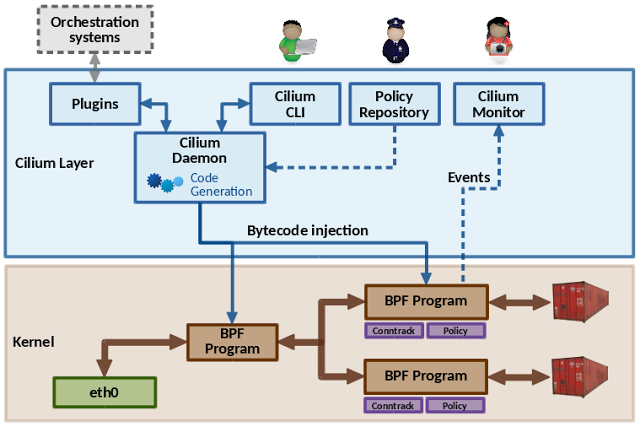

_This is a guest post by Daniel Borkmann who was recently recognized through the Google [Open Source Peer Bonus](https://opensource.googleblog.com/2016/09/google-open-source-peer-bonus-program.html) program for his work on the Cilium project. We invited Daniel to share his project on our blog._

Our open source project, called [Cilium](https://github.com/cilium/cilium), started as an experiment for Linux container networking tackling four requirements:

### Scale

How can we scale in terms of addressing and with regards to network policy?

### Extensibility

Can we be as extensible as user space networking in the Linux kernel itself?

### Simplicity

What is an appropriate abstraction away from traditional networking?

### Performance

Do we sacrifice performance in the process of implementing the aforementioned aspects?

We realize these goals in Cilium with the help of [eBPF](https://en.wikipedia.org/wiki/Berkeley_Packet_Filter#Extensions_and_optimizations). eBPF is an efficient and generic in-kernel bytecode engine, that allows for full programmability. There are many subsystems in the Linux kernel that utilize eBPF, mainly in the areas of networking, tracing and security.

eBPF can be attached to key ingress and egress points of the kernel's networking data path for every network device. As input, eBPF operates on the kernel's network packet representation and can thus access and mangle various kinds of data, redirect the packet to other devices, perform encapsulations, etc.

This is a typical workflow: eBPF is programmed in a subset of C, compiled with [LLVM](https://en.wikipedia.org/wiki/LLVM)which contains an eBPF back-end. LLVM then generates an ELF file containing program code, specification for maps and related relocation data. In eBPF, maps are efficient key/value stores in the kernel that can be shared between various eBPF programs, but also between user space. Given the ELF file, tools like [tc](<https://en.wikipedia.org/wiki/Tc_(Linux)>) (traffic control) can parse its content and load the program into the kernel. Before the program is executed, the kernel verifies the eBPF bytecode in order to make sure that it cannot affect the kernel's stability (e.g. crash the kernel and out of bounds access) and always terminates, which requires programs to be free of loops. Once it passed verification, the program is [JIT (just-in-time) compiled](https://en.wikipedia.org/wiki/Just-in-time_compilation).

Today, architectures such as x86_64, arm64, ppc64 and s390 have the ability to compile a native opcode image out of an eBPF program, so that instead of an execution through an in-kernel eBPF interpreter, the resulting image can run natively like any other kernel code. tc then installs the program into the kernel's networking data path, and with a capable [NIC](https://en.wikipedia.org/wiki/Network_interface_controller), the program can also be offloaded entirely into the hardware.

Cilium acts as a middle layer, plugs into container runtimes and orchestrators such as [Kubernetes](http://kubernetes.io/), [Docker](<https://en.wikipedia.org/wiki/Docker_(software)>) or [CNI](https://github.com/containernetworking/cni), and can generate and atomically update eBPF programs on the fly without requiring a container to restart. Thus, unlike connection proxies, an update of the datapath does not cause connections to be dropped. These programs are specifically tailored and optimized for each container, for example, a feature that a particular container does not need can just be compiled out and the majority of configuration becomes constant, allowing LLVM for further optimizations.

We have many implemented building blocks in Cilium using eBPF, such as [NAT64](https://en.wikipedia.org/wiki/NAT64), [L3/L4](https://en.wikipedia.org/wiki/OSI_model) load balancing with direct server return, a connection tracker, port mapping, access control, NDisc and [ARP](https://en.wikipedia.org/wiki/Address_Resolution_Protocol) responder and integration with various encapsulations like [VXLAN](https://en.wikipedia.org/wiki/Virtual_Extensible_LAN), [Geneve](https://cto.vmware.com/geneve-vxlan-network-virtualization-encapsulations/) and [GRE](https://en.wikipedia.org/wiki/Generic_Routing_Encapsulation), just to name a few. Since all these building blocks run in the Linux kernel and have a stable API, there is of course no need to cross kernel/user space boundary, which makes eBPF a perfectly suited and flexible technology for container networking.

One step further in that direction is [XDP](https://github.com/iovisor/bpf-docs/blob/master/Express_Data_Path.pdf), which was recently merged into the Linux kernel and allows for [DPDK-like](https://en.wikipedia.org/wiki/Data_Plane_Development_Kit) performance for the kernel itself. The basic idea is that XDP is tightly coupled with eBPF and hooks into a very early ingress path at the driver layer, where it operates with direct access to the packet's [DMA](https://en.wikipedia.org/wiki/Direct_memory_access) buffer.

This is effectively as low-level as it can get to reach near-optimal performance, which mainly allows for tailoring high-performance load balancers or routers with commodity hardware. One advantage that comes with XDP is also that it reuses the kernel's security model for accessing the device as opposed to user space based mechanisms. It doesn't require any third party modules and works in concert with the Linux kernel. Both XDP and tc with eBPF are complementary to each other, and constitute a bigger piece of the puzzle for Cilium itself.

If you’re curious, check out the Cilium code or demos on [GitHub](https://github.com/cilium/cilium).

_By Daniel Borkmann, Cilium contributor_
