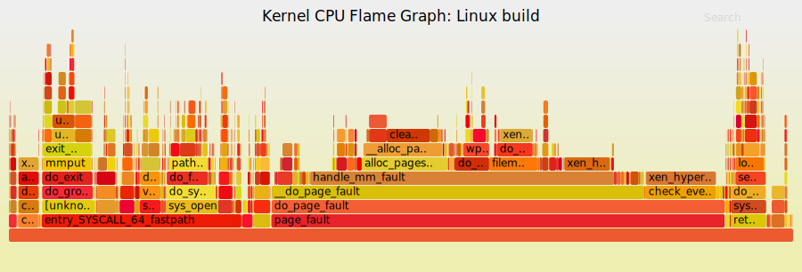
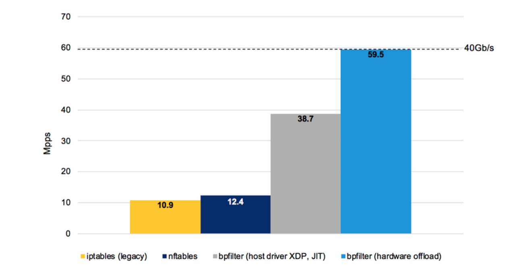

Author Note: this is a post by long-time Linux kernel networking developer and
creator of the Cilium project, Thomas Graf

The Linux kernel community recently announced [bpfilter], which will replace
the long-standing in-kernel implementation of iptables with high-performance
network filtering powered by Linux BPF, all while guaranteeing a non-disruptive
transition for Linux users.

From humble roots as the packet filtering capability underlying popular tools
like tcpdump and Wireshark, BPF has grown into a rich framework to extend the
capabilities of Linux in a highly flexible manner without sacrificing key
properties like performance and safety. This powerful combination has led
forward-leaning users of Linux kernel technology like [Google], [Facebook], and
[Netflix] to choose BPF for use cases ranging from network security and
load-balancing to performance monitoring and troubleshooting. Brendan Gregg of
Netflix first called BPF [Superpowers] for Linux. This post will cover how
these “superpowers” render long-standing kernel sub-systems like iptables
redundant while simultaneous enabling new in-kernel use cases that few would
have previously imagined were possible.

Having spent the past 15 years in the Linux kernel community authoring code to
many subsystems including the TCP/IP stack, iptables, and many more, allowed me
to observe BPF developments up close. I soon realized that BPF was not simply
yet another feature but instead represented a foundational technology shift
that in time would change nearly every aspect of networking and security within
Linux. I started contributing and became one of its biggest supporters along
side with Alexei Starovoitov and Daniel Borkmann which are now maintaining BPF
upstream. In this lens, the shift from iptables with bpfilter is just the next
logical step in a BPF’s journey to revitalize the Linux networking stack for
the modern area. To understand why this shift is so exciting, allow me to take
you on a bit of a tour through the history of iptables in the kernel.

## iptables and the roots of sequential filtering

iptables has been the primary tool to implement firewalls and packet filters on
Linux for many years. iptables and its predecessor ipchains have been part of
my personal Linux journey from early on. Initially as a user, later as a kernel
developer. Over the years, iptables has been a blessing and a curse: a blessing
for its flexibility and quick fixes. A curse during times debugging a 5K rules
iptables setup in an environment where multiple system components are fighting
over who gets to install what iptables rules.

[Jerome Petazzoni](https://twitter.com/jpetazzo) once overheard a quote that
could not be more to the point:

<blockquote class="twitter-tweet" data-lang="en" align="center">
OH: &quot;In any team you need a tank, a healer, a damage dealer, someone with crowd control abilities, and another who knows iptables&quot;
&mdash; Jérôme Petazzoni (@jpetazzo) <a href="https://twitter.com/jpetazzo/status/614851069508595712?ref_src=twsrc%5Etfw">June 27, 2015</a></blockquote>

When iptables started its life 20 years ago to replace its predecessor
ipchains, firewall functionality was written with a simple scope:

- Protect local applications from receiving unwanted network traffic (INPUT
  chain)
- Protect local applications sending undesired network traffic (OUTPUT chain)
- Filter network traffic forwarded/routed by a Linux system (FORWARD chain).

Back then, network speeds were slow. Remember the sound a modem made when
dialing in? That was the era when iptables was initially developed and
designed. The standard practice of implementing access control lists (ACLs) as
implemented by iptables was to use sequential list of rules, i.e. every packet
received or transmitted is matched against a list of rules, one by one.

However, linear processing has an obvious massive disadvantage, the cost of
filtering a packet can increase linearly with the number of rules added.

### The intermediate workaround: ipset

Some time passed, network speeds increased and iptables setups had grown from a
dozen rules to sets of thousands of rules. Traversing sequential iptables lists
had become unbearable from a performance and latency perspective.

The community quickly identified the most common bottleneck: long lists of
rules either rejecting or allowing individual IP address and port combinations.
This lead to the introduction of [ipset]. ipset allows to compress list of
rules matching on IP addresses and/or port combinations into a hash table to
reduce the number of iptables rules overall. This has since been serving as a
workaround without addressing the core problem itself.

Unfortunately, ipset is not an answer to all problems. A prominent example is
`kube-proxy`, a component of [Kubernetes](https://kubernetes.io/) that uses
iptables and `-j DNAT` rules to provide load-balancing for services. It
installs multiple iptables rules for each backend a service is serving to. For
each service added to Kubernetes, the list of iptables rules to be traversed
grows exponentially.

A recent [KubeCon
talk](https://www.slideshare.net/LCChina/scale-kubernetes-to-support-50000-services)
examined kube-proxy performance in all details. The talk presents measurements
showing unpredictable latency and reduced performance as the number of services
grows. It also reveals another major weakness of iptables: lack of incremental
updates. The entire list of rules has to be replaced each time a new rule is
added. This leads to a total duration of 5 hours to install the 160K iptables
rules representing 20K Kubernetes services.

Using IP/port based mechanisms has many other obvious disadvantages in general,
in particular in the age of application containers. Containers are deployed and
torn down frequently. This can lead to a short lifetime of individual IP
addresses. An IP address may be used by a container for just seconds and then
gets reused by another container a couple of seconds later. This puts stress on
systems which rely on using IP addresses for security filtering purposes as all
nodes in a cluster must be constantly aware of the latest IP to container
mapping. While this is barely difficult within a cluster, it becomes incredibly
challenging across clusters. Diving into the details is outside of the scope of
this blog post so we will save it for a future post.

## The rise of BPF

BPF has been evolving at an insane pace in recent years, unlocking what was
previously outside the scope of the kernel. This is made possible by the
incredible powerful and efficient programmability that BPF provides. Tasks that
previously required custom kernel development and kernel recompilations can now
be achieved with efficient BPF programs within the safe boundaries of the BPF
sandbox.

The following is a list of projects that show how BPF is being leveraged in
various projects and companies:

- [Cilium](http://github.com/cilium/cilium) is unleashing the powers of BPF to
the world of containers and provides powerful and efficient networking,
security and load-balancing at L3-L7. Read the [introduction to
Cilium](http://docs.cilium.io/en/stable/intro/) to get started on learning
about Cilium.

  <blockquote class="twitter-tweet" data-lang="en">
What <a href="https://twitter.com/ciliumproject?ref_src=twsrc%5Etfw">@ciliumproject</a> is doing with eBPF and XPD is the cleanest networking plugin I&#39;ve seen, mad props <a href="https://t.co/oOShMvT2iY">https://t.co/oOShMvT2iY</a> <a href="https://t.co/mPV864Aia1">pic.twitter.com/mPV864Aia1</a>
&mdash; jessie frazelle (@jessfraz) <a href="https://twitter.com/jessfraz/status/897819764915142656?ref_src=twsrc%5Etfw">August 16, 2017</a></blockquote>

- Facebook has presented exciting work on [BPF/XDP based load-balancing to
replace
IPVS](https://www.netdevconf.org/2.1/slides/apr6/zhou-netdev-xdp-2017.pdf)
that also includes DDoS mitigation logic. While IPVS is a tempting next step
compared to iptables, Facebook has already migrating away from IPVS to BPF
after seeing roughly a 10x improvement in performance.

  <blockquote class="twitter-tweet" data-lang="en">
Mind blown by eBPF performance! A simple ingress firewall I wrote using XDP processes 11 million packets/s. Time for more optimizations!
&mdash; Diptanu Choudhury (@diptanu) <a href="https://twitter.com/diptanu/status/899424568422486016?ref_src=twsrc%5Etfw">August 21, 2017</a></blockquote>

- Netflix, in particular Brendan Gregg, have been utilizing the
  powers of BPF for performance profiling and tracing. The [bcc] project
  provides users access to the powers of BPF to, for example, generate amazing
  flamegraphs:

  

  For more details including many examples on how to leverage BPF for
  application tracing, checkout out Brendan Gregg’s [blog
  posts](http://www.brendangregg.com/blog/).

    <blockquote class="twitter-tweet" data-lang="en">
as I&#39;ve said to a number of people job hunting in systems engineering: BPF experience is hot and getting hotter <a href="https://t.co/bScbqE6m17">https://t.co/bScbqE6m17</a>
&mdash; Brendan Gregg (@brendangregg) <a href="https://twitter.com/brendangregg/status/866078955530444800?ref_src=twsrc%5Etfw">May 20, 2017</a></blockquote>
  

- Google has been working on bpfd which enables [Powerful Linux Tracing for
  Remote targets using
  eBPF](https://www.socallinuxexpo.org/sites/default/files/presentations/bcc-scale.pdf).
  Based on upstream engagement around BPF, they also seem to be looking at
  migrating various internal projects over to BPF.

- Cloudflare is using BPF to [mitigate DDoS attacks](https://www.netdevconf.org/2.1/slides/apr6/bertin_Netdev-XDP.pdf)
  and has put out several blog posts and presented multiple public talks on the
  topic.

- [Suricata](https://suricata-ids.org/) is an IDS that started using BPF and
  XDP to replace nfqueue which is an iptables based infrastructure to wiretap
  packets. More details can be found in this [Kernel Recipes
  talk](https://www.slideshare.net/ennael/kernel-recipes-2017-ebpf-and-xdp-eric-leblond).

- [Open vSwitch](https://www.openvswitch.org/) has been working on using an
  [eBPF powered datapath](http://www.openvswitch.org//support/ovscon2016/7/1120-tu.pdf).

There are too numerous examples to list them all in this blog post. We are
maintaining a more complete list of [projects using
BPF](http://cilium.readthedocs.io/en/stable/bpf/#projects-using-bpf) in the
[BPF reference guide](http://docs.cilium.io/en/stable/bpf/).

## One BPF to rule them all

The most recent development in the evolution of BPF is an exciting proposal to
completely replace the kernel part of iptables with BPF in a way that is
completely transparent to the user, i.e. existing iptables client binaries and
libraries will continue to work.

You can find the upstream discussion on the [Kernel mailing
lists](https://www.mail-archive.com/netdev@vger.kernel.org/msg217095.html). The
proposal is authored by Daniel Borkmann (Covalent), the networking maintainer
David Miller (Red Hat), and Alexei Starovoitov (Facebook). The proposal was
covered by an [LWN article](https://lwn.net/Articles/747551/) that gives a
great summary of the initial discussion.

The following graph as presented by Quentin Monnet at FRnOG 30 shows some early
measurements of bpfilter in comparison with iptables and nftables. It shows
both the software only BPF implementation as well as a hardware offloaded test:

These early performance numbers are incredible promising and an indication of
the power of BPF. It must be noted that bpfilter and BPF itself will not solve
the performance problems caused by iptables's use of sequential lists. Doing so
will require native use of BPF such as done by the [Cilium](https://cilium.io/)
project.

### How has the kernel community reacted?

Some of the Linux kernel mailing lists are famous for their flame wars. Have
flamewars burst out in this case? No, in fact, there have been immediate
proposals from core iptables maintainers all aiming into the direction of BPF.

- Florian Westphal has [proposed a
  framework](https://www.spinics.net/lists/netdev/msg486873.html) that will
  operate on top of bpfilter and will convert nftables to BPF. This allows to
  keep the domain specific nftables language but benefits from all the
  advantages of the BPF runtime with its JIT compiler, hardware offload, and
  tooling.

- Pablo Neira Ayuso seems to have been working on a [similar
  proposal](https://www.mail-archive.com/netdev@vger.kernel.org/msg217425.html)
  and has published a series which also translates nftables to BPF. The main
  difference in approach seemed to be that Pablo intended to perform the
  translation in the kernel. The community has since agreed that any injection of
  BPF programs must occur through user space and be passed through the BPF
  verifier to guarantee the safety behavior of BPF.

## Summary

I consider BPF the most exciting Linux development since many years. We are
barely scratching the surface of its potential and it is still evolving. The
move to replace the kernel part of iptables with BPF is a logical first step.
The real transition will be to BPF native tooling as well as move away from
traditional IP address/port centric constructs.

Interested in learning more about BPF or Cilium? Talk to us on
[Slack](https://cilium.herokuapp.com/)

[ipset]: http://ipset.netfilter.org/
[bcc]: https://github.com/iovisor/bcc
[bpfilter]: https://lwn.net/Articles/747551/
[google]: https://www.socallinuxexpo.org/sites/default/files/presentations/bcc-scale.pdf
[facebook]: https://www.netdevconf.org/2.1/slides/apr6/zhou-netdev-xdp-2017.pdf
[netflix]: http://www.brendangregg.com/Slides/BSidesSF2017_BPF_security_monitoring.pdf
[superpowers]: http://www.brendangregg.com/blog/2016-03-05/linux-bpf-superpowers.html
