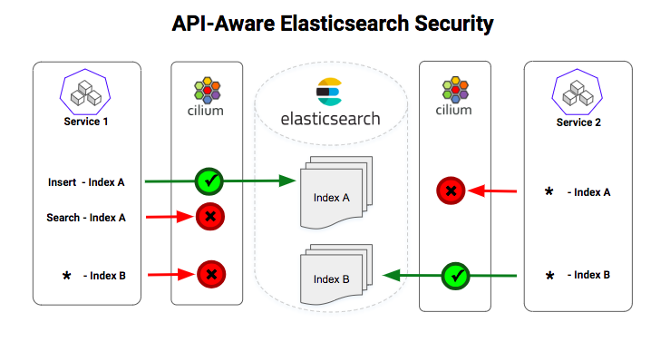

## Elasticsearch Concepts and Least Privilege Security

Elasticsearch APIs provide mechanisms for storing and searching JSON _documents_. Documents are grouped into an _index_, which typically stores many documents of a single type (e.g., user transaction data, or network access logs). A user of the Elasticsearch API selects an index, and then may create, update, delete, or search documents within that index. Multi-tenant Elasticsearch clusters are commonly accessed by many clients running as part of many different applications workloads, any of which may contain a security vulnerability or other weakness that allows an attacker to issue API requests from that application to the Elasticsearch server.

In such environments, it is critical to enforce **least privilege security**, which is the security principle that each component of a larger system has exactly the permissions it requires and no more. Enforcing least privilege on an Elasticsearch API client typically amounts to limiting that client to accessing a particular index, and even more precisely, to performing only certain operations on that index. In the example above, least privilege security would mean the attacker can add erroneous data to the troubleshooting logs index (since that behavior is required for normal application operation), but the attacker would not be allowed to search those logs, or perform any operation on the indices for user transaction data or network logs.

## Application-Layer vs. Infrastructure-Layer Enforcement

One approach to solving this problem is to modify Elasticsearch client and server code to enforce such security policies using Role-based Access Control (RBAC) at the application-layer. In fact, a [commercial solution from Elastic.co](https://www.elastic.co/guide/en/elastic-stack-overview/current/authorization.html) provides similar functionality.

However, from the perspective of the IT ops and security teams, relying on such an approach has significant limitations:

- The tooling for gaining visibility, enforcing security policies, troubleshooting issues, performing audit, and others are all Elasticsearch-specific, and thus require additional tooling for securing all other API-driven workloads in the environment (e.g., HTTP/gRPC-based microservices, queuing services like Kafka, and datastores/caches like MySQL, Postgres, Cassandra, MongoDB, Redis). The end result is a siloed collection of per-API security mechanisms unable to provide a consistent mechanism for visibility + security across a complex modern microservices application.
- Enabling these mechanisms requires gaining the buy-in of each application team with a client that accesses the multi-tenant Elasticsearch cluster. Additionally, the application workloads themselves (e.g., their container images) must be updated with new configurations as security policies change. This tight coupling between application artifacts and the details of security visibility and enforcement leads to additional points of friction between application teams and security teams.

For these reasons, IT Ops and security teams have long preferred "transparent" infrastructure-layer security solutions that require no changes to the application workloads. The widespread use of infrastructure-layer _network firewalls and segmentation_ for security isolation between workloads is a testament to a solution that provides both:

- A single solution for visibility, policy enforcement, troubleshooting, and audit capabilities across all types of workloads.
- A way of transparently inserting visibility and enforcement entirely independent of application development teams.

But traditional firewalls would typically only see and filter traffic at the granularity of an IP address and port. Since the server offering the Elasticsearch API provides access to all API calls on a single port (TCP 9200), it is impossible for such traditional firewalls to see or filter based on the content of individual API calls.

This is where Cilium comes in. Cilium has the ability to see into the individual API calls, and enforce policies that allow least privilege API access for Elasticsearch and any other API services based on protocols like HTTP, gRPC, and Kafka. And while traditional firewalls often run as centralized "choke-points", Cilium leverages a powerful new Linux kernel technology called [BPF](https://cilium.readthedocs.io/en/stable/bpf/) to transparently insert security intelligence into the Linux kernel running the workload itself (e.g., a Kubernetes node running a an Elasticsearch client or server pod). Visibility and security policies are efficiently implemented as network data flows through the kernel to/from the container, with no detours to a centralized firewall or proxy.

## Example: Elasticsearch API Security Using Cilium with Kubernetes

The Cilium is open source and is deeply integrated with container orchestration platforms like Kubernetes, Mesos and Docker. Leveraging BPF, Cilium is able to observe all the traffic coming in/out of each container/pod, and provide both visibility and security based on the identity of the application container/pod (e.g., pod labels). Unlike ephemeral identifiers like IP addresses, the labels provide reliable identity even as pods restart or scale-in/out.

Following the Cilium tradition, we will use a Star Wars-inspired example to understand how Elasticsearch-aware security works in practice.

Just like many enterprises today, the Empire DevOps team has a large scale Elasticsearch cluster which is used for storing a variety of data. Specifically, we will focus on the following two indices:

1. `"_index": "troop_logs"` stores Stormtroopers daily attendance logs collected from every Empire outpost across the galaxy to ensure Stormtroopers are not skipping out on work.
2. `"_index": "spaceship_diagnostics"` stores diagnostics data collected from every spaceship, to be used for troubleshooting by Empire engineers and improving future spaceship designs.

Every Empire outpost pod has an Elasticsearch client service to upload the Stormtroopers logs. And every spaceship pod has a service to upload diagnostics. And the Empire headquarters has a service to search and analyze the troop logs and spaceship diagnostics data. You can easily create the full example application in a minikube environment with Cilium by following the [Cilium Elasticsearch Getting Started Guide](http://cilium.readthedocs.io/en/stable/gettingstarted/elasticsearch/).

From a security perspective, given the large number of outposts scattered across the galaxy, any single outpost pod might be to be captured by the Rebels. Once compromised, the outpost clients can be used to search and manipulate the critical data in any index. For example, the Rebels can search the `"_index": "spaceship_diagnostics"` for information about the current location of the Imperial fleet or to identify critical vulnerabilities in spaceship design (sound familiar?).


Following the least privilege security principle, we want to the allow the following legitimate actions and nothing more:

- Services with label `outpost` can only add documents to `"_index": "troop_logs"`
- Services with label `spaceship` can only add documents to `"_index": "spaceship_diagnostics"`
- The `empire-hq` Service is able to search both the indices.

Fortunately (well, not for the Rebels...), the Empire DevOps team is using Cilium for their Kubernetes cluster. Cilium follows the **least privilege model** for security, so a _CiliumNetworkPolicy_ contains a list of rules that define **allowed requests** and any request that does not match the rules is denied. This example leverages the fact that most Elasticsearch clients use the RESTful HTTP API to access Elasticsearch data.

The resulting Cilium Network Policy has the following key elements:

1. The policy rules are defined for inbound traffic (i.e., "ingress") connections to the _elasticsearch_ service. That is, the enforcement will be done when the API request arrives at any of the pods that are part of the Elasticsearch service. The label `component: elasticsearch` selects the pods that are part of the _elasticsearch_ service
2. Based on the identity of the client service (i.e. the source of traffic), the following rules are defined for controlling access to indices access and actions performed:
   - `fromEndpoints` with labels `app:spaceship` only `HTTP PUT` is allowed on paths matching regex `^/spaceship_diagnostics/stats/...$`
   - `fromEndpoints` with labels `app:outpost` only `HTTP PUT` is allowed on paths matching regex `^/troop_logs/log/...$`
   - `fromEndpoints` with labels `app:empire` only `HTTP GET` is allowed on paths matching regex `^/spaceship_diagnostics/_search/...$` and `^/troop_logs/search/...$`

([View full policy YAML](https://raw.githubusercontent.com/cilium/cilium/v1.1/examples/kubernetes-es/es-sw-policy.yaml))

The policy enforcement is as simple as running a single `kubectl` command:

```bash
kubectl create -f https://raw.githubusercontent.com/cilium/cilium/v1.1/examples/kubernetes-es/es-sw-policy.yaml
```

The Cilium agents on each Kubernetes worker node monitor for new _CiliumNetworkPolicy_ objects and will promptly reconfigure the BPF programs managing network traffic in/out of each pod to implement the new policy.

## Conclusion

Cilium leverages BPF, a powerful new Linux kernel technology, to provide API-aware network visibility and security with zero changes to the application code or containers. Cilium runs fully distributed on the Linux nodes running your workloads, avoiding any centralized network choke-points. The integration with orchestration frameworks such as Kubernetes allows Cilium to combine the traffic visibility with the pod identity, and enforce right security policies even as services scale-up/down or pods get restarted on different nodes. Applying Cilium's API-aware security policies to the Elasticsearch API enables least privilege security on an Elasticsearch cluster efficiently, without interfering with the application.

We welcome feedback/questions about using Cilium with Elasticsearch. Please reach out to us on [Slack](http://www.cilium.io/slack) or [Twitter](http://www.twitter.com/ciliumproject).

And while you're at it, we encourage you to try out our Cilium Getting Started Guide for securing other common API protocols such as [HTTP](http://cilium.readthedocs.io/en/stable/gettingstarted/minikube/), [Kafka](http://cilium.readthedocs.io/en/stable/gettingstarted/kafka/) and [gRPC](http://cilium.readthedocs.io/en/stable/gettingstarted/grpc/).
