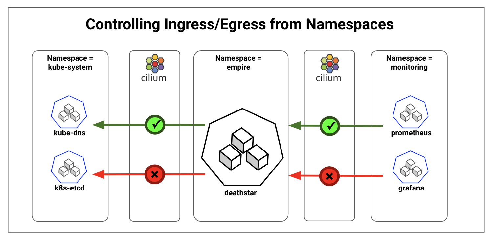

Kubernetes provides [Network Policies](https://kubernetes.io/docs/concepts/services-networking/network-policies/) for controlling traffic going in and out of the pods. Cilium implements the Kubernetes Network Policies for L3/L4 level and extends with L7 policies for granular API-level security for common protocols such as HTTP, Kafka, gRPC, etc. As per the Kubernetes Network Policy model, Cilium policies follow the whitelist model. When a policy is enabled for a pod, all ingress and egress traffic are denied by default unless the policy specification allows specific traffic. As a result, inter-namespace communication will be denied by default and we need policy specifications to whitelist traffic within namespace and legitimate traffic in and out of a namespace.

## Setup to test the policies

- Kubernetes cluster running on AWS created using [Cilium Kubespray guide](http://docs.cilium.io/en/latest/kubernetes/install/kubespray/#k8s-install-kubespray)
- A sample application created using commands below

```
kubectl create ns empire
kubectl create -f https://raw.githubusercontent.com/cilium/cilium/v1.2.2/examples/minikube/http-sw-app.yaml -n empire
```

## Allowing all traffic within a namespace while blocking inter-namespace traffic

The policy specification below allows all traffic within the `empire` namespace.

```YAML
cat <<EOF | kubectl create -n empire -f -
apiVersion: "cilium.io/v2"
kind: CiliumNetworkPolicy
metadata:
  name: "allow-within-namespace"
specs:
  - endpointSelector:
      matchLabels: {}
    egress:
    - toEndpoints:
      - matchLabels:
          "k8s:io.kubernetes.pod.namespace": empire
    ingress:
    - fromEndpoints:
      - matchLabels:
          "k8s:io.kubernetes.pod.namespace": empire
EOF
```

The key components of the policy are:

- The `endpointSelector:matchLabels={}` will select all pods in the namespace `empire`. The scope of Network Policies is per namespace, as noted in the `-n empire` parameter for creating the policy.
- For the selected pods, egress is allowed as long as the identity of destination pods has label `namespace=empire`
- Similar to the egress rule, the ingress rule allows incoming traffic from pods in `namespace=empire`

To test the policy, access the deathstar pod IP and deathstar service:

```
# Replace below IP with the deathstar pod IP in your cluster
$ kubectl exec tiefighter -n empire -- curl -sL 100.96.7.169/v1
{
...
}
#test that ingress is denied from other namespaces
$ kubectl exec -it kube-dns-6c7dfbf97d-cm4tt -n kube-system -- wget 100.96.7.169/v1
Defaulting container name to kubedns.
Use 'kubectl describe pod/kube-dns-6c7dfbf97d-cm4tt -n kube-system' to see all of the containers in this pod.
Connecting to 100.96.7.169 (100.96.7.169:80)
^C
#access using service name will fail as egress to kube-dns is blocked
$ kubectl exec -it tiefighter -n empire -- curl  deathstar.empire.svc.cluster.local/v1
^C
```

The direct call from `tiefighter` pod to `deathstar` pod works as expected since we have whitelisted the egress and ingress traffic within namespace `empire`. The ingress call from `kube-dns` to `deathstar` is blocked. And the call to `deathstar` service using the DNS name doesn't work. This is because we haven't whitelisted the calls to `kube-dns`, which runs in the `kube-system` namespace.

## Allowing select egress to outside the namespace, for example, kube-dns

Pods running in this Kubernetes cluster use the `kube-dns` service for resolving service names to IPs. Allowing pods to access `kube-dns` running in `kube-system` namespace is a good example of whitelisting legitimate inter-namespace traffic.

```YAML
cat <<EOF | kubectl create -n empire -f -
apiVersion: "cilium.io/v2"
kind: CiliumNetworkPolicy
metadata:
  name: "allow-within-namespace"
specs:
  - endpointSelector:
      matchLabels: {}
    egress:
    - toEndpoints:
      - matchLabels:
          "k8s:io.kubernetes.pod.namespace": empire
    ingress:
    - fromEndpoints:
      - matchLabels:
          "k8s:io.kubernetes.pod.namespace": empire
  - endpointSelector:
      matchLabels: {}
    egress:
    - toEndpoints:
      - matchLabels:
          "k8s:io.kubernetes.pod.namespace": kube-system
          "k8s:k8s-app": kube-dns
EOF
```

The policy allows egress to destination pods belonging to `kube-system` namespace and having `k8s-app=kube-dns`. However, access to any other service running in `kube-system` namespace is not allowed.

```
#access using service
kubectl exec -it tiefighter -n empire -- curl  deathstar.empire.svc.cluster.local/v1
{
...
}

#access to other services in kube-system is not allowed
kubectl exec -it tiefighter -n empire -- curl -sL kubernetes-dashboard.kube-system.svc.cluster.local/version
^C
```

## Allowing select ingress from other namespaces

Similar to whitelisting the `kube-dns` access, there is often need to whitelist specific ingress traffic from other namespaces. A common example is Prometheus monitoring, which makes `HTTP GET` calls to pods to pull metrics. We will create a simple Prometheus pod in `monitoring` namespace and apply the following policy which allows traffic from Prometheus to all the pods in the `empire` namespace. Additionally, we will restrict the Prometheus pod access to specific port, `8080`, and to specific `HTTP GET /metrics` call. This is an example of combining L3, L4 and L7 policies for strict least privilege access.

```YAML
kubectl create -f https://raw.githubusercontent.com/cilium/cilium/v1.2/examples/kubernetes/addons/prometheus/prometheus.yaml
cat <<EOF | kubectl create -n empire -f -
apiVersion: "cilium.io/v2"
kind: CiliumNetworkPolicy
metadata:
  name: "allow-within-namespace"
specs:
  - endpointSelector:
      matchLabels: {}
    egress:
    - toEndpoints:
      - matchLabels:
          "k8s:io.kubernetes.pod.namespace": empire
    ingress:
    - fromEndpoints:
      - matchLabels:
          "k8s:io.kubernetes.pod.namespace": empire
  - endpointSelector:
      matchLabels: {}
    egress:
    - toEndpoints:
      - matchLabels:
          "k8s:io.kubernetes.pod.namespace": kube-system
          "k8s:k8s-app": kube-dns
  - endpointSelector:
      matchLabels: {}
    ingress:
    - fromEndpoints:
      - matchLabels:
          "k8s:io.kubernetes.pod.namespace": monitoring
          app: prometheus
      toPorts:
      - ports:
        - port: "8080"
          protocol: "TCP"
        rules:
          http:
          - method: "GET"
            path: "/metrics"
EOF
```

The key elements of the policy are:

- The ingress policy spec is very similar to the egress and uses `ingress:fromEndpoints` along with `matchLabels` to allow traffic from `app=prometheus` and `namespace=monitoring`
- The `toPorts` specification restricts access to port `8080`
- The `http` rules section further restricts access to `GET /metrics`

To test:

```
# This will be allowed
kubectl exec -it prometheus-core-84677d797f-wrhm7 -n monitoring -- wget -O metrics deathstar.empire.svc.cluster.local:8080/metrics

# This will be denied
kubectl exec -it prometheus-core-84677d797f-wrhm7 -n monitoring -- wget -O random_get deathstar.empire.svc.cluster.local:80/v1
^C
```

## Allowing select egress to outside the cluster

Often pods will need access to services outside the cluster. These communications can be allowed by either whitelisting the destination CIDRs or by using DNS. The policy below allows all pods in `empire` namespace to access the external service specified by DNS, `cilium.io`.

```YAML
cat <<EOF | kubectl create -n empire -f -
apiVersion: "cilium.io/v2"
kind: CiliumNetworkPolicy
metadata:
  name: "allow-within-namespace"
specs:
  - endpointSelector:
      matchLabels: {}
    egress:
    - toEndpoints:
      - matchLabels:
          "k8s:io.kubernetes.pod.namespace": empire
    ingress:
    - fromEndpoints:
      - matchLabels:
          "k8s:io.kubernetes.pod.namespace": empire
  - endpointSelector:
      matchLabels: {}
    egress:
    - toEndpoints:
      - matchLabels:
          "k8s:io.kubernetes.pod.namespace": kube-system
          "k8s:k8s-app": kube-dns
  - endpointSelector:
      matchLabels: {}
    egress:
    - toFQDNs:
        - matchName: "cilium.io"
EOF
```

To test run the following commands:

```

$ kubectl exec -it tiefighter -n empire -- curl -sL cilium.io
...
...
...
$ kubectl exec -it tiefighter -n empire -- curl -sL google.com
^C
```

## Allowing select ingress from outside the cluster

Kubernetes services are exposed outside the cluster using either NodePort, LoadBalancer or Ingress Controllers. The IP-address of the original client may not be available depending on the load balancing behavior and/or SNAT scenarios for NodePort. This topic requires broader consideration and will be covered in a dedicated post.

We hope the above namespace based access control examples will help you secure your multi-tenant Kubernetes clusters. If you have use cases, questions, or want to discuss Cilium Kubernetes networking and security then join us on [slack](https://cilium.slack.com/)
