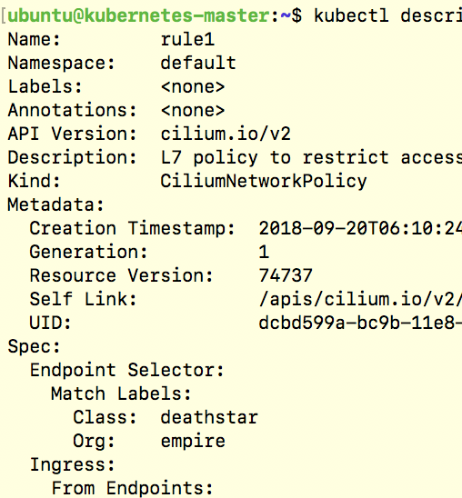
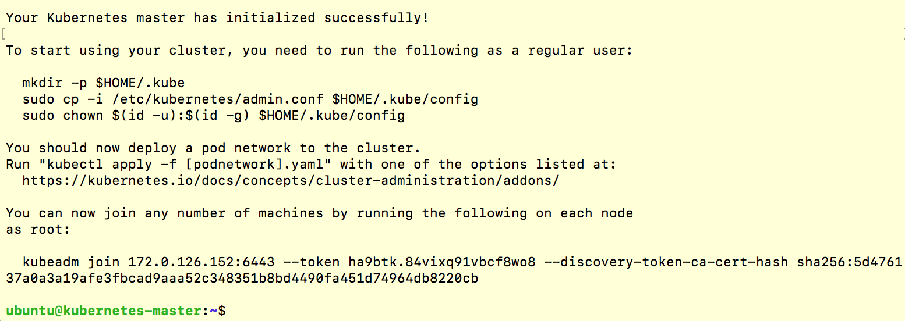
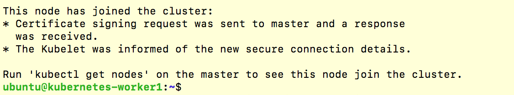
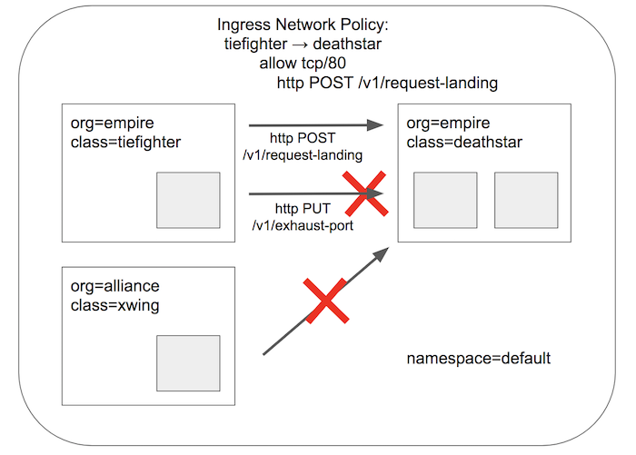
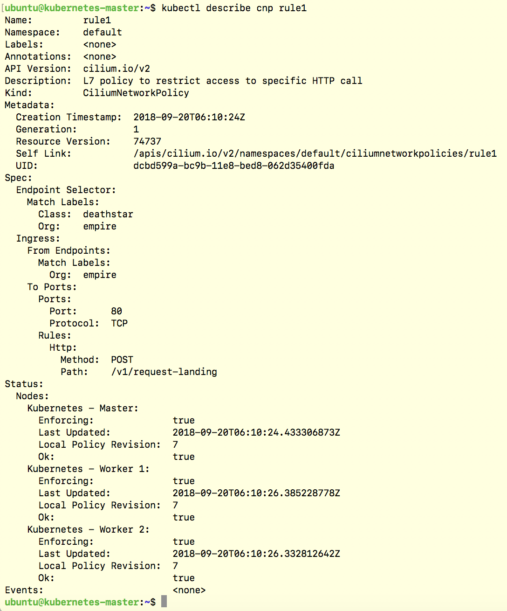

{{preview}}

Cilium provides API-aware network security for cloud-native applications. Here's a How-To guide to get you going easily with Kubernetes and Cilium on Ubuntu 18.04 LTS.



{{/preview}}

Several users are looking to run Kubernetes with Cilium on Ubuntu 18.04 LTS. The Bionic Beaver (codename for Ubuntu 18.04) is an easy choice for deploying Kubernetes with Cilium as it ships with the default Linux kernel version 4.15.

## What is Cilium?

Cilium is open source software that transparently secures network
connectivity between application services deployed using Linux container
orchestration platforms like Docker and Kubernetes. As of Cilium 1.1, it supports multiple container runtimes including Docker, cri-o, and containerd.

Cilium is based on a Linux kernel technology called BPF. Cilium enables this powerful technology to dynamically insert security visibility and control logic
within Linux itself. Because BPF runs inside the Linux kernel, Cilium security
policies can be applied and updated without any changes to the application code
or container configuration.

Check out our [docs](http://docs.cilium.io/en/stable/intro/) for a more detailed introduction to Cilium.

## Software Versions

- **Operating System:** Ubuntu 18.04
- **Kubernetes:** v1.11.0
- **Kubernetes CNI plugin:** Cilium v1.2.3
- **Installer:** kubeadm.

## Prerequisites

- Multiple machines set up with Ubuntu 18.04 (bare-metal, AWS instances, GCE instances, etc).
- Privileged access to the Ubuntu servers as root or with `sudo` for installing packages.

For AWS deployments, you can choose a community AMI for your location: <https://cloud-images.ubuntu.com/daily/server/locator/>. We used the community AMI `ami-d8d997a0` to launch 3 Ubuntu 18.04 instances. You'll need to open up your Security Group (SG) to allow communication on at least the following ports.

<center>

|           |                          |
| :-------- | :----------------------- |
| **Port**  | **Description**          |
| 22        | SSH from outside         |
| 443       | k8s API within SG        |
| 2379-2380 | etcd-operator within SG  |
| 4240      | HTTP L3 checks within SG |
| 6443      | kubeadm/k8s API access   |
| 8472      | vxlan within SG          |
| 9090      | optional for metrics     |
| ICMP      | ICMP check within SG     |

</center>
</br>
Be sure to note that some steps are not persistent across host restarts and need to be added to a start-up script for a permanent configuration.

## Set-Up

In this How-To guide, we'll work with 3 nodes running Ubuntu 18.04 to create 1 master node and 2 worker nodes in a single Kubernetes cluster. We'll assume a clean set-up with default Ubuntu 18.04 settings. We recommend at least 2 nodes to differentiate the installation steps required for master and worker nodes to scale out later on.

Give unique names to your master:

```
sudo hostnamectl set-hostname kubernetes-master
```

And to your worker nodes:

```
sudo hostnamectl set-hostname kubernetes-worker1
```

```
sudo hostnamectl set-hostname kubernetes-worker2
```

Servers require a host reboot in order for the hostname change to take effect.

## Instructions

### Update and Install Docker

Assuming a fresh installation of Ubuntu 18.04 is on your machines, update package lists, install docker and enable it on all nodes.

```
sudo apt-get update
```

```
sudo apt install docker.io
```

Execute the following to enable Docker after reboot.

```
sudo systemctl enable docker
```

### Install Kubernetes

Download and install the signing key for Kubernetes on master and worker nodes:

    sudo su -c 'curl -s https://packages.cloud.google.com/apt/doc/apt-key.gpg | apt-key add'

Next, we're ready to add the Kubernetes repo and install Kubernetes on all nodes.

- Note: At the time of writing, only Ubuntu 16.04 (Xenial) packages for Kubernetes were available. We will update once k8s for Bionic is available.

As a regular user, add the repo and install package.

```
sudo apt-add-repository "deb http://apt.kubernetes.io/ kubernetes-xenial main"
sudo apt install kubeadm
```

At the time of writing, Kubernetes requires swap to be turned off. For work-arounds, check this [GitHub issue](https://github.com/kubernetes/kubernetes/issues/53533). Disable memory swap immediately for all nodes:

```
sudo swapoff -a
```

This is _not_ persistent across host restarts so add to `/etc/fstab` accordingly for persistence.

### Initialize the Kubernetes Master

```
sudo kubeadm init --pod-network-cidr=10.217.0.0/16
```


<br />

- Note: the final output from the command above to enable a regular user with the `.kube` config and extract the join command required for worker nodes to join the cluster.

As a regular user, enable kubectl on the `kubernetes-master` node to use your cluster:

```
mkdir -p $HOME/.kube
sudo cp -i /etc/kubernetes/admin.conf $HOME/.kube/config
sudo chown $(id -u):$(id -g) $HOME/.kube/config
```

### Join Worker Nodes to the Kubernetes Cluster

On each of the worker nodes, execute the `kubeadm join` command from the master init output **as root**.

```
sudo kubeadm join 172.0.126.152:6443 --token XXXX --discovery-token-ca-cert-hash sha256:XXXX
```

You should see a message of successful cluster-join:



<br />

You will see that all the nodes have successfully joined by executing the following from the `kubernetes-master` node:

```
kubectl get nodes
```

- Note: the nodes will only become `READY` once Cilium is installed.

### Install Cilium

We will deploy Cilium on the Kubernetes cluster as the CNI plugin through a DaemonSet configuration.

- **Optional BPF Filesystem Mount:** We will mount the BPF filesystem on each node in the cluster. This step is optional and pins BPF resources to a persistent filesystem structure, thus persistent across `cilium-agent` restarts.

```
sudo mount bpffs /sys/fs/bpf -t bpf
```

This is _not_ persistent across host restarts so add to `/etc/fstab` accordingly for persistence.

- **Cilium + etcd-operator Deployment**

Cilium requires a [KV-store](http://cilium.readthedocs.io/en/stable/concepts/#key-value-store) to store state, including Policy Identities. At the time of writing, we introduced the `etcd-operator` to simplify the deployment of Cilium and its KV-store (etcd), of which Cilium will manage.

Download the Cilium repo folder and unzip it.

```
wget https://github.com/cilium/cilium/archive/v1.2.3.tar.gz
tar -xvf v1.2.3.tar.gz
```

Go to the add-ons folder to follow the instructions in the etcd-operator README. It outlines the scripts for the etcd-operator and Cilium deployment.

```
cd cilium-1.2.3/examples/kubernetes/addons/etcd-operator/
cat README.md
```

At a high level, the steps from the README include:

- Prerequisites: install CloudFlare PKI/TLS toolkit
- Create etcd certificates using the provided script
- Deploy the generated certificates to your Kubernetes cluster
- Ensure the DNS pods have the required label
- Deploy the Kubernetes descriptors for etcd-operator and Cilium.

Confirm Cilium is up with the `CURRENT` count equal to the number of nodes in your cluster (may take several minutes):

```
kubectl get daemonsets -n kube-system
```

Confirm your worker nodes have successfully joined the cluster and are `READY` now that Cilium is up by executing the following from the `kubernetes-master` node:

```
kubectl get nodes
```

## Deploy Your First Application and Security Policy

Let's run through a short HTTP example to demonstrate Cilium's API-aware network security policy in action.

### Deploy a Star Wars Demo Application

```
kubectl create -f https://raw.githubusercontent.com/cilium/cilium/v1.2.3/examples/minikube/http-sw-app.yaml
```

Confirm it's up:

```
kubectl get pods,svc
```

And check the pods and services connectivity:

```
kubectl exec xwing -- curl -s -XPOST deathstar.default.svc.cluster.local/v1/request-landing
<span style="color:grey">Ship landed</span>
kubectl exec tiefighter -- curl -s -XPOST  deathstar.default.svc.cluster.local/v1/request-landing
<span style="color:grey">Ship landed</span>
```

### Enforce an L7 Policy with CiliumNetworkPolicy

The policy will deny `xwing` access completely by its identity label and allow `tiefighter` to only make a specific HTTP call.


<br />

```
kubectl create -f https://raw.githubusercontent.com/cilium/cilium/v1.2.3/examples/minikube/sw_l3_l4_l7_policy.yaml
```

You can take a look at the Cilium Network Policy to see the HTTP-specific policy:

```
kubectl describe cnp rule1
```


<br />

### Test Cilium Security Enforcement

Now that your CiliumNetworkPolicy is in place, you can see it in action! Try to access the `deathstar` service from `xwing`:

```
kubectl exec xwing -- curl --connect-timeout 5 -XPOST deathstar.default.svc.cluster.local/v1/request-landing
```

This command is denied by the (L3) identity-based policy. Use `CTRL-C` to exit prior to timeout.

Next, see what `tiefighter` can access. Per the policy, a POST to /request-landing should be allowed:

```
kubectl exec tiefighter -- curl -s -XPOST  deathstar.default.svc.cluster.local/v1/request-landing
<span style="color:grey">Ship landed</span>
```

whereas other HTTP calls to the deathstar service are forbidden:

```
kubectl exec tiefighter -- curl -s -XPOST deathstar.default.svc.cluster.local/v1/exhaust-port
<span style="color:grey">Access denied</span>
```

Hooray! You have successfully deployed Cilium with Kubernetes on Ubuntu 18.04 and enforced an API-aware network security policy to provide least privilege security.

## Next Steps

We have several examples of API-aware network policy for various protocols. They are easy to check out through our [Getting Started Guides](http://docs.cilium.io/en/stable/gettingstarted/). We'd love to hear how you're doing! Please join our community on [Slack](cilium.io/slack) and let us know how you did.

## References

- [docs.cilium.io](docs.cilium.io)
- <https://linuxconfig.org/how-to-install-kubernetes-on-ubuntu-18-04-bionic-beaver-linux>
