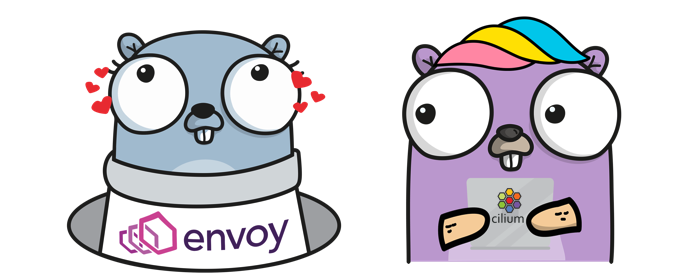
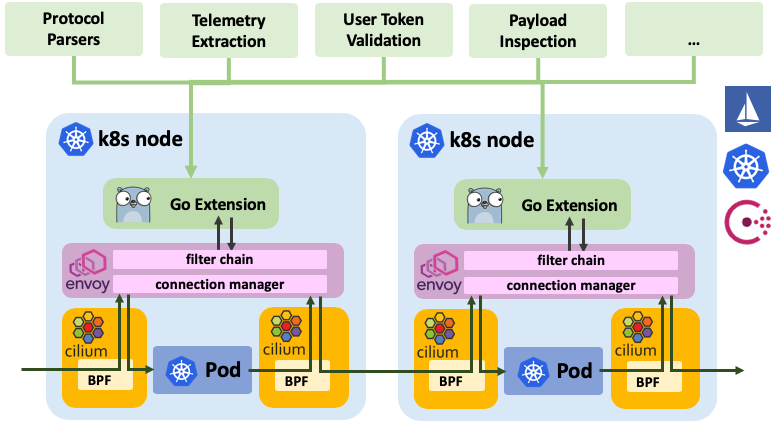
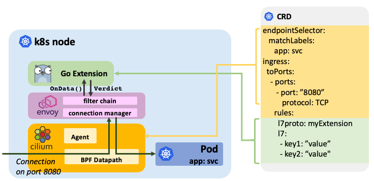

We are excited to announce the Cilium 1.3 release. The release introduces
several new features. The major highlight of the release is the addition of Go
extensions for [Envoy] as well as Cassandra and Memcached protocol parsers with
policy enforcement capability, both implemented as Envoy Go extension.

As usual, a big shout out to the entire community of Cilium developers who have
contributed 785 commits in the time period between 1.2 and 1.3.

## What are Envoy Go extensions?

We have been relying on [Envoy] for all processing of HTTP and gRPC as well as
HTTP derivates such as Elasticsearch since version 1.0. As the community
discussed how to extend the scope of supported L7 protocols, it became clear
that Envoy is the right platform to drive future protocol additions. The focus
quickly shifted to finding ways to simplify the extendability of Envoy and
allow reuse of existing open source projects such as the CNCF project [Vitess].
The idea of Go extensions for Envoy was born.

With Cilium 1.3, we introduce Go extensions for Envoy as a Beta feature.



- **Transparent injection of extensions:** With the help of Cilium, connections
  are transparently redirected to Envoy without requiring to modify the
  application or pod. Redirects are configured based on destination ports and can be restricted to source or destination services based on labels, IPs, DNS
  names, and service names for both ingress and egress connections and map
  connections to extensions via the extension's name. The redirects are
  configured via the CiliumNetworkPolicy CRD or a REST API. Envoy can be
  configured to run either as a sidecar in each pod or as a standalone proxy, one
  per node.

- **Fully distributed:** Go extensions run fully distributed inside of Envoy on
  each node or inside each pod and do not require a centralized control plane
  for data processing. The go extensions themselves can, of course, call out to
  arbitrary control plane components to report telemetry or validate
  requests.

- **Dynamic extensions mapping:** Go extensions are made available to Envoy as
  a shared library. Cilium configures Envoy to automatically load the
  respective Go extension based on the configured redirects and invoke it when
  data for such a connection. Future releases will offer support to update and
  re-load extensions at runtime without restarting Envoy and without losing
  connection state.

- **Extension configuration via CRD:** Go extensions are configured using
  generic key-value pairs via either the CRD or a REST API. This allows passing
  configuration such as security policies, security tokens or other
  configuration without requiring to make Envoy itself aware of it.

- **Generic access logging:** Similar to the configuration, extensions are able
  to return generic key-value pairs which will make its way into the access log
  to allow passing extracted visibility into the access log layer.

- **Sandboxed** A sandbox ensures that any parser instability
  cannot destabilize the mature core of Envoy. Inspired by Matt Klein's post
  [Exceptional Go](https://medium.com/@mattklein123/exceptional-go-1dd1488a6a47),
  parsers are allowed to panic to raise exceptions. When a panic occurs,
  information is logged to the access log and the TCP connection associated
  with the request is closed.

## What is Cilium?

Cilium is open source software for transparently providing and securing the
network and API connectivity between application services deployed using Linux
container management platforms like Kubernetes, Docker, and Mesos.

At the foundation of Cilium is a new Linux kernel technology called BPF, which
enables the dynamic insertion of powerful security, visibility, and networking
control logic within Linux itself. Besides providing traditional network level
security, the flexibility of BPF enables security on API and process level to
secure communication within a container or pod. Because BPF runs inside the
Linux kernel, Cilium security policies can be applied and updated without any
changes to the application code or container configuration.

See the section **[Introduction to
Cilium](https://cilium.readthedocs.io/en/v1.3/intro/)** for a more detailed general
introduction to Cilium.

## What is Envoy?

Envoy is an L7 proxy and communication bus designed for large modern
service-oriented architectures. The project was born out of the belief that:

> The network should be transparent to applications. When network and
> application problems do occur it should be easy to determine the source of
> the problem.

You can learn more about Envoy in the section [What is
Envoy](https://www.envoyproxy.io/docs/envoy/latest/intro/what_is_envoy) of the
Envoy documentation.

# How to write an Envoy Go extension

Writing extensions for Envoy is simple. To illustrate this, we will implement a
basic protocol parser for the R2-D2 control protocol and implement filtering
logic to exclude any control request that contains the string "C-3PO".



The primary API for an extension to implement is the `OnData()` function
which is invoked whenever Envoy is receiving data on a connection that has been
mapped to an extension via the `CiliumNetworkPolicy`. The function must parse
the data and return one of the following verdicts:

- **MORE:** Parser needs more _n_ more bytes to continue parsing.
- **PASS:** Pass along _n_ bytes of the data stream.
- **DROP:** Drop _n_ bytes of the data stream.
- **INJECT:** Inject _n_ bytes of data in the specified direction.
- **ERROR:** A parsing error has occurred, the connection must be closed.
- **NOP:** Do nothing.

In order to register the extension, a parser factory is created which must
implement a `Create()` function. The function is called whenever Envoy
has established a new connection for which the parser should be used.

```go
import (
        "github.com/cilium/cilium/proxylib/proxylib"
)

type parser struct{
        connection *proxylib.Connection
}

func (p *parser) OnData(reply, endStream bool, dataArray [][]byte) (proxylib.OpType, int) {
        data := string(bytes.Join(dataArray, []byte{}))
        msgLen := strings.Index(data, "\r\n")
        if msgLen < 0 {
                return proxylib.MORE, 1 // No delimiter, request more data
        }

        msgStr := data[:msgLen]
        msgLen += 2 // Inlcude the "\r\n" in the request

        if reply {
                return proxylib.PASS, msgLen // Pass responses without additional parsing
        }

        if strings.Contains(msgStr, "C-3PO") {
                return proxylib.DROP, msgLen
        }

        return proxylib.PASS, msgLen
}

type factory struct{}

func (f *factory) Create(connection *proxylib.Connection) proxylib.Parser {
        return &parser{connection: connection}
}

func init() {
        proxylib.RegisterParserFactory("r2d2", &factory{})
}
```

Finally, hook the new parser into the proxylib by importing the new parser
package into the proxylib package. This will include the parser in the
`libcilium.so` that is loaded by Envoy. Edit `proxylib/proxylib.go`:

```go
import (
        [...]
        _ "github.com/cilium/cilium/proxylib/r2d2"
)
```

The above example leaves out the configuration of the extension, integration
into the policy repository and all aspects of access logging. See the guide
[Envoy Go Extensions](https://cilium.readthedocs.io/en/v1.3/envoy/extensions/)
for a step by step guide on how to write a Go extension.

<br />
<br />

# Cassandra Support (Beta)


[Cassandra] is a popular NoSQL database management system. It is often operated
at large scale and accessed by many services and often shared between teams.
Cilium 1.3 introduces protocol support for the Apache [Cassandra] protocol
provide visibility and policy enforcement.

The Cassandra Go extension is capable to provide visibility and enforcement on
the following protocol fields:

- **query_action:** The action performed on the database `SELECT`,
  `INSERT`, `UPDATE`, ... The field is always matched as an exact match.
- **query_table:** The table on which the query is executed on. Matching is
  possible with a regular expression.

### Example: How the Empire restricts Cassandra access by table

The following example shows how the Empire is exposing limited access to the
Empire's Cassandra cluster running on port 9042 to outposts. Outposts are
identified by the label `app=empire-outpost` and have the following
privileges:

- `SELECT` access on the tables "system._` and "system_schema._"
- `INSERT` on the table "attendance.daily_records". Note that the outposts
  can't read from the tables and thus can't read the daily records from other
  outposts.

```yaml
apiVersion: 'cilium.io/v2'
kind: CiliumNetworkPolicy
description: 'Allow only permitted requests to empire Cassandra server'
metadata:
name: 'secure-empire-cassandra'
specs:
  - endpointSelector:
    matchLabels:
      app: cass-server
ingress:
  - fromEndpoints:
      - matchLabels:
          app: empire-outpost
    toPorts:
      - ports:
          - port: '9042'
            protocol: TCP
        rules:
          l7proto: cassandra
          l7:
            - query_action: 'select'
              query_table: "system\\..*"
            - query_action: 'select'
              query_table: "system_schema\\..*"
            - query_action: 'insert'
              query_table: 'attendance.daily_records'
```

This is a simple example, see the [Cassandra getting started guide](https://cilium.readthedocs.io/en/v1.3/gettingstarted/cassandra/)
for more complex examples.

<br />
<br />

# Memcached Support (Beta)


Memcached is a popular distributed in-memory key-value store that is often used
for caching purposes or to share small chunks of arbitrary data between
services. With the addition of a memcached parser golang extension to Envoy,
Cilium can now enforce security rules to restrict memcached clients to certain
commands such as read or write but also to certain key prefixes.

## Example: How the Rebels secure a shared memcached service

In the following example, the Rebels have started running a memcached service
identified by the label `app=memcached`. Several services are interacting
with the memcached services and different rules are being applied:

- The fleet maintenance service identified by `function=fleet-maintenance` is
  granted read and write access to all keys with the prefix
  `alliance/fleet`. Access to any other key is prohibited.

- The fleet monitoring service identified by `function=fleet-monitoring` is
  only granted read access on keys with the prefix `alliance/fleet`.
  Write access to keys in the prefix or access to any key outside of the prefix
  is prohibited.

- All Jedis identified by the label `role=jedi` have full to the entire
  Memcached service and can access all keys.

```yaml
apiVersion: 'cilium.io/v2'
kind: CiliumNetworkPolicy
description: 'Secure the Rebel memcached service'
metadata:
  name: 'secure-rebel-alliance-memcache'
specs:
  - endpointSelector:
      matchLabels:
        app: memcached
    ingress:
      - fromEndpoints:
          - matchLabels:
              function: fleet-maintanence
        toPorts:
          - ports:
              - port: '11211'
                protocol: TCP
            rules:
              l7proto: memcache
              l7:
                - command: 'writeGroup'
                  keyPrefix: 'alliance/fleet/'
                - command: 'get'
                  keyPrefix: 'alliance/fleet/'
      - fromEndpoints:
          - matchLabels:
              function: fleet-monitoring
        toPorts:
          - ports:
              - port: '11211'
                protocol: TCP
            rules:
              l7proto: memcache
              l7:
                - command: 'get'
                  keyPrefix: 'alliance/fleet/'
      - fromEndpoints:
          - matchLabels:
              role: jedi
        toPorts:
          - ports:
              - port: '11211'
                protocol: TCP
            rules:
              l7proto: memcache
              l7:
                - command:
```

For a full example using Memcached, see the [Memcached getting started guide](https://cilium.readthedocs.io/en/v1.3/gettingstarted/memcached/).

<br />
<br />

# Community

## Linux Foundation Core Infrastructure Initiative Best Practices

[](https://bestpractices.coreinfrastructure.org/projects/1269)

We are committed to developing Cilium in the open and with best open source
best practices. This includes a strong commitment to security. We are happy to
announce that we have completed all work to meet the [CII Best
Practices](https://bestpractices.coreinfrastructure.org/en) of the Linux
Foundation [Core Infrastructure
Initiative](https://www.coreinfrastructure.org/). You can learn
more about the badge program [here](https://www.coreinfrastructure.org/programs/badge-program/).

## Introduction of Special Interest Groups (SIGs)

The community is growing and getting more diverse in interest. In order to
ensure the scalability of the project, we are officially introducing special
interest groups (SIGs) to help provide some structure. The following SIGs have
been created already:

- **Datapath:** (#sig-datapath) Owner of all BPF and Linux kernel related datapath code.
- **Documentation:** (#sig-docs) All documentation related discussions
- **Envoy:** (#sig-envoy) Envoy, Istio and maintenance of all L7 protocol parsers.
- **Policy:** (#sig-policy) All topics related to policy. The SIG is responsible for all security relevant APIs and the enforcement logic.
- **Release Management:** (#launchpad) Responsible for the release management and backport process.

Anyone can propose additional SIGs. The process is simple and documented [here](https://cilium.readthedocs.io/en/v1.3/community/#how-to-create-a-sig)

<br />

# 1.3 Release Highlights

- **Go extensions for Envoy**
  - Exciting new extension API for Envoy using Go including a generic configuration
    and access logging API. (Beta)
- **Cassandra & Memcached protocol support**
  - New protocol parsers for Cassandra and Memcached implemented using the new
    Envoy Go extensions. Both parsers provide visibility and security policy
    enforcement on operation type and key/table names using exact matches,
    prefix matches, and regular expressions. (Beta)
- **Security**
  - TTLs support for DNS/FQDN policy rules
  - Introduction of well-known identities for kube-dns, coredns, and
    etcd-operator.
  - New security identity "unmanaged" to represent pods which are not managed
    by Cilium.
  - Improved security entity "cluster" which allows defining policies for all
    pods in a cluster (managed, unmanaged and host networking).
- **Additional Metrics & Monitoring**
  - New "cilium metrics list" command to list metrics via CLI.
  - Lots of additional metrics: connection tracking garbage collection, Kubernetes
    resource events, IPAM, endpoint regenerations, services, and
    error and warning counters.
  - New monitoring API with more efficient encoding/decoding protocol. Used
    by default with fallback for older clients.
- **Networking Improvements**
  - Split of connection tracking tables into TCP and non-TCP to better
    handle the mix of long and short-lived nature of each protocol.
  - Ability to specify the size of the connection tracking tables via
    ConfigMap.
  - Better masquerading behavior for traffic via NodePort and HostPort to allow
    pods to see the original source IP if possible.
- **Full Key-value store Resiliency**
  - Introduced ability to re-construct the kvstore contents immediately after
    loss of any state. Allows to restore etcd from backup or to completely wipe
    it for a running cluster with minimal impact. (Beta)
- **Efficiency & Scale**
  - Significant improvements in the cost of calculating policy of individual
    endpoints. Work continues on this subject.
  - New grace period when workloads change identity to minimize connectivity
    impact throughout identity change.
  - More efficient security identity allocation algorithm.
  - New generic framework to detect and ignore Kubernetes event notifications
    for which Cilium does not need to take action.
  - Improvements in avoiding unnecessary BPF compilations to reduce
    the CPU overhead caused by it. Initial work to scope BPF templating to
    avoid compilation altogether.
- **Kubernetes**
  - Added support for Kubernetes 1.12
  - Custom columns for the CiliumEndpoints CRD (Requires Kubernetes 1.11)
  - Removed cgo dependency from cilium-cni for compatibility with ulibc
  - Removed support for Kubernetes 1.7
- **Documentation**
  - New Ubuntu 18.04 guide
  - Coverage of latest BPF runtime features such as BTF (BPF Type Format).
  - Documentation for VM/host firewall requirements to run multi-host networking.
- **Long Term Stable (LTS) Release**
  - 1.3 has been declared an LTS release and will be supported for the next 6
    months with backports.

## Upgrade Instructions

As usual, follow the [upgrade
guide](https://cilium.readthedocs.io/en/v1.3/install/upgrade/#upgrading-minor-versions)
to upgrade your Cilium deployment. Feel free to ping us on
[Slack].

## Release

- Release Notes & Binaries: [1.3.0](https://github.com/cilium/cilium/releases/tag/1.3.0)
- Container image: `docker.io/cilium/cilium:v1.3.0`

[slack]: https://slack.cilium.io/
[envoy]: https://github.com/envoyproxy/envoy
[vitess]: https://vitess.io/
[cassandra]: https://github.com/apache/cassandra
