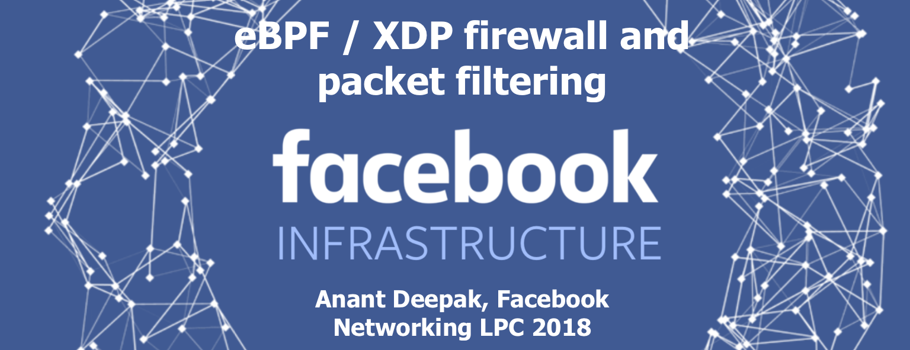
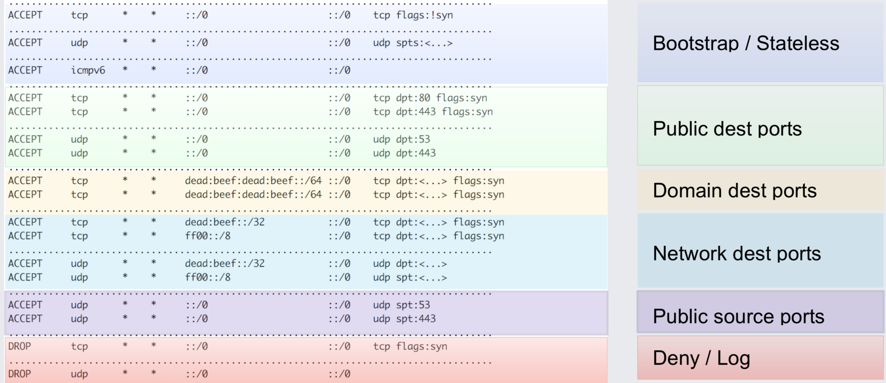
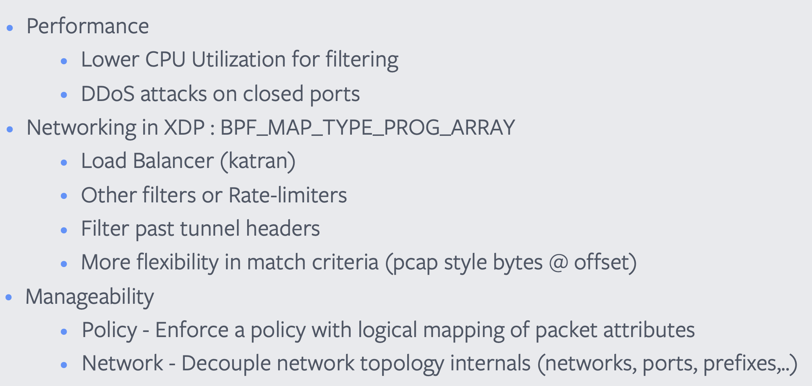
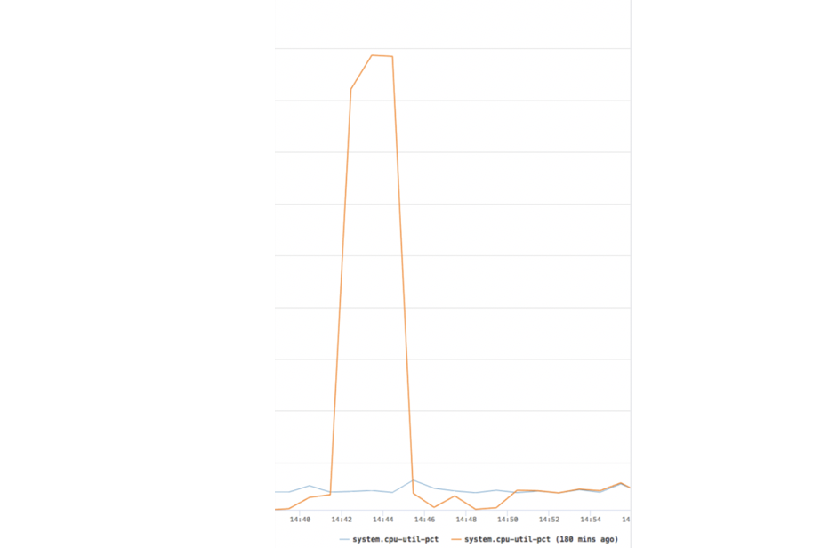

We have covered Facebook's BPF-based load balancer with DDoS protection in
a previous blog post: [Why is the kernel community replacing iptables with BPF?](/blog/2018/04/17/why-is-the-kernel-community-replacing-iptables).
This post provides further details on Facebook's BPF use by covering Anant
Deepak's talk at the [BPF/networking microconference] on Facebook's BPF-based
edge firewall running in production.

The same conference also featured many other BPF related talks which we will
cover in follow-up blog posts. In particular interesting will be Nikita V.
Shirokov's (Facebook) talk [XDP: 1.5 years in production. Evolution and
lessons
learned](http://vger.kernel.org/lpc_net2018_talks/LPC_XDP_Shirokov_v2.pdf)
where Nikita shows the impressive difference between IPVS and BPF under heavy
load as well as Vlad Dumitrescu from Google talking about [Scaling Linux
Traffic Shaping with
BPF](http://vger.kernel.org/lpc_bpf2018_talks/lpc-bpf-2018-shaping.pdf) where
Vlad and others share their experience deploying BPF to production solving
scalable traffic shaping.

## Problems of the existing iptables firewall

Anant started his [talk](http://vger.kernel.org/lpc_net2018_talks/ebpf-firewall-LPC.pdf)
providing the background on the need to replace the existing iptables firewall
with BPF. At the root of the problem lies the sequential nature of the iptables
policy engine. To demonstrate this, Anant showed a simplified version of the
code used to traverse a list of rules:

```c
// net/ipv6/netfilter/ip6_tables.c
unsigned int ip6t_do_table(...)
{
    e = get_entry(...);
    do {
        ...
        if (!ip6_packet_match(...)) {
            e = ip6t_next_entry(e);
            continue
        }
        ...
    } while (...);
}
```

Logic such as this was common 20 years ago when iptables was created. A primary
reason for this model was that most hardware-based firewalls were configured
using sequential list of rules. However, while hardware-based firewalls
primarily used [TCAM] for its parallel search capability and constant
processing speed, the iptables implementation in software has always been
suffering from linearly increasing CPU utilization as more rules are being
added to a table. The performance suffers in particular if packets are
frequently hitting rules in the lower parts of the table.

To illustrate this, Anant showed and explained the iptables ruleset that
previously applied to all network traffic entering any of the datacenters. The
purpose of the rules is to filter out unwanted traffic to protect the
load balancers from DDoS and other attacks. As you can tell based on the
ruleset, even though the ruleset is quite optimized to allow matching the
majority



Why is there no rule matching on the connection tracking state and allowing all
established connections as seen in common iptables rules sets? The overhead of
the iptables/netfilter connection tracker would simply bring any machine to its
knees when being hit with the common Facebook traffic pattern.

# Benefits of a BPF-based firewall

What exactly can BPF do better? The slide that Anant presented listed the
following overview:



**Performance:** The performance aspect is the most important. By using
efficient BPF map data structures, the sequential lookups can be avoided and
the performance of the firewall is increased significantly. But even more
importantly, a DoS attack on closed ports which previously hit the default deny rule at the end of the rules set is no longer effective to impose an unnecessary load on the infrastructure.

**XDP:** XDP is a special BPF mode which enables BPF programs to take control
over network packets at the network driver level. This brings additional
performance benefits due to decreased overhead and more importantly allows to
run the firewall right in front of the existing BPF-based load balancer. The
chaining is done using BPF tail calls which is a function call like construct
with excellent performance attributes. As requirements change, Facebook
engineers can write additional programs to provide rate limiting, additional
filtering, or other custom logic and simply hook the programs into the chain.
The flexibility of BPF allows creating matching logic at arbitrary offsets in
the packet and provides powerful logic to handle any upcoming DoS scenario or
filtering requirement.

**Manageability:** The performance of BPF is outstanding and often an initial
motivation to get involved in BPF but infrastructure engineers ultimately fall
in love with BPF due to its flexibility, programmability, and manageability.
Bits in network packet headers can be arbitrarily interpreted and re-purposed,
policy can be decoupled from the network topology by creating a logical mapping
via packet attributes, visibility at any network layer is a matter of writing
the respective program. An extensive userspace API allows interacting with
programs to export statistics, update maps and atomically replace BPF programs.

# BPF Program Details

The illustration below shows a simplified view of the BPF program that
implements the equivalent of the iptables rule set as shown before. A single
BPF map lookup per tuple using an LPM (Longest Prefix Match) table maps the
network topology to a logical policy which is then interpreted. The policy
logic itself is not that different from before, it still allows to use a list
of logical conditions to implement precedence. Unlike the individual iptables
rule matching function which translates into hundreds or thousands of CPU
instructions with a series of memory accesses. The BPF implementation
translates into a small number of CPU instructions with the logic implementing
the policy all using register-based accesses.


# Performance

Facebook often doesn't publish absolute numbers in terms of performance so we
don't see the exact absolute CPU utilization but the comparison between
iptables (orange) and BPF (blue) clearly indicates how the utilization stays
constant for the BPF firewall while the iptables firewall suffers from a peak
of increased CPU utilization which translates to a successful DoS attack and
unnecessary load on the infrastructure.



- iptables has a linearly increasing CPU utilization as packets hit lower rules

  - Best when packets match earlier rules
  - Worst for default policy (match attempted for each rule)

- The BPF firewall performance remains practically constant irrespective of
  the rule being matched or default drop
  - Packet tuple lookup is efficient with only 1 BPF map per tuple
  - Location of matching rule now only matters to the extent of few branching
    instructions

# Next Steps

The firewall described in the talk is specific to Facebook's edge use case
which has the most specific performance requirements. There are many other use
cases for firewalls where performance is still important but reconfigurability
and flexibility start becoming more important as well. For this reason, Anant
also provided insights into some ongoing projects:

## IPtables-style BPF firewall Prototype

The presented BPF program can be generalized a bit to make it more flexible.
Facebook engineers have written a prototype which can translate a set of
limited iptables rules into a BPF program and map. The per-packet algorithm is
similar to the program discussed in the first part of the talk with a single
BPF map lookup per tuple. Instead of the verdict, the value of the BPF map
carries a bit array which describes the verdict based on the rule position.

```c
// Parse the packet and lookup against maps for each attribute
// *_res are the results of the lookup
ip4_src_addr_res = lookup_ipv4_src_addr(iph->saddr);

// ..collect _res for all other tuples
#pragma clang loop unroll(full)
for (rule_word = 0; rule_word < RULE_IDS_MAX_WORDS; rule_word++) {
  u64 rule_id = ip4_src_addr_res->rule_ids[rule_word];
      rule_id &= ip4_src_lpm_res->rule_ids[rule_word];
      rule_id &= ip4_dst_addr_res->rule_ids[rule_word];
      rule_id &= ip4_dst_lpm_res->rule_ids[rule_word];
      rule_id &= ip6_src_addr_res->rule_ids[rule_word];
      rule_id &= ip6_dst_addr_res->rule_ids[rule_word];
      rule_id &= ip6_src_lpm_res->rule_ids[rule_word];
      rule_id &= ip6_dst_lpm_res->rule_ids[rule_word];
      rule_id &= src_port_res->rule_ids[rule_word];
      rule_id &= dst_port_res->rule_ids[rule_word];
      rule_id &= ip_proto_res->rule_ids[rule_word];
      rule_id &= tcp_flag_res->rule_ids[rule_word];

  if (rule_id) {
    // find first bit set (MSB)
    int rule_num = (rule_word * 64) + get_msb_set(rule_id);

    // Take action
    int action = lookup_action(rule_num);
    if (action == BPFILTER_ACTION_PASS) {
      XDP_PASS;
    }

    if (action == BPFILTER_ACTION_DENY) {
      XDP_DROP;
    }
  }
}
```

The full details can be found in the [slides] and [paper]. As of now, the prototype still has some restrictions such as no support for REJECT rules.

## bpfilter

As known publicly for a while, the kernel community is working on replacing the
in-kernel portion of iptables with BPF. Anant provided an update on this
project called [bpfilter]. Unlike the prototype described in the previous chapter
which works by having the user pipe `iptables-save` output into a python
program that generates a BPF program. The bpfilter program handles the
conversion from iptables to BPF as part of a kernel interface to provide
seamless backward compatibility. The goal is to allow users to continue using
iptables as-is while providing a more performant implementation.

# Summary

Anant provided great details on Facebook's BPF use to build a highly efficient
and flexible firewall that complements the existing BPF-based load balancer.
The new firewall demonstrates constant CPU utilization regardless of the type
of traffic that is being processed and has become immune against DoS attacks.
The main reason listed for the migration away from the outdated iptables model
is the sequential matching semantics of iptables and the superior performance
and manageability of the BPF subsystem.

A recording of the talk should become available in a couple of weeks on the
[microconference page](http://vger.kernel.org/lpc-networking.html).

This post covered one of the many exciting talks on the topic of BPF, both the
BPF and Networking microconference where overflowing with BPF related talks. To
pick just a few:

- [Scaling Linux Traffic Shaping with BPF, Vlad Dumitrescu (Google) et al](http://vger.kernel.org/lpc_bpf2018_talks/lpc-bpf-2018-shaping.pdf)
- [XDP: 1.5 years in production. Evolution and lessons learned, Nikita V. Shirokov (Facebook)](http://vger.kernel.org/lpc_net2018_talks/LPC_XDP_Shirokov_v2.pdf)
- [Combining kTLS and BPF for Introspection and Policy Enforcement, Daniel Borkmann (Cilium) et al.](http://vger.kernel.org/lpc_net2018_talks/ktls_bpf.pdf)
- [BPF control flow, supporting loops and other patterns, John Fastabend (Cilium)](http://vger.kernel.org/lpc_bpf2018_talks/bounded-loops.pdf)
- [Traffic policing in eBPF: applying token bucket algorithm, Julia Kartseva (Facebook)](http://vger.kernel.org/lpc_bpf2018_talks/LPC2018-TokenBucket_v4.pdf)
- [Compile once, run everywhere, Yonghong Song and Alexei Starovoitov (Facebook)](http://vger.kernel.org/lpc_bpf2018_talks/bpf_compile_once.pdf)
- [ELF relocation for static data in BPF, Joe Stringer (Cilium) and Daniel Borkmann (Cilium)](http://vger.kernel.org/lpc_bpf2018_talks/bpf_global_data_and_static_keys.pdf)
- [XDP - challenges and future work, Jesper Brouer (Red Hat), Toke Høiland-Jørgensen (Karlstad University)](http://vger.kernel.org/lpc_net2018_talks/presentation-lpc2018-xdp-future.pdf)
- [Bringing the Power of eBPF to Open vSwitch, William Tu (VMware) et al.](http://vger.kernel.org/lpc_net2018_talks/ovs-ebpf-lpc18-presentation.pdf)

You can find the full list of talks including slides and papers on the
[BPF](http://vger.kernel.org/lpc-bpf.html) and
[Networking](http://vger.kernel.org/lpc-networking.html) microconference
websites. If you want to learn more about BPF, dive into the [BPF and XDP
Reference Guide](http://docs.cilium.io/en/stable/bpf/).

If you are interested in leveraging BPF and XDP for networking, policy and load
balancing in the context of containers, Kubernetes and microservices then have
a look at [Cilium].

## References

- [BPF and XDP Reference Guide](http://docs.cilium.io/en/stable/bpf/)
- [Facebook open-sources new suite of Linux kernel components and tools](https://code.fb.com/open-source/linux/)
- [bpfilter LWN article](https://lwn.net/Articles/747551)
- [katran - Facebook loadbalancer repository](https://github.com/facebookincubator/katran)
- [droplet - BPF-based DDoS counter measures from Facebook](https://netdevconf.org/2.1/session.html?zhou)
- [SIGCOMM 2018 - Accelerating Linux Security with eBPF iptables](https://dl.acm.org/citation.cfm?id=3234228)
- [Why is the kernel community replacing iptables with BPF?](https://cilium.io/blog/2018/04/17/why-is-the-kernel-community-replacing-iptables/)

[slack]: http://cilium.io/slack
[cilium]: https://github.com/cilium/cilium
[slides]: http://vger.kernel.org/lpc_net2018_talks/ebpf-firewall-LPC.pdf
[paper]: http://vger.kernel.org/lpc_net2018_talks/ebpf-firewall-paper-LPC.pdf
[bpf/networking microconference]: http://vger.kernel.org/lpc-networking.html
[lpc]: https://www.linuxplumbersconf.org/
[tcam]: https://en.wikipedia.org/wiki/Content-addressable_memory#Ternary_CAMs
[bpfilter]: https://lwn.net/Articles/747551
