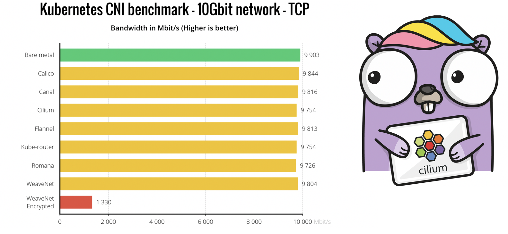
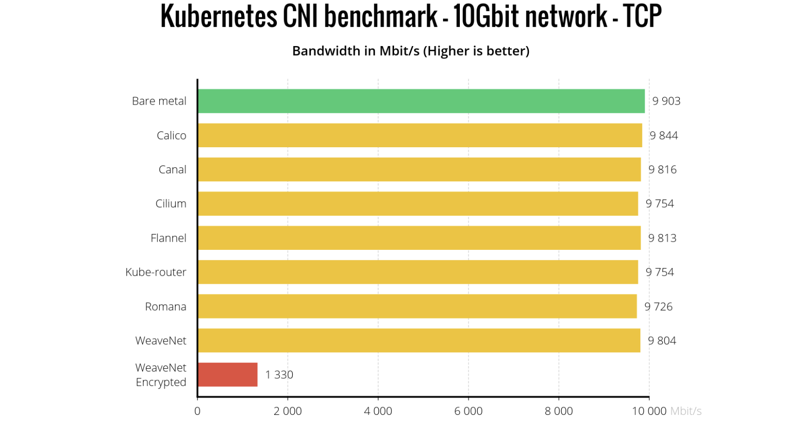
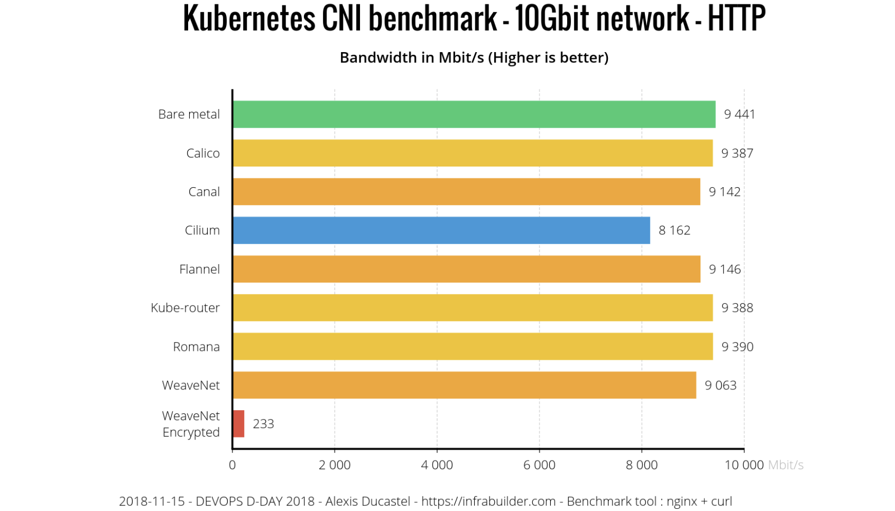
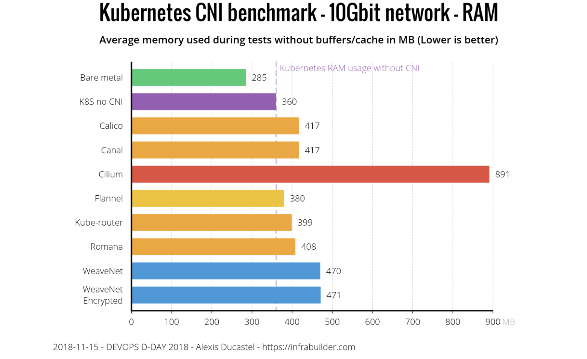
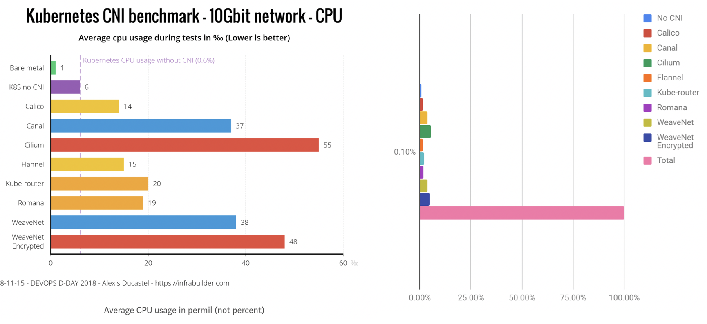

First of all, huge shout-out to [Alexis
Ducastel](https://twitter.com/infrabuilder) for putting together a great CNI
benchmark comparison. To be honest, there was definitely a moment of panic when
we saw the article pop up. Did we just miss a major performance regression?

This blog post documents the investigation we have done so far of what looked
like a performance regression of HTTP/FTP traffic over pure TCP.

Alexis was super quick to share the
[scripts](https://github.com/InfraBuilder/k8s-cni-benchmark) that he used to
collect the benchmarks numbers. This not only allowed for a quick verification
but also allows us to integrate this into our CI tests and run it alongside of
the existing benchmarks for better coverage.

## Summary

- The external etcd is no longer a requirement. With 1.3, we started providing an
  etcd-operator to have Cilium maintain its own etcd. We are still
  investigating a CRD-based replacement as well but are still seeing a
  significant scalability difference when running >2000 pods or >100 nodes. We
  leverage atomic transactions supported by etcd to avoid distributed locks and
  it heavily benefits the scalability of policy enforcement.

- The article shows lower HTTP and FTP throughput compared to TCP. We feared
  this to be a BPF related performance regression but it turned out to be
  caused by how curl measures download speed in combination with Cilium's
  optimistic pod scheduling strategy which treats CNI requests mostly
  asynchronously. This allows a pod to start running before the networking has
  been setup while ensuring that policy enforcement is always enforced
  correctly. This helps reduce the time to schedule a pod and thus allows to
  schedule pods quicker. The consequence is that the TCP connection started by
  curl to be established later. Unfortunately, curl measures the time of the
  transfer from the initial connection attempt (unlike iperf3 and netperf) and
  thus includes the time in which the connection is waiting to be established
  to the total transfer time. This leads to a lower bitrate to be reported.

  The latest development tree already had this behavior changed but the change
  was not released yet. Cilium versions 1.2.6, 1.3.1 and 1.4.0 will include the
  commit and change this default setting to block the CNI call until all
  network plumbing has been completed. We will make the functionality of
  asynchronous network bootstrapping available to advanced users via an option.

- The article shows minor differences between raw TCP throughput of individual
  CNI plugins. The benchmarks of all TCP/UDP tests are limited by the speed of
  the 10Gbit/s network connectivity except for the encrypted test via Weave.
  There is a difference in theoretical payload maximum depending on
  whether a CNI plugin uses encapsulation or direct routing mode. In the
  article, Alexis is running Cilium in encapsulation mode which will lower the
  maximum achievable payload rate slightly because more of the available
  network bandwidth is used for network headers instead of payload. Multiple
  CNI plugins can be put in either encapsulation or direct routing mode and I
  would expect the numbers to change slightly accordingly.
  _Update:_ According to our friends working on Weave, the Weave performance in
  encryption mode is bad because the MTU is misconfigured and does not take
  into account the ESP headers. This causes fragmentation which lowers the
  throughput significantly. If the MTU is configured to be 8196 to account for
  VXLAN + ESP, the reported throughput will be a lot better.

  As a side note: While testing, we observed that the kernel being used by
  Alexis (4.15) has a known performance regression which is fixed by [this
  upstream kernel commit](https://git.kernel.org/pub/scm/linux/kernel/git/torvalds/linux.git/commit/?id=9c4c325252c54b34d53b3d0ffd535182b744e03d).
  It's observable by comparing the number of TCP retransmissions required to
  transfer the data. This bug is not Cilium specific though, all CNI plugins
  that require a network packet to cross a network namespace boundary will
  suffer from this. The effect is not big enough to have meaningful impact in
  this 9000 MTU benchmark test but adds some variance to the test results.

- The memory consumption is due to aggressively pre-allocating BPF maps in the
  in favour of providing lowest average latency possible. There is a PR under
  discussion to change the default pre-allocation strategy become less
  aggressive. Another PR is out to disable IPv6 by default to save additional
  memory resource usage by default.

- The only number we could not directly reproduce is the 5.5% CPU consumption.
  In our tests, iperf3 or curl consume significantly more CPU on their own and
  the CPU usage of Cilium and kernel is insignificant to everything else.

- The frequently requested transparent encryption will be added
  in Cilium 1.4. The work has been underway for a while and will be merged in
  the next couple of weeks.

## TCP and UDP benchmarks

The first tests performed are TCP and UDP benchmarks using iperf3 by
transmitting random data as quickly as possible for 2 minutes. The tests are
run in a bare metal setup connected by 10Gbit/s hardware. As for all tests, an
MTU of 9000 bytes is used. The MTU defines the maximum size of a single packet
on the wire. By setting this to the largest possible number that the network
hardware supports, the ratio between data payload and network packet headers
can be optimized. This means that for a given available network bandwidth, more
of it can be used for actual data. Large MTUs (jumbo frames) work well within
datacenters but is much harder to achieve on the Internet where the MTU is
typically 1500 and below. Large MTUs put the least stress on the networking
layer and more stress on the application and the network hardware or the memory
bus typically becomes the bottleneck.

Let's look at the numbers collected:



It would be quite surprising if any CNI plugin cannot achieve network wire
speed in this scenario. Why? Let's look at the CPU utilization of the sending
machine while 10Gbit/s are being transmitted with Cilium.

```
top - 14:25:54 up 19:33,  1 user,  load average: 1.16, 0.61, 0.30
Tasks: 419 total,   2 running, 223 sleeping,   0 stopped,   0 zombie
%Cpu(s):  0.2 us,  0.1 sy,  0.0 ni, 98.4 id,  0.0 wa,  0.0 hi,  1.3 si,  0.0 st
KiB Mem : 61822704 total, 56957304 free,  1374384 used,  3491016 buff/cache
KiB Swap:        0 total,        0 free,        0 used. 59416744 avail Mem

   PID USER      PR  NI    VIRT    RES    SHR S  %CPU %MEM     TIME+ COMMAND
127440 root      20   0    3312    948    684 R  13.7  0.0   0:03.97 iperf3         <-- Benchmark app
  7167 root      20   0 5174800  93288  50600 S   3.9  0.2  34:13.57 kubelet
    65 root      20   0       0      0      0 S   2.0  0.0   0:26.06 ksoftirqd/9    <-- BPF in kernel
  6373 root      20   0 6644496  70412  28976 S   2.0  0.1  16:31.18 dockerd
 17895 root      20   0   54416  28384  21564 S   2.0  0.0   2:30.99 aws-k8s-agent
 94338 root      20   0   10.1g  55652  17712 S   2.0  0.1  28:31.99 etcd
     1 root      20   0  191540   5984   4148 S   0.0  0.0   0:05.45 systemd
     2 root      20   0       0      0      0 S   0.0  0.0   0:00.07 kthreadd
```

As expected, the networking layer is not really consuming any significant CPU.
Overall, the systesm is 98.4% idle and the majority of the CPU being consumed
is by the app which produces the network traffic. This is pretty much expected,
Linux has been optimized to run as a server hosting applications for decades.

The picture looks similar on the receiving side:

```
top - 14:32:52 up 19:40,  1 user,  load average: 0.46, 0.51, 0.39
Tasks: 424 total,   1 running, 233 sleeping,   0 stopped,   0 zombie
%Cpu(s):  0.3 us,  0.9 sy,  0.0 ni, 97.7 id,  0.0 wa,  0.0 hi,  1.0 si,  0.0 st
KiB Mem : 61822704 total, 45532640 free,  1472912 used, 14817152 buff/cache
KiB Swap:        0 total,        0 free,        0 used. 59248884 avail Mem

   PID USER      PR  NI    VIRT    RES    SHR S  %CPU %MEM     TIME+ COMMAND
 72931 root      20   0    3436   1068    612 S  58.0  0.0   4:13.87 iperf3
 71028 root      20   0   10.1g  58400  18116 S   6.0  0.1  24:18.46 etcd
 70274 root      20   0   10.1g  56560  17456 S   4.0  0.1  24:53.08 etcd
  6977 root      20   0 5172432  92316  50740 S   2.0  0.1  40:14.05 kubelet
 84317 root      20   0   50276  25616  18704 S   2.0  0.0   4:33.68 kube-dns
 87137 root      20   0  169296   4596   3732 R   2.0  0.0   0:00.09 top
     1 root      20   0  191532   6044   4168 S   0.0  0.0   0:04.39 systemd
     2 root      20   0       0      0      0 S   0.0  0.0   0:00.07 kthreadd
     4 root       0 -20       0      0      0 I   0.0  0.0   0:00.00 kworker/0:0H
```

The system is only 97.7% idle and 58% of a single core is consumed by the
benchmark app.

So are there differences between CNI plugins for throughput at an MTU of 9000
at all? Yes, different CNI plugins use different architectures in connecting
pods to the networks. Cilium defaults to an encapsulation based routing
mechanism. The advantage of this mode is the ability to pretty much run on any
infrastructure without changes. The disadvantage of this mode is a slight
overhead in theoretical maximum throughput as each packet is encapsulated into
additional network headers. For this reason, Cilium also supports direct
routing mode with integration into any routing daemon including kube-router. So
if you care about maximising the throughput and have the expertise to configure
your network to route pod IPs, feel free to configure direct routing mode by
running Cilium with the option `--tunnel=disabled`.

## HTTP and FTP benchmark

This is where it gets really interesting! The benchmark shows a reduced
throughput for both HTTP and FTP in the scenario of Cilium. This is very
unexpected, in particular because there is no HTTP level network policy
in effect and thus HTTP/FTP performance should match TCP.



The benchmark that Alexis is performing is to run nginx in a Kubernetes pod
with a volume mounted that contains a 10G file consisting of random data and
then fetching it via curl to measure the duration of the download.

The initial step was to run this benchmark and just run `top` on the side:

```
top - 15:06:15 up 20:13,  1 user,  load average: 0.51, 0.36, 0.26
Tasks: 502 total,   2 running, 229 sleeping,   0 stopped,   0 zombie
%Cpu(s):  1.2 us,  0.6 sy,  0.0 ni, 97.9 id,  0.0 wa,  0.0 hi,  0.4 si,  0.0 st
KiB Mem : 61822704 total, 56942360 free,  1376780 used,  3503564 buff/cache
KiB Swap:        0 total,        0 free,        0 used. 59411592 avail Mem

   PID USER      PR  NI    VIRT    RES    SHR S  %CPU %MEM     TIME+ COMMAND
 65922 root      20   0   14096   3220   2804 S  18.3  0.0   0:00.55 curl
  7167 root      20   0 5175856  93868  50600 S   4.3  0.2  35:25.54 kubelet
  6373 root      20   0 6644496  71252  29040 S   2.3  0.1  17:03.42 dockerd
 57396 root      20   0 3725028 124768  37952 S   2.0  0.2   0:04.29 cilium-agent
 94338 root      20   0   10.1g  57432  17864 S   2.0  0.1  29:23.63 etcd
     1 root      20   0  191540   5984   4148 S   0.3  0.0   0:05.97 systemd
  6631 root      20   0 3312864  29336   7580 S   0.3  0.0   4:32.37 docker-containe
```

Nothing unexpected at all. The majority of the CPU is consumed by curl
respectively nginx on the other node. What is going on? Let's try with the
latest master version of Cilium and compare it to 1.3.0 that Alexis is using.

```
  Run |       1.3.0 |      master
------|-------------|------------
    1 | 4539 Mbit/s | 4814 Mbit/s
    2 | 4545 Mbit/s | 4814 Mbit/s
    3 | 4543 Mbit/s | 4814 Mbit/s
    4 | 4542 Mbit/s | 4815 Mbit/s
    5 | 4547 Mbit/s | 4815 Mbit/s
Total | 4543 Mbit/s | 4814 Mbit/s
```

Bingo! Did we unknowingly fix a performance regression that only applies to HTTP and
FTP? To understand what is going on, let's look what the benchmark script does
specifically:

```bash
function bench_kubectl {
        kubectl run --restart=Never --rm \
                --overrides='{"apiVersion":"v1","spec":{"nodeSelector":{"kubernetes.io/hostname":"XXX"}}}' $@
}

RES_HTTP=$(bench_kubectl bench -it --image=infrabuilder/netbench:client \
         -- curl -o /dev/null -skw "%{speed_download}" http://$IP/10G.dat 2>/dev/null| sed 's/\..*//' )
```

The script uses `kubectl run` which launches curl as soon as the container has
started and then outputs the download speed. Why does this matter?

When a pod launches, kubelet invokes the CNI layer to request the CNI plugin to
do the neworking plugin. This call blocks the scheduling of the pod. CNI
plugins that support network policy have to ensure that an eventual security
policy is correctly enforced from the first possible packet that a pod could
transmit or receive. This operation takes some time, any added time will lower
the speed at which pods can be scaled up on cluster level. Early on, we discussed
the pros and cons of:

1. Blocking the CNI request until pods labels have been fetched and all
   networking plumbing is done and to ensure that the first possible packet
   encounters are fully configured network and no packet drop is every
   happening.

2. Optimistically putting as little plumbing in place to allow for TCP
   retransmissions, return from the CNI request call and fetch the Kubernetes
   pod labels and completing the networking in the background. Because of
   eventual network policy that might apply, all traffic is dropped until the
   pod labels have been fetched. This mode makes use of the nature of TCP to
   retransmit for a while until networking is fully up and leads to better pod
   scalability.

We have chosen the faster pod scaling so far but based on user feedback, are
switching to the blocking mode going forward. The master tree already contains
[PR #6299](https://github.com/cilium/cilium/pull/6299) to change this default
and is scheduled to be released as 1.4.0, 1.3.1, and 1.2.6.

Due to how curl measures the download speed, it will start measuring the total
time of the download when making the initial connection attempt. This means
that the total time includes the period in which networking was still blocked.
This reduces the reported troughput rate. OTOH, iperf3 measures the actual
transmitted data rate in intervals and adds it up.

## Memory consumption

The memory consumption as reported in the benchmark is real but work is
underway to provide better defaults while allowing large scale users to
continue running aggressive memory pre-allocation settings.



The reasons for this are:

- A very aggressive pre-allocation strategy of any datapath related kernel data
  structure including state required to maintain connection tracking. This
  ensures that none or as few memory allocations are required when performing
  work for individual network packets. This is done to keep latency low and
  stable. [PR #6357](https://github.com/cilium/cilium/pull/6357) is being worked
  on to disable pre-allocation with a `--preallocate-bpf-maps` option to
  continue optimizing for latency.

- Enabling IPv6 by default. This leads to data structures being allocated
  for IPv6 which most users don't use yet. [PR #6082] is underway to change this
  default.

We have definitely optimized for a low latency datapath so far while knowingly
sacrificing memory. The 1.4.0 release will provide more control over this with
defaults as decided by the community.

Another aspect is that the project is moving very quickly right now. We
dedicate a percentage of time to resource optimization for every release and
memory consumption has been coming down consequently with each release. We
definitely don't claim to have optimize this yet. We believe that BPF gives us
the flexibility and efficiency to strike the perfect balance between serving
low latency requests benefiting from heavily pre-allocated memory tables and
high throughput environments which do not require this at all.

## CPU utilization

The last piece to look at is the CPU consumption. One thing to note here is
that the article includes a graph that shows the overhead in permil instead of
percent and the graph does not scale up to 100%. To put everything a bit into
perspective, the graph on the right shows the same numbers at a scale of 100%.



Let's try a different workload type to and trigger more CPU consumption by
the networking layer. We are running `wrk` in a pod on one Kubernetes node
configured to make as many HTTP requests as possible with 12 threads and 400
parallel connections to `nginx` running on another Kubernetes node.

```
wrk -t12 -c400 -d30s http://10.163.228.10:80/index.html
Running 30s test @ http://10.163.228.10:80/index.html
  12 threads and 400 connections
  Thread Stats   Avg      Stdev     Max   +/- Stdev
    Latency    50.04ms  117.73ms   2.00s    87.14%
    Req/Sec     3.43k     1.61k   13.60k    75.93%
  1214934 requests in 30.10s, 271.07MB read
  Socket errors: connect 0, read 0, write 0, timeout 53
Requests/sec:  40362.94
Transfer/sec:      9.01MB
```

wrk is able to roughly send 40'0000 requests per second. Let's look at the CPU
consumption on both the sender and receiver:

```
top - 03:03:12 up 1 day,  8:36,  3 users,  load average: 1.16, 0.70, 0.37
Tasks: 510 total,   1 running, 259 sleeping,   0 stopped,   0 zombie
%Cpu(s):  0.7 us,  1.9 sy,  0.0 ni, 91.7 id,  0.0 wa,  0.0 hi,  5.7 si,  0.0 st
KiB Mem : 26403225+total, 25511452+free,  2000124 used,  6917612 buff/cache
KiB Swap:  1995772 total,  1995772 free,        0 used. 26021649+avail Mem

  PID USER      PR  NI    VIRT    RES    SHR S  %CPU %MEM     TIME+ COMMAND
 4635 root      20   0  106524   6288   1728 S 282.5  0.0   0:29.02 wrk
  132 root      20   0       0      0      0 S   1.3  0.0   0:26.84 ksoftirqd/20
    8 root      20   0       0      0      0 S   1.0  0.0   0:20.08 ksoftirqd/0
   24 root      20   0       0      0      0 S   1.0  0.0   0:07.93 ksoftirqd/2
   48 root      20   0       0      0      0 S   1.0  0.0   0:07.11 ksoftirqd/6
   60 root      20   0       0      0      0 S   1.0  0.0   0:11.13 ksoftirqd/8
   72 root      20   0       0      0      0 S   1.0  0.0   0:06.87 ksoftirqd/10
   84 root      20   0       0      0      0 S   1.0  0.0   0:20.00 ksoftirqd/12
   96 root      20   0       0      0      0 S   1.0  0.0   0:07.65 ksoftirqd/14
  108 root      20   0       0      0      0 S   1.0  0.0   0:03.32 ksoftirqd/16
```

The majority of the CPU is consumed by `wrk` itself which is consuming roughly
3 cores in total spread over 12 threads.

On the receiving side.

```
op - 03:02:07 up 1 day,  8:36,  2 users,  load average: 0.47, 0.37, 0.28
Tasks: 512 total,   2 running, 263 sleeping,   0 stopped,   0 zombie
%Cpu(s):  0.5 us,  0.9 sy,  0.0 ni, 96.3 id,  0.0 wa,  0.0 hi,  2.3 si,  0.0 st
KiB Mem : 26403224+total, 23441790+free,  2124056 used, 27490276 buff/cache
KiB Swap:  1995772 total,  1995772 free,        0 used. 26002094+avail Mem

  PID USER      PR  NI    VIRT    RES    SHR S  %CPU %MEM     TIME+ COMMAND
41591 systemd+  20   0   33120   3336   1964 R  99.7  0.0   0:37.05 nginx
11463 root      20   0 10.034g  22268  12872 S   1.0  0.0   1:02.30 etcd
    9 root      20   0       0      0      0 I   0.3  0.0   0:11.23 rcu_sched
   72 root      20   0       0      0      0 S   0.3  0.0   0:06.98 ksoftirqd/10
  132 root      20   0       0      0      0 S   0.3  0.0   0:12.50 ksoftirqd/20
  168 root      20   0       0      0      0 S   0.3  0.0   0:10.03 ksoftirqd/26
37246 root      20   0       0      0      0 I   0.3  0.0   0:00.26 kworker/u97:0
```

The receiving side reveals the bottleneck which is nginx running as a single
pod. You can also see various `ksoftirqd` which are kernel software interrupt
threads which are handling the network receive load. You can see that no
significant CPU resources are being spent on the networking stack itself.

## Conclusion

This is where we are right now with our investigation. We did not find a
generic performance regression. The HTTP and FTP related performance has been
tracked down to asynchronous handling of the CNI API which will change in
1.3.1, 1.2.6 and 1.4.0. 1.4.0 will make the aggresive pre-allocation optional
and disable IPv6 to optimize the memory footprint.

A big thank-you again to Alexis Ducastel for sharing the results. Feedback like
this helps everybody improve.

[slack]: https://slack.cilium.io
[cilium]: https://github.com/cilium/cilium
[benchmark]: https://itnext.io/benchmark-results-of-kubernetes-network-plugins-cni-over-10gbit-s-network-36475925a560
[pr #6357]: https://github.com/cilium/cilium/pull/6357
[pr #6082]: https://github.com/cilium/cilium/pull/6082
