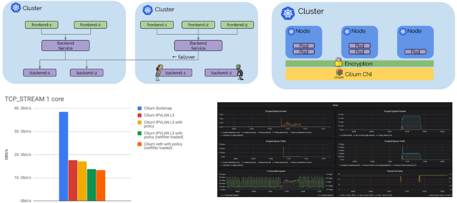

We are excited to announce the Cilium 1.4 release. The release introduces
several new features as well as optimization and scalability work. The
highlights include the addition of global services to provide Kubernetes
service routing across multiple clusters, DNS request/response aware
authorization and visibility, transparent encryption (beta), IPVLAN support for
better performance and latency (beta), integration with Flannel, GKE on COS
support, AWS metadata based policy enforcement (alpha) as well as significant
efforts into optimizing memory and CPU usage.

As usual, a big shout out to the entire community of Cilium developers who have
contributed 1048 commits in the last 4 months between version 1.3 and 1.4.

## What is Cilium?

Cilium is open source software for transparently providing and securing the
network and API connectivity between application services deployed using Linux
container management platforms like Kubernetes, Docker, and Mesos.

At the foundation of Cilium is a new Linux kernel technology called BPF, which
enables the dynamic insertion of powerful security, visibility, and networking
control logic within Linux itself. BPF is utilized to provide functionality
such as multi-cluster routing, load balancing to replace kube-proxy,
transparent encryption using X.509 certificates as well as network and service
security. Besides providing traditional network level security, the flexibility
of BPF enables security with the context of application protocols and DNS
requests/responses. Cilium is tightly integrated with Envoy and provides an
extension framework based on Go. Because BPF runs inside the Linux kernel, all
Cilium functionality can be applied without any changes to the application code
or container configuration.

See the section **[Introduction to Cilium](https://cilium.readthedocs.io/en/stable/intro/)** for a more detailed general
introduction to Cilium.

## Multi-Cluster Service Routing

Cilium 1.3 introduced the basic pod IP routing capability between multiple
clusters. Cilium 1.4 is introducing the concept of global services based on
standard Kubernetes services. Global services allow a user to nominate a
Kubernetes service to be available in multiple clusters. That service can then
have backend pods in multiple clusters.

The user experience is as simple as defining a Kubernetes service with
identical name and namespace in each cluster and adding an annotation to mark
it as global.

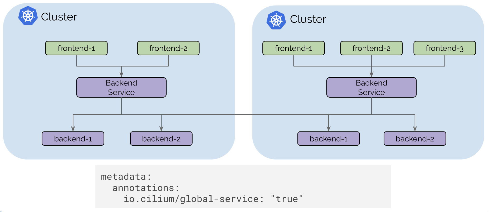

The Kubernetes health-check information is leveraged to add and remove service
backends automatically as pods scale up and down or become unhealthy.

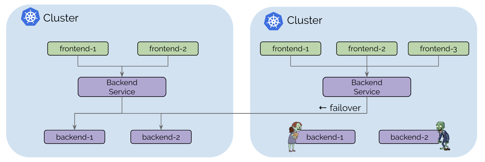

The control plane is built on top of etcd similar to how Kubernetes itself
operates with resiliency and simplicity as its foundational design pattern.
Each cluster continues to operate its own etcd cluster and replication happens
on a read-only basis which ensures that failures in a cluster do not impact
other clusters.

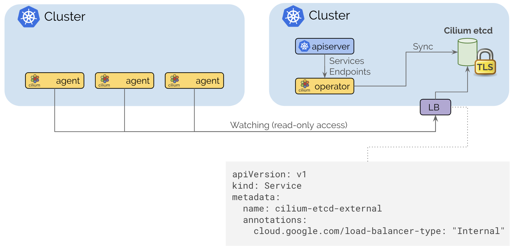

Connecting clusters together is as simple as providing routing between VPCs
using standard routing APIs of cloud providers or on-prem infrastructure via
regular IPSec based VPN gateways and tunnels and then exposing the Cilium
control plane via an internal Kubernetes Loadbalancer to expose it to the
internal VPCs. TLS is used to authenticate the client and server with the
certificates and keys managed as Kubernetes secrets.

<a name="ipvlan-support-beta"></a>

## IPVLAN support (beta)

A new IPVLAN based datapath mode has been added. IPVLAN has latency advantages
over veth based architectures. The following benchmarks have been measured with
netperf between two local containers on a 3.40Ghz Xeon with hyper-threading
disabled using a single core. The 99th percentile latency is considerably
lower with IPVLAN compared to veth (lower is better):


The maximum throughput (higher is better) is quite similar between IPVLAN and
veth but a very noticeable performance gain can be achieved by compiling out
netfilter/iptables from the kernel. Running your Kubernetes cluster completely
iptables free is already possible if you are not using NodePort services and do
not require to masquerade network traffic as it leaves a Kubernete worker node.
We'll provide a guide on how to run iptables and kube-proxy free in the next
couple of weeks.

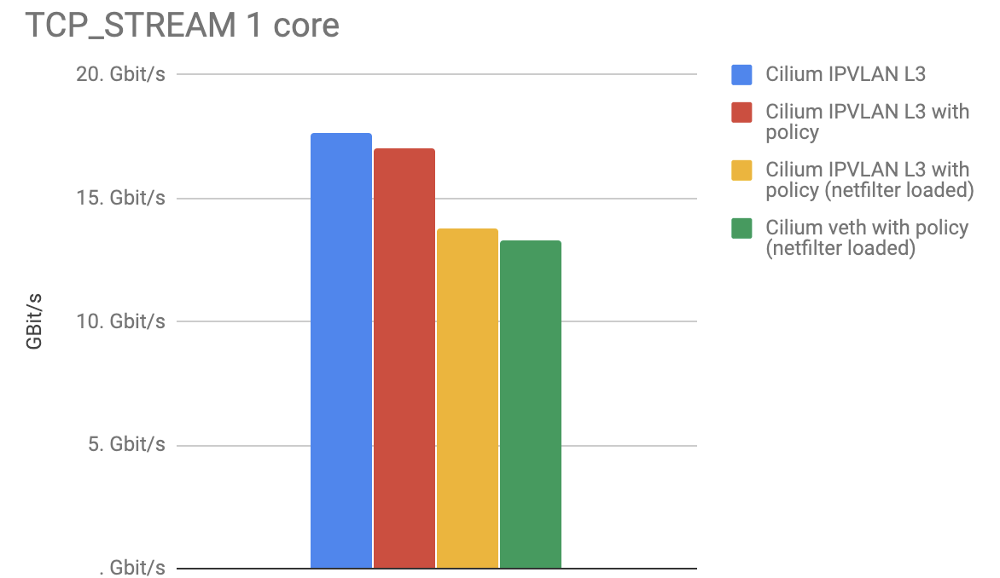

IPVLAN is a beta level feature in 1.4, see the [IPVLAN getting started guide](https://docs.cilium.io/en/v1.4/gettingstarted/ipvlan/) for instructions
on how to enable and configure the feature.

## DNS Request/Response Aware Security & Visibility

Cilium 1.4 extends the existing DNS security policy model to be aware of the
DNS requests that individual pods issue and the DNS responses they receive.
This significantly improves the security of pods accessing services outside of
the cluster:

- Pods can be restricted to have minimal privileges when performing DNS
  lookups, i.e. pod can be limited to only succeed in looking up DNS names
  matching a pattern such as `*.domain.com`. Any request outside of the allowed
  pattern will receive a `request refused` DNS response in return.

- The communication following the DNS lookup can be limited to the IP addresses
  as returned in the DNS response that the specific pod received. This reduces
  the privileges of a compromised application significantly and improves the
  reliability of DNS based policy rules as the enforcement logic no longer
  requires to know about all possible IP addresses that a DNS name can map to.

  In particular for popular storage, messaging, and database services offered
  by cloud providers, a single DNS name can map to hundreds or thousands of IP
  addresses.

- DNS lookups and responses are now logged via the Cilium authorization
  logging layer that is accessible via an API. This provides an exact log of
  every DNS request and response that a pod has performed.

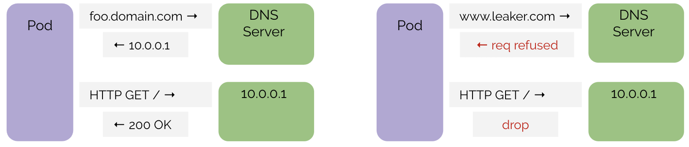

The above example shows a successful DNS sequence followed by an HTTP request
to the IP as responded by the DNS server. This is how an application is
expected to behave and what is permitted. Subsequent HTTP requests can use the
cached DNS information, allowing such requests. The DNS information will time
out according to TTL information in the record.

On the right is a sequence where the application is performing a DNS lookup
outside of the allowed DNS policy. It also shows that if the application fails
to perform a DNS lookup, any attempt to contact the IP address, even if the IP
address actually maps to a DNS name which is permitted, will be blocked if the
application failed to lookup the DNS name at some point.

### Policy Example

```yaml
apiVersion: 'cilium.io/v2'
kind: CiliumNetworkPolicy
metadata:
  name: 'egress-domain-wildcard'
spec:
  endpointSelector:
    matchLabels:
      app: myService
  egress:
    - toEndpoints:
        - matchLabels:
            'k8s:io.kubernetes.pod.namespace': kube-system
            k8s-app: kube-dns
      toPorts:
        - ports:
            - port: '53'
              protocol: UDP
          rules:
            dns:
              - matchPattern: '*.domain.com'
    - toFQDNs:
        - matchPattern: '*.domain.com'
      toPorts:
        - ports:
            - port: '443'
              protocol: TCP
```

The above policy example grants a pod or container the privilege to perform DNS
requests via kube-dns but limits the allowed DNS lookups to `*.domain.com`. A
request not matching the pattern will receive a `request refused` DNS response.
It further grants the pod egress access on port 443/TCP to the IPs returned in
the DNS response. Any attempt to access any IP address not previously returned
in a DNS response is rejected.

To get started using DNS-based policies, follow the [DNS-based getting started
guide](https://docs.cilium.io/en/v1.4/gettingstarted/dns/).

## Transparent Encryption & Authentication (beta)

Providing transparent encryption for all service-to-service communication
within a cluster and across clusters has been a frequently requested feature.
The encryption allows to run Kubernetes in untrusted networks transparently
encrypting all communication between services in the cluster. The
authentication ensures that only trusted worker nodes can participate in the
cluster.

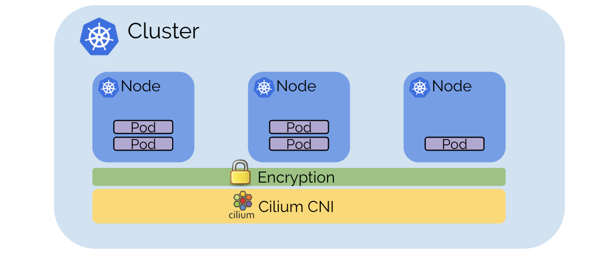

The encryption is based on X.509 certificates and keys. For now, a PSK is used
that is distributed to all nodes using a Kubernetes secret. However, the
infrastructure is compatible with SPIFFE and allows to provide service
authentication using SPIFFE certificates on a per service level in a future
release. The datapath implementation uses the IPSec implementation of the Linux
kernel which avoids the need to run sidecar proxies as part of all services and
ensures efficient and automatic use of hardware-assisted crypto acceleration
via specialized CPU instruction sets as found in modern processors.

Transparent encryption is a beta level feature. To enable the feature, pass
`--enable-ipsec` option to the agent and provide a pre shared key (PSK) via
the `--ipsec-key-file` option or by using a Kubernetes secret.

<a name="sockmap-bpf-based-sidecar-acceleration-alpha"></a>

## Sockmap BPF based sidecar acceleration (alpha)

As [announced at KubeCon](https://www.youtube.com/watch?v=ER9eIXL2_14), we are
making the local process communication acceleration available with Cilium 1.4.

Sockmap accelerated local process communication is primarily useful for
communication between sidecar proxies and local processes but applies to all
local processes.

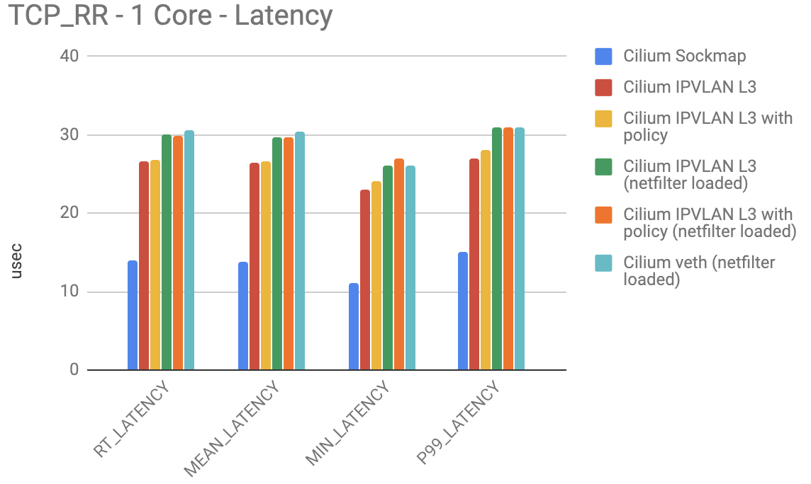

The number of requests/s and maximum throughput both double when sockmap is
enabled:

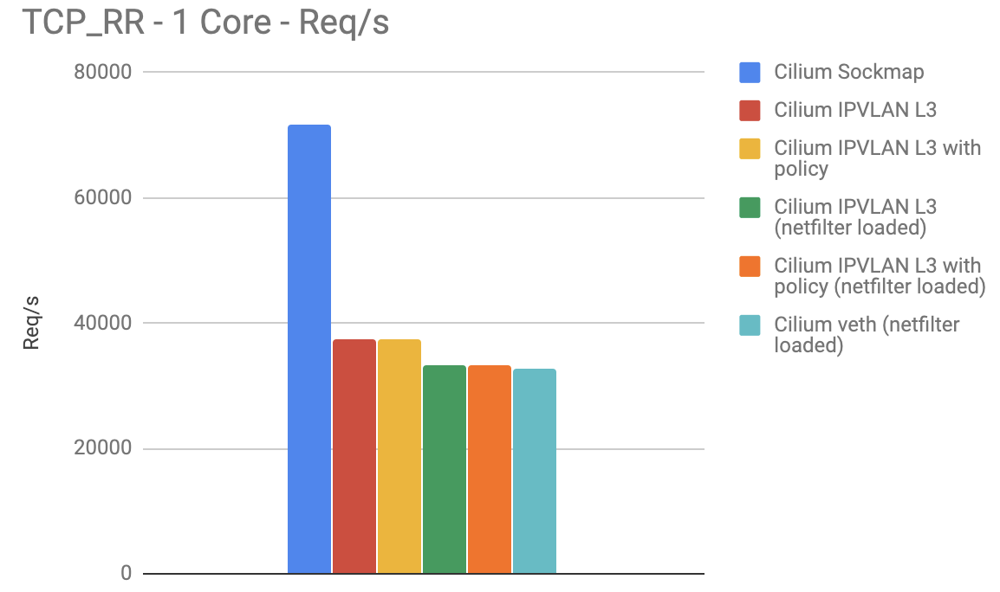

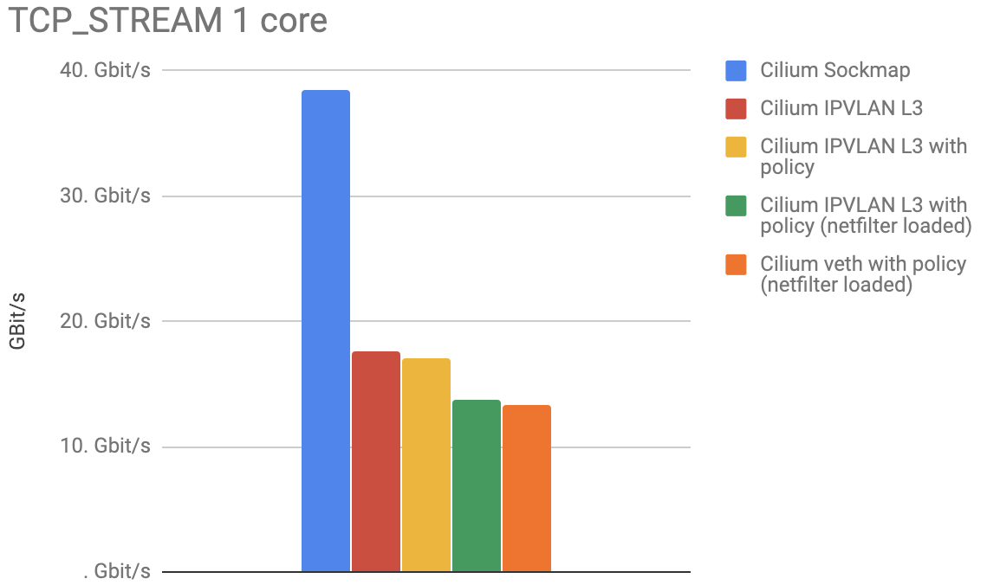

Note that all of these performance numbers are per CPU core.

Sockmap acceleration is an alpha level feature in 1.4. It can be enabled using
the `--sockops-enable` option.

## New Grafana Dashboard

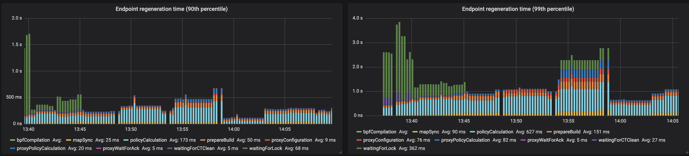

Several new Prometheus metrics have been added and a new Grafana dashboard is
available that can be deployed into any Kubernetes cluster with a single
command:

```
kubectl apply -f https://raw.githubusercontent.com/cilium/cilium/v1.4/examples/kubernetes/addons/prometheus/monitoring-example.yaml
```

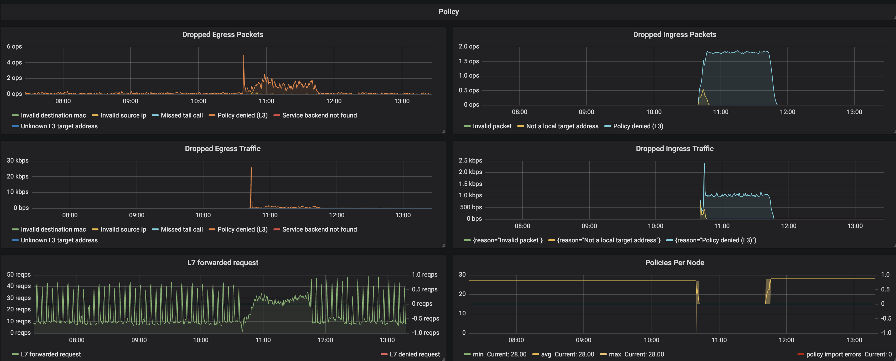

## Flannel Integration (beta)

Integration with Flannel has been a frequent ask by users looking for the
security policy enforcement and load-balancing capability of Cilium for
existing clusters configured using the Flannel CNI plugin.

Cilium 1.4 introduces a new configuration option:

```
flannel-master-device: "cni0"
```

which enables Cilium to run on top of Flannel using CNI chaining. It is also
possible to automatically pick up existing containers/pods on worker nodes by
enabling the following option:

```
flannel-manage-existing-containers: "true"
```

The option also requires to edit the Cilium DaemonSet to enable the `hostPID: true` option so Cilium can see all processes to attach to existing containers.

The Flannel integration is primarily useful to try out Cilium functionality in
existing clusters or for migration purposes. Several features which will help at
large scale will not function, this includes the ability to embed the security
identity of the source into network packets which requires to fall back to IP
based identification.

For more details, see the [flannel getting started guide](https://docs.cilium.io/en/v1.4/gettingstarted/flannel-integration/)

## Benchmarking Other CNIs

We have been approached a lot in the last two months how Cilium compares to
other CNI plugins. As a result, we have run a couple of benchmarks against
other popular CNI plugins.

A couple of words before we get into the actual numbers:

- Benchmarking is hard. We do not claim that we can configure other CNI
  plugins in the ideal configuration. Approach us if you have input and we are
  happy to adjust. The goal of these benchmarks is to show that the most
  impact can be made by changing architecture and using different technologies
  in the stack rather than just comparing one CNI against another. Even Cilium
  will behave very differently depending on the configuration.

- We have focused on measuring the networking overhead so we are running the
  benchmarks between two local containers to remove as many hardware
  limitations as possible.

- The goal is not to get to the largest or lowest number possible. We are
  measuring using a single CPU core which arbitrarily limits the number.
  Larger systems will be able to achieve much better absolute numbers. Focus
  on the difference between the numbers, not the absolute numbers.

- As usual, take any benchmark with several kilos of salt. Benchmarking is
  always done in a particular context. Understanding that context is
  important. If something is unclear about the numbers we publish here,
  approach us and we will clarify it.

That said, let's dig into the numbers:

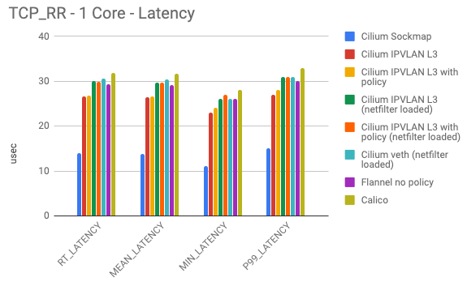

The above numbers show the various latency measurement when two containers
exchange as many 1 byte request and response messages over a single connection
as possible. This test primarily shows whether a particular forwarding path is
heavily favoring throughput over latency.

- Cilium Sockmap is heavily exploiting its advantage of being able to operate
  on socket level. This only works on connections within the node.

- The next best category is Cilium operating in IPVLAN mode with
  netfilter/iptables completely removed. There is a difference whether
  Cilium is operating with security policy rules loaded or not, but that
  difference is minor. This is due to the efficient per-CPU hash tables used
  for policy enforcement which minimize the overhead. Note that this number
  already includes a load balancing BPF map lookup so this mode allows to
  replace kube-proxy which other tests are not accounting for.

- Next is Flannel and Cilium operating in veth mode. Flannel is a minimal
  networking plugin using the Linux routing tables. The minimalism pays off but
  it also means that Flannel can not perform any policy enforcement and has to
  rely on kube-proxy in either iptables or IPVS mode. Cilium is doing slightly
  worse due to performing some work to enable policy enforcement in the middle
  of a connection even if no policy rule was previously loaded.

- Calico showed slightly more overhead in our tests. Likely due to more iptables
  rules being added and more netfilter chains being utilized. We have not
  loaded any policy rules into Calico for this particular test but assume that
  the use of ipset will allow to scale OK. Not quite as good as the per CPU
  hash tables.

Typical enemies of these benchmarks are:

- Context switches between kernel and user space. These numbers will get
  **much** worse when an L4/L7 proxy gets involved.
- Any per-packet overhead has dramatic effects. Cold caches and data
  structures can negative impact as well. The less code that has to be
  traversed, the better.

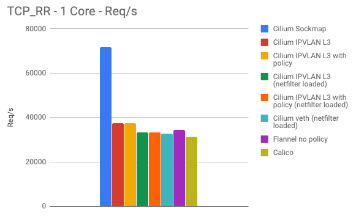

The above graph shows the requests per second for the same benchmark being
performed. The requests per second overlap with the latency pretty well. As for
the previous tests, these numbers are measured per CPU core.

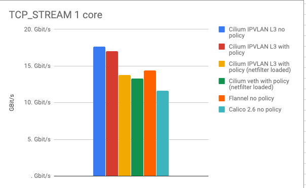

The last graph illustrates the opposite of the spectrum. The TCP_STREAM test is
attempting to pump as many bytes as possible over a single TCP connection. This
is where memory bandwidth can come into play and where network hardware or
cloud provider limits can often artificially limit the benchmark.

- Leaving Sockmap aside for a second, we can see that the IPVLAN mode has
  clear advantage over all other modes.

- We expected Calico to have similar numbers to Cilium so we have likely
  misconfigured something. Any help is appreciated. Calico doing worse in the
  TCP_STREAM does not really make a lot of sense, as the iptables overhead in
  this test is amortized across a larger amount of data.

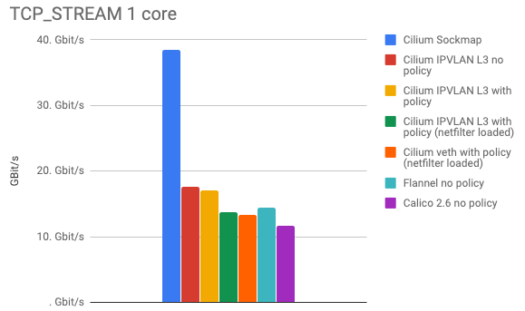

Adding Sockmap back into the picture proves the performance benefit of doing
networking at socket level. Again, this benefit is only gained between local
processes as it occurs regularly when sidecar proxies are in effect or when
services are scheduled onto the same node for improved local communication.

## GKE Support with COS

A completely new
[guide](https://docs.cilium.io/en/v1.4/gettingstarted/k8s-install-gke/)
documents how to run Cilium on GKE using COS. A brand new [node-init
DaemonSet](https://github.com/cilium/cilium/tree/master/examples/kubernetes/node-init)
enables to prepare GKE nodes by mounting the BPF filesystem and reconfiguring
kubelet to run in CNI mode. Use of the [cilium-etcd-operator] provides the
kvstore requirement while keeping the installation simple.

## 1.4 Release Highlights

- **Multi Cluster**
  - Addition of global services which enable spanning Kubernetes services
    across multiple Kubernetes services via an annotation. (beta)
  - Much improved installation guide including tooling to automatically extract
    SSL certificates when the [cilium-etcd-operator] is used.
- **Transparent encryption (beta)**
  - Encryption of all pod/host to pod/host communication using IPsec with a PSK.
  - IPv4 and IPv6
  - PSK configured via Kubernetes secret
  - No app or pod modifications required.
- **IPVLAN support (beta)**
  - A new alternative datapath mode utilizing IPVLAN replaces the use of veth
    pairs for improved latency and performance.
- **DNS Request/Response Authorization**
  - FQDN-based security policies are now enforced based on actual DNS requests
    and responses performed by each service.
  - Ability to specify policy on what DNS requests can be performed by services.
  - API and CLI to query FQDN host name lookups performed by individual
    endpoints
  - Ability to restore FQDN mapping on agent restore for persistent mapping
  - Configurable minimum TTL and maximum FQDN hosts per endpoint
- **Flannel Integration (beta)**
  - Ability to run Cilium on top of Flannel. Flannel provides networking and
    Cilium provides load-balancing and policy enforcement.
  - Ability to hook onto an existing Flannel deployment without restarting any
    pods.
- **AWS metadata-based policy enforcement (alpha)**
  - Ability to specify policy rules based on AWS metadata such as EC2 labels,
    security group names, VPC names, Subnet names, etc.
- **Additional Metrics & Monitoring**
- **Networking**
  - New simple PodCIDR route propagation mode via the kvstore. Enable via
    ``--auto-direct-node-routes```.
  - IPv6 is now disabled by default for new installations. Existing ConfigMaps
    will continue with current behavior. Enable via `--enable-ipv6=true`.
  - Ability to run IPv6 only cluster without allocating any IPv4 addresses with
    the `--enable-ipv4=false` option.
  - Improved persistent behavior of the load balancer
  - BPF sockmap support to accelerate local process communication. Available
    via option `--sockops-enable` (alpha)
  - Decoupled endpoint identified from IP addresses to support arbitrary IP
    addressing models.
- **Efficiency & Scale**
  - Heavily improved scalability of the CiliumEndpoint CRD. It is no longer
    required to disable CEP for large deployments.
  - Introduction of per-node local identities for CIDR/DNS based rules
    which do not require cluster or global scope. A pod performing a DNS
    request on node-23 resulting in an IP being whitelisted for that pod no
    longer has any impact on other nodes in clusters.
  - IPv6 is now disabled by default to reduce the memory footprint in small
    deployments.
  - BPF map pre-allocation is now disabled by default to reduce the memory
    footprint in small deployments.
  - Single binary for agent and client command to reduce container image size.
  - Compile bugtool as static binary
  - New cilium-operator to provide singleton tasks such as CEP garbage
    collection.
  - Synchronous pod label retrieval on CNI ADD. This can slow down the pod
    scheduling rate a bit but avoids policy drops on pod start without init
    policies.
  - The status probe now collects state concurrently for improved accuracy.
  - Better signal handling on termination and new terminationGracePeriodSeconds
    default of 1 second to minimize downtime of agent
- **Kubernetes**
  - Added support for Kubernetes 1.13
  - Support for new CRI-O versions which automatically mount the BPF fileystem
  - New NodeInit DaemonSet to automatically prepare GKE nodes for Cilium
    installation. This enables use of COS and auto-scaling.
  - The cilium-operator now automatically restarts kube-dns when kube-dns is
    not managed by Cilium. This simplifies the initial installation on managed
    Kubernetes offerings.
- **Istio**
  - Improved Istio integration
- **Observability**
  - New metrics: kvstore operations, proxy upstream/processing latency,
    forwarded and dropped bytes, node events, number of nodes,
- **Documentation**
  - The standard installation is now using the [cilium-etcd-operator] and no
    longer depends on the user providing an external kvstore.
  - New GKE guide including COS support
  - Simplified EKS guide using eksctl
  - Improved cluster mesh guide using automated tooling

## Upgrade Instructions

As usual, follow the [upgrade guide](https://cilium.readthedocs.io/en/v1.4/install/upgrade/#upgrading-minor-versions)
to upgrade your Cilium deployment. Feel free to ping us on
[Slack].

## Release

- Release Notes & Binaries: [1.4.0](https://github.com/cilium/cilium/releases/tag/1.4.0)
- Container image: `docker.io/cilium/cilium:v1.4.0`

[slack]: https://cilium.herokuapp.com/
[cilium-etcd-operator]: https://github.com/cilium/cilium-etcd-operator
