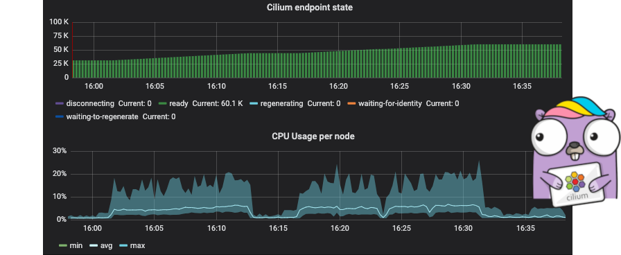
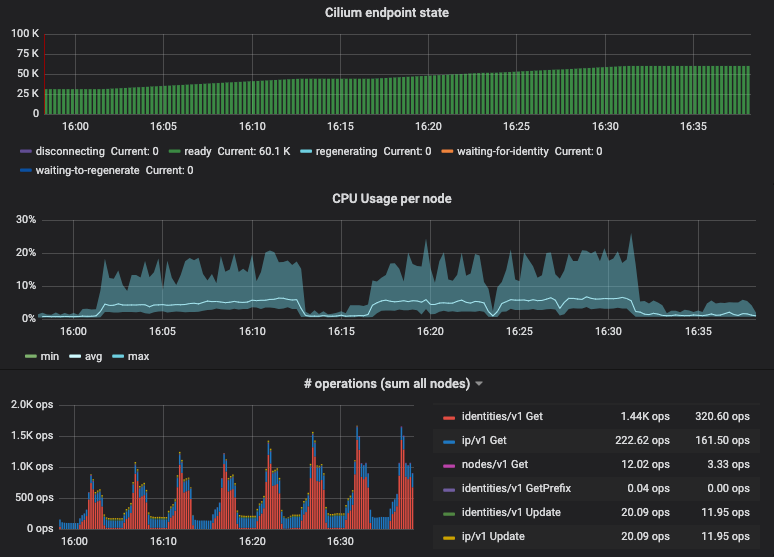
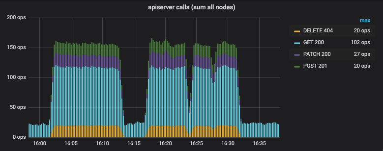
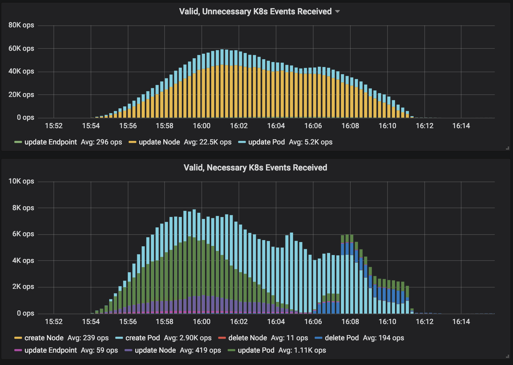
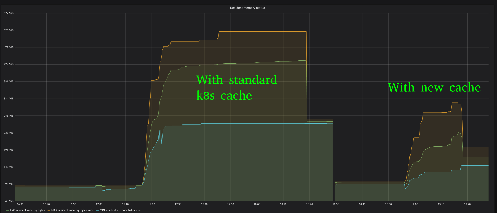
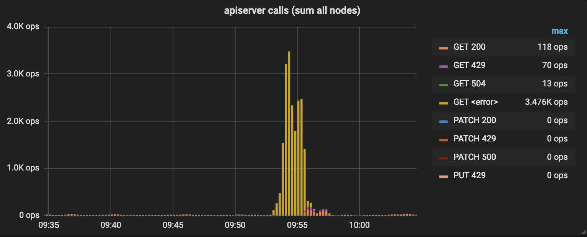
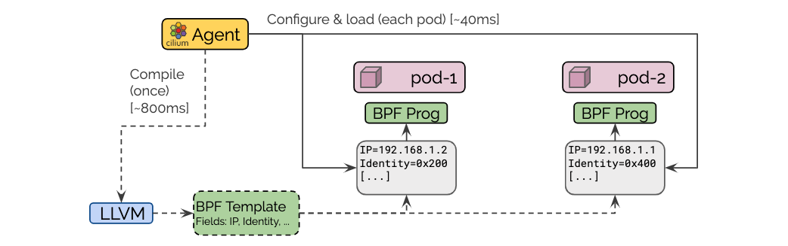
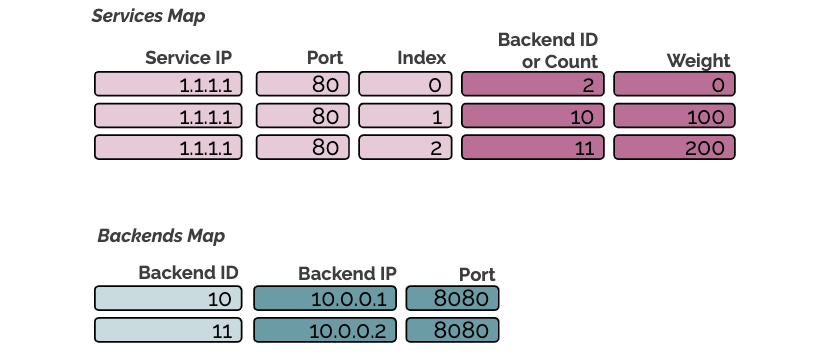

We are excited to announce the Cilium 1.5 release. Cilium 1.5 is the first
release where we primarily focused on scalability with respect to number of
nodes, pods and services. Our goal was to scale to 5k nodes, 20k pods and 10k
services. We went well past that goal with the 1.5 release and are now
officially supporting 5k nodes, 100k pods and 20k services. Along the way, we
learned a lot, some expected, some unexpected, this blog post will dive into
what we learned and how we improved.

Besides scalability, several significant features made its way into the release
including: BPF templating, rolling updates for transparent encryption keys,
transparent encryption for direct-routing, a new improved BPF based service
load-balancer with improved fairness, BPF based masquerading/SNAT support,
Istio 1.1.3 integration, policy calculation optimizations as well as several
new Prometheus metrics to assist in operations and monitoring. For the
full list of changes, see the [1.5 Release Notes](#15Highlights).

As usual, a big shout out to the entire community of Cilium developers who have
contributed 1336 commits in the last 2 months between version 1.4 and 1.5.

## What is in this post?

- [Deep Dive into Scalability Improvements](#Scalability)
- [BPF Templating: Avoiding BPF compilations](#BpfTemplating)
- [BPF-based masquerading support: On the last Mile to removing kube-proxy](#BpfMasquerading)
- [Policy Calculation Optimization](#PolicyOptimization)
- [Optimized Load-Balancing](#NewLoadBalancing)
- [1.5 Release Notes](#15Highlights)
- [What's on the roadmap for 1.6](#16Outlook)

# What is Cilium?

Cilium is open source software for transparently providing and securing the
network and API connectivity between application services deployed using Linux
container management platforms like Kubernetes, Docker, and Mesos.

At the foundation of Cilium is a new Linux kernel technology called BPF, which
enables the dynamic insertion of powerful security, visibility, and networking
control logic within Linux itself. BPF is utilized to provide functionality
such as multi-cluster routing, load balancing to replace kube-proxy,
transparent encryption using X.509 certificates as well as network and service
security. Besides providing traditional network level security, the flexibility
of BPF enables security with the context of application protocols and DNS
requests/responses. Cilium is tightly integrated with Envoy and provides an
extension framework based on Go. Because BPF runs inside the Linux kernel, all
Cilium functionality can be applied without any changes to the application code
or container configuration.

See the section **[Introduction to
Cilium](https://cilium.readthedocs.io/en/stable/intro/)** for a more detailed general
introduction to Cilium.

# Scalability

_Thank You: we would like to thank Google for providing us with [Google
Cloud](https://cloud.google.com) credits to run extensive scalability tests and
benchmarks._

On our quest to unlocking scalability, we have encountered several challenges.
Some of them were expected problems known to most software engineers:

- **Fixed re-sync intervals:** A sanity re-sync of state every 5
  minutes looks harmless at 100 nodes with 0.33 ops/s but grows to 16.6ops/s
  when scaling to 5K nodes.

- **O(n^2) algorithms:** While harmless at a few dozen nodes, a no-go at
  5K nodes or 100k pods.

- **Missing exponential back-off:** These are typically more subtle and often
  come into play after the cluster has successfully scaled up slowly followed
  by sudden synchronized failure across many nodes. Without exponential
  back-off, the load of retries may exceed the capacity of centralized
  resources and a cluster may never recover again.

- **Missing jitter for intervals:** This causes unnecessary alignment of
  actions towards centralized resources such as the Kubernetes apiserver.
  Failures due to these appear randomly and are hard to track down. While
  we never reproduced this type of problem, we introduced jitter into all
  major timer intervals to be safe.

Other challenges were a bit more surprising:

- **Scaling Kubernetes watchers:** The sheer size of some Kubernetes resources
  makes it challenging to scale watchers across large clusters without
  consuming significant network bandwidth. The issue itself was expected, the
  dimension of this problem was a surprise, we measured 400Mbit/s of network
  traffic when running a 2K nodes cluster with the standard node heartbeat
  intervals.

- **etcd panic:** A bug in grpc-go can cause etcd to close an already closed
  go channel resulting in a panic. Above a certain scale, we started seeing
  this very frequently and it caused a lot of disruption.

- **Dealing with apiserver server-side rate-limiting:** This is less of a
  problem with self-managed Kubernetes clusters but all managed Kubernetes
  services we have tested with impose server-side rate-limiting of the
  apiserver. For most of them, the rate limiting is dependent on the cluster
  size. When scaling up quickly, the rate limiting can lag behind
  significantly.

## New Unlocked Scalability

We have performed a wide set of scale tests to identify and push the limits.
Starting with Cilium 1.5 we will be comfortable to support clusters up to the
following size:

- 5k nodes
- 100k pods
- 20k services[*]

_Note: The scalability of services will depend heavily on whether and how
you are running kube-proxy. Operating kube-proxy in iptables mode can cause
considerable CPU consumption due to requiring several individual iptables rules
for each service backend. It is already possible for Cilium users to remove
kube-proxy entirely if you are not relying on NodePort. Starting with Cilium
1.6, NodePort will be natively support with BPF as well and kube-proxy can be
removed entirely from all nodes._

Can I run bigger clusters? Yes, we don't actually know the exact limit yet as
we did not hit any barries so far in our testing. Resource usage on individual
nodes is pretty flat.

To illustrate this, the following graph shows resource metrics for a 1k nodes
cluster while scaling from 30k pods to 60k pods:

The graph shows min/max/avg CPU spent across all nodes (1 vCPU, 2GB RAM) as
well as the sum of all kvstore operations performed by the entire clsuter. The
CPU consumption on individual nodes is almost flat. This is thanks to the new
BPF templating support described later on this post which avoids expensive
compilation.

As you grow clusters further, additional resources are primarily required for
your centralized services such as the apiserver, Prometheus and the etcd
cluster user by Cilium. In this test, we have been running a dedicated 3 node
etcd cluster for Cilium and the memory consumption of etcd had grown to about
700MB per instance.

What about interactions with the Kubernetes apiserver? The following graph
shows the number of apiserver interactions per second for all nodes combined
while scaling from 30K to 60K pods:

The `GET` calls are done to retrieve pod labels of new pods for network policy
evaluation. The `DELETE` calls are agents removing custom resources with
potential conflicting names. Doing a `DELETE` is cheaper than doing a `GET`
first followed by a `DELETE` if needed. The `POST` and `PATCH` calls are used
to create and update CiliumEndpoint custom resources. By using `PATCH` as
available with k8s \>=v1.13.0, it is no longer required to keep a local copy of
these resources.

## Glitch in the Matrix: etcd panics

Did you know that for a Go `select` statement with multiple cases, when
multiple communication operations are met, the execution order of the
processing block is random?

It was a bit of a surprise that we were the first to hit this etcd panic as it
was quite simple to reproduce above several hundred nodes. The bug was not in
etcd itself but in grpc-go and has been fixed by [gprpc-go PR#2695](https://github.com/grpc/grpc-go/pull/2695).
[etcd PR#10624](https://github.com/etcd-io/etcd/pull/10624) has been opened as well
to rebase on top of the fixed grpc-go.

## Scaling Kubernetes Events

Cilium uses the Kubernetes node resource to detect other nodes in the
Kubernetes cluster and pod resources to learn which pod is running on which
node and to derive the pod labels to implement network policies.

As much as we love the standard Kubernetes resources for nodes, they do not
scale very well when attempting to register a standard Kubernetes ListAndWatch
from every ach worker node in a larger cluster. This is for two main reasons:

- The node resource is used to detect stale nodes, each node will update a
  heartbeat field regularly which cause the node resource to change every
  couple of seconds. Each of those changes is being reflected to all
  listeners, in this case several thousand worker nodes. The issue is being
  addressed in Kubernetes via [KEP-009](https://github.com/kubernetes/enhancements/blob/021046fcf0036a7fa051e6b55659acfcaa369fc4/keps/sig-node/0009-node-heartbeat.md)
  using a new NodeLease feature. You can further details about this in the section
  [Node
  Controller](https://kubernetes.io/docs/concepts/architecture/nodes/#node-controller)
  of the Kubernetes documentation.

- As many other resources, the node resource has grown over time. Even with
  ProfoBuf serialization enabled, transmitting the entire node resource to all
  worker nodes on each change of the resource results in significant load in
  bytes transmitted over the network and in CPU cycles spent to serialize and
  deserialize the large resource so often. This is made worse by the fact
  that only some of the fields in the resource are relevant to Cilium so the
  majority of events are sent unnecessarily.

The following graph shows the ratio of events that were necessary or
unnecessary to be received while scaling a GKE cluster from 0 to 2000 nodes
and back:

In order to optimize this, Cilium 1.5 includes a new optimization to allow
offloading events from Kubernetes to a more efficient notification channel via
etcd watchers:

This resolves both of the previously described problems, etcd will only store a
minimal version of the resource with the fields relevant to Cilium and will
thus only distribute an event when significant fields have changed. It also
means that the heavy-weight event is sent once to the single-instance operator
and a light-weight event is distributed to the 5000 worker nodes.

## Optimizing Kubernetes Resource Caches

Another problem that appears at scale is the amount of memory it requires to
maintain resource caches of standard resources such as nodes, services, pods,
endpoints, and network policies when using the standard [Kubernetes go
client](https://godoc.org/k8s.io/client-go) via interfaces such as
[Informers](https://godoc.org/k8s.io/client-go/informers). The cache will store
the full-blown resource with all fields defined in a local in-memory cache.

By introducing a slimmed down of various Kubernetes resources that only defines
the fields of relevance, the memory consumption of the agent in each node can
be reduced significantly. The graph above shows the difference in memory
consumption in a 2K nodes GKE cluster.

## Dealing with apiserver rate-limiting

In order to gain visibility into how successfully Cilium interacts with the
Kubernetes apiserver, we have introduced a Prometheus metric which keeps track
of number of interactions per resource as well as track the return codes and
latency as histogram.

The following shows an attempt to scale up from 3 to 5K nodes without any
optimizations. While cloud providers have no problem to provision 5k nodes in
parallel, 5k nodes suddenly hitting the apiserver to register themselves
clearly overloads the apiserver:

The apiserver is so undersized that it gets overwhelmed immediately and calls
to the apiserver will simply timeout and several thousand apiserver calls fail
per second (yellow bars). Note that the graph only shows the interactions as
performed by the apiserver, in parallel, kubelet and kube-proxy will also
interact with the apiserver, adding more load to the system. This is not
represented in this graph.

Shouldn't the apiserver get resized and become more powerful? Yes, but it
requires the cluster to grow first which requires kubelet to be successful in
starting up. This depends on successful interactions with the apiserver. A
classic chicken and egg situation. It also requires kubelet to continue being
successful in updating the heartbeat timestamps of the node resource or the
node will be marked stale again.

The major optimization that we found is to fail less quickly. Standard
software engineering principles typically suggest to fail quickly when
unexpected errors occur such as inability to communicate with the apiserver.
kubelet will restart Cilium and the operation will be retried. This strategy
has a major drawback, during the bootstrap process, Cilium performs multiple
calls to the apiserver to retrieve services, endpoints, nodes, and network
policies. A successful start of Cilium requires all of these calls to succeed.
Assuming that the first 3 calls have succeeded and the fourth fails, Cilium
fails, will be restarted and has to start from the first call again.

With the smarter failure strategy in place, dangerous restart cycles can be
avoided and the apiserver is resized successfully. The new apiserver is now
capable to handle the requests from a load perspective but the rate is above
the server side rate limiting and the apiserver will return HTTP error codes
429 (magenta bars), at the same time, the number of successful apiserver calls
increases until the cluster has been scaled up (orange bars). Once the cluster is
scaled up, the number of interactions returns to the regular idle level.

# BPF Templating: Avoiding BPF compilations

_Section contributed by Joe Stringer_

Cilium is designed to tailor the datapath forwarding logic for each individual
endpoint, minimizing the number of instructions required to apply security and
determine how to forward traffic to its destination. To achieve this, any
endpoint-specific information such as IP addresses is compiled directly into
the machine-code instructions in BPF, unused features are compiled out, and
security policies specific to the endpoint are implemented via O(1) map
lookups. In prior versions of Cilium, the agent would invoke the C to BPF
compiler each time an endpoint runs, meaning that if you run a hundred
endpoints on a node, that node would spend a lot of time and CPU preparing the
datapath for each of those many endpoints.

In Cilium 1.5, we implemented [BPF
templating](https://linuxplumbersconf.org/event/2/contributions/115/) which
compiles the BPF programs once when Cilium starts up, then injects
endpoint-specific information into the compiled BPF ELF files for each endpoint
when the endpoint starts. This process is about 25x faster than invoking the
compiler every time, and greatly speeds up the deployment of new pods into your
cluster---particularly at high scale. CPU requirements for Cilium are also
drastically decreased as a result. Users running any supported kernel with
Cilium 1.5 will benefit from these changes, but we've been working with the
Linux community to further [improve support for BPF
templating](https://lore.kernel.org/bpf/CAADnVQKaPEi5-vjG_fvt0o8e9b9wAC665++3s48sD2h0qLhoiQ@mail.gmail.com/T/),
which will be part of the Linux 5.2 release later this year.

# BPF-based masquerading support

_Contributed by Daniel Borkmann_

A native BPF-based SNAT engine has been implemented as part of Cilium's BPF
datapath. This allows to replace the iptables-based NAT machinery through
more efficient, native BPF when the masquerade option is enabled in the Cilium
agent as well as iptables rule setup disabled.

For the initial 1.5 merge, we have enabled Cilium's IPVLAN datapath to use
BPF-based masquerading. Later minor releases will bring Cilium's veth
datapath on parity as well. For ipvlan, this has the unique advantage that
the datapath can be operated with masquerading in the more efficient L3
mode instead of having to fall back to L3S to fix the netfilter symmetry
problem. In the latter case, it is required for masquerading to pass netfilter
hooks in host namespace on ingress as well as egress which is not the case
in L3 mode, and therefore the switch to one of the ipvlan slaves must be
performed at a late point in time out of a custom ipvlan netfilter hook
in L3S mode. Thanks to BPF-based masquerading, these limitations are gone
and ipvlan can operate normally and perform slave-switching directly at
its receive hook out of L3 mode.

The BPF-based masquerading in Cilium works together with Cilium's BPF-based
connection tracker and has been integrated be to attached to external-world
facing devices, but can flexibly be attached to host internal devices as
well. Masquerading is supported for IPv4 as well as IPv6 for protocols TCP,
UDP, ICMP and ICMPv6 right now. For example, for both ICMP protocols, echo
request / reply identifiers are translated and remapped in case of collisions.
The BPF SNAT engine first tries to retain ports or identifier from the packet
in order avoid L4 packet rewrites, but in case of collisions with existing
mappings, it will select a different one. In case of L3 for host-based
connections, it avoids rewrites altogether if the tuple can be retained
as-is. The Cilium daemon has a set of new commands under `cilium bpf nat`
for introspecting the NAT table similarly as with the Cilium connection
tracking tables.

# Policy Optimizations

_Section contributed by Ian Vernon_

Significant progress has been made in Cilium v1.5 in the policy subsystem. The
policy subsystem is responsible for computing the policy for a given endpoint
by iterating over all rules which select an endpoint, and transforming these
rules into a representation which the BPF datapath and proxies can understand.
Starting in v1.5, we began working on a substantial redesign of how policy is
plumbed for a given endpoint, which will bring large performance gains in
future releases of Cilium. Part of this redesign included the effort to only
compute the policy for an endpoint if truly necessary. Previously, upon any
policy change in Cilium (e.g., CiliumNetworkPolicy being imported) across the
entire cluster, each Cilium agent would re-compute the policy for all endpoints
on its local node, even if the policy which was imported had no effect for some
endpoints. Now, Cilium analyzes the content of the change in rules, and only
regenerates the endpoints which the added rules select. This significantly
reduces the amount of endpoint regenerations which occur on a given node when
there is a high amount of change in the state of rules on a given node. Such a
state is common in the case where rules which contain `toFQDNs` policy that
select an endpoint on the node, as such rules can update the policy repository
on a given node quite frequently as new IPs are resolved via DNS which
correspond to the FQDNs in the rules.

# New Optimized Load Balancing

_Section contributed by Martynas Pumputis_

Cilium provides a BPF-based loadbalancing capability which can be used to
replace the kube-proxy implementation of services of the `ClusterIP` type. The
former does not rely on the `iptables` and `conntrack` kernel modules.
Therefore, it has a better performance, and it does not suffer from the various
conntrack race conditions which e.g. can cause 5 second timeouts of DNS
requests.

Prior to Cilium 1.5, in the case of a removal of a service endpoint, the
loadbalancing mechanism had to replace the removed endpoint entry in the BPF
maps with any other endpoint. This was needed to prevent from breaking
established connections to the service. Unfortunately, the endpoint entry
duplication had a side-effect which could lead to uneven distribution of
endpoints serving requests.

In Cilium 1.5, we have addressed the problem by reworking the loadbalancer. In
addition, the new loadbalancer no longer needs to duplicate the entries, thus
it has a smaller memory footprint. The design document of the new loadbalancer
can be found
[here](https://docs.google.com/document/d/e/2PACX-1vTWTj_Umicxcp5aBaun30EH6Rb_t5oi1vd18lTpmRx60mI4uBXuJymUj-5BmJ4aa_qmdi0HCpZpe6V_/pub).

To support a smooth migration to the new loadbalancer for existing users, we
maintain both loadbalancers at the same time. New users or the ones who do not
care about breakage of the existing connections to services can disable the
legacy loadbalancer by passing `--enable-legacy-services=false` to
`cilium-agent`. We plan to stop supporting the legacy loadbalancer in Cilium
1.6.

# 1.5 Release Highlights

- **Scalability:**
  - Own implementation of Kubernetes resource stores with minimal data
    structure definitions to avoid using bloated Kubernetes types to save
    memory at large scale.
  - Ability to hand-over distribution of Kubernetes node and pods events via
    kvstore instead of standard watchers for heavily reduced apiserver traffic.
    (75 vs 5 memory allocations per event).
  - New scalable load-balancing implementation which guarantees fairness as
    service backends scale up & down
  - Use of PATCH instead of UPDATE whenever possible and as supported by
    Kubernetes >= 1.13.
  - Liveness of the apiserver is now primarily derived from the last receiving
    of an event, requiring less pings.
  - Several interval have been made dependent on the overall cluster size using
    a logarithm function to become less aggressive with access to centralized
    resources as the cluster grows.
  - Several garbage collector operations have been moved from the per-node
    agent into the single-instance operator for reduced load on the apiserver.
  - The ability to rate-limit access to the kvstore has been added
  - Jitter has been added to exponential backoff intervals to avoid aligning
    many nodes close to certain timestamps.
  - The cost of keeping the CliumEndpoint CRD up-to-date has been reduced.
  - New connection tracking garbage collector interval tailored to the BPF map
    type in use to minimize CPU overhead and to minimize risk of connections
    being dropped when oeprating at the table limit: 12 hours on new kernels
    when LRU is in use, 15 minutes on older kernels.
- **BPF Templating:**
  - Compilation of BPF programs are now done through the use of templates which
    allow to reuse existing compilation artifacts. This means that scheduling
    of additional pods onto a node no longer requires compilation of BPF
    programs with LLVM. This reduces the CPU overhead and pod spin-up time.
  - Options with large runtime impact are still done at compile time, the cost
    of recompilation is paid once per node and can then be re-used by all other
    pods on the same node.
  - A new CLI tool `bpf template` is available to list and describe templates.
  - Rebase to LLVM 7
- **Transparent Encryption:**
  - Support for rolling key updates
  - Support for direct-routing datapath mode
  - Switch to more efficient GCM-128-AES algorithm by default
  - Ability to encrypt communication of pods not managed by Cilium
  - Automatic MTU correction to account for network header overhead
- **Policy:**
  - More intelligent selection of which endpoints need their policy
    re-calculated on the event of policy rule changes (CiliumNetworkPolicy and
    NetworkPolicy).
- **Networking:**
  - BPF based SNAT in IPVLAN mode which allows to enable masquerading in
    the more efficient IPVLAN L3 mode. This is a drop-in replacement for
    the iptables based masquerading which can only operate at a less efficient
    L3S mode. Later minor releases will bring the Cilium VETH based data
    path on par with supporting BPF based SNAT. A new CLI tool `bpf nat`
    has been added for introspection of NAT mappings.
  - Additional visibility into IPAM layer (pod name, health IPs, router IPs)
- **Istio:**
  - Support for Istio 1.1.3
- **New Prometheus Metrics:**
  - kvstore operation (duration histogram)
  - All BPF system calls (duration histogram)
  - BPF map accesses (duration histogram)
  - API calls made to the agent (duration histogram)
  - All Kubernetes apiserver & events interactions (duration histogram)
  - FQDN proxy & cache statistics
- **Kubernetes:**
  - Kubernetes 1.14 support
  - New optimized initContainer for state cleanup and preflight checks
  - The CNI configuration is no longer removed on pod exit
  - The DaemonSet definition no longer lists all environment variables, the
    ConfigMap is mounted as a directory into the pod and the agent reads the
    directory automatically.

## Upgrade Instructions

As usual, follow the [upgrade
guide](https://cilium.readthedocs.io/en/v1.5/install/upgrade/#upgrading-minor-versions)
to upgrade your Cilium deployment. Feel free to ping us on
[Slack].

## Release

- Release Notes & Binaries: [1.5.0](https://github.com/cilium/cilium/releases/tag/1.5.0)
- Container image: `docker.io/cilium/cilium:v1.5.0`

# Outlook: Roadmap for Cilium 1.6

## Native AWS ENI allocation support

Native AWS ENI allocation will allow to use AWS ENI addressing in combination
with Cilium. Quite unique to the implementation will be pre-allocation of ENI
adapters and addresses based on quotas as well interaction with the AWS API via
the centralized operator to have control over the rate of interactions with
the API to avoid rate limiting to affect cluster operation and scheduling success
probabilities. For additional details, refer to the
[design document](https://docs.google.com/document/d/1KEdjNrpa9I1DRt4s1ftRIJOwyemCPlbF79ZXfq2biFc/edit?usp=sharing).

## Optimized Policy Calculation Engine

1.5 has unlocked scalability with regard to number of nodes, pods and services.
While the policy scalability is already much better than traditional solutions,
there is some leftover potential that we will address in 1.6. The policy engine
will become entirely incremental. If you are interested in this topic, join the
SIG-Policy meetings to get involved.

## Load-balancing for host processes

Load-balancing has only been available to Cilium managed pods so far. With
support for host processes, load-balancing will be done at socket level without
any need for network packet mangling and will also apply to processes in the
init namespace. This will also allow to use Cilium load-balancing in
combination with other CNI plugins without requiring to chain the plugins
together.

## kube-proxy removal

Cilium 1.5 has introduced the BPF SNAT datapath capability. With Cilium 1.6, we
will provide `--masquerade=true` behavior for non-IPVLAN modes and also provide
a NodePort implementation.

## CNI Chaining API

1.6 will provide a new API to simplify chaining with other CNI plugins to
integrate Cilium network policy, load-balancing, transparent encryption and
visibility in combination with other CNI plugins. We already have working code
for the following plugins which will be made available together with the new
API.

- [aws-vpc-cni](https://github.com/aws/amazon-vpc-cni-k8s)
- [OpenShift SDN](https://github.com/openshift/openshift-sdn)

If you want to contribute chaining support for additional plugins, feel free to
contact us on [Slack].

## CRD backing for identity allocation

So far, installation of Cilium required either an external etcd or use of the
etcd-operator to provide an etcd cluster.
[PR7573](https://github.com/cilium/cilium/pull/7573) will provide CRD support
for identity allocation which will make etcd entirely optional for operations.
As outlined in the scalability section, we will still require etcd to guarantee
performance above a certain cluster size.

[slack]: https://cilium.herokuapp.com/
[cilium-etcd-operator]: https://github.com/cilium/cilium-etcd-operator
