Back in March we have asked our users to provide feedback via our first ever
[user survey](https://forms.gle/c1kphSwp9v82yEgTA). Many of you have responded
and the results are in!

The survey was announced on our Slack channel and on Twitter. Participation was
anonymous and did not require to leave behind contact information. Most
questions had a set of predefined answers plus a field to add additional
answers. All questions were optional, some users did not answer all questions.

# Current Use of Cilium

### In what stage are you with your usage of Cilium?

The initial question captured how many users we have in each stage. The first
four answers were predefined.

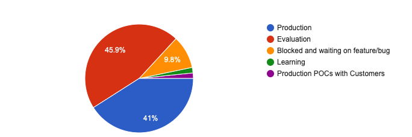

### What are you blocked on?

Those who answered that they are blocked were given a chance to provide a
detailed response:

- _End-to-end transparent encryption_ (Now supported by Cilium 1.4/1.5)
- _SSL/TLS Layer 7 filtering_
- _IPv6 /96 prefix requirement_ (Planned for Cilium 1.6)
- _AWS VPC CNI support_ (Planned for Cilium 1.6)
- _Usage with Istio 1.1_ (Now supported by Cilium 1.5)
- _Better VPC-CNI support_ (Planned for 1.6)
- _The latest blocker for me is an integration with Istio CNI_ (Planned for Cilium 1.6)
- _Support of non containers workloads that is on roadmap_
- _RKE_ (Now supported by Cilium 1.5)
- _Openshift v3_ (Guide planned for Cilium 1.6)

_Note: The survey was published just after we had released Cilium 1.4, we have
since released Cilium 1.5 which already includes some of the asks provided via
the survey. See the status of each ask in brackets._

### What is your motivation to use Cilium?

Why are you using Cilium? The first 9 answers were predefined.

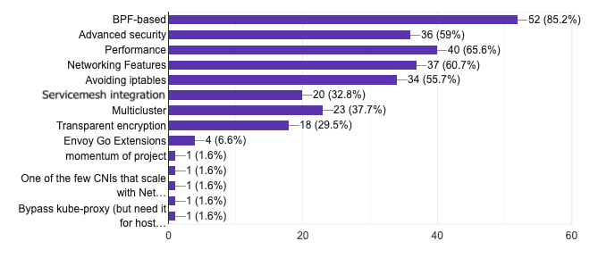

# Kubernetes

The vast majority of our users are running Cilium on Kubernetes so we have
decided to include a Kubernetes specific section to the survey to gain some
insights into how our users use Kubernetes.

## How are you managing Kubernetes?

Are you managing your own Kubernetes or are you using a managed Kubernetes
service?

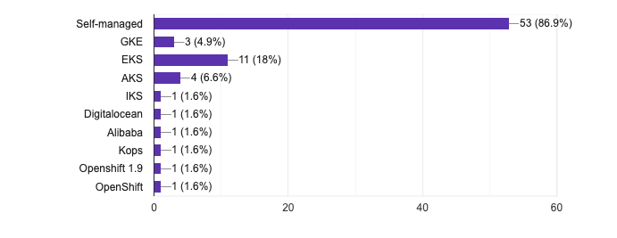

### How many nodes do you run in your Kubernets Cluster?

What is a typical size of a Kubernetes cluster?

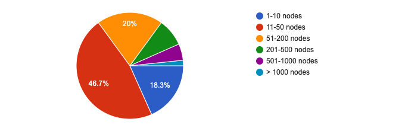

### How many Kubernetes clusters are you operating?

How many Kubernetes clusters are you operating in total?

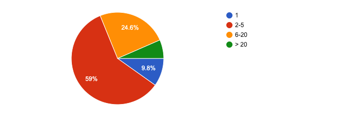

### What Linux Distribution do you run Kubernetes on?

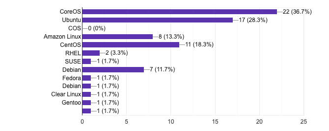

# Cilium Feature Usage

We are always interested to understand what features are actually used. The
survey focused heavily on new functionality made available as beta feature to
understand what areas we should continue to focus on.

### What networking mode are you using?

How are our users using Cilium? Are they using direct-routing or tunneling
mode? Are they integrating with other networking components? The first 3
answered were predefined.

### What type of security policies are you using?

Cilium supports a wide set of security policy features. What are our users
using? The first 4 answers were predefined.

### How are you managing your security policies?

Everybody's favorite topic: YAML. How are users defining the security policies?
The first 3 answers were predefined.

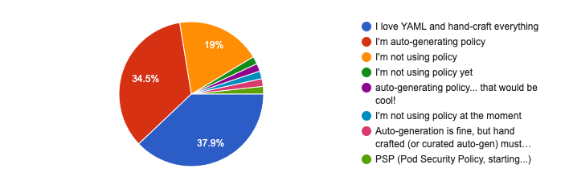

### IPv6 vs IPv4?

How is IPv6 usage doing? We will track this metric over time.

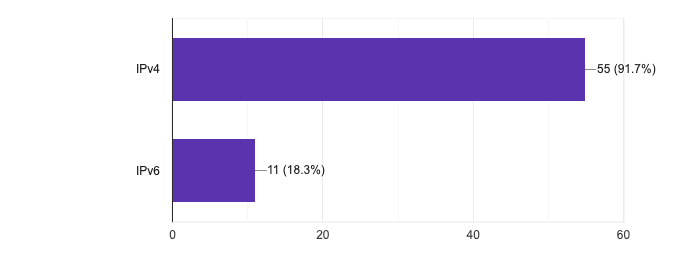

### Are you interested in transparent encryption?

The availability of transparent encryption was announced as beta feature just
before the survey. We wanted to understand how many of our users are interested
in it. The first 3 answers were predefined.

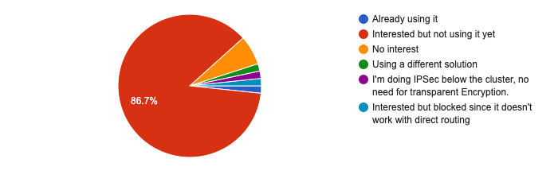

### Are you interested in multicluster?

Multi-cluster has been introduced a while ago but Cilium 1.4 added support for
global service routing. Who is using it and who is planning to use it?

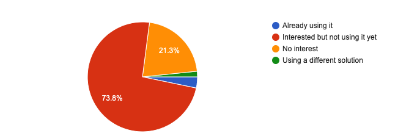

# Next Features

### Pick two features that we should focus on next

What features should we focus on next? We have asked users to pick 2 features
from a predefined list:

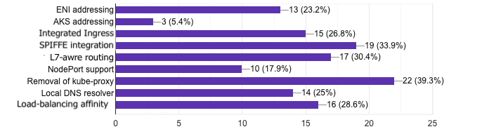

### Additional feedback on the roadmap

In addition to the predefined answers on next features, we wanted to provide an
opportunity to provide more details:

- _SRv6 support_
- _Weighted cluster preference for global services is highly needed_
- _"Integrated ingress" sounds interesting, if it is something that accelerates
  Istio Ingress Gateway. I am also interested in L7-aware routing, NodePort
  support, if it accelerates Istio._
- _Non container workloads_
- _Great but needs to focus on features to work on Direct routing_
- _Interested in bare metal deployment load balancing, e.g. MetalLB_

### Documentation Gaps

How are we doing on documentation? The first 4 answers were predefined. It is
great to see how users provided very specific feedback.

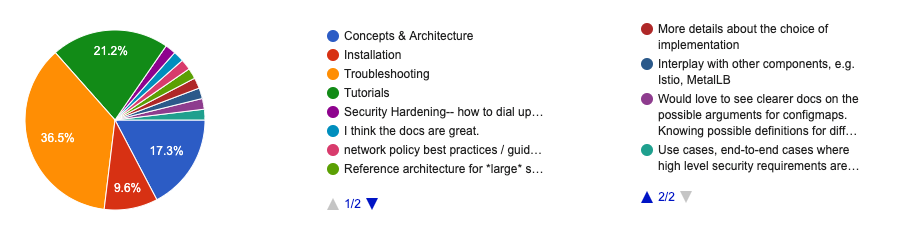

### Blog Posts

How are we doing on blog posts. What type of blog posts should we post more?

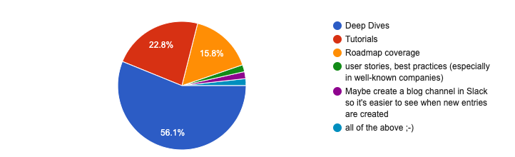

# Community

### Ease of Contributing

Every open source project is only as good as the diversity of its contributors.

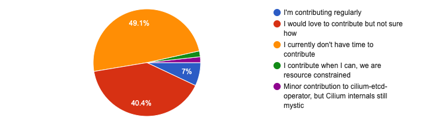

We are currently leaving behind a large potential of highly motivated
contributors. We will do better and find ways to encourage a diverse and wide
set of contributors.

### Bug Reporting Process

How is the bug reporting process working for our users?

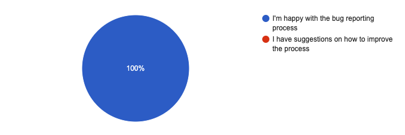

# Personal feedback

### Additional feedback provided

At the end of the survey, we provided a free-form text box for additional
feedback. Here is a selected list of some of our favourites:

- _Cilium is great, thanks for making it._
- _You guys are doing awesome job, keep making it better.._
- _Cilium rocks!_
- _Love what you are doing guys, keep going !_
- _Concerned about the lack of updates on kops. Currently working around the
  kops-based installation of cilium_

# Thank You

A big thank you to everyone who filled out the survey. It has helped us in
great length to plan the roadmap of the coming months. We will be repeating the
survey in 6 months interval.

[slack]: https://slack.cilium.io
[cilium-etcd-operator]: https://github.com/cilium/cilium-etcd-operator
