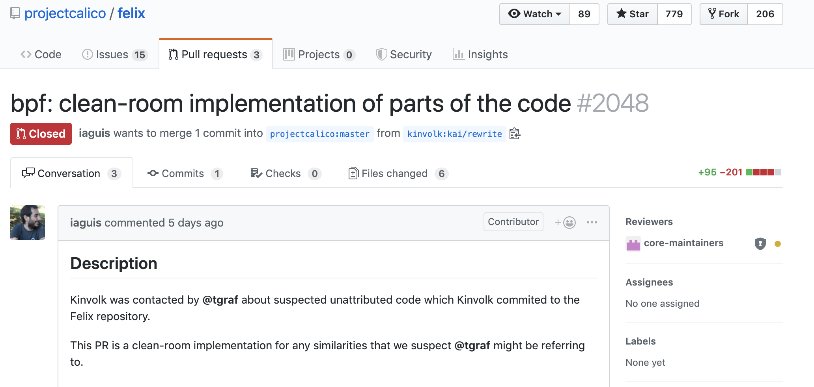

{{preview}}

As with everything we do, we are fully transparent. As it becomes obvious that
a simple resolution in this matter is not possible, we follow open source best
practices and choose a public forum for the sake of transparency.

It was brought to our attention that some of the [new eBPF
code](https://github.com/projectcalico/felix/tree/master/bpf) committed to the
[Calico repository](https://github.com/projectcalico/felix) is violating the
license of source code in the Cilium repository.

The original report called out suspiciously similar code in both repositories.
This by itself is of course not a problem if the open source licenses involved
are respected. This includes, among other things, attribution and restrictions
regarding the rights to re-license.

Upon closer inspection, it was identified that source code has been copied from
the [Cilium
repository](https://github.com/cilium/cilium/blob/master/bpf/bpf_xdp.c),
modified to create derivative work, and then committed ([commit](https://github.com/projectcalico/felix/commit/336d34c307f477b73692656058b890d1c01e73f4#diff-0f8b4a32fcc0262e15d01210383db0df))
to the Calico repository with the license changed in a non-compatible manner.
As part of this, the attribution required by the license was also omitted. The
details of this can be found further down in this post.

Like the majority of the Linux kernel source code, the datapath portion of
Cilium that runs as part of the Linux kernel is released under the [GPL 2.0]
license. The GPL license does not permit a license change to the [Apache
License] without consent of the original authors.

This prompted us to contact the authors of the derivative work. As a result,
[an initial attempt](https://github.com/projectcalico/felix/pull/2048) was made
to rewrite some sections of the code. After inspection, we concluded that the
work is still a derivative of our original source code.

However, in order to resolve the situation as simply as possible, we offered to
dual-license the respective code under the Apache license with the condition
that attribution to the original authors is added. This resulted in the
[following pull request](https://github.com/projectcalico/felix/pull/2049)
being proposed to the Calico repository to add the attribution. The pull
request is currently waiting to be merged.

From our perspective, this would resolve all of our concerns. We obviously also
accept any other resolution as long as it conforms to the respective open
source licenses.

We are waiting for a reaction by the maintainers of the Calico project.

_Update 2019-06-25:_ Some of the eBPF related code has now been removed from
the Calico repository via [this
PR](https://github.com/projectcalico/felix/pull/2056).

{{/preview}}

# TL;DR

As with everything we do, we are fully transparent. As it becomes obvious that
a simple resolution in this matter is not possible, we follow open source best
practices and choose a public forum for the sake of transparency.

It was brought to our attention that some of the [new eBPF
code](https://github.com/projectcalico/felix/tree/master/bpf) committed to the
[Calico repository](https://github.com/projectcalico/felix) is violating the
license of source code in the Cilium repository.

The original report called out suspiciously similar code in both repositories.
This by itself is of course not a problem if the open source licenses involved
are respected. This includes, among other things, attribution and restrictions
regarding the rights to re-license.

Upon closer inspection, it was identified that source code has been copied from
the [Cilium
repository](https://github.com/cilium/cilium/blob/master/bpf/bpf_xdp.c),
modified to create derivative work, and then committed ([commit](https://github.com/projectcalico/felix/commit/336d34c307f477b73692656058b890d1c01e73f4#diff-0f8b4a32fcc0262e15d01210383db0df))
to the Calico repository with the license changed in a non-compatible manner.
As part of this, the attribution required by the license was also omitted. The
details of this can be found further down in this post.

Like the majority of the Linux kernel source code, the datapath portion of
Cilium that runs as part of the Linux kernel is released under the [GPL 2.0]
license. The GPL license does not permit a license change to the [Apache
License] without consent of the original authors.

This prompted us to contact the authors of the derivative work. As a result,
[an initial attempt](https://github.com/projectcalico/felix/pull/2048) was made
to rewrite some sections of the code. After inspection, we concluded that the
work is still a derivative of our original source code.

However, in order to resolve the situation as simply as possible, we offered to
dual-license the respective code under the Apache license with the condition
that attribution to the original authors is added. This resulted in the
[following pull request](https://github.com/projectcalico/felix/pull/2049)
being proposed to the Calico repository to add the attribution. The pull
request is currently waiting to be merged.

From our perspective, this would resolve all of our concerns. We obviously also
accept any other resolution as long as it conforms to the respective open
source licenses.

We are waiting for a reaction by the maintainers of the Calico project.

# The Full Story

Cilium is an open source project that builds on an underlying Linux kernel
technology called eBPF. Recently, the Calico open source project has accepted
several pull requests to add two additional features based on eBPF. Both of the
newly added features have been part of the Cilium repository in similar or
almost identical form for a while. There is obviously nothing wrong with
multiple open source projects implementing the same feature. However, if source
code from a repository is used to derive work, the open source license of that
original source code must be respected.

The respective features are:

- A BPF/XDP based DDoS mitigation filter to drop network packets from
  potentially malicious sources as early as possible
  ([Calico Code](https://github.com/projectcalico/felix/blob/master/bpf/xdp/filter.c) vs
  [Cilium Code](https://github.com/cilium/cilium/blob/master/bpf/bpf_xdp.c))
- A BPF and sockmap based acceleration of local TCP connections for the purpose
  of accelerating sidecar proxy architectures.
  ([Calico Code](https://github.com/projectcalico/felix/blob/master/bpf/sockmap/sockops.c) vs
  [Cilium Code](https://github.com/cilium/cilium/blob/master/bpf/sockops/bpf_sockops.c))

# Report of License Violation

Following a blog post to announce the features in Calico, it was brought to our
attention that the source code to implement these features looks suspiciously
similar.

This by itself is not a problem so why did we bother at all? Creation of
derivative work is encouraged in open source, right?

The first problem is lack of attribution. Attribution is a key principle in
open source for any significant derivation. While also a license violation,
omission of attribution is frown upon in the open source community.

The second problem is even more significant: The derivative work included an
incompatible change of license from GPL 2.0 to the Apache License. As the
majority of the Linux kernel source code, the datapath portion of Cilium that
directly interacts with the Linux kernel is licensed under GPL 2.0. The user
space code including all control plane aspects are licensed under the Apache
License.

All of this was sufficient to contact the authors of the derived work with a
request for clarification.

## Exbibit A: Example of derived source code

The following diff shows a subset of the source code and illustrates that
Cilium source code was likely directly copied. Significant amounts of the
original source code are entirely unmodified, other sections only differ in
removed code such as dropping IPv6 support, or different variable/function
naming. The overall code structural is identical in significant amounts. There
are many more examples like the one shown below. For more examples, the
respective files can be comapred in both source code repositories.

```diff
@@ -1,81 +1,73 @@
 static __always_inline void *xdp_data(const struct xdp_md *xdp)
 {
        return (void *)(unsigned long)xdp->data;
 }

 static __always_inline void *xdp_data_end(const struct xdp_md *xdp)
 {
        return (void *)(unsigned long)xdp->data_end;
 }

 static __always_inline bool xdp_no_room(const void *needed, const void *limit)
 {
-       return unlikely(needed > limit);
+       return needed > limit;
 }

 struct lpm_v4_key {
        struct bpf_lpm_trie_key lpm;
        __u8 addr[4];
 };

-struct lpm_v6_key {
-       struct bpf_lpm_trie_key lpm;
-       __u8 addr[16];
-};
-
 struct lpm_val {
-       /* Just dummy for now. */
-       __u8 flags;
+       __u32 ref_count;
 };

 [...]

 static __always_inline int check_v4(struct xdp_md *xdp)
 {
        void *data_end = xdp_data_end(xdp);
        void *data = xdp_data(xdp);
        struct iphdr *ipv4_hdr = data + sizeof(struct ethhdr);
-       struct lpm_v4_key pfx __maybe_unused;
+       struct lpm_v4_key pfx;
+       __u16 dest_port;

-       if (xdp_no_room(ipv4_hdr + 1, data_end))
+       if (xdp_no_room(ipv4_hdr + 1, data_end)) {
                return XDP_DROP;
+       }

-#ifdef CIDR4_FILTER
        __builtin_memcpy(pfx.lpm.data, &ipv4_hdr->saddr, sizeof(pfx.addr));
        pfx.lpm.prefixlen = 32;

-#ifdef CIDR4_LPM_PREFILTER
-       if (map_lookup_elem(&CIDR4_LMAP_NAME, &pfx))
+       if (map_lookup_elem(&calico_prefilter_v4, &pfx)) {

 [...]
 }

-static __always_inline int check_filters(struct xdp_md *xdp)
+static __always_inline int check_prefilter(struct xdp_md *xdp)
 {
        void *data_end = xdp_data_end(xdp);
        void *data = xdp_data(xdp);
        struct ethhdr *eth = data;
        __u16 proto;

-       if (xdp_no_room(eth + 1, data_end))
+       if (xdp_no_room(eth + 1, data_end)) {
                return XDP_DROP;
+       }

        proto = eth->h_proto;
-       if (proto == bpf_htons(ETH_P_IP))
+       if (proto == bpf_htons(ETH_P_IP)) {
                return check_v4(xdp);
-       else if (proto == bpf_htons(ETH_P_IPV6))
-               return check_v6(xdp);
-       else
-               /* Pass the rest to stack, we might later do more
-                * fine-grained filtering here.
-                */
+       } else {
+               /* other traffic can continue */
                return XDP_PASS;
+       }
 }

-__section("from-netdev")
-int xdp_start(struct xdp_md *xdp)
+__section("pre-filter")
+int xdp_enter(struct xdp_md *xdp)
 {
-       return check_filters(xdp);
+       return check_prefilter(xdp);
 }

-BPF_LICENSE("GPL");
+char ____license[] __section("license")  = "Apache-2.0";
```

# Our offer: Dual-license the respective code

After contacting the authors of the derived work. [An attempt was
made](https://github.com/projectcalico/felix/pull/2048) to reimplement some of
the source code.



The commit description labelled this work as a [clean room
design] implementation. Apparently this involved a reimplementation of isolated
code sections which were identified as being similar to the Cilium source code.
We will leave it to the judgement of everyone individually to decide whether
the following
[diff](https://github.com/projectcalico/felix/pull/2048/commits/62c95df8d3041ab3037998d62fdd2fe480228097)
is a [clean room design] implementation or not.

In order to resolve the situation as simply as possible, we offered to
dual-license the code under the Apache License with the condition that the
original authors must be attributed. This is possible because all authors of
the respective code were core team members which could be identified and asked
for permission easily. We have no problem with others creating derivative work
based on ours but request to be attributed for it.

This proposal seems to have been accepted by the authors of the derivative
work, the original PR was closed and the following
[PR](https://github.com/projectcalico/felix/pull/2049) was opened to add the
attribution. It is currently waiting to be merged.


Great! We can all be happy, right?

# What happens next?

We are waiting for a reaction by the maintainers of the Calico project to merge
the outstanding pull request. Our offer to put the respective source code under
a dual-license stands. We obviously also accept any other resolution as long as
it respects the open source license of the respective code.

_Update 2019-06-25:_ Some of the eBPF related code has now been removed from
the Calico repository via [this
PR](https://github.com/projectcalico/felix/pull/2056).

[clean room design]: https://en.wikipedia.org/wiki/Clean_room_design
[apache license]: https://www.apache.org/licenses/LICENSE-2.0
[gpl 2.0]: https://en.wikipedia.org/wiki/GNU_General_Public_License#Version_2
