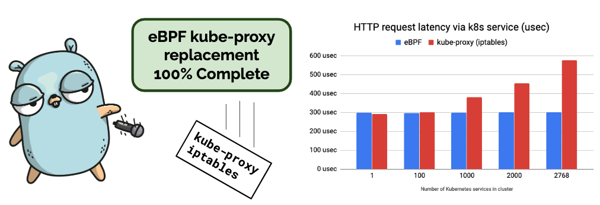
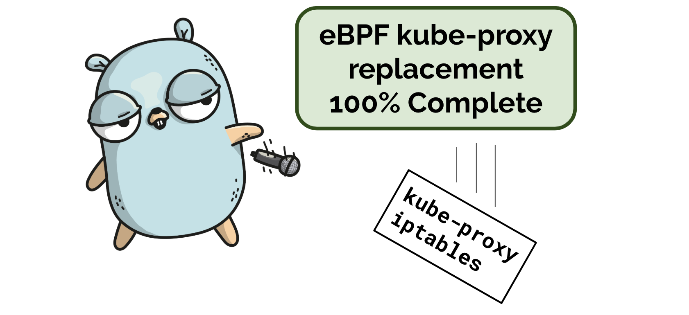
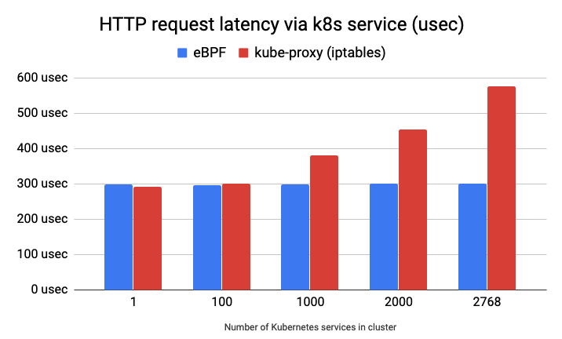
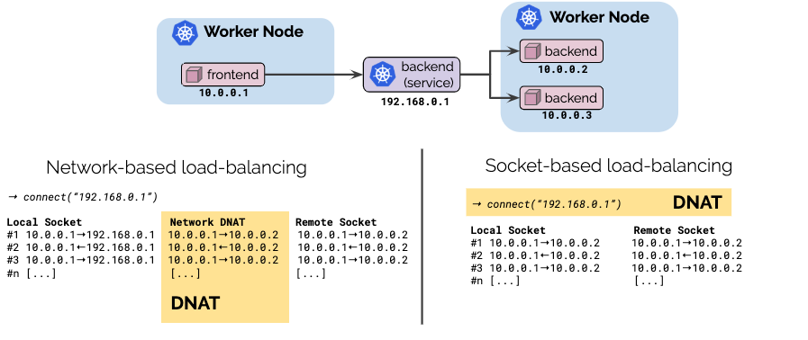
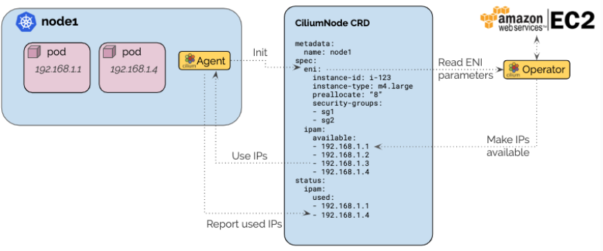

We are excited to announce the Cilium 1.6 release. A total of 1408 commits have
been contributed by the community with many developers contributing for the
first time. Cilium 1.6 introduces several exciting new features:

- **KVStore free operation:** The addition of a new CRD-based
  backend for security identities now allows to operate Cilium entirely
  without a KVstore in the context of Kubernetes. ([More details](#kvstorefree))
- **100% Kube-proxy replacement:** Operating a
  Kubernetes cluster without requiring to run kube-proxy has been a desire of
  many users. This release includes the final two features required to run a
  Kubernetes cluster without kube-proxy with Cilium fully replacing
  kube-proxy. ([More details](#kubeproxy-removal))
- **Socket-based load-balancing:** Socket-based load-balancing combines
  the advantage of client-side and network-based load-balancing by providing
  fully transparent load-balancing using Kubernetes services with the
  translation from service IP to endpoint IP done once during connection
  establishment instead of translating each network packet for the lifetime of
  a connection. ([More details](#hostservices))
- **Policy scalability improvements:** The entire policy system has been
  improved to decouple handling of policy and identity definitions and moving
  to an entirely incremental model. This ensures that environments with high
  pod scheduling churn, e.g. several 100K pods across multiple clusters, can
  cope well in combination with constant policy definition changes. ([More
  details](#policyscale))
- **Generic CNI chaining:** The 1.6 release introduces a new
  CNI chaining framework allowing to run Cilium on top of the majority of
  other CNI plugins such as Weave, Calico, Flannel, AWS VPC CNI or the Lyft
  CNI plugin. This enables using advanced features such as eBPF-based security
  policy enforcement, visibility, multi-cluster, encryption, and
  load-balancing while continuing to run whatever CNI plugin is already
  in-use. ([More details](#chaining))
- **Native AWS ENI mode:** A new datapath and IPAM mode allows to combine the
  efficiency of native AWS ENI routing with Cilium policy enforcement,
  encryption and multi-cluster. A new operator-based design, works around many
  problems known to large scale AWS ENI users with per node agents. ([More
  details](#eni))
- **... and much more:** For the full list of changes, see the [1.6 Release
  Notes](#16Highlights).

# What is Cilium?

Cilium is open source software for transparently providing and securing the
network and API connectivity between application services deployed using Linux
container management platforms like Kubernetes, Docker, and Mesos.

At the foundation of Cilium is a new Linux kernel technology called eBPF, which
enables the dynamic insertion of powerful security, visibility, and networking
control logic within Linux itself. eBPF is utilized to provide functionality
such as multi-cluster routing, load balancing to replace kube-proxy,
transparent encryption as well as network and service security. Besides
providing traditional network level security, the flexibility of eBPF enables
security with the context of application protocols and DNS requests/responses.
Cilium is tightly integrated with Envoy and provides an extension framework
based on Go. Because eBPF runs inside the Linux kernel, all Cilium
functionality can be applied without any changes to the application code or
container configuration.

See the section **[Introduction to
Cilium](https://cilium.readthedocs.io/en/stable/intro/)** for a more detailed general
introduction to Cilium.

<a name="kvstorefree"></a>

# KVStore Free Operation (CRD storage)

_Contributed by Ray Bejjani and others_

This has been one of the long awaited features and it has finally landed. We
have completed all work to run Cilium without requiring a key-value store.
Starting with 1.6, it is possible to run Cilium entirely CRD-backed in a
Kubernetes environment. The new modes in a nutshell:


- **New default:** The new default mode derives all required information from
  standard Kubernetes resources and stores all state using Custom Resource
  definitions (CRDs).

- **Managed etcd:** Building on top of the default mode, the managed
  etcd mode uses an etcd-operator to maintain an etcd cluster within the
  Kubernetes cluster and uses it to offload state propagation. This leads to
  better scalability while continuing to maintain Kubernetes as the source of
  truth for all state. If the etcd cluster fails, state propagation falls back
  to being CRD-based until etcd recovers.

  This new managed etcd mode is more reliable than the previous etcd-operator
  mode in versions 1.5. Due to maintaining the source of truth in Kubernetes,
  failure of etcd is no longer critical.

- **External kvstore:** This remains the most reliable mode for large-scale
  environments. It requires an external kvstore to be maintained. The
  Kubernetes etcd can be used or a dedicated etcd or consul cluster.

For more information, see the new [Quick
Installation](https://docs.cilium.io/en/v1.6/gettingstarted/k8s-install-default/)
section in the documentation.

<a name="kubeproxy-removal"></a>

# Kube-proxy Removal

_Contributed by Daniel Borkmann and Martynas Pumputis_



The 1.6 release brings the last missing piece in the kube-proxy removal -
support for services of the NodePort type and the ability to make Kubernetes
services available for processes on the host and pods running in host
networking. The new feature allows to finally run a fully functioning
Kubernetes cluster without kube-proxy. This means that long lists of iptables
rules are no longer needed to enable the Kubernetes Service abstraction.

## Why does it matter?

The plot below shows a latency per HTTP GET request (lower is better) via a
Kubernetes service to a `nginx` Pod running on a remote host measured with `ab`
sending 100'000 sequential requests. As we can see, the eBPF service
implementation does not depend on number of services being deployed in a
cluster, while the kube-proxy implementation using iptables does.



The eBPF-based service implementation not only improves latency and throughput
of a Kubernetes service traffic, it also reduces time and overhead when
processing changes in a service definition. With iptables, entire tables of
rules have to be replaced in the datapath whereas eBPF supports applying
individual service changes in the datapath.

Another key difference is the deterministic behavior. An iptables-based service
implementation requires multiple iptables rules for each service and service
backend. This essentially creates a long list of rules which have to be
traversed one by one. Depending on how far down the list the service to be
matched is, the cost is higher, some service load-balancing will have the cost
of only having to traverse a few rules, other packets will have to traverse
thousands of rules before a match is found. The behavior is non-deterministic.
With eBPF, the implementation uses hash tables so the lookup cost is close to
O(1) and the behavior is deterministic as the benchmark above indicates as
well.

## Removal of the per-node iptables rules mess

Anyone who has been operating Kubernetes at non-trivial scale with more than a
couple of dozen services, will have noticed, the vast amount of iptables rules
generated. The following is an example of _one_ Kubernetes service of type
NodePort with two endpoints as backends:

**Rules with kube-proxy (iptables)**

```bash
-A KUBE-NODEPORTS -p tcp -m comment --comment "default/nginx:" -m tcp --dport 30905 -j KUBE-MARK-MASQ
-A KUBE-NODEPORTS -p tcp -m comment --comment "default/nginx:" -m tcp --dport 30905 -j KUBE-SVC-253L2MOZ6TC5FE7P
-A KUBE-SEP-PCCJCD7AQBIZDZ2N -s 10.217.1.154/32 -j KUBE-MARK-MASQ
-A KUBE-SEP-PCCJCD7AQBIZDZ2N -p tcp -m tcp -j DNAT --to-destination 10.217.1.154:80
-A KUBE-SEP-UFVSO22B5A7KHVMO -s 10.217.1.159/32 -j KUBE-MARK-MASQ
-A KUBE-SEP-UFVSO22B5A7KHVMO -p tcp -m tcp -j DNAT --to-destination 10.217.1.159:80
-A KUBE-SERVICES ! -s 10.217.0.0/16 -d 10.107.41.178/32 -p tcp -m comment --comment "default/nginx: cluster IP" -m tcp --dport 80 -j KUBE-MARK-MASQ
-A KUBE-SERVICES -d 10.107.41.178/32 -p tcp -m comment --comment "default/nginx: cluster IP" -m tcp --dport 80 -j KUBE-SVC-253L2MOZ6TC5FE7P
-A KUBE-SERVICES -m comment --comment "kubernetes service nodeports; NOTE: this must be the last rule in this chain" -m addrtype --dst-type LOCAL -j
KUBE-NODEPORTS
-A KUBE-SVC-253L2MOZ6TC5FE7P -m statistic --mode random --probability 0.50000000000 -j KUBE-SEP-PCCJCD7AQBIZDZ2N
-A KUBE-SVC-253L2MOZ6TC5FE7P -j KUBE-SEP-UFVSO22B5A7KHVMO
```

**Rules with eBPF-based k8s services**

```bash
# This snippet is intentionally left blank
```

<a name="nodeport"></a>

## Native eBPF NodePort and SNAT implementation

Under the hood, we attach a NodePort eBPF program to a network device which has
a default route on the host. This makes a NodePort service to be accessible via
IP address of the device. In addition, thanks to the new host-level services
feature, the NodePort service can be reached within the cluster from a host or
a Pod via loopback or `cilium_host` IP address.

When the service endpoint runs on the other host than a request was sent to,
the eBPF program does the SNAT translation before forwarding the request to
a host running the endpoint.

The feature can be enabled by setting `enable-node-port` to `true`. See the
[NodePort Getting Started Guide](https://docs.cilium.io/en/v1.6/gettingstarted/nodeport/)
for more configuration options.

<a name="hostservices"></a>

# Socket-based load-balancing

_Contributed by Daniel Borkmann and Martynas Pumputis_



Load-balancing is typically done in one of the following ways:

- The application performs client-side load-balancing and picks a destination
  endpoint itself. The benefit of this is that the cost of load-balancing is
  paid once upfront when a connection is established and no additional overhead
  exists for the lifetime of the connection. The downside of this approach is
  that this is not transparent to the application.

- The network performs the load-balancing via a middle box by translating
  requests to a particular service IP. The advantage of this method over
  client-side load-balancing is the transparency. The application itself is not
  involved. However, the downside is that each network packet needs to have its
  IP addresses changed in both the request and response direction.

With Cilium 1.6, we are introducing socket-based load-balancing which combines
the advantages of both approaches:

- **Transparent:** Load-balancing remains 100% transparent to the application.
  Services are defined using standard Kubernetes service definitions.

- **Highly efficient:** By performing the load-balancing at the socket level by
  translating the address inside the `connect(2)` system call, the cost of
  load-balancing is paid upfront when setting up the connection and no
  additional translation is needed for the duration of the connection
  afterwards. The performance is identical as if the the application talks
  directly to the backend.

## Diving Deeper

This socket-based load-balancing implementation makes use of recent eBPF cgroup
hooks in the Linux kernel which Cilium attaches to `connect(2)`, `sendmsg(2)`
and `recvmsg(2)` system calls. The eBPF programs then rewrite `sockaddr_in{,6}`
data with information for the service backend. For UDP services we've extended
the kernel to enable `recvmsg(2)` ([more
details](https://git.kernel.org/pub/scm/linux/kernel/git/torvalds/linux.git/commit/?id=983695fa676568fc0fe5ddd995c7267aabc24632))
for reverse sock address translation. The advantage of these hooks are that
they i) operate transparent to the application, ii) they operate in a device
independent manner, and iii) the backend selection only needs to be performed
e.g. at `connect(2)` time. Latter means that packets headers don't need to be
NAT'ed throughout the lifetime of the connection. Thus, to the kernel it looks
as if the application connects to the backend directly. Host-reachable services
are available for both TCP and UDP where in case of UDP both connected and
unconnected UDP is supported.

This feature can be enabled by setting `enable-host-reachable-services` to
`"true"` for the daemon config which then exposes both TCP and UDP services.
Protocol exposure can be controlled via daemon flag
`host-reachable-services-protos` that has a default value of `"tcp,udp"` and
can be set to one of the two for older kernel compatibility.

<a name="chaining"></a>

# Generic CNI Chaining

_Contributed by Thomas Graf and Laurent Bernaille_

CNI (Container Networking interface) is the Kubernetes API for plugins to
provide networking to Kubernetes pods. While Cilium directly implements this
API as well, there are scenarios where it is desirable to use another CNI
plugin for networking and use Cilium to provide additional functionality on top
such as security policy enforcement, multi-cluster, encryption, or
load-balancing.


For all of these users, we are introducing generic CNI chaining. It is a new
pluggable architecture built on top of the standard chaining feature of CNI.
All veth based CNI plugins can be integrated with a new generic veth chainer
that should work out of the box in combination with any CNI plugin that uses
veth devices to connect pods. Other CNI plugins can be integrated by writing a
bit of Go code to define the interface between Cilium and that CNI plugin.

<a name="policyscale"></a>

# Policy Scalability

_Contributed by Ian Vernon, Jarno Rajahalme, and Joe Stringer_

While Cilium release 1.5 focused on scalability for Cilium running in clusters
with a large number of nodes, release 1.6 improves scalability of node-local
operations in these environments, specifically policy computation. Policy
computation in Cilium occurs for each pod running on a node whenever global
cluster state or policy has been changed by a cluster administrator, for
example when a new pod has launched, or when local policy-relevant state
changes, such as when Cilium learns a new IP address corresponding to an FQDN
which is allowed by policy. When these events happen, Cilium determines which
rules select each of the local endpoints, and figures which counterparts are
allowed (e.g., other pods within the cluster, FQDNs, CIDRs, etc.). As part of
this computation, Cilium now caches which label identities match each label
selector in the applicable policy rules. For instance, take the following
policy rule:

```yaml
apiVersion: 'cilium.io/v2'
kind: CiliumNetworkPolicy
description: 'L3 ingress from env=qa'
metadata:
  name: 'l3-ingress-qa'
spec:
  endpointSelector:
    matchLabels:
      app: foo
  ingress:
    - fromEndpoints:
        - matchLabels:
            env: qa
```

The rule applies on any pod running with label `app=foo`. Within the rule, we
can see that we should allow ingress from any remote destination corresponding
to `env=qa`. Given a cluster that has multiple endpoints with label `env=qa`,
e.g., `{app=foo, env=qa}`, `{app=bar, env=qa}`, `{app=baz, env=qa}`, a unique
numeric identifier, called a security identity, is allocated to each of these
sets of labels, e.g.:

```
51718 --> {app=foo, env=qa}
56949 --> {app=bar, env=qa}
61625 --> {app=baz, env=qa}
```

As soon as the allocation of these security identities is distributed to a
local node, Cilium matches each locally used selector in the policy against the
new identity and caches this information so that this matching operation need
not be performed from scratch again later. You can see this caching in action:

```bash
$ cilium policy selectors -o json
[
  {
    "identities": [
      51718,
      56949,
      61625
    ],
    "selector": "\u0026LabelSelector{MatchLabels:map[string]string{any.env: qa,k8s.io.kubernetes.pod.namespace: default,},MatchExpressions:[],}",
    "users": 2
  }
]
```

The caching of this information now has a single upfront cost, and after that,
a simple map lookup for the selector suffices to see to which remote
destinations it corresponds. This allows for efficient policy computation for a
large number of identities for a large number of rules. As part of this new
selector caching functionality, Cilium can now update the eBPF policy state
without performing a full policy recomputation when new pods are spun up in
anywhere in the cluster. We are proud to say that now Cilium can efficiently
compute the policy for a pod when thousands of rules are configured in
large-scale clusters that run thousands of pods. The benchmark results speak
for themselves:

```
PASS: resolve_test.go:225: PolicyTestSuite.BenchmarkRegenerateL3IngressPolicyRules     1000    2150217 ns/op
PASS: resolve_test.go:235: PolicyTestSuite.BenchmarkRegenerateL3EgressPolicyRules     1000    2209893 ns/op
```

These benchmarks test different types of rules against a large number of
identities. The profiling output above indicates that even with 1000 rules of
either ingress or egress, and 3000 identities, layer-3 policy computation takes
around 2 milliseconds when the selector caching has been performed upfront.

Along with these policy calculation changes, we improved also other aspects of
generating the endpoint datapath. In cases with large amounts of identity
churn---that is, upwards of dozens of pods being created in the cluster each
second---it commonly takes less than 50 milliseconds to update the datapath of
each endpoint to realize the whitelist policy and how it applies to traffic
destined for the new endpoints in the cluster.

<a name="eni"></a>

# Native AWS ENI Datapath

_Contributed by Thomas Graf, Vlad Ungureanu, and Ryan McNamara_



The AWS ENI allocator is specific to Cilium deployments running in the AWS
cloud and performs IP allocation based on IPs of AWS Elastic Network Interfaces
(ENI) by communicating with the AWS EC2 API.

The architecture ensures that only a single operator communicates with the EC2
service API to avoid rate-limiting issues in large clusters. A pre-allocation
watermark allows to maintain a number of IP addresses to be available for use
on nodes at all time without requiring to contact the EC2 API when a new pod is
scheduled in the cluster.

The new IPAM mode is coupled with a specific [AWS ENI
datapath](https://docs.cilium.io/en/v1.6/concepts/datapath/#aws-eni) connects
pods using AWS ENI IPs in a direct routing mode that is compatible with the
multi-cluster, policy enforcement and load-balancing subsystem.

<a name="encryption"></a>

# High-scale Dataplane for Transparent Encryption

_Contributed by John Fastabend, Laurent Bernaille, and Robert Boll_

Cilium provides transparent encryption support utilizing eBPF to orchestrate
encryption using the Linux kernel crypto subsystem. The Cilium 1.6 release
expands this support with a new subnet mode allowing users to specify subnets
of IPs that should have transparent encryption applied. Cilium will also manage
the FIB table, automatically adjust MTUs, and expose flow level encryption
status to ensure connectivity.

## Node to node encryption

The encryption support is extended to also cover node to node communication
even if no pod communication is involved. This allows to easily encrypt all
network traffic regardless whether the source or destination endpoint is a
Kubernetes pod.

<a name="helm"></a>

# Helm Charts

With the growing number of supported datapath and control plane configurations,
maintaining pre-generated YAML resources for deployments has become hard. As
part of this, we have integrated with [Helm] and now provide several Helm
charts which can be used for templating and deployment. All guides have been
converted to use [Helm].

**Example: Configuring Cilium for GKE**

```bash
helm template cilium \
  --namespace cilium \
  --set nodeinit.enabled=true \
  --set nodeinit.reconfigureKubelet=true \
  --set nodeinit.removeCbrBridge=true \
  --set global.cni.binPath=/home/kubernetes/bin \
  > cilium.yaml
kubectl create namespace cilium
kubectl create -f cilium.yaml
```

<a name="16Highlights"></a>

# 1.6 Release Highlights

- **Policy**
  - New selector cache to massively speed up correlation of label based
    selectors with identity objects
  - The policy map size is now configurable if more than the default 16K are
    needed
  - Labels created from annotations are now ignored from the identity by
    default
  - Allow all policy is now enforced with a single entry in the datapath table
    for reduced overhead
  - New garbage collector to remove obsolete nodes in the status section of
    CiliumNetworkPolcies
- **Kvstore free operation**
  - CRD-backing for all required state storage
  - Ability to start Cilium without a key-value store configured
- **Kubernetes**
  - Simplified init container to remove cilium state
  - Distinct user-agent to identify Cilium communication with the apiserver
  - Patch Kubernetes Node status with NetworkUnavailable=false
  - New option to skip creation of CRDs on startup
  - The container runtime integration is now disabled by default. It only needs
    to be enabled if users want container runtime labels in addition to pod
    labels to identify services.
  - Kubernetes 1.15 support
  - Removed dependency of operator to reach the cluster DNS
- **Generic CNI chaining**
  - New CNI chaining plugin architecture
  - Built-in chaining support for aws-cni-vpc, Calico, Portmap, and Weave-Net
  - Generic veth chaining plugin to run on top of any veth based CNI plugin
- **Resource consumption**
  - Numerous code optimizations to reduce memory allocations and footprint in
    environments with a large number of pods.
  - New minimal status response to reduce resource consumption
  - New option to disable status of CiliumNetworkPolicy to reduce resource size
- **Socket-level load-balancing**
  - Highly efficient load-balancing of Kubernetes services at socket level
  - Load-balancing of Kubernetes services for host processes
- **Datapath**
  - New TPROXY based L7 redirection datapath to no longer require to rewrite
    any packet headers to transparently redirect to proxies.
  - Use a static IP 169.254.42.1 for service redirection loopback SNAT instead
    of allocating an IP
  - The new datapath event aggregation now defaults to maximum
  - New datapath mode (--enable-endpoint-routes) where packets to local
    endpoints are routed via a per
    endpoint route instead via a separate veth pair
  - New native AWS ENI datapath mode
- **IPAM**
  - New CRD-backed IPAM mechanism
  - AWS ENI allocation method
- **NodePort Support**
  - Native eBPF implementation of NodePort services (--enable-node-port)
- **Transparent Encryption:**
  - Node to node encryption in addition to pod to pod and pod to node
  - New metric to count encrypted and unencrypted traffic
- **CLI**
  - New `cilium identity list --endpoints` commands
  - New `cilium policy selectors` to list content of the policy selector
    cache
- **Documentation**
  - All guides have been rewritten to use Helm charts
  - New guide on how to use Cilium with Kata containers
  - New guide for simple deployment on microk8s
  - Additional troubleshooting documentation
- **Istio**
  - Support for 1.2.4

# Getting Started

New to Cilium? Follow one of the [Getting Started
Guides](https://docs.cilium.io/en/v1.6/gettingstarted/).

# Upgrade Instructions

As usual, follow the [upgrade
guide](https://cilium.readthedocs.io/en/v1.6/install/upgrade/#upgrading-minor-versions)
to upgrade your Cilium deployment. Feel free to ping us on
[Slack].

# Release

- Release Notes & Binaries: [1.6.0](https://github.com/cilium/cilium/releases/tag/v1.6.0)
- Container image: `docker.io/cilium/cilium:v1.6.0`

[slack]: https://cilium.herokuapp.com/
[helm]: https://helm.sh/
[external ips]: https://kubernetes.io/docs/concepts/services-networking/service/#external-ips
[cni chaining mode]: http://docs.cilium.io/en/v1.6/gettingstarted/cni-chaining/
