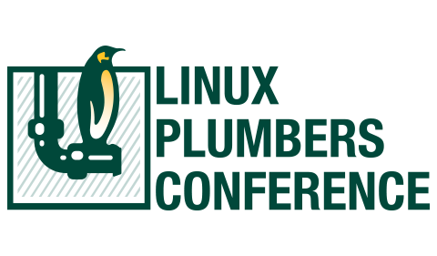

The [Linux Plumbers Conference 2019](https://linuxplumbersconf.org/event/4) is
coming up September 9-11 in Lisbon, Portugal. There are several tracks
featuring eBPF related topics:

- [BPF Microconference](https://linuxplumbersconf.org/event/4/sessions/62/#20190911)
- [Linux Networking Summit](https://linuxplumbersconf.org/event/4/sessions/41/#all)
- [Tracing Microconference](https://linuxplumbersconf.org/event/4/sessions/49/#20190911)

## BPF Microconference

The microconference is hosted by the two eBPF upstream maintainers Alexei
Starovoitov and Daniel Borkmann.

> The goal of the BPF Microconference is to bring BPF developers together to discuss and hash out unresolved issues and to move new ideas forward. The focus of this year's event is on the core BPF infrastructure as well as its many subsystems and related user space tooling.

> The BPF Microconference will be open to all LPC attendees. There is no additional registration required. This is also a great occasion for BPF users and developers to meet face to face and to exchange and discuss developments.

As usual, presentation material will be made available after the event.

### Agenda

- **Bringing BPF developer experience to the next level** ([details](https://linuxplumbersconf.org/event/4/contributions/448/)), Andrii Nakryiko (Facebook)
- **BPF Debugging** ([details](https://linuxplumbersconf.org/event/4/contributions/447/)), Yonghong Song (Facebook)
- **A pure Go BPF library** ([details](https://linuxplumbersconf.org/event/4/contributions/449/)), Joe Stringer (Cilium), Lorenz Bauer (Cloudflare), Martynas Pumputis (Cilium)
- **Do we need CAP_BPF_ADMIN?**([more details](https://linuxplumbersconf.org/event/4/contributions/452/)), Song Liu (Facebook)
- **Reuse host JIT back-end as offload back-end** ([more details](https://linuxplumbersconf.org/event/4/contributions/451/)), Jiong Wang (Netronome)
- **Using SCEV to establish pre and post-conditions over BPF code** ([more details](https://linuxplumbersconf.org/event/4/contributions/450/)), John Fastabend (Cilium)
- **Beyond per-CPU atomics and rseq syscall: subset of eBPF bytecode for the do_on_cpu syscall** ([more details](https://linuxplumbersconf.org/event/4/contributions/453/)), Mathieu Desnoyers (EfficiOS)
- **Kernel Runtime Security Instrumentation (KRSI)** ([more details](https://linuxplumbersconf.org/event/4/contributions/454/)), KP Singh (Google)
- **Map batch processing** ([more details](https://linuxplumbersconf.org/event/4/contributions/488/)), Yonghong Song (Facebook)

## Networking Summit

The track is hosted by David Miller and Daniel Borkmann.

### eBPF related Agenda

- **BPF packet capture helpers, libbpf interfaces** ([more details](https://linuxplumbersconf.org/event/4/contributions/489/)), Alan Maguire (Oracle)
- **Programmable socket lookup with BPF** ([more details](https://linuxplumbersconf.org/event/4/contributions/487/)), Jakub Sitnicki (Cloudflare), Lorenz Bauer (Cloudflare), Marek Majkowski (Cloudflare)
- **XDP bulk packet processing** ([more details](https://linuxplumbersconf.org/event/4/contributions/465/)), Maciej Fijałkowski (Intel)
- **Making the Kubernetes Service Abstraction Scale using eBPF** ([more details](https://linuxplumbersconf.org/event/4/contributions/458/)), Daniel Borkmann (Cilium), Martynas Pumputis (Cilium)
- **Scaling container policy management with kernel features** ([more details](https://linuxplumbersconf.org/event/4/contributions/464/)), Joe Stringer (Cilium)
- **Seamless transparent encryption with BPF and Cilium** ([more details](https://linuxplumbersconf.org/event/4/contributions/461/)), John Fastabend (Cilium)
- **Traffic footprint characterization of workloads using BPF** ([more details](https://linuxplumbersconf.org/event/4/contributions/490/)), Aditi Ghag (VMware)
- **XDP: the Distro View** ([more details](https://linuxplumbersconf.org/event/4/contributions/460/)), Jiri Benc (Red Hat)
- **An Evaluation of Host Bandwidth Manager** ([more details](https://linuxplumbersconf.org/event/4/contributions/486/)), Lawrence Brakmo (Facebook)

## Tracing Microconference

The track is hosted by Steven Rostedt.

### eBPF related Agenda

- **bpftrace** ([more details](https://linuxplumbersconf.org/event/4/contributions/441/)), Alastair Robertson (Yellowbrick)
- **BPF Tracing Tools: New Observability for Performance Analysis** ([more details](https://linuxplumbersconf.org/event/4/contributions/444/)), Brendan Gregg (Netflix)
