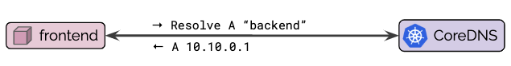
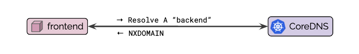
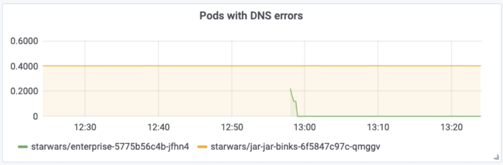

DNS is a common cause for outages and incidents in Kubernetes clusters. For
real-world stories, swing by [Kubernetes Failure Stories](https://k8s.af/). How
do you debug and troubleshoot DNS issues? How do you know a problem is related
to DNS? This guide provides a step by step tutorial on how to systematically
troubleshoot DNS issues in Kubernetes clusters. We will be using [Hubble] to
identify and inspect DNS issues as well as set up monitoring so we can locate
DNS issues early on to react even before incidents occur.

If you are not running [Hubble] yet, deploy it into your cluster by following
the [installation
instructions](https://github.com/cilium/hubble/blob/v0.5/Documentation/installation.md).

# Kubernetes DNS 101

In case you are not entirely familiar with how Kubernetes leverages DNS for
service discovery, this section will give you a brief introduction. You can
skip this section if you are already familiar with the DNS concepts of
Kubernetes.

Kubernetes pods and services are assigned a transient IP address requiring a
service discovery mechanism to be used to map the persistent service and pod
name to the temporary IP address on the fly. To implement this functionality,
Kubernetes assigns a fully qualified domain name (FQDN) to services and pods
and configures pods to use CoreDNS. Pods are now able to look up service and
pod names using DNS to retrieve the transient IP addresses.

Even though pods are assigned an FQDN as well, it is common practice to perform
service discovery via the Kubernetes service name as shown in the diagram
below:



Depending on the type of Kubernetes service, CoreDNS will respond with a
ClusterIP or with a list of PodIPs directly (headless service). The pod
connecting to the service can now initiate a connection to the returned IP
address(es). For services of type ClusterIP, the Kubernetes networking layer
will automatically translate connections to that ClusterIP to the IP of one of
the pods chosen by the service to the PodIP of one of the pods selected by the
service as illustrated by step (2) in the below diagrams:


If errors occur in this first step, these errors are typically referred to as
DNS resolution errors or, more broadly, DNS issues. Errors during the second
phase are generally referred to as network connectivity issues.

If you want to learn more about how Kubernetes uses DNS, see [DNS for Services
and Pods](https://kubernetes.io/docs/concepts/services-networking/dns-pod-service/)
of the Kubernetes documentation.

# How to monitor DNS errors in a Kubernetes Cluster

Network related errors can be challenging to troubleshoot as most applications
will only log a generic timeout error when a network connection fails. Even
worse, the cause for the failure can range from applications problems, network
connectivity issues, misconfigured firewall rules, DNS issues, or a combination
of the above and the error messages logged rarely provide sufficient context to
differentiate between them.

To assist in monitoring and troubleshooting these errors, [Hubble] can be used
to monitor all DNS traffic and to maintain metrics representing DNS error
scenarios. The simplest DNS error scenario is if the DNS server returns an
error directly to the application pod. Hubble maintains a metric to keep track
of all such errors. You can use a metrics collection stack such as [Prometheus]
and [Grafana] to collect and graph the DNS errors metrics of [Hubble] using the
following query:

```bash
sum(rate(hubble_dns_responses_total{rcode!=\"No Error\"}[1m])) by (pod, qtypes, rcode)
```

Using [Grafana], we can generate a graph like the following, which will show the
number of DNS errors occurring in the entire cluster at any time:


It is good practice to also set up a [Prometheus alert] on the number of DNS
errors to receive an alert notification when the number of errors exceeds a
certain threshold.

But, what if DNS resolution fails without the pod receiving a DNS error? This
can happen if the network packets carrying the DNS response are being dropped.
You can use [Hubble] to track a metric that shows the balance between DNS
requests and DNS responses over time. Any significant in-balance of this graph
indicates DNS requests remaining unanswered:


Understanding the presence of DNS errors is a vital first step. The next step
is to track down the source of DNS errors and identify affected pods.

# How to identify Pods receiving DNS errors

Knowing that DNS errors are occurring is excellent, but we need to know which
application pods are being affected by DNS errors. Using the Hubble CLI, we can
query the flow history on each node to identify the pods which have received
DNS errors.



Hubble operates on a per-node basis, to simplify querying across nodes, we
first define a bash function to execute a command inside all Hubble pods which
are running as a DaemonSet in your cluster:

```bash
function hubble-cluster {
    while read -r p; do
        kubectl -n kube-system exec $p -- $*
    done <<< "$(kubectl -n kube-system get pods -l k8s-app=hubble -o json | jq -r ".items[].metadata.name")"
}
```

We can now use the `hubble` CLI to query the flow history to extract the names
of all pods which have received DNS errors in the last 10 minutes:

```bash
hubble-cluster hubble observe --protocol dns --since=10m -j | \
  jq -r 'select(.l7.dns.rcode!=null) | .destination.namespace + "/" + .destination.pod_name + " " + .l7.dns.query' | \
  sort | uniq -c | sort -r
```

```bash
198 starwars/jar-jar-binks-59cdcc8dc4-hxl6w unknown-galaxy.svc.cluster.local.
198 starwars/jar-jar-binks-59cdcc8dc4-hxl6w unknown-galaxy.starwars.svc.cluster.local.
198 starwars/jar-jar-binks-59cdcc8dc4-hxl6w unknown-galaxy.cluster.local.
198 starwars/jar-jar-binks-59cdcc8dc4-hxl6w unknown-galaxy.
```

The output in the above command illustrates a typical example of a particular
pod `jar-jar-binks-59cdcc8dc4-hxl6w` in namespace `starwars` consistently
failing to look up the FQDN `unknown-galaxy` while attempting to resolve all
the variants of the DNS suffix search list.

# Tracking Pod Context in Metrics

The standard configuration will not attach any additional context, and the
metric will describe the DNS errors and DNS response balance for an entire
cluster or node. However, using the programmable metrics, Hubble can be
configured to attach additional context to scope the metric by namespace,
security identity, or even to individual pods. As an example, the following
graph has been configured to label DNS errors with the pod name receiving the
DNS error:



The [Prometheus] query used is:

```bash
topk(10,sum(rate(hubble_dns_responses_total{rcode!=\"No Error\"}[1m])) by (pod, destination))
```

See [Hubble
Metrics Documentation](https://github.com/cilium/hubble/blob/v0.5/Documentation/metrics.md#metric-options)
for details on how to configure Hubble metrics to label accordingly.

Counting the number of DNS errors per pod helps to quickly identify which pods
are subject to DNS resolution failures but doesn't yet tell us why the
resolution is failing.

# How to debug the DNS resolution of a pod

Continuing the troubleshooting process of the previous section, we can use
Hubble to retrieve the detailed flow log and gain insights into the entire DNS
resolution process. For this, we first define a couple of helper functions to
identify the Hubble pod responsible for a particular application pod:

```bash
function node-of-pod {
    kubectl -n $1 get pods $2 -o json | jq '.spec.nodeName'
}

function hubble-pod {
    kubectl -n kube-system get pods -l k8s-app=hubble -o json | \
    jq -r ".items[] | select(.spec.nodeName==$(node-of-pod $1 $2)) | .metadata.name"
}
```

We can then extract the entire DNS resolution history of that pod as
observed in the last minute:

```bash
kubectl -n kube-system exec -ti $(hubble-pod starwars jar-jar-binks-59cdcc8dc4-hxl6w) -- \
    hubble observe --since=1m -t l7 --protocol DNS --pod starwars/jar-jar-binks-59cdcc8dc4-hxl6w -j | \
    jq -r '.time + " " + .Summary'
```

```bash
2019-12-17T15:23:12.681144228Z DNS Answer RCode: Non-Existent Domain TTL: 4294967295 (Query unknown-galaxy. A)
2019-12-17T15:23:12.678563485Z DNS Answer RCode: Non-Existent Domain TTL: 4294967295 (Query unknown-galaxy. AAAA)
2019-12-17T15:23:12.673809404Z DNS Query unknown-galaxy. A
2019-12-17T15:23:12.673437023Z DNS Query unknown-galaxy. AAAA
2019-12-17T15:23:12.671396412Z DNS Answer RCode: Non-Existent Domain TTL: 4294967295 (Query unknown-galaxy.cluster.local. AAAA)
2019-12-17T15:23:12.671358294Z DNS Answer RCode: Non-Existent Domain TTL: 4294967295 (Query unknown-galaxy.cluster.local. A)
2019-12-17T15:23:12.670369160Z DNS Query unknown-galaxy.cluster.local. A
2019-12-17T15:23:12.669797423Z DNS Query unknown-galaxy.cluster.local. AAAA
2019-12-17T15:23:12.667882766Z DNS Answer RCode: Non-Existent Domain TTL: 4294967295 (Query unknown-galaxy.svc.cluster.local. AAAA)
2019-12-17T15:23:12.666437147Z DNS Query unknown-galaxy.svc.cluster.local. AAAA
2019-12-17T15:23:12.666968986Z DNS Answer RCode: Non-Existent Domain TTL: 4294967295 (Query unknown-galaxy.svc.cluster.local. A)
2019-12-17T15:23:12.666305732Z DNS Query unknown-galaxy.svc.cluster.local. A
2019-12-17T15:23:12.663315418Z DNS Answer RCode: Non-Existent Domain TTL: 4294967295 (Query unknown-galaxy.default.svc.cluster.local. A)
2019-12-17T15:23:12.659744803Z DNS Query unknown-galaxy.default.svc.cluster.local. A
2019-12-17T15:23:12.659082489Z DNS Answer RCode: Non-Existent Domain TTL: 4294967295 (Query unknown-galaxy.default.svc.cluster.local. AAAA)
2019-12-17T15:23:12.658412636Z DNS Query unknown-galaxy.default.svc.cluster.local. AAAA
```

The output illustrates nicely how Kubernetes configures a Pod's [DNS Config] to
search a list of domain names and how each request fails for IPv4 (`A`) and
IPv6 (`AAAA`) with an error indicating that the corresponding DNS name could
not be found.


If the DNS server is returning any errors, you will see it in the output.

# How to debug missing DNS responses

What if the symptom isn't DNS errors, but DNS responses are missing altogether?
Assuming that the pod `starwars/jar-jar-binks-5bcd4b9b9f-cn7vc` is failing to
perform DNS resolution, we can check for network packet drops from and to that
pod by running:

```bash
kubectl -n kube-system exec -ti $(hubble-pod starwars jar-jar-binks-5bcd4b9b9f-cn7vc) -- \
    hubble observe --since=5m --pod starwars/jar-jar-binks-5bcd4b9b9f-cn7vc -t drop
```

```
TIMESTAMP             SOURCE                                          DESTINATION                                       TYPE                 VERDICT   SUMMARY
Dec 17 15:37:32.171   starwars/jar-jar-binks-5bcd4b9b9f-cn7vc:45464   kube-system/coredns-5644d7b6d9-v5cv2:53(domain)   Policy denied (L3)   DROPPED   UDP
Dec 17 15:37:32.171   starwars/jar-jar-binks-5bcd4b9b9f-cn7vc:45464   kube-system/coredns-5644d7b6d9-v5cv2:53(domain)   Policy denied (L3)   DROPPED   UDP
Dec 17 15:37:27.166   starwars/jar-jar-binks-5bcd4b9b9f-cn7vc:45464   kube-system/coredns-5644d7b6d9-v5cv2:53(domain)   Policy denied (L3)   DROPPED   UDP
Dec 17 15:37:27.164   starwars/jar-jar-binks-5bcd4b9b9f-cn7vc:45464   kube-system/coredns-5644d7b6d9-v5cv2:53(domain)   Policy denied (L3)   DROPPED   UDP
Dec 17 15:36:43.680   starwars/jar-jar-binks-5bcd4b9b9f-cn7vc:42160   kube-system/coredns-5644d7b6d9-r9pfk:53(domain)   Policy denied (L3)   DROPPED   UDP
Dec 17 15:36:43.680   starwars/jar-jar-binks-5bcd4b9b9f-cn7vc:42160   kube-system/coredns-5644d7b6d9-r9pfk:53(domain)   Policy denied (L3)   DROPPED   UDP
```

In this example, the cause for DNS resolution is simple. The corresponding UDP
packets are being dropped because the packets are being denied by the
configured NetworkPolicies.

If the issue is still unclear, the entire network transaction can be retrieved
to identify in which exact moment packets are being dropped:

```bash
hubble-cluster hubble observe --since=1m --pod starwars/jar-jar-binks-5bcd4b9b9f-k6ts9
```

```bash
Dec 17 15:47:03.016   10.96.0.10:53(domain)                             starwars/jar-jar-binks-5bcd4b9b9f-k6ts9:51031     to-endpoint    FORWARDED   UDP
Dec 17 15:47:03.011   kube-system/coredns-5644d7b6d9-r9pfk:53(domain)   starwars/jar-jar-binks-5bcd4b9b9f-k6ts9:51031     dns-response   FORWARDED   DNS Answer RCode: Non-Existent Domain TTL: 4294967295 (Query unknown-galaxy.starwars.svc.cluster.local. A)
Dec 17 15:47:03.011   starwars/jar-jar-binks-5bcd4b9b9f-k6ts9:51031     kube-system/coredns-5644d7b6d9-r9pfk:53(domain)   dns-request    FORWARDED   DNS Query unknown-galaxy.starwars.svc.cluster.local. A
Dec 17 15:47:03.011   starwars/jar-jar-binks-5bcd4b9b9f-k6ts9:51031     kube-system/coredns-5644d7b6d9-r9pfk:53(domain)   to-proxy       FORWARDED   UDP
```

The above example shows a complete transaction showing the UDP packet carrying
the request, the parsed DNS request, the parsed DNS response, and the UDP
packet carrying the DNS response delivered back to the endpoint. If any of them
are missing, then you will know where the packet is being dropped.

# Summary

DNS issues are a frequent cause of outages and incidents in Kubernetes
clusters. DNS issues have typically been hard to detect and troubleshoot. In
this guide, we have explored how [Hubble] using [Cilium] and [eBPF] can help to
identify and track down DNS issues in your Kubernetes cluster.

To get started:

- Install Cilium using any of the [Installation instrutions](http://docs.cilium.io/en/v1.6/gettingstarted/#installation)
- Deploy Hubble with the metrics dashboard configured: [Setting up Hubble Metrics with Grafana](https://github.com/cilium/hubble/tree/v0.5/tutorials/deploy-hubble-and-grafana)
- Enable [DNS visiblity](https://github.com/cilium/hubble/blob/v0.5/Documentation/dns_visibility.md)
- Check out [Cilium Slack] for questions and answers

[cilium]: https://github.com/cilium/cilium
[ebpf]: https://docs.cilium.io/en/stable/bpf/
[cilium slack]: http://slack.cilium.io/
[hubble]: https://github.com/cilium/hubble
[prometheus]: https://github.com/prometheus/prometheus
[grafana]: https://github.com/grafana/grafana
[prometheus alert]: https://prometheus.io/docs/practices/alerting/
[cilium]: https://github.com/cilium/cilium
[ebpf]: http://docs.cilium.io/en/v1.6/bpf/
[dns config]: https://kubernetes.io/docs/concepts/services-networking/dns-pod-service/#pod-s-dns-config
