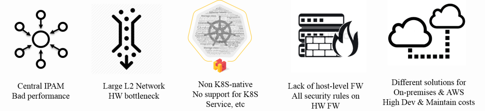

{{preview}}

This post provides the background on how [Trip.com] uses Cilium and what lead
the team to standardize on Cilium as their networking and network security
platform for the years to come. It is a summary with some commentary of the
[original trip.com blog
post](https://ctripcloud.github.io/cilium/network/2020/01/19/trip-first-step-towards-cloud-native-networking.html)
by ArthurChiao from Trip.com/Ctrip which provides extensive details into the
decision-making process and experiences while running Cilium in production.

{{/preview}}

# Introduction

_This is a post in the user-story series. If you would like to share your
Cilium user-story, feel free to approach any of the Cilium authors on Slack._

This post provides the background on how [Trip.com] uses Cilium and what lead
the team to standardize on Cilium as their networking and network security
platform for the years to come. It is a summary with some commentary of the
[original trip.com blog
post](https://ctripcloud.github.io/cilium/network/2020/01/19/trip-first-step-towards-cloud-native-networking.html)
which provides extensive details into the decision-making process and
experiences while running Cilium in production.

## User Background

[Trip.com] (previously known as [Ctrip]) is a Chinese provider of travel
services including accommodation reservation, transportation ticketing,
packaged tours and corporate travel management. The company owns and operates
Trip.com, Skyscanner, and Ctrip.com, all of which are online travel agencies.
[...] Ctrip.com receives over 1.6M daily visits.

_Source: [Wikipedia](https://en.wikipedia.org/wiki/Trip.com_Group)_ and [vstat.info](https://vstat.info/ctrip.com)

## The Cloud-Native Networking Challenge

With the status quo evolving in the era of OpenStack, the networking platform
was not set up for success for the cloud-native world:

> After many times iterations of current problems reviewing as well as future
> needs clarification, we listed five critical problems/requirements of our
> networking:

Diving into further details, the current deficits of the platform resulted in
several real challenges:

- **Centralized IPAM**
  - The Neutron-based centralized IPAM became a bottleneck and prevented
    Kubernetes clusters from growing.
- **L2 scalability limitations**
  - The L2-based network required the networking hardware to maintain L2
    forwarding entries for each network endpoint.
  - With the introduction of Kubernetes and containers, the number of network
    endpoints exploded and caused network hardware to run into limits and
    prevent further growth of the infrastructure.
- **Kubernetes unawareness**
  - The current networking solution was not Kubernetes-aware, requiring a
    different solution to implement Kubernetes services.
- **Hardware firewall restrictions**
  - With hardware-based firewalls being the only point of enforcement,
    firewall rule management became a burden and point of bottleneck.
  - Inability to enforce Kubernetes NetworkPolicy put additional strain on the
    already struggling hardware-based firewalls.
- **Different stack for bare-metal and Cloud**
  - Separate solutions for bare-metal and AWS cloud deployments resulted in
    high development and maintenance costs.

## Conclusion: Cloud-Native L3 Networking & Kubernetes Awareness

> Based on the above analysis, we started to survey and evaluate next
> generation networking solutions. Corresponding to the questions above, our
> new solution should provide:

- **De-centralized IPAM:** Local IPAM on each node
- **No hardware bottleneck:** L3 networking between hosts
- **Kubernetes-native:** Support all Kubernetes functionalities natively
- **Network policy:** Host or application-level network security rules on each node
- **Bare-metal & Cloud:** Single solution covering both on-premises (bare-metal) and AWS

# Evaluation - eBPF beats iptables

Trip.com has looked at several options to pick its next-generation networking
platform, including Calico, Flannel, and Cilium. All of the solutions are
commonly used in a cloud-native context to meet the listed requirements. The
key difference is the underlying technology used. While Calico (which is
required for policy enforcement in combination with Flannel) relies on
iptables, Cilium relies entirely on the newer, much more powerful eBPF
technology.

- **Calico & Flannel**

  > Container platforms became more and more popular since ~2005.
  > Kubernetes-native solutions such as Flannel and Calico evolved with this
  > trend.
  > [...]
  > But, these solutions suffer from severe performance issues when the cluster
  > grows really large [1]. Essentially this is because the solutions are based
  > on iptables, which is based on a chain design, thus has O(n) complexity. It’s
  > also hard to troubleshooting when there are tens of thousands of iptables
  > rules on each node.

- **Cilium**

  > Cilium is also a Kubernetes-native solution, but solves the performance problem by
  > utilizing a new kernel technology: eBPF. eBPF rules bases on hashing, so it
  > has O(1) complexity.
  > [..]
  > After several POC verifications, we decided to adopt Cilium as our next
  > generation networking solution. This is a 10-year leap for us in terms of
  > networking stack.

# Architecture Details

## Routing Topology

Trip.com has chosen an intelligent topology based on where workloads are being
run:

- **Bare-metal on-premises:** Direct routing via BGP using BIRD
- **AWS:** AWS ENI routing mode via [Cilium AWS ENI support](https://docs.cilium.io/en/v1.6/concepts/ipam/eni/)

This topology provides native routing architecture in both the bare-metal and
AWS environments with all its performance benefits. In addition, it provides a
universal Kubernetes services and Network Policy model across all environments
to minimize the differences between the bare-metal and cloud environments.

## Customizations

### Fixed IP for statefulset

Some workloads in the Trip.com use case require fixed IP addresses to be
assigned. This is a feature that Cilium currently doesn't support so Trip.com
has added support for this:

> We added fixed IP functionality (only for statefulset) for our special use
> case - an intermediate step towards true cloud-native for some applications.
> [...]
> But this feature currently relies on sticky scheduler, which is a simple
> Kubernetes scheduler implemented by us internally (you could also find
> similar schedulers on GitHub), so this feature is not ready to be widely used
> by other users.

We will work with Trip.com to merge this feature upstream and make it available
to all Cilium users as Kubernetes gains underlying support on the scheduler side.

### Monitoring

> Cilium officially recommends Grafana + Prometheus for monitoring and
> alerting, and provides yaml files to create those infrastructures. It’s easy
> to get started.
> We re-used our existing monitoring & alerting infrastructures [...]

# Conclusion

> We have been stably running Cilium in our production environments for several
> months.
> Now we have 6K+ pods on Cilium, which span over PROD and UAT/FAT, as well as
> on-premises and AWS.
> Besides, we also have 10K+ GitlabCI jobs on Cilium each day, with each job
> launches a new Pod (and terminates it after job finishes).
> This only accounts for a very small part of our total Pods, and in year 2020,
> we will start to migrate those legacy Pods to Cilium.

# Getting started with Cilium

- Install Cilium using any of the [Installation instrutions](http://docs.cilium.io/en/v1.6/gettingstarted/#installation)
- Getting started with AWS ENI: [AWS ENI guide](https://docs.cilium.io/en/v1.6/gettingstarted/aws-eni/)
- Getting started with BGP: [BGP guide](https://docs.cilium.io/en/v1.6/gettingstarted/kube-router/) (Trip.com replaced kube-router with BIRD)

[trip.com]: https://www.trip.com/
[ctrip]: https://en.wikipedia.org/wiki/Trip.com_Group
