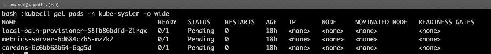
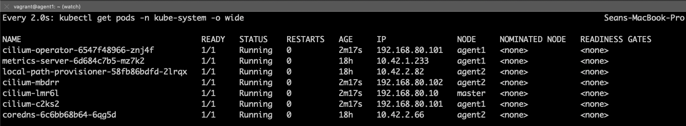
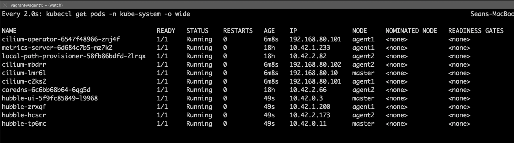
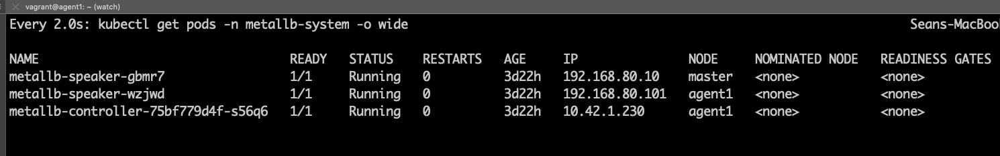
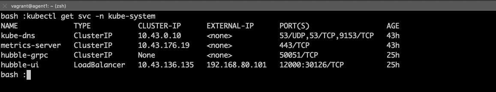
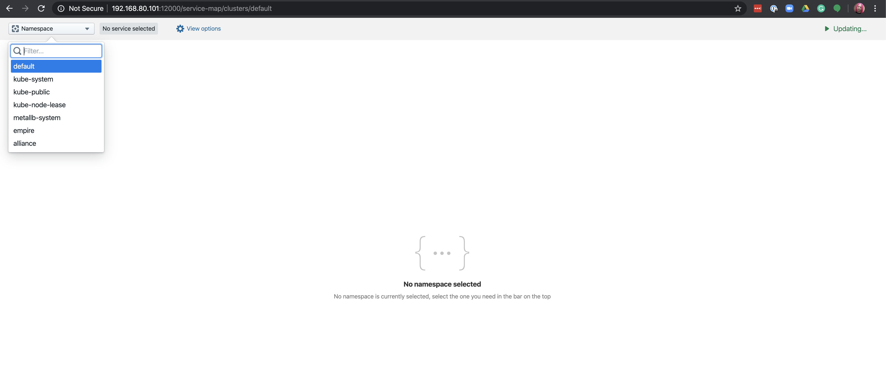
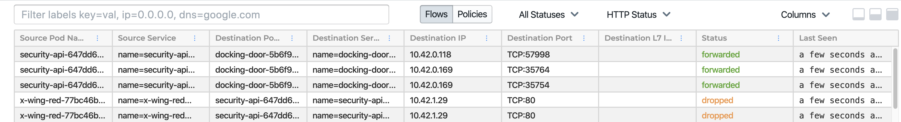
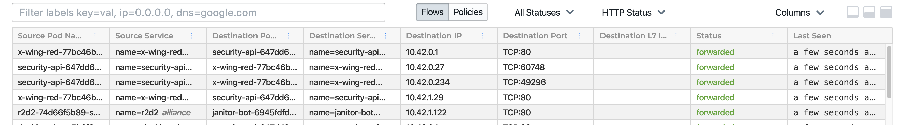

Like many of you, we have been feeling the pains of working remotely from home.
We are living in a difficult time where many of us have limited access to
resources. Still, the need to design, build and maintain moves on!
For many of us, it is what keeps us mentally strong on a daily basis right now.
This means we still need to test and optimize our applications. But how can we
reliably test a complex application and ensure the network policies are properly
enforced across the entire communications path?

Thanks to our friends at [Rancher Labs](https://rancher.io) and their amazing
solution for kubernetes on edge and IoT devices [K3s](https://k3s.io) it is
not only possible, but easy to do. With Cilium and K3s you can build a
multi-node Kubernetes cluster with just 8GB of memory and a modern CPU in just
minutes. A multi-node cluster can help with testing of complex application
architectures and is especially useful when diagnosing or troubleshooting
network policies. Whether you just want to take Cilium for a test drive or you
want to start designing tight network controls into your application, this
post is for you!

In this guide, we will walk through the steps required to build a multi-node
Kubernetes cluster on your local workstation or laptop using K3s and Cilium.
Then we'll show you how you can use Hubble to inspect traffic in the cluster
and visualize data which is exposed by the superpowers of eBPF and Cilium. We
will also show you how to restrict the flow of traffic between applications.
Finally, we will see how Cilium and Hubble can provide you detailed information
which can help solve problems related to compliance and regulatory concerns.

## Pre-Requisites

- **Vagrant:** HashiCorp [Vagrant](https://www.vagrantup.com/downloads.html) is
  useful for building local development environments. It's free to install and
  use. This guide will use it with VirtualBox, but vagrant can also be used with
  a number of other [providers](https://www.vagrantup.com/intro/getting-started/providers.html).
- **VirtualBox:** [VirtualBox](https://www.virtualbox.org) is a virtualization
  platform freely distributed for personal use. In order to run
  the virtual machines in this post VirtualBox 6.1. or higher is required. To
  check if you have the correct version of VirtualBox, run the following at a
  terminal prompt: `vboxmanage --version`
- **Helm:** [Helm](https://helm.sh) version 3 is required to install Cilium and
  Hubble. To determine if you have Helm version 3 you can run the following
  command at a terminal prompt: `helm version`
- **Git:** Code examples are available via [GitHub](https://www.github.com/sesanmwinn/cilium-k3s-demo)
  —and may be downloaded using [Git](https://git-scm.com)—but are not required.
  I have provided all of the necessary code bits here in the post to follow
  along, but if you want to customize your environment beyond this post I
  recommend cloning the repository.
- **kubectl** - [Kubernetes CLI](https://kubernetes.io/docs/tasks/tools/install-kubectl/)
  used for interacting with the kubernetes api. We will be installing version
  1.17.4 of kubernetes, so we should install the same version or newer.
  To check the version installed type `kubectl version`. Your system should
  report the version installed for both Client and Server. If your connection
  to the server fails, this is expected without a server running.

## Starting Your Environment

Clone the repository:

```shell-session
git clone https://github.com/seanmwinn/cilium-k3s-demo.git
cd cilium-k3s-demo
```

The guest machines will require the Virtualbox Guest Additions installed. In
order to allow vagrant to automatically install the guest additions on boxes
which do not implement it, install the `vagrant-vbguest` plugin:

```shell-session
vagrant plugin install vagrant-vbguest
```

By default, the included `Vagrantfile` will start a cluster with one K3S master node
and one K3S agent node by default. You can change the number of agent nodes by
configuring an environment variable for `K3S_AGENTS` or passing it with the
command as a prefix:

```shell-session
vagrant up
```

After about 5-10 minutes depending on your download spped, the machines should
be started and K3s should be installed and running. The provisioning script
will copy a `k3s.yaml` file to your working directory. Verify that `kubectl` can
communicate with the kubernetes master. It is expected to see pods in a
`Pending` state:

```shell-session
export KUBECONFIG=$PWD/k3s.yaml
kubectl get pods -n kube-system -o wide
```



## Installing Cilium

Cilium is installed using Helm version 3. First, add the Cilium repository to
your helm configuration:

```shell-session
helm repo add cilium https://helm.cilium.io/
```

Then install Cilium using Helm:

```shell-session
$ helm install cilium cilium/cilium --version=1.7.2 \
    --set global.tag="v1.7.2" --set global.containerRuntime.integration="containerd" \
    --set global.containerRuntime.socketPath="/var/run/k3s/containerd/containerd.sock" \
    --set global.kubeProxyReplacement="strict" --namespace kube-system
```

This Helm command executes the following four actions:

- Selecting the v1.7.2 release.
- Configuring Cilium to be able to read information from the containerd
  runtime along with a custom path for the domain socket implemented by k3s.
- Disabling kube-proxy and using Cilium for address translation

It will take a few minutes for the Cilium agent and operator to become available.
Once we have Cilium up and running, the other pods in the cluster should also
start to transition into the `Running` state. You should see one Cilium
pod on each node as well as the cilium-operator.



## Installing Hubble

Next we will install Hubble, an observability tool which provides deep
visibility into network connections, processes and much more thanks to Cilium
and eBPF. In order to install Hubble using helm, it's necessary to clone the
source repository:

```shell-session
$ cd ..
$ git clone https://github.com/cilium/hubble --branch v0.5
$ cd hubble/install/kubernetes/hubble

$ helm install hubble . --namespace kube-system \
    --set metrics.enabled="{dns:query;ignoreAAAA;destinationContext=pod-short,drop:sourceContext=pod;destinationContext=pod,tcp,flow,port-distribution,icmp,http}" \
    --set ui.enabled=true --set image.tag="v0.5.1"
```

Here we are setting custom values to:

- enable the Hubble UI;
- define the [metrics](https://github.com/cilium/hubble/blob/v0.5/Documentation/metrics.md)
  Hubble will collect;
- select to deploy release v0.5.1.gma

The Hubble daemonset should start a pod on each node, as well as a single pod
running the Hubble UI. This process should take a few minutes as the containers
are downloaded and started.



## Installing MetalLB

[MetalLB](https://metallb.universe.tf/) is a software load balancer which can
expose Kubernetes services to external hosts thanks to a `LoadBalancer`
service object. We are using MetalLB to work around [an existing bug](https://github.com/rancher/k3s/issues/1216)
with multi-node clusters in the K3s service load balancer.

Create the metallb-system namespace:

```shell-session
kubectl create ns metallb-system
```

The Helm charts for MetalLB are hosted in the official stable repository. You
can see the list of configured repos with `helm repo list`. If you do not have
the stable repository configured, add it:

```shell-session
helm repo add stable https://kubernetes-charts.storage.googleapis.com/
```

Next, install MetalLB using Helm:

```shell-session
$ helm install -f https://raw.githubusercontent.com/seanmwinn/cilium-k3s-demo/master/configmap.yaml \
    --namespace metallb-system metallb stable/metallb
```

We are passing a configmap to the MetalLB which includes the following inline
configuration:

```yaml
configInline:
  peers:
  address-pools:
    - name: default
      protocol: layer2
      addresses:
        - 192.168.80.101-192.168.80.150
```

This MetalLB configuration will establish an IP address range which will be
advertised using Layer2 protocols.

You can check that MetalLB has started up by running:

```shell-session
kubectl get pods -o wide -n metallb-system
```

You should see a single controller pod and one speaker pod for each node in the
cluster. If you used the default configuration, you should see a total of 3 pods.



## Observing Traffic with Hubble

Now that we have a fully working multi-node environment, let's deploy some demo
applications which will allow us to observe the powers of eBPF and Cilium using
Hubble.

In our scenario, the Alliance is mounting their attack against an Empire base.
A fleet of x-wing fighters will infiltrate the security systems and breach the
docking area. Teams will then infiltrate the base and activate the internal
self-destruct mechanisms to destroy the base using one of the terminals from the
control room. This will ensure victory for the Alliance and restore order to the
galaxy.

Start off by deploying the applications:

### Empire

```shell-session
kubectl apply -f https://raw.githubusercontent.com/seanmwinn/cilium-k3s-demo/master/example-apps/empire.yaml
```

- **docking-doors:** The docking door control systems. Our heroes need these
  systems disabled so they can breach the Empire base and transmit the codes.
- **janitor-bots:** An API for managing janitor-bots. R2D2 has detected a flaw
  in the janitor bot code which he can exploit to install backdoor program.
- **security-api:** The central security systems, tightly secured
  against attacks—or so the empire thinks...

### Alliance

```shell-session
kubectl apply -f https://raw.githubusercontent.com/seanmwinn/cilium-k3s-demo/master/example-apps/alliance.yaml
```

We will also modify the Hubble UI service to be available via a LoadBalancer
port using MetalLB:

```shell-session
$ kubectl patch -n kube-system svc/hubble-ui --patch \
    '{"spec": {"type": "LoadBalancer"}}'
```

Obtain a list of services in the kube-system namespace and determine which IP
address was assigned to the hubble-ui service:



Here we can see the IP address for hubble-ui listed as an External IP and the
advertised port, 12000. Using a web broswer, navigate to the IP address of
hubble-ui on port 12000 and select the empire namespace in the top left corner:



You should now see a service map of all communications going to or from the
empire's various applications in the upper part of the screen, and a list of
flows and their forwarding status - either dropped or forwarded in the lower
part. Here you can see the failed attempts of the x-wing fleet trying to unlock
the docking doors which would allow them to access the empire base.



We can see in the logs that the x-wing-red fleet has been unsuccessful in their
attempts to communicate with the security-api control systems.

Fortunately, R2D2 has been able to find a critical security vulnerability in
the janitor bots, and he is able to deploy an application into the empire's
systems to open a backdoor:

```shell-session
kubectl apply -f https://raw.githubusercontent.com/seanmwinn/cilium-k3s-demo/master/example-apps/r2d2.yaml
```

Let's explore the backdoor application R2D2 was able to install:

```yaml
---
apiVersion: 'cilium.io/v2'
kind: CiliumNetworkPolicy
metadata:
  name: 'janitor-bots-backdoor'
  namespace: empire
spec:
  endpointSelector:
    matchLabels: {}
  ingress:
    - fromEndpoints:
        - matchLabels:
            k8s:io.kubernetes.pod.namespace: alliance
  egress:
    - toEndpoints:
        - matchLabels:
            name: janitor-bot
```

R2D2 was able to find a flaw in the empire's systems which allowed him to access
the janitor bots. While the empire was thoughtful about security for the docking
bay, these droids have access to every system inside the base—including the
docking bay doors! He created an application that will allow any communications
that come from an alliance ship to access the janitor-bots which should allow
the x-wing red fleet to breach the empire base.

R2D2 also sent out the following application update to give the x-wing
fleet access to the docking bay security systems via the janitor bots:

```shell-session
$ kubectl patch -n alliance deploy/x-wing-red -p \
    '{"spec": {"template": {"spec": {"containers": [{"name": "x-wing-red", "command":["bash", "-c", "while true; do curl -sS -o /dev/null janitor-bot.empire.svc.cluster.local; sleep $(( ( RANDOM % 10 )  + 1 )); done"]}]}}}}'
```



This allows the x-wing fleet to land inside the docking bay. Our heroes are able
to successfully access the empire base's self-destruct mechanism and make it
back out safely!

The galaxy is saved......

## Further Reading

We encourage you to read the following guides and explore Hubble's capabilities:

- [Setting up Hubble Metrics with Grafana](https://github.com/cilium/hubble/tree/v0.5/tutorials/deploy-hubble-and-grafana)
- [Enabling DNS Visibility](https://github.com/cilium/hubble/blob/v0.5/Documentation/dns_visibility.md)
- [Enabling HTTP Visibility](https://github.com/cilium/hubble/blob/v0.5/Documentation/http_visibility.md)

## Cleanup

To clean up the environment and delete all virtual machines, from the same
folder where the environment was first started:

`vagrant destroy -f`
