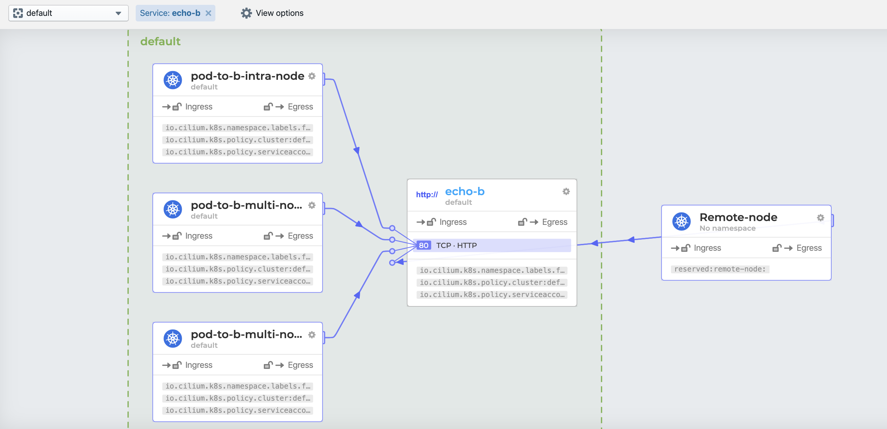
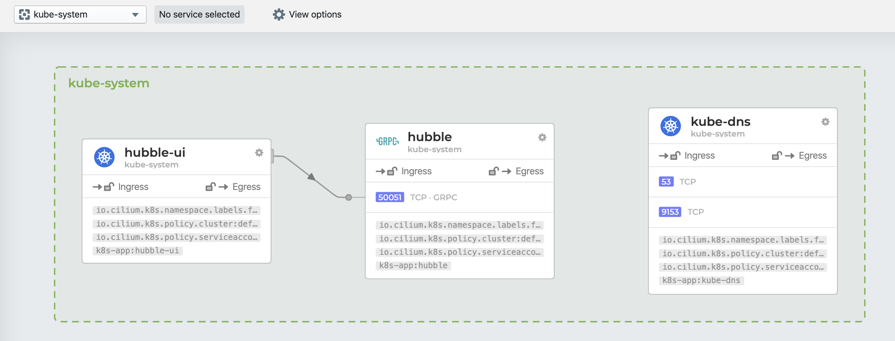
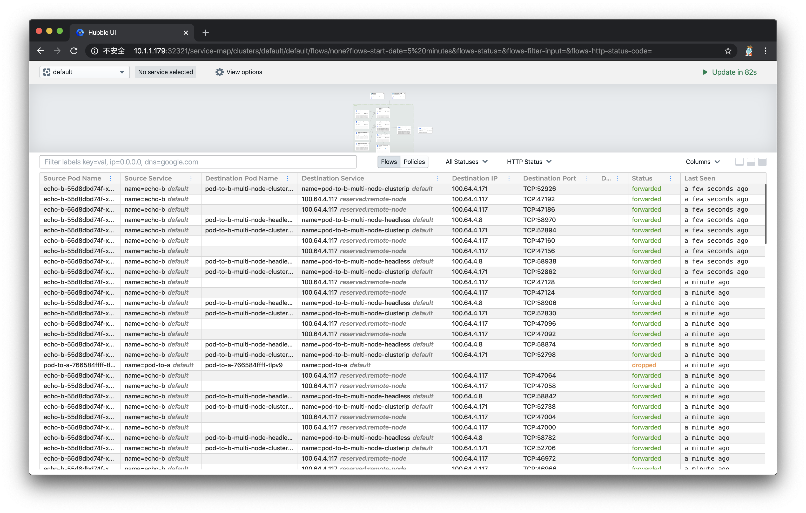
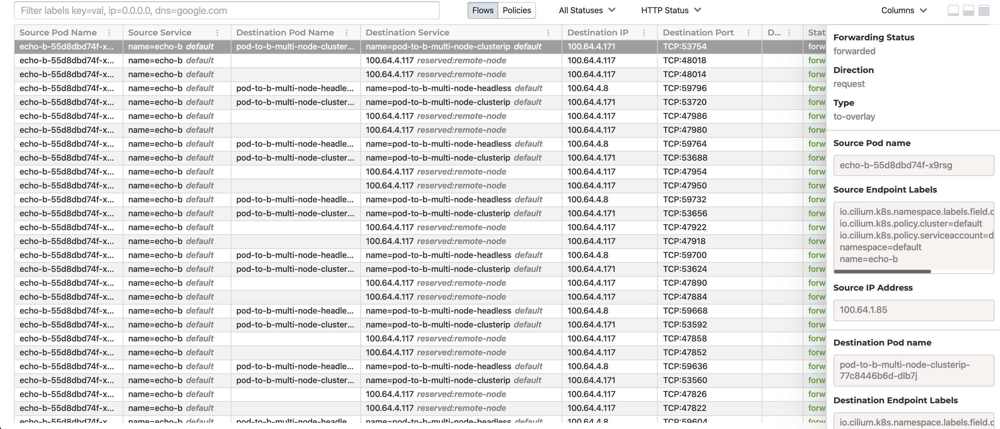
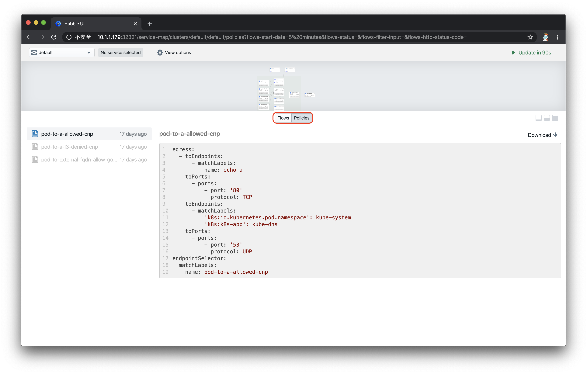
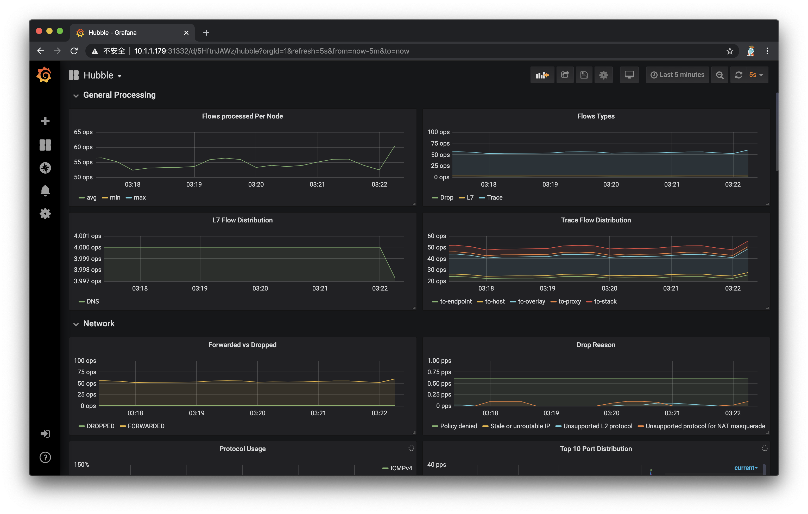
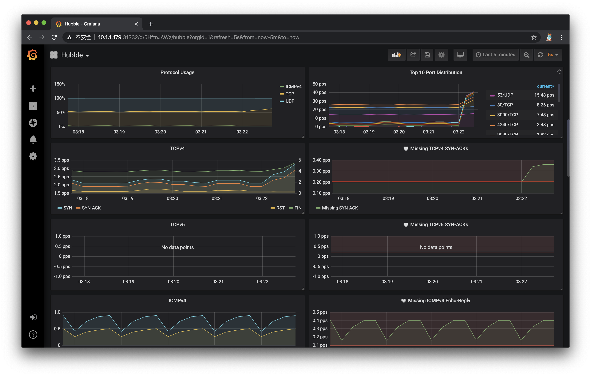

<div class="blog-authors">
  <div class="blog-author">
    <span class="blog-author-header">
      Guest Blog Post
    </span>
    <span class="blog-author-bio">
      This is a guest blog by a Cilium user based on the <a
      href="https://davidlovezoe.club/wordpress/archives/851">the original blog
      post</a>. If you would like to publish a blog post as well, contact us on
      Slack.
    </span>
  </div>
  <div class="blog-author">
    <span class="blog-author-header">
      About the author: Li Wenquan
    </span>
    <span class="blog-author-bio">
    Hello everyone, I am Li Wenquan from China. You can call me David. I
    started my Docker journey from 2014 and now work as a project manager of
    enterprise container platform, which is built on Kubernetes and Mesos. I
    got to know Cilium project from Kubecon, it is so interesting and
    promising. I've learned a lot from it, such as BPF, XDP and how to replace
    kube-proxy in a elegant way and I'd love to contribute to it.
    </span>
  </div>
</div>


> 最近业界使用范围最广的 K8S CNI 网络方案[Calico 宣布支持 eBPF](https://www.projectcalico.org/introducing-the-calico-ebpf-dataplane/)，而作为第一个通过 eBPF 实现了 kube-proxy 所有功能的 K8S 网络方案——Cilium，它的先见之名是否能转成优势，继而成为 CNI 新的头牌呢？今天我们一起来入门最 Cool Kubernetes 网络方案 Cilium。

## Cilium 介绍

> 以下基于[Cilium 官网文档](https://cilium.readthedocs.io/en/stable/)翻译整理。

# 当前趋势

现代数据中心的应用系统已经逐渐转向基于微服务架构的开发体系，一个微服务架构的应用系统是由多个小的独立的服务组成，它们之间通过轻量通信协议如 HTTP、gRPC、Kafka 等进行通信。微服务架构下的服务天然具有动态变化的特点，结合容器化部署，时常会引起大规模的容器实例启动或重启。要确保这种向高度动态化的微服务应用之间的安全可达，既是挑战，也是机遇。

## 现有问题

传统的 Linux 网络访问安全控制机制（如 iptables）是基于静态环境的 IP 地址和端口配置网络转发、过滤等规则，但是 IP 地址在微服务架构下是不断变化的，非固定的；出于安全目的，协议端口(例如 HTTP 传输的 TCP 端口 80)也不再固定用来区分应用系统。为了匹配大规模容器实例快速变化的生命周期，传统网络技术需要维护成千上万的负载均衡规则和访问控制规则，并且需要以不断增长的频率更新这些规则，而如果没有准确的可视化功能，要维护这些规则也是十分困难，这些对传统网络技术的可用性和性能都是极大的挑战。比如经常会有人对 kube-proxy 基于 iptables 的服务负载均衡功能在大规模容器场景下具有严重的性能瓶颈，同时由于容器的创建和销毁非常频繁，基于 IP 做身份关联的故障排除和安全审计等也很难实现。

## 解决方案

Cilium 作为一款 Kubernetes CNI 插件，从一开始就是为大规模和高度动态的容器环境而设计，并且带来了 API 级别感知的网络安全管理功能，通过使用基于 Linux 内核特性的新技术——[BPF](https://docs.cilium.io/en/stable/bpf/)，提供了基于 service/pod/container 作为标识，而非传统的 IP 地址，来定义和加强容器和 Pod 之间网络层、应用层的安全策略。因此，Cilium 不仅将安全控制与寻址解耦来简化在高度动态环境中应用安全性策略，而且提供传统网络第 3 层、4 层隔离功能，以及基于 http 层上隔离控制，来提供更强的安全性隔离。

另外，由于 BPF 可以动态地插入控制 Linux 系统的程序，实现了强大的安全可视化功能，而且这些变化是不需要更新应用代码或重启应用服务本身就可以生效，因为 BPF 是运行在系统内核中的。

以上这些特性，使 Cilium 能够在大规模容器环境中也具有高度可伸缩性、可视化以及安全性。


## 部署 Cilium

部署 Cilium 非常简单，可以通过单独的 yaml 文件部署全部组件（目前我使用了这个方式部署了 1.7.1 版本），也可以通过 helm chart 一键完成。重要的是部署环境和时机：

1. 官方建议所有部署节点都使用 Linux 最新稳定内核版本，这样所有的功能都能启用，具体部署环境建议可以参照[这里](https://cilium.readthedocs.io/en/stable/install/system_requirements/)。
2. 作为一个 Kubernetes 网络组件，它应该在部署 Kubernetes 其他基础组件之后，才进行部署。这里，我自己遇到的问题是，因为还没有 CNI 插件，coredns 组件的状态一直是 pending 的，直到部署完 Cilium 后，coredns 完成了重置变成 running 状态。
   下图是 Cilium 的整体部署组件图：
   

## 测试安装效果

官方提供了一个[connectivity 检查工具](https://github.com/cilium/cilium/blob/master/examples/kubernetes/connectivity-check/connectivity-check.yaml)，以检测部署好的 Cilium 是否工作正常。如果你的网络环境有些限制，我作了一些简单修改，可以参照[这里](https://github.com/nevermosby/K8S-CNI-Cilium-Tutorial/blob/master/cilium/connectivity-check.yaml)。部署起来很简单，请确保至少有两个可用的节点，否则有几个 deployment 会无法成功运行：

```bash
> kubectl apply -f connectivity-check.yaml

NAME                                    READY   UP-TO-DATE   AVAILABLE   AGE
echo-a                                  1/1     1            1           16d
echo-b                                  1/1     1            1           16d
host-to-b-multi-node-clusterip          1/1     1            1           16d
host-to-b-multi-node-headless           1/1     1            1           16d
pod-to-a                                1/1     1            1           16d
pod-to-a-allowed-cnp                    1/1     1            1           16d
pod-to-a-external-1111                  1/1     1            1           16d
pod-to-a-l3-denied-cnp                  1/1     1            1           16d
pod-to-b-intra-node                     1/1     1            1           16d
pod-to-b-multi-node-clusterip           1/1     1            1           16d
pod-to-b-multi-node-headless            1/1     1            1           16d
pod-to-external-fqdn-allow-google-cnp   1/1     1            1           16d

```

如果所有的 deployment 都能成功运行起来，说明 Cilium 已经成功部署并工作正常。


## 网络可视化神器 Hubble

上文提到了 Cilium 强大之处就是提供了简单高效的网络可视化功能，它是通过[Hubble](https://github.com/cilium/hubble)组件完成的。[Cilium 在 1.7 版本后推出并开源了 Hubble](https://cilium.io/blog/2019/11/19/announcing-hubble)，它是专门为网络可视化设计，能够利用 Cilium 提供的 eBPF 数据路径，获得对 Kubernetes 应用和服务的网络流量的深度可见性。这些网络流量信息可以对接 Hubble CLI、UI 工具，可以通过交互式的方式快速诊断如与 DNS 相关的问题。除了 Hubble 自身的监控工具，还可以对接主流的云原生监控体系——Prometheus 和 Grafana，实现可扩展的监控策略。


### 部署 Hubble 和 Hubble UI

官方提供了基于 Helm Chart 部署方式，这样可以灵活控制部署变量，实现不同监控策略。出于想要试用 hubble UI 和对接 Grafana，我是这样的部署的：

```bash
> helm template hubble \
    --namespace kube-system \
    --set metrics.enabled="{dns:query;ignoreAAAA;destinationContext=pod-short,drop:sourceContext=pod;destinationContext=pod,tcp,flow,port-distribution,icmp,http}" \
    --set ui.enabled=true \
    > hubble.yaml
> kubectl apply -f hubble.yaml
# 包含两个组件
# - daemonset hubble
# - deployment hubble UI
> kubectl get pod -n kube-system |grep hubble
hubble-67ldp                       1/1     Running   0          21h
hubble-f287p                       1/1     Running   0          21h
hubble-fxzms                       1/1     Running   0          21h
hubble-tlq64                       1/1     Running   1          21h
hubble-ui-5f9fc85849-hkzkr         1/1     Running   0          15h
hubble-vpxcb                       1/1     Running   0          21h

```

### 运行效果

由于默认的 Hubble UI 只提供了 ClusterIP 类似的 service，无法通过外部访问。因此需要创建一个 NodePort 类型的 service，如下所示：

```yaml
# hubble-ui-nodeport-svc.yaml
kind: Service
apiVersion: v1
metadata:
  namespace: kube-system
  name: hubble-ui-np
spec:
  selector:
    k8s-app: hubble-ui
  ports:
    - name: http
      port: 12000
      nodePort: 32321
  type: NodePort
```

执行`kubectl apply -f hubble-ui-nodeport-svc.yaml`，就可以通过任意集群节点 IP 地址加上 32321 端口访问 Hubble UI 的 web 服务了。打开效果如下所示：


- 页面上半部分是之前部署的一整套 conectivity-check 组件的数据流向图，官方叫做`Service Map`，默认情况下可以自动发现基于网络 3 层和 4 层的访问依赖路径，看上去非常 cool，也有点分布式链路追踪图的感觉。点击某个服务，还能看到更为详细的关系图：
  
  下图是 kube-system 命名空间下的数据流图，能看到 Hubble-UI 组件和 Hubble 组件是通过 GRPC 进行通信的，非常有趣。但令人感到的好奇的是，为何没有显示 Kubernetes 核心组件之间的调用关系图。
  
- 页面的下半部分默认显示的是对于每条数据流路径的详细描述，包括发起请求的 pod 名称、发起请求的 service 名称、请求目标的 pod 名称、请求目标的 service 名称、目标 IP、目标端口、目标 7 层信息、请求状态、最后一次查看时间等，如下图所示：
  
  点击任意一条 flow，可以查看到更多详细信息：
  
- 页面的下半部分可以通过点击切换成显示 network policy 模式，列出了当前命名空间下所有的网络策略：
  

如果想开启网络 7 层的可视化观察，就需要对目标 pod 进行 annotations ，感兴趣可以看[这里](http://docs.cilium.io/en/stable/policy/visibility/)，就不在入门篇详述了。

这样的网络可视化是不是你梦寐以求的，绝对能在排查请求调用问题的时候帮上大忙。

### 对接 Grafana+ Prometheus

如果你跟一样是 Grafana+ Prometheus 的忠实粉丝，那么使 Hubble 对接它们就是必然操作了。仔细的同学已经发现之前 helm template 的玄机了：

```bash
--set metrics.enabled="{dns:query;ignoreAAAA;destinationContext=pod-short,drop:sourceContext=pod;destinationContext=pod,tcp,flow,port-distribution,icmp,http}"
# 上面的设置，表示开启了hubble的metrics输出模式，并输出以上这些信息。
# 默认情况下，Hubble daemonset会自动暴露metrics API给Prometheus。

```

你可以对接现有的 Grafana+Prometheus 服务，也可以部署一个简单的：

```bash
# 下面的命令会在命名空间cilium-monitoring下部署一个Grafana服务和Prometheus服务
kubectl apply -f https://raw.githubusercontent.com/cilium/cilium/v1.6/examples/kubernetes/addons/prometheus/monitoring-example.yaml

# 创建对应NodePort Service，方便外部访问web服务
kubectl expose deployment/grafana --type=NodePort --port=3000 --name=gnp -n cilium-monitoring

kubectl expose deployment/prometheus --type=NodePort --port=9090 --name=pnp -n cilium-monitoring

```

完成部署后，打开 Grafana 网页，导入官方制作的[dashboard](https://github.com/cilium/hubble/blob/v0.5/tutorials/deploy-hubble-and-grafana/grafana.json)，可以快速创建基于 Hubble 的 metrics 监控。等待一段时间，就能在 Grafana 上看到数据了：





Cilium 配合 Hubble，的确非常好用！

## 取代 kube-proxy 组件

Cilium 另外一个很大的宣传点是宣称已经全面实现 kube-proxy 的功能，包括`ClusterIP`, `NodePort`, `ExternalIPs` 和 `LoadBalancer`，可以完全取代它的位置，同时提供更好的性能、可靠性以及可调试性。当然，这些都要归功于 eBPF 的能力。

官方文档中提到，如果你是在先有 kube-proxy 后部署的 Cilium，那么他们是一个“共存”状态，Cilium 会根据节点操作系统的内核版本来决定是否还需要依赖 kube-proxy 实现某些功能，可以通过以下手段验证是否能停止 kube-proxy 组件：

```bash
# 检查Cilium对于取代kube-proxy的状态

> kubectl exec -it -n kube-system [Cilium-agent-pod] -- cilium status | grep KubeProxyReplacement

# 默认是Probe状态
# 当Cilium agent启动并运行，它将探测节点内核版本，判断BPF内核特性的可用性，
# 如果不满足，则通过依赖kube-proxy来补充剩余的Kubernetess，
# 并禁用BPF中的一部分功能
KubeProxyReplacement:   Probe   [NodePort (SNAT, 30000-32767), ExternalIPs, HostReachableServices (TCP, UDP)]

# 查看Cilium保存的应用服务访问列表
# 有了这些信息，就不需要kube-proxy进行中转了
> kubectl exec -it -n kube-system [Cilium-agent-pod] -- cilium service list
ID   Frontend              Service Type   Backend
1    10.96.0.10:53         ClusterIP      1 => 100.64.0.98:53
                                          2 => 100.64.3.65:53
2    10.96.0.10:9153       ClusterIP      1 => 100.64.0.98:9153
                                          2 => 100.64.3.65:9153
3    10.96.143.131:9090    ClusterIP      1 => 100.64.4.100:9090
4    10.96.90.39:9090      ClusterIP      1 => 100.64.4.100:9090
5    0.0.0.0:32447         NodePort       1 => 100.64.4.100:9090
6    10.1.1.179:32447      NodePort       1 => 100.64.4.100:9090
7    100.64.0.74:32447     NodePort       1 => 100.64.4.100:9090
8    10.96.190.1:80        ClusterIP
9    10.96.201.51:80       ClusterIP
10   10.96.0.1:443         ClusterIP      1 => 10.1.1.171:6443
                                          2 => 10.1.1.179:6443
                                          3 => 10.1.1.188:6443
11   10.96.129.193:12000   ClusterIP      1 => 100.64.4.221:12000
12   0.0.0.0:32321         NodePort       1 => 100.64.4.221:12000
13   10.1.1.179:32321      NodePort       1 => 100.64.4.221:12000
14   100.64.0.74:32321     NodePort       1 => 100.64.4.221:12000
15   10.96.0.30:3000       ClusterIP
16   10.96.156.253:3000    ClusterIP
17   100.64.0.74:31332     NodePort
18   0.0.0.0:31332         NodePort
19   10.1.1.179:31332      NodePort
20   10.96.131.215:12000   ClusterIP      1 => 100.64.4.221:12000

# 查看iptables是否有kube-proxy维护的规则
> iptables-save | grep KUBE-SVC
<Empty> # 说明kube-proxy没有维护任何应用服务跳转，即可以停止它了。


```

## 小结

Cilium 作为当下最 Cool 的 Kubernetes CNI 网络插件，还有很多特性，如高阶 network policy、7 层流量控制等，这款基于 BPF/eBPF 打造出的简单、高效、易用的网络管理体验，有机会大家都来试用吧。
