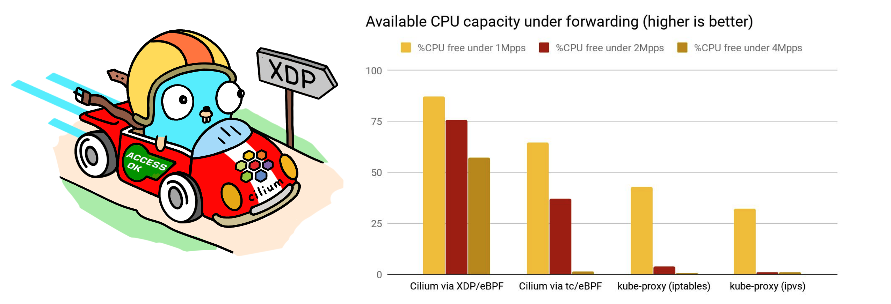
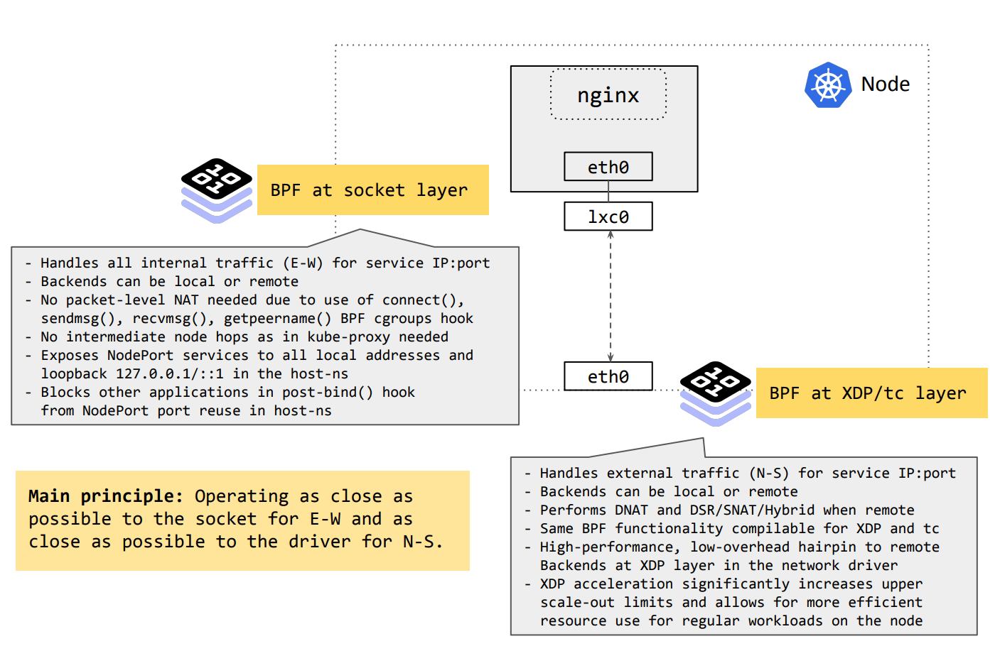
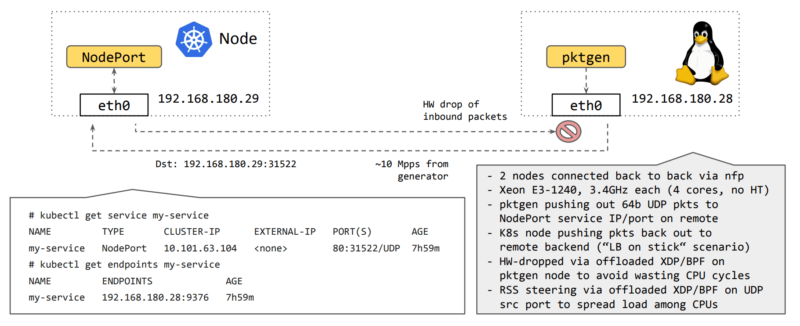
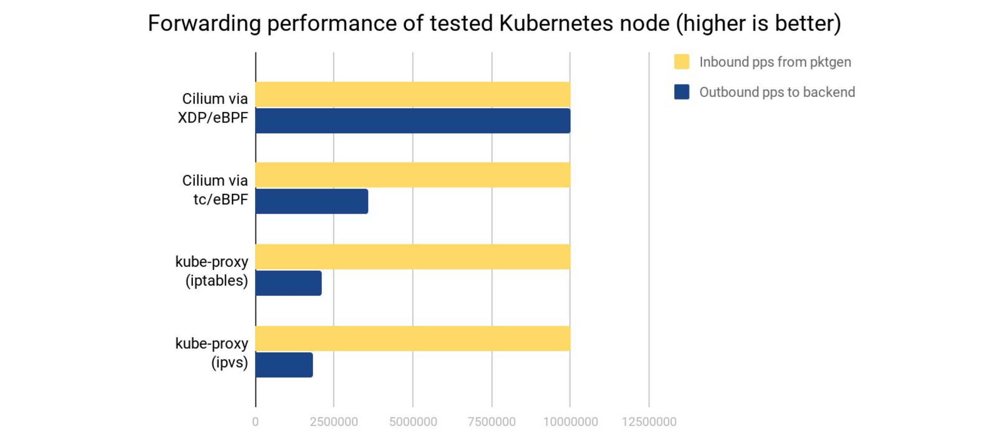
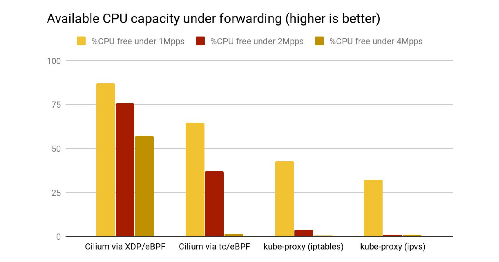
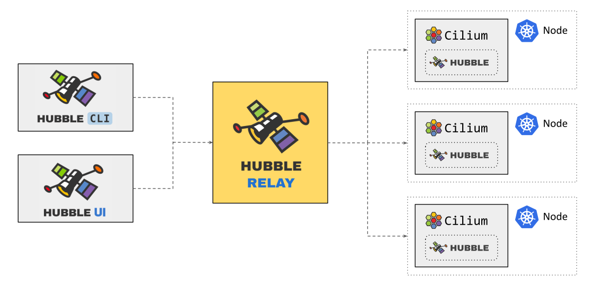
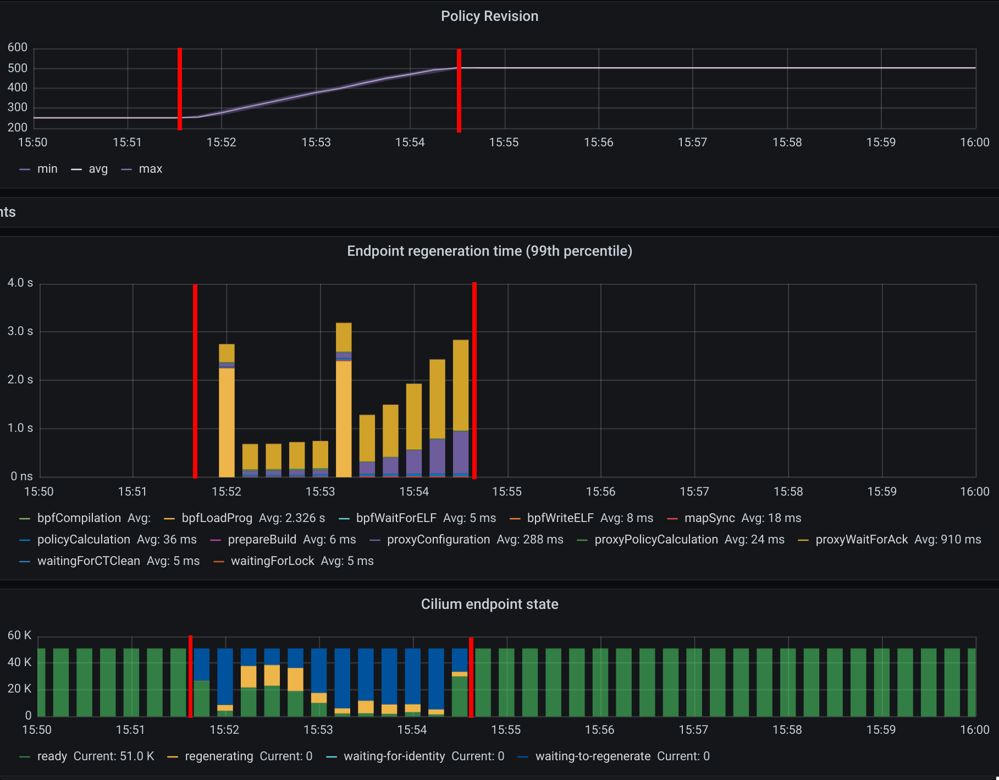
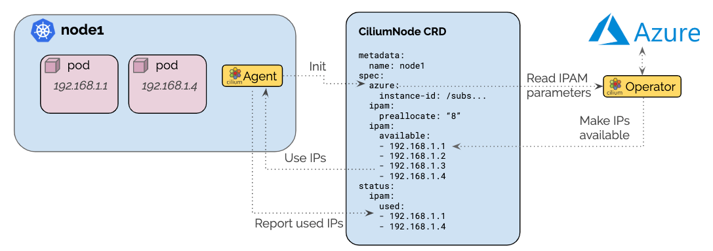

We are excited to announce the Cilium 1.8 release. A total of 2162 commits have
been contributed by a community of 182 developers, many of whom made their first
contributions this cycle. Cilium 1.8 brings with it a trove of exciting new
features:

- **XDP Load Balancing Support:** eXpress Data Path (XDP) is the fast-lane for
  networking in the Linux kernel, built on eBPF. We've extended our existing
  eBPF kube-proxy replacement to accelerate service forwarding by 5x in our
  tests while dramatically reducing CPU consumption at the same time.
  ([More details](#kubeproxy-removal))
- **Cluster-wide Flow API**: Hubble Relay builds on the solid core of Hubble
  and Cilium to provide deep observability across the entire cluster via a
  centralized API with minimal overhead.
  ([More details](#hubblerelay))
- **Better policy visibility and control:** ClusterwideNetworkPolicy now
  supports matching hosts in the cluster to implement
  [Host network security protection](#hostfw), and all policy types gain
  named ports support. New community
  contributors have built eBPF notifications for [Policy
  Verdicts](#policyverdicts) and a [Policy Audit mode](#auditmode) to
  incrementally deploy network policies in your cluster.
  ([More details](#policy))
- **Performance optimizations across the board:** We've improved the
  performance and resource usage in almost every dimension in this release,
  from [improving CRD scalability](#crdscale) and optimizing the Cilium agent's
  [memory footprint](#memory) to various performance enhancements in our eBPF
  data path and size reduction of the Cilium [container image](#container-size).
  Hubble has been optimized to minimize resource usage by
  [embedding the core functionality](#hubble-embedded) into the Cilium agent.
  ([More details](#performance))
- **Making more functionality iptables-free:** We've worked hard on improving
  Cilium's service implementations to further reduce the dependence on external
  tools based on iptables. Several features are now implemented natively in
  eBPF, ranging from [Session Affinity](#affinity) and [HostPort](#hostport) to
  [IP masquerade agent](#masq) and [IP fragmentation support](#ipfrag).
  ([More details](#iptables-free))
- **Many more features:** [Native Azure IPAM](#azureipam) provides better
  integration for Azure Cloud via a new IPAM plugin, datapath load balancing
  support was extended to support environments with
  [multiple native devices](#multi-dev), and initial support for
  [ARM64](#arm64) has been added with docker image snapshots.
  ([More details](#much-more))
- **Upstream community contributions:** For a deep dive on the work we're doing
  with the Linux kernel and LLVM development communities, including nitty-gritty
  details on [socket load balancing improvements](#socketlb), [eBPF instruction
  set improvements](#alu32) and [transparent proxying in eBPF](#tproxy), see
  our community contributions writeup.
  ([More details](#kernel))

## Are you using Cilium?

Consider listing your use case in the
[USERS.md](https://github.com/cilium/cilium/blob/master/USERS.md) file by
opening a [pull request](https://github.com/cilium/cilium/edit/master/USERS.md).
Sharing experiences and learning from other users is crucial in open-source. It
also helps us understand common features that our users depend on to align CI
and testing priorities.

## New Core Team members

Congratulations to the new core team members based on 1.8 contributions:

- Chris Tarazi, Ilya Dmitrichenko, Quentin Monnet, Paul Chaignon, Robin Hahling, Tobias Klauser (Isovalent)
- Weilong Cui, Yongkun Gui, Zang Li (Google)

## What is Cilium?

Cilium is open source software for transparently providing and securing the
network and API connectivity between application services deployed using Linux
container management platforms such as Kubernetes.

At the foundation of Cilium is a new Linux kernel technology called eBPF, which
enables the dynamic insertion of powerful security, visibility, and networking
control logic within Linux itself. eBPF is utilized to provide functionality
such as multi-cluster routing, load balancing to replace kube-proxy,
transparent encryption as well as network and service security. Besides
providing traditional network level security, the flexibility of eBPF enables
security with the context of application protocols and DNS requests/responses.
Cilium is tightly integrated with Envoy and provides an extension framework
based on Go. Because eBPF runs inside the Linux kernel, all Cilium
functionality can be applied without any changes to the application code or
container configuration.

See the section **[Introduction to Cilium](https://docs.cilium.io/en/v1.8/intro/)** for a more detailed general
introduction to Cilium.

<a name="kubeproxy-removal"></a>
<a name="kube-proxy-replacement-at-the-xdp-layer"></a>

## Kube-proxy replacement at the XDP layer

_Contributed by Daniel Borkmann (Isovalent)_


We first introduced Cilium's kube-proxy replacement in eBPF in Cilium's <a href="/blog/2019/08/20/cilium-16/#kubeproxy-removal">1.6</a> release and further improved it in <a href="/blog/2020/02/18/cilium-17#kubeproxy-removal">1.7</a> to run by default in new Cilium deployments. For the Cilium 1.8 release we took it to another extreme and now _accelerate_ our eBPF-based kube-proxy replacement handling for Kubernetes service types `NodePort`, `LoadBalancer` and services with `externalIPs`. eXpress Data Path (XDP) in the Linux kernel allows for significantly better performance while at the same time making more efficient use of CPU resources on the worker nodes.

The XDP layer, which we co-maintain and develop in the Linux kernel, is directly integrated into network drivers and supported by all major 10G, 40G or
faster NIC drivers in Linux, including most major cloud provided virtual NICs. The XDP layer operates at the _earliest_ possible point in software to process
packets coming right off the driver's receive queue with eBPF, which is what makes it so fast. For more details including performance benchmarks, see our
open access [publication] on XDP itself.

In order to understand where Cilium's XDP service acceleration fits into the bigger picture, below is a brief outline of Cilium 1.8's service load balancing
architecture:



As can be seen, the Cilium's kube-proxy replacement in eBPF consists at a high-level of
two main components: eBPF at the socket layer and eBPF at the driver layer.
East-West traffic, that is, service traffic between all Cilium-managed nodes,
is solely handled at the socket layer in the kernel - before any memory
allocations occur for packet metadata. Executing at this point allows Cilium to
eliminate per-packet costs for service translation. North-South traffic, that
is, all inbound service traffic from an external source to a Cilium-managed
node is handled as close as possible to the driver layer, operating on a single
interface for both ingress and egress. This allows forwarding to be handled
very fast, even dropping or reflecting traffic back out the inbound interface
before any expensive operations occur higher up the stack. The latter component
which is handling North-South traffic is then accelerated via XDP.

Cilium's service XDP acceleration currently supports direct-routing mode,
sharing the same core code as our tc eBPF implementation. Three options are
provided for redirecting traffic to remote backends after service translation
in XDP: DSR, SNAT and Hybrid.

- **DSR:** "Direct Server Return" (DSR) was introduced in <a href="/blog/2020/02/18/cilium-17#kubeproxy-removal">1.7</a> in the tc eBPF layer in order to remove an extra hop and therefore latency for reply traffic as well as for client source IP address preservation. In Cilium's DSR mode, we encode the service IP/port tuple as an IP option only once for TCP in SYN packets, or in every UDP packet.

- **SNAT:** The simplest mode which does not require any MTU adoption is that
  packets are SNAT'ed through our eBPF-based NAT engine on the node. This
  mode does not preserve the client source IP address, but is the most
  generic with regards to the underlying fabric, requiring no special
  knowledge or configuration.

- **Hybrid:** In Cilium 1.8 we have _newly_ added a Hybrid mode for eBPF
  service handling which is a middle-ground between plain SNAT and plain DSR.
  In the Hybrid mode, all TCP service traffic is subject to DSR and all UDP
  service traffic is subject to SNAT. This helps to avoid MTU changes and
  assumes that the main user workload operates on the TCP transport while
  slow(er)-path service traffic such as DNS operates on UDP. Hybrid mode can
  be configured in helm by setting `global.nodePort.mode=hybrid`.

**Why does it matter?**

We performed initial benchmarking where we've deployed a _single_ service onto a
freshly kubeadm-deployed node with a bleeding edge 5.7 kernel, ran with iptables- and
ipvs-based kube-proxy to get a baseline, and then plugged Cilium's kube-proxy replacement
in eBPF from tc and XDP side right in front of it:



Initial results show a dramatic increase in Cilium's kube-proxy replacement's XDP
acceleration being able to max out the packet generator and push all 10M incoming
requests to a remote service backend, whereas with kube-proxy the node under test is
only able to forward ~2.1M requests per second for that same service while the rest
gets dropped. The latter was similarly observed for ipvs which appears to have a
slightly higher per-packet cost despite having a better "first-packet" scalability for
large number of services compared to iptables. Plugging the kube-proxy replacement in
front with Cilium's tc eBPF implementation not only solves the "first-packet" scalability
but also increases the performance as can be seen with the observed ~3.6M requests per
second for that node, though that is still no comparison to the significantly better
gain when Cilium gets accelerated at the XDP layer:



Comparing flame-graphs for <a href="/2020-06-02-cilium-18-kube-proxy.svg">kube-proxy</a>
and <a href="/2020-06-02-cilium-18-xdp.svg">Cilium's XDP</a> implementation under 10M
requests per second also shows the shortcut when accelerating service handling right
off the driver's poll routine. Moreover, forwarding under the XDP acceleration takes
significantly less processing overhead in softirq context compared to both Cilium running
eBPF under tc as well as kube-proxy in iptables and ipvs mode. Below test is run on an
otherwise idle system where the node's CPU is only consumed by processing softirqs. The
available remaining CPU capacity is shown in the graph. What can be seen is that even
under rates as low as ~1M requests per second for that specific node the CPU only spends
about 13% of its time in softirq context with XDP, thus leaving a remainder of 87%
capacity to be used elsewhere while in the kube-proxy case the CPU spends at least 60%
of its time in servicing softirq context with only a free remainder of at most 40%. The
kube-proxy case gets significantly worse under ~2M or ~4M requests per second where there
is only between 1-2% free share while the CPU spends 98% of its time in softirq context
for packet processing:



In short, being able to accelerate Kubernetes service handling under XDP with Cilium
dramatically increases the performance to push packets to remote backends under
significantly less CPU overhead. This also increases the overall capacity of the cluster
under the default `externalTrafficPolicy: Cluster` for services. Meaning, scaling out
a service to more backends is only as good as the upper limit of a single node's forwarding
capacity to those backends. But even if there is no requirement to handle that many packets
for a given Kubernetes deployment, these CPU cycles can then be freed and spent on actual
user workloads instead.

**Enabling Cilium's kube-proxy replacement at the XDP layer**

The `global.nodePort.acceleration=native` setting can be configured in helm in
order to enable XDP-based acceleration for native XDP-supported devices in Cilium.
Further information including a list of native XDP supported drivers and instructions
for running on bare metal or on various cloud providers can be found in our <a href="https://docs.cilium.io/en/v1.8/gettingstarted/kubeproxy-free/#loadbalancer-nodeport-xdp-acceleration">
Kubernetes without kube-proxy</a> getting started guide.

<a name="hubblerelay"></a>

## Cluster-wide observability with Hubble Relay

_Contributed by Robin Hahling (Isovalent) and Michi Mutsuzaki (Isovalent)_

Hubble Relay is a new component introduced as technology preview with Cilium
1.8 which brings cluster-wide network observability for Kubernetes. Previously,
Hubble operated entirely on a per-node basis so gathering full cluster
visibility required tedious iteration across Hubble instances in the cluster to
gain visibility on the flows that route through each node in the cluster.
Hubble Relay bridges this gap by exposing the Hubble API for the scope of the
entire cluster and can be leveraged by Hubble CLI and UI components.



Hubble Relay runs as a deployment which requires little to no configuration as
it leverages Hubble to discover all Hubble peers within a cluster and connect
to their API endpoints. Running Hubble Relay as a deployment provides
flexibility in terms of scheduling and resource allocation. Furthermore, as it
is decoupled from Cilium, specific network policies can be applied.

A new <a href="https://docs.cilium.io/en/v1.8/gettingstarted/hubble">networking and security observability with Hubble</a> getting started guide has been added to our documentation. It provides a walkthrough of setting up a local multi-node Kubernetes cluster on Docker using <a href="https://kind.sigs.k8s.io/">kind</a> in order to demonstrate some of Hubble’s capabilities, including using Hubble Relay.

Our vision for Hubble Relay is to make it the entrypoint for cluster-wide
observability. Ultimately, once properly secured, it also becomes possible to
make the service accessible from outside the cluster. As such, it should not
only become the goto tool for operation teams who need to troubleshoot cluster
network issues but also for security teams who need observability for security
purposes.

In Cilium 1.8, Hubble Relay is required for Hubble UI.

<a name="policy"></a>

## Improved Policy visibility and control

<a name="hostfw"></a>

<a id="host-level-network-policies"></a>

### Host-level Network Policies

_Contributed by Paul Chaignon (Isovalent)_

Expanding upon the <a href="/blog/2020/02/18/cilium-17#cilium-cluster-wide-network-policies">
CiliumClusterwideNetworkPolicies</a> introduced in Cilium 1.7, this release
brings the same network policy constructs to defining policy to protect your
cluster nodes. The `CiliumClusterwideNetworkPolicies` gains a new optional
field `nodeSelector` to select nodes by their labels.

```yaml
apiVersion: 'cilium.io/v2'
kind: CiliumClusterwideNetworkPolicy
description: "Allow only kube-api, kube-dns, Cilium's API, and SSH."
metadata:
  name: 'host-policy-example'
spec:
  nodeSelector:
    matchLabels:
      role: worker
  ingress:
    - toPorts:
        - ports:
            - port: '6443'
              protocol: TCP
            - port: '22'
              protocol: TCP
```

As with pods, Cilium allows all traffic until you load a host policy, at which
point it switches to a default-deny behavior. For example, the host policy
above grants access to the host on ports 6443 and 22 only. Clients will still
be allowed to connect to the pods on this host, but connections to the host
itself will be filtered. Host network policies are in tech preview, for more
details and limitations see the
[Host Policy Documentation](https://docs.cilium.io/en/v1.8/policy/language/#hostpolicies).

<a name="policyverdicts"></a>

## Policy Verdict Notifications

_Contributed by Zang Li (Google), writeup by Joe Stringer (Isovalent)_

Cilium monitor notifications at the daemon level can be fairly chatty as they
have traditionally been based upon per-packet events that traffic was either
forwarded or dropped. Policy Verdict Notifications are a new form of
notification emitted by the eBPF datapath whenever a policy decision is made,
on a per-connection basis. Use `cilium monitor -t policy-verdict` to see the
verdicts:

```
# cilium monitor -t policy-verdict
...
Policy verdict log: flow 0x1fdbbff4 local EP ID 1121, remote ID 16307, dst port 80, proto 6, ingress true, action allow, match L3-L4, 10.29.210.187:42768 -> 10.29.50.40:80 tcp SYN
Policy verdict log: flow 0x3cc7e88f local EP ID 343, remote ID 11862, dst port 80, proto 6, ingress true, action deny, match none, 10.29.171.240:39126 -> 10.29.47.87:80 tcp SYN
```

<a name="auditmode"></a>

## Policy Audit Mode

_Contributed by Arthur Evstifeev (GitLab), writeup by Joe Stringer (Isovalent)_

One of the challenges for cluster operators deploying Kubernetes networking
plugins is how to go from zero network policy enforcement to full enforcement,
particularly when migrating large existing applications over to cloud-native
infrastructure. Kubernetes default-deny policies force the user to understand
the full picture of how their application uses the network and to encode all of
that knowledge into a Network Policy before enabling it in their cluster. Any
omissions from the policy can result in broken applications, requiring an
iterative process of attempting policy rollout, observing broken applications,
rolling back, updating the policy, and starting the process again.

Policy Audit mode allows the user to instead allow all traffic during the
policy transition period, logging all connections that would otherwise be
dropped by policy using [Policy Verdict Notifications](#policyverdicts).
Policy audit mode may be configured for the entire daemon using
`config.policyAuditMode=true`, and it supports all L3/L4 policy types. When this
mode is enabled, the action from the policy verdict log is reported as `action audit`. Using the policy verdict notifications, we can then form a policy to
match on the traffic and allow it. Using the same example as the policy
verdicts section above:

```
$ cat sw_l3_l4_policy.yaml
apiVersion: "cilium.io/v2"
kind: CiliumNetworkPolicy
description: "L3-L4 policy to restrict deathstar access to empire ships only"
metadata:
  name: "rule1"
spec:
  endpointSelector:
    matchLabels:
      org: empire
      class: deathstar
  ingress:
  - fromEndpoints:
    - matchLabels:
        org: empire
    toPorts:
    - ports:
      - port: "80"
        protocol: TCP
$ kubectl create -f sw_l3_l4_policy.yaml
ciliumnetworkpolicy.cilium.io/rule1 created
# kubectl -n kube-system exec -ti $(get_cilium_pod) cilium monitor -t policy-verdict
Policy verdict log: flow 0xabf3bda6 local EP ID 343, remote ID 2986, dst port 80, proto 6, ingress true, action allow, match L3-L4, 10.29.210.187:59824 -> 10.29.47.87:80 tcp SYN
```

Now that we inject a policy to match on the traffic, we can see that the action
is now to `allow` the traffic. For more details see the new <a href="https://docs.cilium.io/en/v1.8/gettingstarted/policy-creation">Policy Creation Getting Started Guide</a>.

<a name="performance"></a>

# Performance

<a name="crdscale"></a>

## Scale validation of the CRD-only mode

_Contributed by André Martins (Isovalent)_

In Cilium's <a href="/blog/2019/04/24/cilium-15#Scalability">1.5</a>
we announced support to 5k nodes and 100k pods though was only possible using an
external KVStore. In Cilium's <a href="/blog/2019/08/20/cilium-16#kvstore-free-operation-crd-storage">1.6</a>
we announced the initial support to run Cilium without required a KVStore using CRD from
Kubernetes.

As more of our users switched over to this CRD mode, we have made significant
improvements in Cilium to have the same scalability results achieved in 1.5.

In this release, we have created a detailed scalability report on Cilium
entirely running in CRD mode for a cluster running 1000 nodes and 50000 pods.
This report is part of the official documentation and can be found in <a href="https://docs.cilium.io/en/v1.8/concepts/scalability/report/">here</a>.



_Cilium endpoint regeneration time in the 99th percentile, i.e. time it took the
policy being enforced on the 10 slowest nodes out of 1000 nodes, for 50000 pods
with 250 CiliumClusterwideNetworkPolicies being sequentially created_

<a name="memory"></a>

## Memory Footprint Optimizations

_Contributed by Tobias Klauser (Isovalent)_

Optimization of Cilium's memory footprint has been a frequent user request. Among the biggest
contributors to Cilium's memory consumption are the eBPF maps. In this release we introduce a new
agent option to determine the size of several large eBPF maps dynamically based on the available node
memory. Moreover, the default sizes for certain large eBPF maps are now reduced and their memory
usage was optimized.

The following example will allocate 0.5% (`0.005`) of the total system memory available on the
node for the large eBPF maps (connection tracking, NAT, neighbor and load-balancing maps):

```
helm install cilium cilium \
    --namespace kube-system \
    --set config.bpfMapDynamicSizeRatio=0.005
```

In case a particular map should be made bigger or smaller, the dynamic sizing can be overridden by
specifying a fixed size. The following example will allocate the NAT eBPF map with a fixed size of
841429 entries while the remaining maps will use 0.3% of the system memory:

```
helm install cilium cilium \
    --namespace kube-system \
    --set config.bpfMapDynamicSizeRatio=0.003 \
    --set global.bpf.natMax=841429
```

On new installations, the ratio is set to 0.25% (`0.0025`) by default. This number was chosen such
that the map sizes approximately correspond to the Linux connection track table sizes used by
`kube-proxy`. More details can be found in the <a href="https://docs.cilium.io/en/v1.8/concepts/ebpf/maps/">eBPF maps section</a>
of the Cilium documentation.

In addition, various improvements were made to reduce the size of all the Cilium binaries and
container images. This directly results in a smaller RSS (Resident Set Size) of the Cilium processes at runtime and thus a smaller memory footprint. In addition, Cilium 1.8 is built using <a href="https://golang.org/doc/go1.14">Go release 1.14</a> which includes several improvements
resulting in both, reduced memory footprint and reduced binary size.

| Binary                    |  1.7  |  1.8  | Reduction |
| ------------------------- | :---: | :---: | :-------: |
| `cilium`                  | 47MB  | 47MB  |    0%     |
| `cilium-agent`            | 74MB  | 56MB  |   -24%    |
| `cilium-bugtool`          | 12MB  | 8.5MB |   -29%    |
| `cilium-cni`              | 47MB  | 14MB  |   -70%    |
| `cilium-docker`           | 23MB  | 16MB  |   -30%    |
| `cilium-health`           | 21MB  | 14MB  |   -33%    |
| `cilium-health-responder` | 7.4MB | 5.4MB |   -27%    |
| `cilium-operator`         | 75MB  | 58MB  |   -23%    |

<a name="container-size"></a>

## Cilium Container Image Optimizations

_Contributed by Daniel Borkmann (Isovalent)_

In Cilium 1.8, the container image has been reworked significantly in order to remove image
size overhead. Comparing the official Cilium docker images, the 1.8 image has been shrunk
by about 280MB compared to its previous major release:

```
# docker images
REPOSITORY          TAG                 IMAGE ID            CREATED             SIZE
cilium/cilium       v1.8.0              6856f0c0841b        About an hour ago   422MB
cilium/cilium       v1.7.5              7971361d1f2e        10 days ago         713MB
cilium/cilium       v1.6.9              f5f5dacc4ab0        2 weeks ago         740MB
cilium/cilium       v1.5.13             94447e683ae4        7 weeks ago         636MB
```

The base runtime image has been upgraded from Ubuntu 18.04 LTS to Ubuntu 20.04 LTS and additional
dependencies reduced to a bare minimum. More concretely, this means that we removed shipping a
generic compiler, linker, binutils, along with libc and system headers. In other words, there is
now an empty `/usr/include/` and Cilium's eBPF code has been reworked to be fully self-contained.
Overall this rework helped to shrink the size by roughly 300MB, after Hubble CLI integration
into the Cilium image in 1.8, we end up with a final 280MB of savings.

While in Cilium 1.7 and prior releases we relied on Ubuntu 18.04's Clang-7 and LLVM-7 compiler
for eBPF, Cilium 1.8 now ships with its own Clang-10 and LLVM-10 build along with additional
BPF code generation <a href="https://github.com/llvm/llvm-project/commit/13f6c81c5d9a7a34a684363bcaad8eb7c65356fd">optimizations</a>
that we have implemented and backported from latest upstream LLVM which we have been running in
production from Hubble side prior to that. The major LLVM update ensures better overall eBPF code
generation, while also allowing us to remove _all_ non-relevant backends from the `clang` and
`llc` binary. In other words, there is _no_ x86 LLVM backend anymore which would be able to
generate executable code. Instead, _only_ eBPF backends are available for generating Cilium's eBPF
object files that are loaded through our eBPF infrastructure into the kernel:

```
# docker run -it docker.io/cilium/cilium:v1.8.0 /bin/sh
# llc --version
LLVM (http://llvm.org/):
  LLVM version 10.0.0
  Optimized build.
  Default target: x86_64-unknown-linux-gnu
  Host CPU: haswell

  Registered Targets:
    bpf   - BPF (host endian)
    bpfeb - BPF (big endian)
    bpfel - BPF (little endian)
#
```

This is possible since we have also fully reworked our feature probing facilities which
test the underlying kernel for available eBPF verifier, program, map and helper capabilities. The
base tooling including LLVM which is integrated into the <a href="https://github.com/cilium/cilium/blob/master/contrib/packaging/docker/Dockerfile.runtime">cilium-runtime</a> image can be found <a href="https://github.com/cilium/image-tools">here</a>.

<a name="hubble-embedded"></a>

## Near-Zero Overhead Network Visibility with Hubble

_Contributed by Michi Mutsuzaki (Isovalent) and Robin Hahling (Isovalent)_

The development cycle of Cilium 1.7 coincided with a
[first preview release of Hubble](/blog/2019/11/19/announcing-hubble) {'-'}- an
observability platform for cloud native workloads leveraging Cilium and eBPF.
At the time, Hubble was a completely separate component which was typically
deployed alongside Cilium in order to pull information from Cilium's agent.
Hubble matured during the development cycle of Cilium 1.8 and the server part of
it was embedded in the Cilium agent. This change drastically reduces Hubble's
CPU and memory footprint by eliminating inter-process communication and cache
replication between Cilium and Hubble. This also allows the Hubble API endpoint
to be exposed directly from the Cilium DaemonSet rather than requiring an
additional resource to expose the core Hubble functionality.

In short, near-zero overhead network, service and security observability for
Kubernetes is now as easy as specifying some parameters while deploying Cilium.
See <a href="https://docs.cilium.io/en/v1.8/gettingstarted/hubble/">networking and security observability with Hubble</a> for more details on how to get started with Hubble.

<a name="iptables-free"></a>
<a name="voyaging-towards-iptables-free"></a>

## Voyaging towards iptables-free

<a name="affinity"></a>

### eBPF Session Affinity

_Contributed by Martynas Pumputis (Isovalent) and Daniel Borkmann (Isovalent)_

This release brings the implementation of Kubernetes services session affinity in
eBPF as part of Cilium's kube-proxy replacement. This allows each connection from
the same pod or host to _always_ select the same endpoint of a service which has
been configured with `sessionAffinity: ClientIP`. The default timeout for the affinity
is three hours, but can be configured through Kubernetes' `sessionAffinityConfig`
as needed. The session affinity feature is implemented for all traffic sources
as briefly outlined in the [kube-proxy replacement at the XDP
layer](#kubeproxy-removal) section. Session affinity is enabled by default for
Cilium's kube-proxy replacement on Linux kernels 4.19 or later, with an
improved implementation available on Linux 5.7 or later.

When a request is sent from outside the cluster to a service, the request's
source IP address is used for determining the endpoint affinity, and when a
request is sent from inside the cluster, a cookie is used to set the affinity.
This cookie is either fixed (earlier kernels) or based upon the network
namespace (5.7 or later, more details in [Kernel Improvements](#kernel)). For
the fixed implementation, all applications on the host select the same
service endpoint for a given service with session affinity configured.

<a name="hostport"></a>

## Native eBPF HostPort implementation

_Contributed by Daniel Borkmann (Isovalent)_

We have seen a fair number of users relying on Kubernetes `hostPort`, which is
the ability to bind and expose a Pod to a specific port on the host where the
Pod is running on.

```
apiVersion: apps/v1
kind: Deployment
metadata:
  name: my-nginx
spec:
  selector:
    matchLabels:
      run: my-nginx
  replicas: 1
  template:
    metadata:
      labels:
        run: my-nginx
    spec:
      containers:
     - name: my-nginx
        image: nginx
        ports:
        - containerPort: 80
          hostPort: 8080
```

In Cilium 1.7 and earlier, users had to deploy Cilium in chaining mode on top
of the `portmap` CNI plugin to support `hostPort`. This mode introduced
complexity in the form of more moving components, and didn't integrate as well
with Cilium's kube-proxy replacement in eBPF. In the Cilium 1.8 release, we
therefore implemented the service mapping for `hostPort` natively via eBPF as
part of our kube-proxy replacement. This allows users to simplify their CNI
configuration and replace the slow iptables-based implementation with the more
efficient native eBPF implementation in Cilium.

Further information about deploying Pods with Cilium's HostPort support can be found in
our <a href="https://docs.cilium.io/en/v1.8/gettingstarted/kubeproxy-free/#container-hostport-support">
Kubernetes without kube-proxy</a> getting started guide.

<a name="masq"></a>

## eBPF-based masquerading and ip-masq-agent

_Contributed by Martynas Pumputis (Isovalent)_

Cilium 1.8 enables a native eBPF-based masquerading for Cilium's default veth
datapath mode. The masquerading was
[first introduced in v1.5 for the IPVLAN datapath](/blog/2019/04/24/cilium-15/#bpf-based-masquerading-support),
and since then has been used by the NodePort eBPF implementation in the SNAT
mode.

The feature allows to replace iptables-based masquerading with more efficient
eBPF-based implementation. Also, it makes it possible to run a fully functioning
Kubernetes cluster with netfilter/iptables being completely disabled, which
brings improvements in performance, reliability and stability to the cluster.

By default, a subject to the eBPF-based masquerading is a packet sent from a
local pod to outside of the cluster. The latter can be controlled by
`nativeRoutingCIDR`: any IP address which does not belong to the cidr and a
any remote Cilium node IP address is considered as the outside destination.

To have more fine-grained control over the masquerading targets, we implemented
ip-masq-agent in eBPF. The latter can be configured via ConfigMap, i.e. in the
same way as the [Kubernetes ip-masq-agent](https://kubernetes.io/docs/tasks/administer-cluster/ip-masq-agent/).
Any packet sent to an IP address belonging to a CIDR from the ConfigMap will be
excluded from the masquerading.

Finally, if not specified, the eBPF masquerading program is attached to a
network device which is used in a default route. If it does not meet user
needs, the program can be attached to multiple specified by user devices. See <a href="https://docs.cilium.io/en/v1.8/concepts/networking/masquerading/#ebpf-based">eBPF-based masquerading</a> for more details.

<a name="ipfrag"></a>

## IP fragmentation support in eBPF

_Contributed by Quentin Monnet (Isovalent)_

Cilium is typically deployed in clusters today where iptables use is prevalent;
not all users have the freedom to go [kube-proxy free](https://docs.cilium.io/en/v1.8/gettingstarted/kubeproxy-free/). By
default when iptables is enabled in the kernel, it automatically performs
several duties, one of which is IP fragment reassembly. Applications using
protocols like UDP which have no in-protocol segmentation use this
functionality to transfer large messages over the network. However, as we've
looked at in a [prior blog post](/blog/2019/02/12/cilium-14/#sockmap-bpf-based-sidecar-acceleration-alpha),
automatically enabling iptables has an associated cost. For those looking to a
future without iptables, Cilium v1.8 pushes IPv4 fragmentation handling into
the eBPF datapath.

When a TCP or UDP datagram is fragmented, only the first logical fragment
contains the L4 header. The source and destination ports cannot be extracted
directly for the subsequent packets. This is a problem for processing at the
transport layer where port numbers - along with transport protocol and IP
source and destination addresses - are part of the 5-tuple used to perform
lookups in tables and make decisions. In Cilium, examples include the L4
load-balancing, or the application of L4 policy rules. Before version 1.8, IPv4
packets from a fragmented datagram would have to either be handled by iptables
rules in the kernel to be reassembled, or otherwise they would be dropped in
eBPF. But there is now a mechanism to track fragments and retrieve the port numbers.

The traditional way to have L4 processing with fragmentation is to reassemble
the datagram when it reaches an endpoint, and to disassemble again on the
egress path if necessary. This approach has several disadvantages: It is
demanding in resources as we need to store all fragment payloads until we can
reassemble, it is costly in computing time, and it leaves us vulnerable to the
wide range of attacks targeting IP fragments processing. Instead, we preferred
a lighter solution. When fragment support is enabled, we use a new eBPF table
to keep track of the datagram geometries. On encounter with the first logical fragment of
a datagram, a new entry is created in the table to associate the L4 port
numbers to the datagram's identifier. For the packets coming next, the ports
are easily retrieved with a lookup from that table. Although this approach may
fail if the first logical fragment is received out-of-order (the first packets
received in time have no corresponding entry in the map, they are dropped,
causing the whole datagram to be lost), it is efficient and secure. Reassembly
of the datagram is left to the Linux stack of the destination container, which
does a good job at it. If the datagram is dropped by the network policy, then
reassembly is skipped altogether.

See the [IP Fragmentation documentation] for more details. Go ahead and play
with fragments, you're allowed to break things (datagrams) now!

<a name="much-more"></a>

# ...And much more

<a name="azureipam"></a>

## Azure IPAM mode

_Contributed by Thomas Graf (Isovalent) and Vlad Ungureanu (Palantir)_

Cilium has supported AWS ENI addressing natively for a couple of releases. This
release adds an equivalent IPAM mode for Microsoft Azure Cloud, allowing Cilium
to utilize [Azure Private IP
Addresses](https://docs.microsoft.com/en-us/azure/virtual-network/private-ip-addresses)
for Pod IPs.



The architecture ensures that only a single operator communicates with the
Azure APIs to avoid rate-limiting issues in large clusters. A pre-allocation
watermark allows to maintain a number of IP addresses to be available for use
on nodes at all time without requiring to contact the Azure APIs when a new pod
is scheduled in the cluster.

With this feature, Cilium becomes able to run on Azure Cloud in native routing
mode without requiring to chain on top of another CNI plugin and thus gives
full flexibility over the choice of model:

- **Encapsulation:** Utilizes an overlay network (encapsulation) to route all
  pod to pod to traffic. Allows for any number of IPs to be utilized in the
  cluster and per node.
- **Native routing:** Utilizes the Azure Cloud networking fabric with Azure
  private IP addresses. Is subject to Azure addressing limits but avoids
  encapsulation.

See the [Azure Cloud Getting Started Guide](https://docs.cilium.io/en/v1.8/gettingstarted/k8s-install-azure/) for more details.

Special thanks to our friends at Datadog and Palantir for helping to contribute this feature.

<a name="multi-dev"></a>

## Multi-device support for eBPF load balancing & services

_Contributed by Martynas Pumputis (Isovalent)_

Until this release, eBPF NodePort program could have been attached to a single
external facing network device. This meant that a request from outside the cluster
to a `NodePort`, `LoadBalancer` service or a service's `externalIP` was handled
only by that particular device. This was limiting for setups with multiple
external devices (the limitation did not apply for requests to the service
originating from inside the cluster).

Cilium 1.8 brings a support for attaching eBPF NodePort to multiple devices.
Each device can be specified via the helm option `global.devices`, e.g.
`global.devices={eth0,eth1,eth2}`. If no device is specified, cilium-agent will
try to attach the program to a device with a default route and a device which
has Kubernetes `InternalIP` or `ExternalIP` set. See <a href="https://docs.cilium.io/en/v1.8/gettingstarted/kubeproxy-free #nodeport-devices-port-and-bind-settings">Kubernetes without kube-proxy</a> for more details.

<a name="arm64"></a>

## ARM64 support

_Contributed by Tina Tsou (Arm), Jianlin Lv (Arm) and Ilya Dmitrichenko (Isovalent)_

In the Arm ecosystem, Cilium is an indispensable part of container networking,
so we're excited to start the journey of Cilium Arm64 support in Cilium v1.8.
We fixed compilation and runtime issues on Arm64 platform and added new jobs in
Travis CI to run on Arm64 platform. Additionally, the Dockerfile now supports
building images on the Arm64 platform, and the Cilium team has initiated work
to build images that support multi-CPU architecture; they will be available
soon as regular image snapshots. In this process, the Cilium team have given a
great help, support and inspiration. Some basic features have been verified on
the Arm64 platform, but we still have more work waiting to be completed.

We hope that this is a good start to promote Cilium to a more diverse set of
platforms and production environments.

<a name="kernel"></a>

## Upstream Linux kernel contributions

_Contributed by Daniel Borkmann (Isovalent), John Fastabend (Isovalent) and Joe Stringer (Isovalent)_

During the Cilium 1.8 development window, we've also worked on a number of improvements to the Linux
kernel's eBPF subsystem which we co-maintain. The selected changes highlighted below are generic for
all eBPF users, but have been implemented mainly in the context of Cilium's and Hubble's eBPF needs.
Most of our bleeding edge kernel changes are already used in Cilium 1.8 while few others are preparatory
work for Cilium's 1.9 development window.

<a name="socketlb"></a>

### Socket layer load balancer improvements

As shortly outlined in the [kube-proxy replacement at the XDP layer](#kubeproxy-removal) section,
one of the two main components of Cilium's eBPF kube-proxy replacement architecture is to attach
eBPF programs at the socket layer.
Each Kubernetes service type processed there has different requirements, and several of them
require the ability to differentiate between network namespaces out of those hooks. To mention
one, in case of NodePort services, accessing the service through the loopback address needs to
be translated for requests out of the _host_ namespace, while it should not be translated for
application Pods.
The [session affinity](#affinity) is yet another case of missing network namespace awareness: we do not
yet have a source IP address given a socket buffer (skbuff) has not been created at this layer, but
we could use information about the originating network namespace instead. To solve this awareness
issue, we've implemented network namespace cookies accessible via `bpf_get_netns_cookie()` eBPF helper.
The idea was adapted from socket cookies, which efficiently generates a globally unique, non-overflowing
identifier which is globally unique even beyond the lifetime of a socket pointer and can therefore be
used as part of a key in eBPF LRU maps where it can be guaranteed that stale entries are never being
reused accidentally through pointer reuse for the same object type from the kernel's allocator.

Another remaining limitation of the eBPF hooks in the socket layer that we have addressed both for the
kernel and for the Cilium 1.8 release were missing attachment types for `getpeername(2)` and `getsockname(2)`.
As discussed during this year's <a href="https://docs.google.com/presentation/d/1w2zlpGWV7JUhHYd37El_AUZzyUNSvDfktrF5MJ5G8Bs/edit#slide=id.g746fc02b5b_3_185">bpfconf</a>,
we have seen a few rare occasions where applications were bailing out given their peer's address returned
from `getpeername(2)` did not match the service address the application originally connected to. This is because
the application's connection was performed on the service IP/port tuple but the `getpeername(2)` call returned
the IP/port tuple after it had been rewritten by Cilium for service translation. With the help of the new hooks,
Cilium now reverse translates the `struct sockaddr` on `getpeername(2)` calls in order to always return the
initial IP/port tuple used by the application.

Last but not least, we have equipped the eBPF hooks in the socket layer with the ability to export custom
audit and tracing information to user space through the perf event ring buffer and to enable <a href="/blog/2020/02/18/cilium-17#safe-and-multi-architecture-supported-ebpf-probe-helpers-for-tracing">memory probing without faulting</a> from the tracing side. In
particular while the latter is a small change to the kernel, it comes with a paradigm-shift for networking
in specifically since the boundary between the networking and tracing landscape becomes blurry - this
essentially enables the set of `bpf_probe_read_user()`, `bpf_probe_read_kernel()`, `bpf_probe_read_user_str()`
and `bpf_probe_read_kernel_str()` eBPF helpers to the kernel that we have added recently for strict access
under either `USER_DS` or `KERNEL_DS` and allows to enrich load balancing, policy or tracing context
based on data that can be gathered from the `current` task natively out of eBPF socket programs.

See the merged patch sets for further information: <a href="https://lore.kernel.org/bpf/cover.1585323121.git.daniel@iogearbox.net/">here</a>, <a href="https://lore.kernel.org/bpf/cover.1589841594.git.daniel@iogearbox.net/">here</a> and <a href="https://lore.kernel.org/bpf/159033879471.12355.1236562159278890735.stgit@john-Precision-5820-Tower/">here</a>

<a name="alu32"></a>

### Verifier ALU32 signed and unsigned min/max bounds tracking

Clang 10 was recently <a href="https://releases.llvm.org/10.0.0/tools/clang/docs/ReleaseNotes.html">released</a>.
Among the numerous fixes and features, eBPF ALU32 support was enabled by
default <a href="https://reviews.llvm.org/D69957">here</a>. This improves code generation
to reduce instructions needed for some operations and in some cases improves visible performance. However,
as we enabled this we observed a missing piece. Namely, the kernel verifier did not fully
track ALU32 operations. This would result in code that appeared valid when
inspected at the C language level, but would still generate verifier errors when loading
the program into the kernel.

At a high level the verifier needs to ensure access into map values, the stack, and
other operations are safe. Safe is context dependent, but for instance
a map value can only be read or written up to its defined size and any access past
the end of the allocated size needs to throw an error. When we write into the stack
we need to ensure that the write is not past the end of the stack and so on. One of
the ways the verifier ensures this is by tracking the minimum and maximum values of
any scalars (variables in C code) it comes across. However, the verifier only tracked bounds over the
64-bit register. This resulted in conservative estimates that when 32-bit registers
were being used could result in the verifier over-estimating the range of possible values. For example,
C code may result in over-estimates when mixing 'int' types which are 32-bits
and other types, such as the 64-bit C type 'uint64_t'. Numerous workarounds for
this problem involved using casts, avoiding int types altogether and preventing compiler optimizations
by placing compiler barriers in the C code. All of this works, but is unnatural
from the C programmer's point of view.

To resolve this and allow for more natural C code with fewer verifier errors in
otherwise safe code we improved the eBPF LLVM backend and Linux kernel eBPF
verifier. First, we improved the Linux verifier by tracking 32-bit minimum
and maximum bounds in addition to the already existing 64-bit bounds. By
doing this we accurately track the bounds of a register and avoid the over
estimates mentioned earlier. Next, we added additional improvements on the bounds
by noting eBPF 32-bit operations zero-extend by definition. That is, a 32-bit move
operation will zero the upper 32-bits of the destination register. This allows us
to implement a set of improvements to track zero extension fully. At that point
the verifier was able to track most ALU32 enabled code we loaded.
But, we noticed the eBPF LLVM backend still generated a few extra instructions
to zero extend registers unnecessarily because eBPF JITs and the eBPF emulator
all enforce zero extension. So to complete this work,
we updated the eBPF LLVM backend code generation to omit these zero extensions
when possible.

The end result is eBPF ALU32 support is now working correctly for the vast
amount of C code we have seen and additionally generating better code that
is smaller and more efficient.

See the merged patch sets for further information: <a href="https://lore.kernel.org/bpf/158560409224.10843.3588655801186916301.stgit@john-Precision-5820-Tower/">here</a> and <a href="https://github.com/llvm/llvm-project/commit/13f6c81c5d9a7a34a684363bcaad8eb7c65356fd">here</a>.

<a name="tproxy"></a>
<a name="ebpf-based-tproxy-replacement"></a>

### eBPF-based TPROXY replacement

Cilium's L7 proxy implementations make use of a feature called Transparent Proxy
(TPROXY) in the Linux kernel to [help manage the datapath at scale](https://linuxplumbersconf.org/event/4/contributions/464/).
TPROXY allows each proxy implementation to open just one socket to handle
traffic across multiple sessions, which simplifies configuration & traffic
redirection for L7 connection termination. While this has several benefits
on the userspace co-ordination side, it can involve some complex co-ordination
between multiple subsystems in Linux to correctly configure.
During this cycle, we extended the Linux eBPF API to support TPROXY directly
from eBPF programs which paves the way for Cilium to further simplify the
configuration & debugging of proxy redirection from eBPF by configuring more
of the datapath functionality through a single kernel API.

See the merged patch sets for further information: <a href="https://lore.kernel.org/bpf/20200329225342.16317-1-joe@wand.net.nz/">here</a>

<a name="18Highlights"></a>

## 1.8 Release Highlights

- **Hubble**
  - New hubble-relay agent for multinode support
  - Architecture work to integrate flow handling functionality in Cilium
  - Helm charts for hubble UI, CLI and Relay components
- **Scalability and Resource consumption**
  - CRD mode scale optimizations
  - Native Azure IPAM support
  - Optimize footprint using Go 1.14
  - Smaller container images
- **Policy**
  - Host-level network security protection
  - Policy verdict notifications
  - Policy audit mode for incremental policy deployment
- **Kubernetes**
  - Support for named ports
  - Implemented ip-masq-agent via eBPF
  - [Multi-CIDR KEP](https://github.com/kubernetes/enhancements/pull/808)
  - Validated with Kubernetes 1.18
  - Better CRD validation for Cilium resources
- **Datapath**
  - Nodeports in XDP
  - Support for sessionAffinity in eBPF
  - Support for hostPort in eBPF
  - IP fragment tracking support for LB and policy
  - IP masquerade in eBPF
  - Expose services through multiple devices
  - Better eBPF code generation with Clang/LLVM 10
  - Fix host reachable services with applications that use `getpeername()`
  - Various performance-related improvements
- **Upstream kernel changes**
  - Better network namespace detection
  - Improved peer name substutition handling with socket LB
  - eBPF helpers for transparent proxying
- **Istio**
  - Support for 1.5.6
- **CLI**
  - New `cilium ip list` command for ip {'<->'} identity introspection
- **Continuous Integration / Testing**
  - This release marks the start of major CI improvements effort (aka CI Force)
  - Many reliability improvements were made to current integration tests
  - Multiple GitHub Actions jobs had been added, including new smoke tests
  - Integration test coverage had been generally extended
  - New tests added for Hubble
  - Flaky tests moved to quarantine pipeline
- **Documentation**
  - Switched the default GKE guide instructions to use direct-routing
  - New guides for k3s and kind for sandbox testing

See the [Changelog](https://github.com/cilium/cilium/blob/v1.8/CHANGELOG.md)
for full notes on changes during the Cilium 1.8 development cycle.

<a id="getting-started"></a>

## Getting Started

New to Cilium? Follow one of the [Getting Started Guides](https://docs.cilium.io/en/v1.8/gettingstarted/).

<a id="upgrade-instructions"></a>

## Upgrade Instructions

As usual, follow the [upgrade guide](https://cilium.readthedocs.io/en/v1.8/install/upgrade/#upgrading-minor-versions)
to upgrade your Cilium deployment. Feel free to ping us on [Slack].

<a id="release"></a>

## Release

- Release Notes & Binaries: [1.8.0](https://github.com/cilium/cilium/releases/tag/v1.8.0)
- Container image: `docker.io/cilium/cilium:v1.8.0`

[slack]: https://slack.cilium.io
[publication]: https://dl.acm.org/doi/10.1145/3281411.3281443
[ip fragmentation documentation]: https://docs.cilium.io/en/v1.8/concepts/networking/fragmentation
