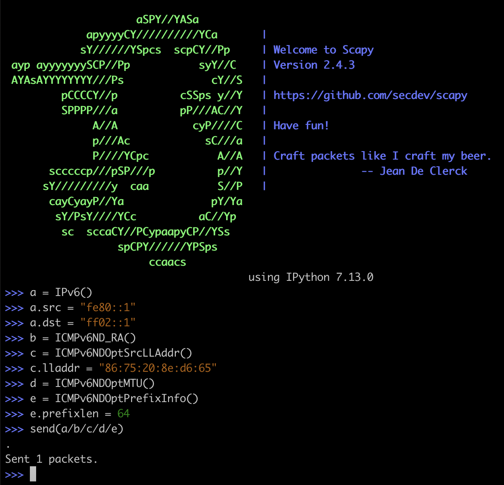

_Contributed by Jed Salazar, Senior Solutions Architect, Isovalent_

Recently a [vulnerability](https://nvd.nist.gov/vuln/detail/CVE-2020-10749) was discovered by [Etienne Champetier](https://github.com/champtar) that impacted several Kubernetes CNIs. The vulnerability worked by having an attacker pod send rogue IPv6 “Router Advertisement” packets to the host worker node, causing the node to route its IPv6 traffic through the attackers pod (commonly known as “Man-In-The-Middle”). Fortunately for users of Cilium, this vulnerability didn’t impact their environments because of several built-in and on-by-default security features provided by Cilium.

In this blog post, we’ll discuss how on-by-default Cilium features automatically protect against these common types of network attacks.

Before we dive into why Cilium users are protected, let’s first discuss the basics of IPv4 and IPv6, and how it relates to the vulnerability.

## IPv4 and IPv6 Basics

In IPv4, when a machine attaches to a network it can learn about its network configuration (including router details) via DHCP. The machine sends a broadcast packet called `DHCPDISCOVER` to all users on the network and if everyone is playing nicely, only the DHCP server sends back a `DHCPOFFER`. Unfortunately, any device on the network can be configured to listen for discover packets and can send an offer, which means a race condition (who can send the offer packet first) determines which DHCP server the client trusts. Because this mechanism offers no authentication or security, users must rely on a _trusted network_ model where they trust every device on the network.

Similar to DHCP, in IPv6 a host on the network can learn about its router or other neighbors via a mechanism called _Neighbor Discovery Protocol_ (NDP). A machine can send a _Router Solicitation_ packet to local peers looking for its local router on the network, or a router can preemptively send a _Router Advertisement_ to all hosts attached to a local link, indicating it’s the device to route IPv6 traffic through. This Router Advertisement is sent to a special IPv6 address analogous to broadcast called _All Nodes_ (`ff02::1`) so everyone on the same network link receives and trusts the advertisement. There have been some notable improvements in IPv6 that mitigate the broad trust applied to IPv4 DHCP, in particular the use of link-local addresses ensures that Router Advertisements are never routed across links and are only visible to point-to-point links and directly-connected peers.

However, this assumption of trust in link-local adjacency breaks down in Kubernetes, as pods attach to the host worker node's network space via a point-to-point link. Therefore, in this context, IPv6 operates on the same _trusted network_ model where devices trust other devices on the link-local network.

## The Vulnerability

Based on what we know about IPv6 Router Advertisements, the vulnerability is described as follows.

> By sending “rogue” router advertisements, a malicious container can reconfigure the host to redirect part or all of the IPv6 traffic of the host to the attacker-controlled container.

It’s important to distinguish the fact that this isn’t a Kubernetes vulnerability, Kubernetes simply relies on the same IPv6 standards and trusted network model discussed above.

The “rogue” aspect of the vulnerability references the fact that the attacker pod spoofs its source IP address. Neighbor Discovery uses _link-local_ addresses (`fe80::/10`) to send traffic, including Router Advertisements. Link-local addresses are not routed to other links and are used for local communication, therefore they do not require a unique IP address. All enabled IPv6 interfaces have a link-local address.

This means that any interface that _supports_ IPv6 will have a `fe80` address. You can verify this with `ip addr show|grep fe80` even on a network interface not running IPv6 (note the `scope link` which means link-local). This means that the attacker pod uses its link-local address as the source IP for the Router Advertisement.

How can the attacker pod spoof its IP address? In Kubernetes, workloads run with a set of _Linux Capabilities_ that define what permissions a process/thread is capable of. This eliminates the need for processes to have root which gives overly broad permissions. One of the permissions granted to pods by default in Kubernetes is the `CAP_NET_RAW` capability, which means a pod can send “raw” packets which includes permissions to set an arbitrary source IP addresses, ports, and so on. You can see if your pod has these capabilities with `kubectl exec`.

```
kubectl exec -it ubuntu-pod -- capsh --print |grep cap_net_raw
```

The vulnerability is exploited by the attacker pod spoofing the link-local source IP, and sending Router Advertisements to the node, causing the node to trust the attacker pod as its router and sending some or all of its IPv6 traffic directly to the attacker pod.

## How Cilium Protects Users


Cilium has several built-in and on-by-default security features that offer protection against this vulnerability.

In these examples, we’ll use `scapy` from a Cilium-managed pod to craft and send arbitrary packets to the All Nodes address. [Scapy](https://scapy.net/) is an excellent tool for testing and since our pod has `CAP_NET_RAW` Linux capabilities, we can create and send any packets we like.


We’ll test on Kubernetes 18 using Cilium 1.8.

```
kubectl get nodes -o wide
NAME     STATUS     ROLES    AGE     VERSION        INTERNAL-IP      EXTERNAL-IP      OS-IMAGE       KERNEL-VERSION     CONTAINER-RUNTIME
master   Ready   master   3m58s   v1.18.3+k3s1   192.168.80.10    192.168.80.10    Ubuntu 19.10   5.3.0-51-generic   containerd://1.3.3-k3s2
agent1   Ready   <none>   2m4s    v1.18.3+k3s1   192.168.80.101   192.168.80.101   Ubuntu 19.10   5.3.0-51-generic   containerd://1.3.3-k3s2

kubectl exec -tin kube-system cilium-88vk8 -- cilium version
Client: 1.8.0-rc2 ce5852475 2020-05-29T21:53:07+02:00 go version go1.14.3 linux/amd64
Daemon: 1.8.0-rc2 ce5852475 2020-05-29T21:53:07+02:00 go version go1.14.3 linux/amd64
```

### Layer 3 Protection

Even though all enabled IPv6 interfaces have a link-local address, IPv6 must explicitly be enabled on in Cilium, otherwise IPv6 traffic is automatically dropped. We can observe this by deploying Cilium with `enable-ipv6: "false"` and verify that traffic is dropped with `cilium monitor -t drop` from a Cilium Agent pod.

First, let’s deploy a standard Ubuntu container and create the packet with `scapy`.

```
kubectl exec -it ubuntu -- /bin/bash
root@ubuntu:/# apt-get update && apt-get install scapy -y
```

Start scapy and determine the IP settings.

```
scapy3
>>> import subprocess
>>> subprocess.run(["ip", "addr", "show"])
```

Recall that even though we disabled IPv6, because the interface is enabled, it will configure a `fe80` link-local address. This creates the vulnerability where the attacker pod can send Router Advertisements using the auto-assigned `fe80` link-local address. We can verify that the link-local address has been configured on the interface by inspecting the `ip addr show` output.

```
inet6 fe80::68a6:e6ff:fe36:487e/64 scope link
```

Using `scapy` to craft the packet, we could use any IPv6 link-local address, but the principle is the same whether it's the link-local address seen above or not. We will use (`fe80::1`) here as the source IP for ease of readability and set the destination IP as the All Nodes address (`ff02::1`).



We’re almost ready to send the packet, but before we do, let’s `exec` into our Cilium pod on the node and observe the traffic drops with `cilium monitor -t drop` to make sure Cilium drops the unsupported IPv6 traffic.

```
kubectl exec -tin kube-system cilium-88vk8 -- /bin/bash
root@agent1:/home/cilium# cilium monitor -t drop
```

Let’s send the packet in scapy and inspect the drops in `cilium monitor`.

```
send(a/b/c/d/e)
Sent 1 packets.
```

Sure enough, Cilium drops the unsupported IPv6 traffic.

```
xx drop (Unsupported L3 protocol) flow 0x0 to endpoint 0, identity 28896->0: fe80::1 -> ff02::1 RouterAdvertisement
```

### IP Spoof Prevention

So Cilium protects against IPv6 traffic if we explicitly disable it, but what about spoofed packets? Cilium provides protection against spoofed IP addresses by dropping packets that have a source IP address that wasn’t provided via IP Address Management (IPAM).

Let’s verify this by redeploying Cilium with `enable-ipv6: "true"` and use the same scapy packet to send the packet with the spoofed link-local address. We can again, monitor for drops in `cilium monitor -t drop`.

```
a.src = “fe80::1”
send(a/b/c/d/e)
Sent 1 packets
```

```
xx drop (Invalid source ip) flow 0x0 to endpoint 0, identity 15625->0: fe80::1 -> ff02::1 RouterAdvertisement
```

Here we can see that since the source IP wasn’t provided by Cilium’s IPAM subsystem, we know it’s a spoofed IP address and Cilium automatically blocks the traffic. Built-in Layer 3 Protection and IP Spoof Prevention are just some of the ways that Cilium automatically protects against common network attacks.

## Wrapping Up

Cilium takes security seriously. Security teams can be sure that Cilium provides critical, built-in, and on-by-default protections to secure their Kubernetes environments. Additionally, these teams can take advantage of the powerful security observability data provided by [Hubble](https://cilium.io/blog/2019/11/19/announcing-hubble/) to get full insights into the network activity in their environment.

## Further Reading

For further information on Linux capabilities and container security, we recommend reading [O’Reilly Container Security](https://www.oreilly.com/library/view/container-security/9781492056690/).
