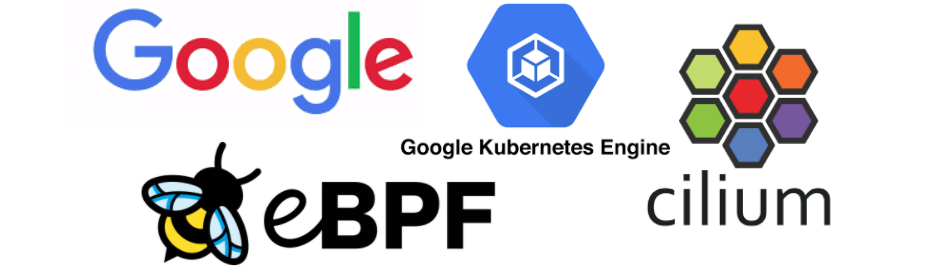

Today marks an exciting day for the Cilium community and all Cilium
contributors, Google just announced that Cilium has been selected and made
available as the new datapath for GKE and Anthos:

> Today, we’re introducing GKE Dataplane V2, an opinionated dataplane that
> harnesses the power of eBPF and Cilium, an open source project that makes the
> Linux kernel Kubernetes-aware using eBPF.

You can read all the details in the official
[announcement](https://cloud.google.com/blog/products/containers-kubernetes/bringing-ebpf-and-cilium-to-google-kubernetes-engine).
In this post, we will take a look behind the scenes that lead up to this.

# How it all started

As it often does, large adventures start with a small innocent
Git [commit](https://github.com/cilium/cilium/commit/ba85129ea4558ae03eca07f07e88bf169f2c9307).
Late last year, the following commit from a Google engineer popped up out of the
blue and was merged shortly after:

```
commit ba85129ea4558ae03eca07f07e88bf169f2c9307
Author: Valas Valancius <valas@google.com>
Date:   Sun Dec 15 14:13:21 2019 -0800

    test: Add conntrack entry timeout validation tests.

    Partially fixes #9303.

    Signed-off-by: Valas Valancius <valas@google.com>
```

Pretty innocent, right? Shortly after, more and more Google engineers started
contributing, including major new features such as [Aggregated policy verdict
visibility](https://github.com/cilium/cilium/pull/9943). A feature that
provides visibility into the network policy decision making process at
extremely low overhead while still providing all the required context and
details. This later became the foundation for GKE's [Kubernetes Network Policy
Logging](https://cloud.google.com/kubernetes-engine/docs/how-to/network-policy-logging) feature.

```
commit e831859b5cc336c6d964a6d35bbd34d1840e21b9
Author: Zang Li <zangli@google.com>
Date:   Wed Jan 22 23:16:36 2020 +0000

    Add a new event type for policy action logging

    Signed-off-by: Zang Li <zangli@google.com>
```

Collaboration and bug fixing efforts between the teams intensified and resulted
in several new features being contributed such as auto-detection of
EndpointSlices support, ability to join IPv6 NDP multicast groups and support
for IPv6 neighbor discovery for pod IPs, Geneve encapsulation bugfixes, and
optimizations to the socket cookie-based load-balancing.

At the same time, a major effort was made to test the conformance, stability,
and reliability of Cilium on GKE and Anthos. All of this lead to today’s
announcement and the availability of Cilium as the new eBPF networking data
plane for GKE.

# Why Cilium on GKE?

What is behind this decision? In today’s announcement, Google provides some
context on this decision:

> As more and more enterprises adopt Kubernetes, the gamut of use cases is
> widening with new requirements around multi-cloud, security, visibility and
> scalability. In addition, new technologies such as service mesh and
> serverless demand more customization from the underlying Kubernetes layer.
> These new requirements all have something in common: they need a more
> programmable dataplane that can perform Kubernetes-aware packet manipulations
> without sacrificing performance.
>
> Enter Extended Berkeley Packet Filter (eBPF), a new Linux networking paradigm
> that exposes programmable hooks to the network stack inside the Linux kernel.
> The ability to enrich the kernel with user-space information—without jumping
> back and forth between user and kernel spaces—enables context-aware
> operations on network packets at high speeds.

Google clearly has incredible technical chops and could have just built their
dataplane directly on eBPF, instead, the GKE team has decided to leverage
Cilium and contribute back. This is of course a huge honor for everybody who
has contributed to Cilium over the years and shows Google's commitment to open
collaboration.

> The Cilium community has put in a tremendous amount of effort to bootstrap
> the Cilium project, which is the most mature eBPF implementation for
> Kubernetes out there. We at Google actively contribute to the Cilium project,
> so that the entire Kubernetes community can leverage the advances we are
> making with eBPF.

And there is more, Google is not planning to stop there, there will be more
exciting things being built with eBPF and Cilium:

> eBPF’s ability to augment network packets with custom metadata enables a long
> list of possible use cases. We are as excited about the future of Kubernetes
> and eBPF as you are, so stay tuned for more innovations.

# What is eBPF?

How does this magic eBPF technology work exactly? We can't go into all of the
details of eBPF in this post but the following is extracted from
[ebpf.io](https://ebpf.io) which is a good source to learn everything about
eBPF:

> eBPF is a revolutionary technology that can run sandboxed programs in the
> Linux kernel without changing kernel source code or loading kernel modules.
> By making the Linux kernel programmable, infrastructure software can leverage
> existing layers, making them more intelligent and feature-rich without
> continuing to add additional layers of complexity to the system.


# What is Cilium?

For those hearing about Cilium for the first time:
Cilium is an open source project that has been designed on top of eBPF to
address the new scalability, security, and visibility requirements of
container workloads. Cilium goes beyond a traditional [Container Networking
Interface
(CNI)](https://kubernetes.io/docs/concepts/extend-kubernetes/compute-storage-net/network-plugins/#cni)
to provide service resolution, network policy enforcement, extensive visibility
and much more.


Overview of what Cilium brings to Kubernetes using eBPF:

- **Networking**

  - eBPF-based in-kernel networking datapath featuring IPv4 and IPv6 with the
    ability to support both direct-routing and encapsulation/overlay
    topologies. Highly scalable kube-proxy replacement with direct server
    return (DSR), session affinity, XDP-based acceleration for services of type
    LoadBalancer, NodePort and services with externalIPs, as well as
    socket-level load-balancing for all service types. Multi-cluster
    routing capabilities with service load-balancing across clusters.

- **Security**

  - Identity-based network policy implementation that decouples security
    enforcement from IP addresses for increased scalability and compatibility
    with service mesh identity concepts. FQDN/DNS-based policy support to
    secure access to external services. Network policy logging to improve the
    troubleshooting experience. Ability to transparently inject Envoy for
    L7-aware policies and policy-driven SSL termination.

- **Observability**

  - Programmable flow logging capabilities for visibility into security verdicts,
    networking forwarding decisions, and to understand service topologies and
    connectivity patterns. Programmable metrics system to monitor traffic
    patterns, security status, and error conditions.

# Try it Out

You can get started running Cilium as the GKE dataplane using the GKE rapid channel:

```bash
gcloud beta container clusters create <cluster name> \
    --enable-dataplane-v2 --release-channel rapid \
    --cluster-version 1.17.9-gke.600 --zone <zone name>
```

If you don't want to use the rapid channel, the existing [GKE installation
instructions](https://docs.cilium.io/en/stable/gettingstarted/k8s-install-gke/)
will of course still work.

# What is next?

Working together with Google's GKE team has been incredibly exciting and
rewarding. Having Google as a main contributor to the project will yield many
exciting new features that will benefit the entire community. We couldn't be
more excited about the future ahead of Cilium and eBPF.

If you want to learn more about Cilium and eBPF, check out:

- [Cilium Overview](https://cilium.io/)
- [Cilium GitHub](https://github.com/cilium/cilium)
- [What is eBPF?](https://ebpf.io/)
- [GKE Dataplane V2 announcement](https://cloud.google.com/blog/products/containers-kubernetes/bringing-ebfp-and-cilium-to-google-kubernetes-engine)

<div class="blog-authors">
  <div class="blog-author">
    <span class="blog-author-header">
      Author: Thomas Graf
    </span>
    <span class="blog-author-bio">
    Thomas Graf is a Co-Founder of Cilium and the CTO & Co-Founder of
    Isovalent, the company behind Cilium. Previously, Thomas worked at Red Hat
    and Cisco as Linux kernel developer on the Linux kernel and various other
    open-source projects.
    </span>
  </div>
</div>
