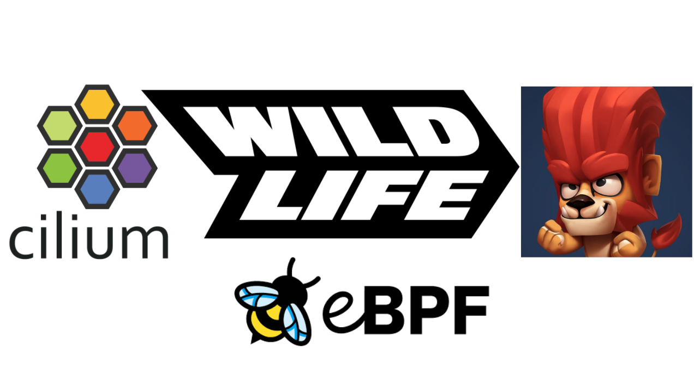
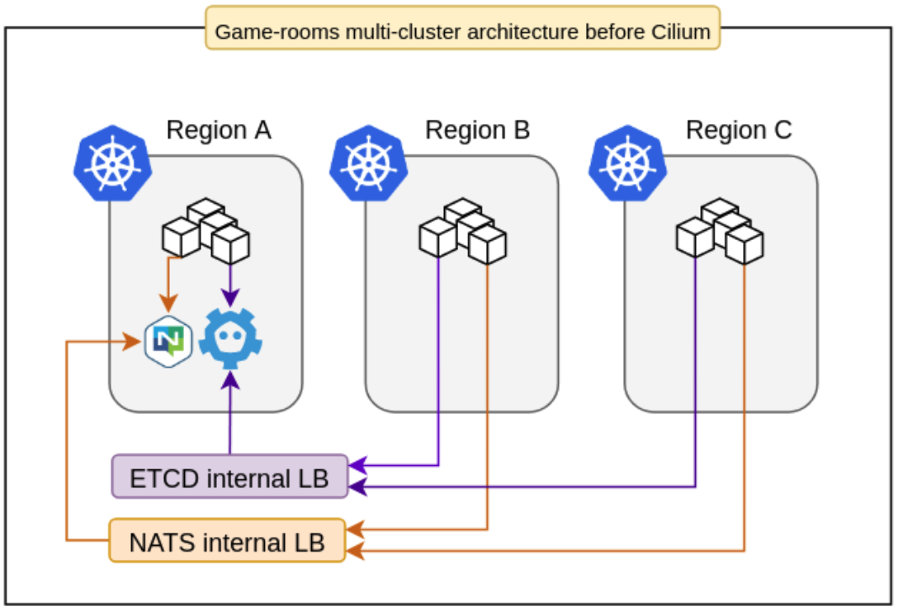
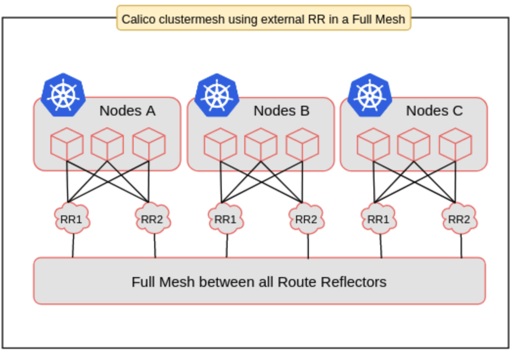
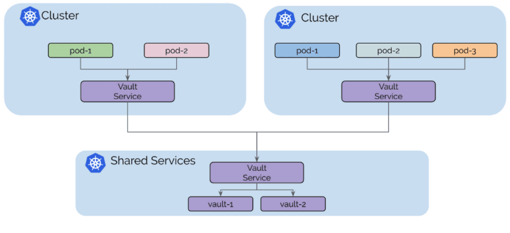
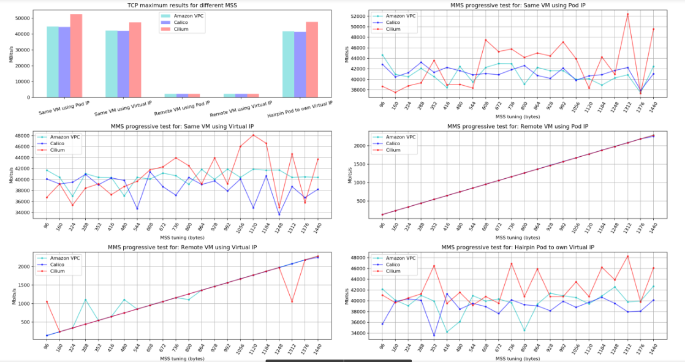
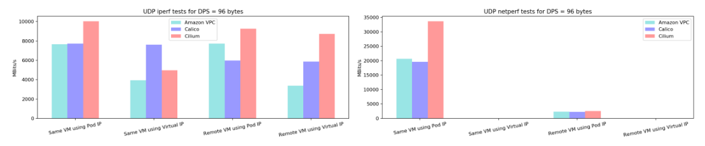
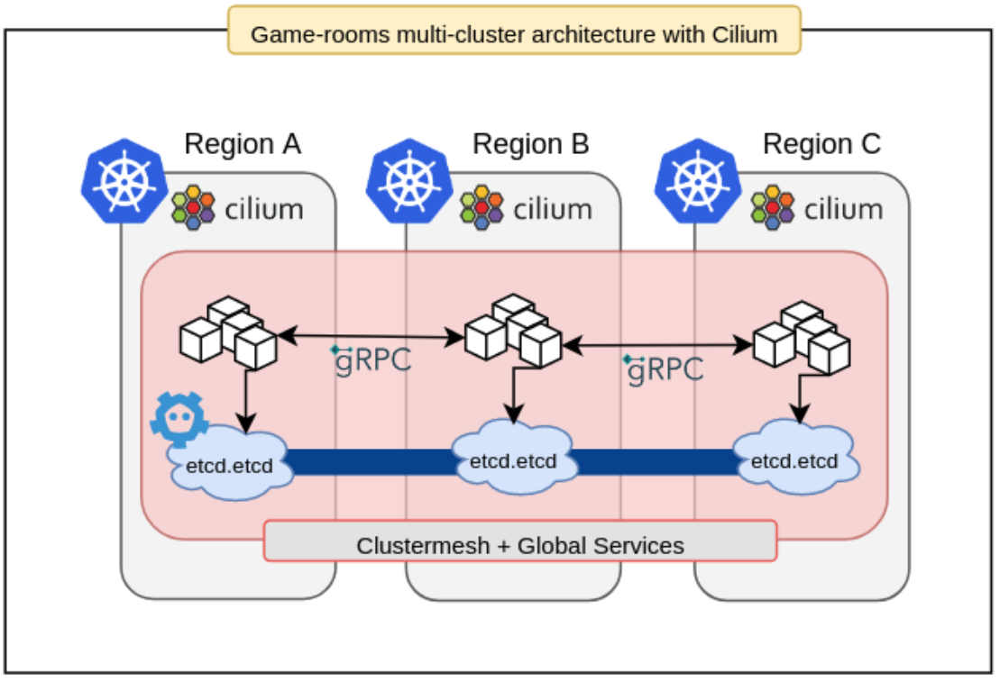

Wildlife Studios is a Brazil-based global gaming company, one of the twenty
largest mobile gaming companies in the world, and has more than 700 employees
and offices in Brazil, Argentina, Ireland, and the United States. Their games
are distributed in over 150 countries, and have been dowloaded over
two billion times. Their online gaming infrastructure relies on several
services deployed all over the globe, which are delivered from around 30,000
Kubernetes pods running on 2,500 nodes.

In mid-2018 we started the preparations for two big game launches planned
for the middle of the next year. One of the most important thing was to rethink our
networking infrastructure for Kubernetes in order to support better integration
between different regions where we run game servers.

At that moment, we had some clusters running with Calico 2.6, exposing their services
through internal load balancers and connecting important parts of our internal game
architecture using NATS. Two systems represent the keys to this infrastructure castle:

**The first system** - Each game consists of several components built upon a lightweight
game server framework called "[Pitaya](https://medium.com/tech-at-wildlife-studios/pitaya-wildlifes-golang-go-af57865f7a11)"
with clustering support. These components use a centralized Etcd cluster for
auto-discovery, in this way they can communicate with each other using two
different mechanisms, through NATS topics, or direct gRPC requests.

**The second system** - a game room scheduler called [Maestro](https://github.com/topfreegames/maestro),
which is responsible for scaling different stacks of game rooms on demand, making sure that there
will always be game rooms available for new matches. In order to reduce latency
and improve the user experience, these stacks are deployed in several regions
around the world. This also created a fault-tolerant system, where it's
possible to turn off game rooms in specific regions and temporarily redirect users to
another point of the globe.



## Problems to solve

In this architecture, for each shared service, like Etcd, NATS, and Jaeger, we
had to create and maintain internal load balancers and their respective DNS
records. It was also hard to configure routing for pod-to-pod communication in
order to enable Pitaya’s gRPC integration, a more efficient operation mode.
Last but not least, we needed a tool to improve the visibility of the network
without adding tons of specialized components to our clusters.

The main question was: How do we create and monitor a highly available global
environment for critical game components that need to reach each other and also
communicate with some centralized shared services?

To answer this question, the first big challenge would be to find a Kubernetes
CNI plugin that supported the following requirements:

- Low-latency pod-to-pod communication across different clusters
- Global service network without dramatically increasing system complexity
  adding a bunch of tools, controllers, and resources
- Reasonable use of resources due to the criticality of adding a new daemonset
  to the system
- Reliable scaling up to a 600 node single cluster
- Boot quickly enough to withstand a super volatile game-room environment
- Simple configuration in order to reduce the operational cost
- A good set of metrics that could be exported to Prometheus and Datadog
- Good documentation and community support

As the existing clusters were deployed using kops, three different CNI
supported plugins appeared as good candidates to meet those requirements:
Calico 2.6, Amazon VPC 1.2, and Cilium 1.2.

## Tests and Benchmarks

At the end of 2018, we performed several load and networking tests against the available options.
Even though the results are quite large and detailed and would need a dedicated post, some
results bear illustration as they point to the reasons for selecting Cilium.

### Setup complexity

Calico 2.6 didn’t have a standard way to use a reliable HA route
reflector configuration for exchanging routes. It meant that we needed to use its
normal BGP full-node-mesh mode, but in this way, it would be virtually
impossible to deploy a cluster with more than 300 nodes. Even though this was a
breaking point, we decided to configure an external
[BIRD](https://bird.network.cz/) according to [this post from
IBM](https://medium.com/ibm-cloud/journey-to-1000-nodes-for-ibm-cloud-private-5294138047d5),
building a full-mesh of route reflectors.



This configuration significantly increased the complexity of the system and the
respective operational cost. To make things worse, these drawbacks would be ok if we were
trying to build a static environment, but we weren't. Since we needed node autoscaling,
we had to develop a hacky controller for managing inclusions and
removals of dynamic nodes as BGP peers in BIRD’s static configuration files.
Definitely, Calico couldn’t give us what we needed.

Amazon VPC was much simpler, as pods used secondary IPs from nodes in the same
network. We only needed to create VPC peerings and the respective routing
tables between the clusters. The problem was that we would still have to
configure internal load balancers and deal with their name resolution.

Although Cilium required a little bit more effort than Amazon VPC because of
the dedicated Etcd server which was necessary for large clusters at that point,
we found what we were looking for in terms of multi-cluster management. The
Cilium Cluster Mesh configuration was absolutely simple. All we needed to do
besides setting up the basic VPC peering, routing tables, and firewalling was
to tell Cilium where to find the dedicated Etcd endpoints from the other
clusters.

```yaml
# cluster mesh config snippet
data:
  cluster-A: |-
    endpoints:
    - "http://etcd-0.cluster-A.example.internal:2379"
    - "http://etcd-1.cluster-A.example.internal:2379"
    - "http://etcd-2.cluster-A.example.internal:2379"
  cluster-B: |-
    endpoints:
    - "http://etcd-0.cluster-B.example.internal:2379"
    - "http://etcd-1.cluster-B.example.internal:2379"
    - "http://etcd-2.cluster-B.example.internal:2379"
```

Nowadays, Cilium also supports CRD-backed IPAM mode instead of using a dedicated Etcd.
This works for large clusters and cluster meshes configurations as well, managing IP addresses
via Kubernetes Custom Resource Definition (CRD).

Cilium also comes with a feature called [global
services](https://cilium.io/blog/2019/03/12/clustermesh/) that solved the
internal load balancer problem in a very simple way. We only had to add an
annotation to those services and deploy them to all the clusters.



## Networking benchmark

The following charts are the result of one of the networking tests comparing
Calico 2.6, Amazon VPC 1.2, and Cilium 1.2. In a very similar environment, an orchestrator
system coordinated workers to test different MTUs settings (configuring MSS to
TCP and setting direct package size to UDP).

Scenarios evaluated:

- Local VM using pod IP: Local VM pod-to-pod traffic;
- Local VM using cluster/virtual IP: Local VM pod-to-pod traffic tests using its
  Service IP;
- Remote VM using pod IP: traffic tests for pods in different nodes using pod
  IP;
- Remote VM using cluster/virtual IP: traffic tests using cluster/virtual IP
  for pods in different nodes;
- Local VM pod Hairpin: pod itself using Cluster IP.




These data were obtained from the project [Kubernetes Netperf](https://github.com/kubernetes/perf-tests/tree/master/network/benchmarks/netperf), and we used the following configuration for the testing environment running in AWS:

- Kops version: v1.11.0

- Kubernetes version: v1.10.7

- Control Plane

  - instances: 3
  - zones: us-east-1b, us-east-1c, us-east-1d
  - instance type: m4.xlarge

- Node

  - instances: 200
  - zones: us-east-1b, us-east-1c, us-east-1d
  - instance type: c4.2xlarge

We didn’t enable encryption, nor any other specific configuration for
each CNI plugin. As you can see, compared to the others, Cilium performed very
well, especially for UDP traffic, which is important when we are talking about
games. Another point in favor of Cilium was the results of TCP throughput for
different MSS test, which was impressive for tests within the same VM.

_Note: The results obtained are consistent with previous versions of these tools, and
although they were extremely relevant to the decision we made, they may not match
current tests under the same conditions, as these tools are constantly evolving._

## The migration process

After these and some other positive results, like the stability running hundreds
of nodes, and the small amount of requests to the Kubernetes API, in November 2018
Wildlife's SRE team decided to rollout their whole self-managed Kubernetes
infrastructure in order to use Cilium. The migration process was also possible
thanks to the great support of its community. Since pod-to-pod communication was
working well, relying on the Cilium Cluster Mesh feature, the gRPC mechanism on
Pitaya was enabled, improving the servers' performance and removing one of
those single points of failure - NATS.

In a second migration round, Wildlife substituted most of the internal load
balancers with Cilium Global Services. This process included the migration of
those load balancers attached to Pitaya's Etcds, and to internal logging and tracing
stacks. This removed the complexity of maintaining a lot of cloud-scoped load
balancers and their respective private DNS records.



In mid-2019, Wildlife's SRE team started developing a tool called Bigbang that
supports the creation of production-ready Cluster Meshes in a short time.
Bigbang was built on top of Kops, Terraform, Helm3, and Cilium, making it
possible to quickly deploy a full-integrated multi-cluster
infrastructure for game servers. This tool supported the launch of the
company's last two major successes, Zoo Battle Arena and Tennis Clash, which were top #10 in over
150 countries.

Today, Bigbang is shipping Cilium in more than 20 Kubernetes production
clusters in the company. Each game has at least 3 clusters running together in
the same Cluster Mesh configuration. This infrastructure handles more than 50k
client requests per second and supports millions of daily active users.

## Comments and the future

Since 2018 we've been proactively working with the Cilium team to improve our systems. This
close interaction supported some investigations and allowed us to efficiently solve problems
together, consequently increasing the reliability of our network.

After this long period migrating and building tools around Cilium, we're looking forward to
improving the security of our environment with the powers of Network Policies. This is a step
towards the Zero Trust Network strategic initiative, which Cilium facilitates.

Another promising step is related to [Hubble](https://github.com/cilium/hubble), a distributed
networking and security observability platform built on top of Cilium for cloud native workloads.
After testing this in a few clusters, we're very excited to rollout the tool for all the production
environments in order to obtain detailed insights about our network with minimum overhead thanks
to the use of the Linux kernel technology [eBPF](https://ebpf.io/).

<div class="blog-authors">
  <div class="blog-author">
    <span class="blog-author-header">
      Author: Luan Guimarães
    </span>
    <span class="blog-author-bio">
    Hi, my name is Luan, I'm a Brazilian rock climber, amateur musician, and
    programmer and am enthusiastic about free software communities and other
    open knowledge initiatives. I’ve been working as a Site Reliability
    Engineer at Wildlife Studios, using and building infrastructure tools on
    top of Kubernetes in order to support millions of users around the world.
    </span>
  </div>
</div>
