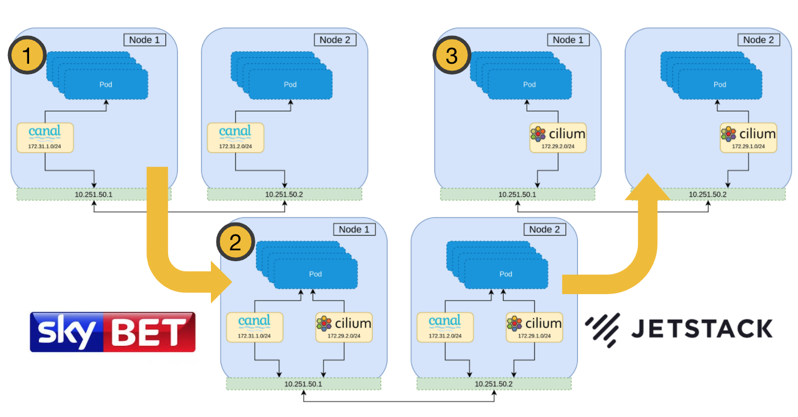
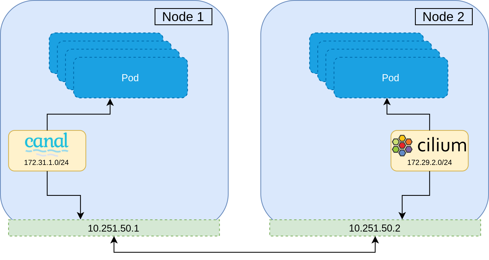
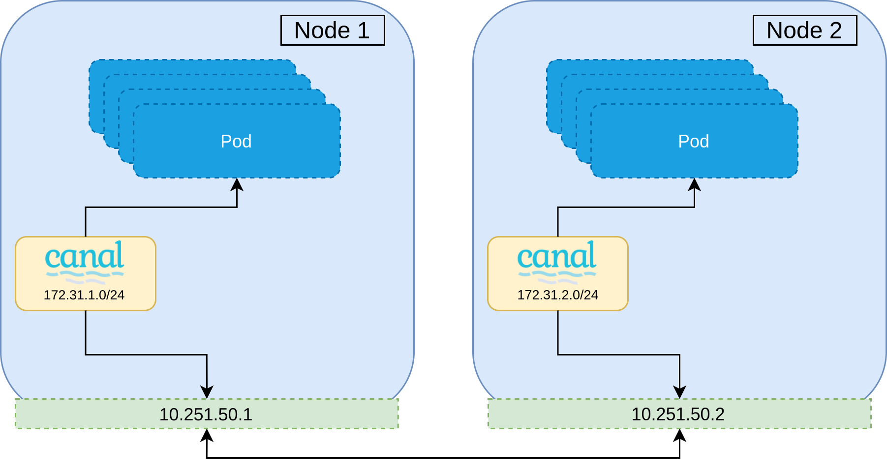
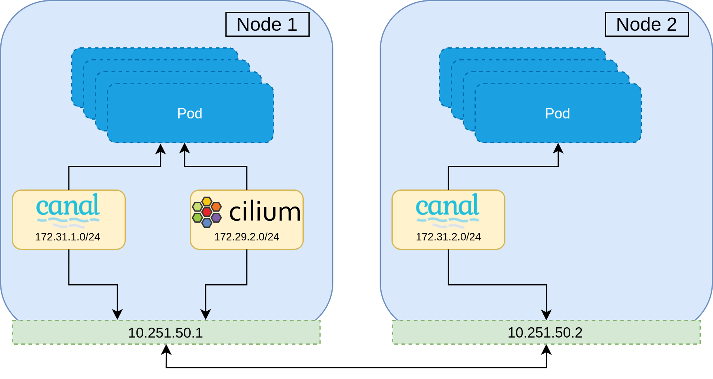
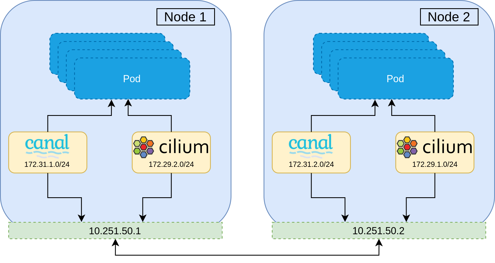
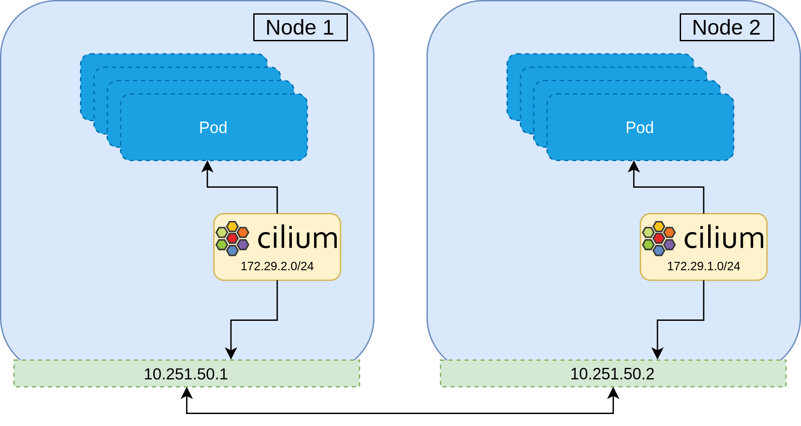

import authors from 'utils/author-data';



This is a guest blog by Josh Van Leeuwen and covers how Josh implemented a CNI
live migration for a customer, [Sky Betting and Gaming](https://m.skybet.com),
to live migrate a cluster running the Canal CNI plugin (Flannel+Calico) to
Cilium. Josh is working as a Customer Reliability Engineer for Jetstack. Read
on to hear what Josh has to say...

In this post we'll discuss why one might want to change CNIs, what I have learnt
developing a solution for live migration, and how it all works.

# What is CNI, and why change it?

Container Network Interface (CNI) is a big topic, but in short, CNI is a set of
specifications that define an interface used by container orchestrators to set
up networking between containers. In the [Kubernetes
space](https://kubernetes.io/docs/concepts/cluster-administration/networking/),
the Kubelet is responsible for calling the CNI installed on the cluster so Pods
are attached to the Kubernetes cluster network during creation, and its
resources are properly released during deletion. CNIs can also be responsible
for more advanced features than just setting up routes in the cluster, such as
network policy enforcement, encryption, load balancing, etc.

There are many implementations of CNI for various use cases, each having their
own advantages and disadvantages. [Flannel](https://github.com/coreos/flannel)
is one such implementation, backed by iptables, and it is perhaps the most
simple and popular in Kubernetes. Flannel is solely concerned with setting up
routing between Pods in the Kubernetes cluster, which is achieved by creating
an [overlay network](https://en.wikipedia.org/wiki/Overlay_network) using the
[Virtual Extensible LAN
(VXLAN)](https://en.wikipedia.org/wiki/Virtual_Extensible_LAN) protocol. Another
project, [Calico](https://www.projectcalico.org), can be run as either a
standalone CNI solution or on top of Flannel (called
[Canal](https://docs.projectcalico.org/getting-started/kubernetes/flannel/flannel))
to provide network policy enforcement.

While using Flannel and Calico together is a solid solution, it can have
problems. For example, Flannel can have
[issues](https://openai.com/blog/scaling-kubernetes-to-2500-nodes/) at
[scale](https://tech.xing.com/a-reason-for-unexplained-connection-timeouts-on-kubernetes-docker-abd041cf7e02),
and may not be as feature rich as other implementations.

[Cilium](https://cilium.io/) is another CNI solution, based on
[eBPF](https://ebpf.io/), and is designed to be run at large scale. Whilst
Cilium implements the standard
[NetworkPolicies](https://kubernetes.io/docs/concepts/services-networking/network-policies/),
it is able to utilise the full packet introspection of eBPF, enabling it to have
first class support for [Layer 7
policy](https://docs.cilium.io/en/stable/policy/language/#layer-7-examples) for
a number of protocols, [custom
extensions](https://docs.cilium.io/en/v1.8/concepts/security/proxy/envoy/) using
Envoy, large options for [endpoint
selection](https://docs.cilium.io/en/stable/policy/kubernetes/), as well as rich
[network monitoring
introspection](https://docs.cilium.io/en/v1.8/configuration/metrics/?highlight=monitoring).
For these reasons, Cilium becomes a very favourable choice for running
Kubernetes at scale, with complex network policy requirements.

---

Since the CNI underpins the entire network running on Kubernetes, it would seem
that the only solution for changing a CNI is to take the entire cluster down,
replace it, and bring up all workloads again on the new CNI. This of course
causes downtime, or at the least, requires a full cluster migration. For some
companies this might be unacceptable. So, how about a live migration instead?

# Designing a live CNI Migration

When a Pod is created, the installed CNI is called which will attach a network
interface to the Pod. If all goes well, this network interface will join that Pod
to the cluster network. The network interface shares the same life cycle as the
Pod, meaning that only newly-created Pods will be picked up by the newer CNI if
it was swapped out. This requires that all Pods on the cluster that are a part
of the cluster network be recycled in order to be a member of the new CNI.

A naive approach to migrating a CNI would be to gradually roll each node on the
cluster, and then replacing the CNI installed when the node is brought back up. This is
however, not possible—the second CNI will be installed with a separate CIDR
range to that of the currently installed CNI, which has no knowledge of the
other network range. Not to mention the use of different encapsulation
protocols, or broken network policy since identity is lost. This can be
demonstrated below where Pods on Node 1 will be unable to communicate to Pods on
Node 2, and visa versa.

<figure class="pure-img center">
  
  <figcaption><p>Separate CNIs installed</p></figcaption>
</figure>

With this constraint, it is clear that during the migration, there must be a
period in which all Pods on the cluster are members of both networks. Once all
Pods are members of both networks, the first network can be peeled away, leaving
only the new second CNI network remaining. In practice this means that
routing decisions can be made based upon the destination IP and the
corresponding network interface to use.

The best strategy therefore, is to install the new CNI alongside the current
one and then remove the old CNI during the migration. The overview of the migration
is as follows.

<figure class="pure-img center">
  
  <figcaption><p>Step 0: Single CNI installed on the cluster.</p></figcaption>
</figure>

<figure class="pure-img center">
  
  <figcaption><p>Step 1: Rollout the second CNI alongside the current. All pods communicate over the current.</p></figcaption>
</figure>

<figure class="pure-img center">
  
  <figcaption><p>Step 2: Both CNIs installed on all nodes, and Pods can communicate on either CNI.</p></figcaption>
</figure>

<figure class="pure-img center">
  
  <figcaption><p>Step 3: Peel away the first CNI. Pods can communicate on the new CNI if the first is unavailable at the source or destination Pod.</p></figcaption>
</figure>

<figure class="pure-img center">
  
  <figcaption><p>Step 4: First CNI is completely removed. All commination done over the new CNI.</p></figcaption>
</figure>

This strategy maintains all network policy throughout the entire migration, and
ensures no network downtime.

---

The caveat to this strategy is that all workloads on the cluster will need to be
rolled several times. This should be acceptable. Workloads running on Kubernetes are
expected to be resilient to service disruption and rescheduling, and with proper
disruption budgets and probes, a conservative roll of the cluster at each
migration step should ensure that the entire cluster remains healthy at all
times.

# Implementation

The end result of the project is a [CLI
tool](https://github.com/JoshVanL/cni-migration) that runs the migration from
start to finish, allowing configuration of which steps to run, and ensuring
cluster network health throughout the process. This is all configured using a
config file and flags.

The CLI has support for running in a "dry mode", and will ensure all previous
steps have been completed before continuing. The full migration consists of 6 steps which
I will run through below.

```yaml
# Node labels to use to check the status of each stage
labels:
  canal-cilium: node-role.kubernetes.io/canal-cilium
  cni-priority-canal: node-role.kubernetes.io/priority-canal
  cni-priority-cilium: node-role.kubernetes.io/priority-cilium
  rolled: node-role.kubernetes.io/rolled
  cilium: node-role.kubernetes.io/cilium
  migrated: node-role.kubernetes.io/migrated
  value: 'true' # used as the value to each label key

# File paths of resources for the migration
paths:
  cilium: ./resources/cilium.yaml
  multus: ./resources/multus.yaml
  knet-stress: ./resources/knet-stress.yaml

# Resources required to be deployed before any migration steps.
preflightResources:
  daemonsets:
    knet-stress:
      - knet-stress
      - knet-stress-2
  deployments:
  statefulsets:

# Resources to watch status for to ensure that the cluster is healthy at each
# stage. Must be installed and ready at prepare.
watchedResources:
  daemonsets:
    kube-system:
      - canal
      - cilium
      - cilium-migrated
      - kube-multus-canal
      - kube-multus-cilium
      - kube-controller-manager
      - kube-scheduler
    knet-stress:
      - knet-stress
      - knet-stress-2
  deployments:
  statefulsets:

# Resources to clean up at the end of the migration.
cleanUpResources:
  daemonsets:
    kube-system:
      - canal
      - cilium
      - kube-multus-canal
      - kube-multus-cilium
    knet-stress:
      - knet-stress
      - knet-stress-2
  deployments:
  statefulsets:
```

---

## Step 0: Preflight

Before, during, and after the migration, we need to check that the cluster has
full network connectively in order to ensure there is no downtime. To do this, I
decided to write a small service called
[knet-stress](https://github.com/joshvanl/knet-stress) that regularly connects
to the other knet-stress services on the cluster. It does this by looking up a
Kubernetes Service, and sending an `HTTP GET` request to every endpoint IP
listed, including its own.

By running this as two DaemonSets under the same Service, we can cover Pod to
Pod communication both between nodes, as well as Pods on the same node. The API
lookup is also a good sanity check that the API server is still rotatable.

During the migration, we exec into each Pod and run a manual `status` check,
with the end result being that we have checked the bidirectional health of the
network, across the entire cluster.

<div align="center"><b>knet-stress in action</b></div>

```
DEBU[0016] [kubectl exec --namespace knet-stress knet-stress-tvhjv -- /knet-stress status]  step=0-preflight
time="2020-08-16T13:33:23Z" level=info msg="client: TLS disabled"
time="2020-08-16T13:33:23Z" level=info msg="client: sending request http://172.31.0.3:6443/hello"
time="2020-08-16T13:33:23Z" level=info msg="client: got response status code: 200"
time="2020-08-16T13:33:23Z" level=info msg="client: sending request http://172.31.0.4:6443/hello"
...
time="2020-08-16T13:33:23Z" level=info msg="client: sending request http://172.31.5.7:6443/hello"
time="2020-08-16T13:33:23Z" level=info msg="client: got response status code: 200"
time="2020-08-16T13:33:23Z" level=info msg="client: sending request http://172.31.5.8:6443/hello"
time="2020-08-16T13:33:23Z" level=info msg="client: got response status code: 200"
STATUS OK
```

We run knet-stress before and after every migration step, and is our source of
truth for network connectivity.

## Step 1: Prepare

This step is for installing all our dependant resources, and labelling nodes.

### Node Labels

The migration will swap out multiple DaemonSets at various steps, so we use
[Node Labels and
Selectors](https://kubernetes.io/docs/concepts/scheduling-eviction/assign-pod-node/)
to control the scheduling. Not only is it better to leave scheduling to
Kubernetes, but it's also a convenient way to observe where we are in the
migration through a simple `kubectl get nodes`. We also make sure that we patch
the first CNI, Canal, to have a node selector that we can use to uninstall it
at a later stage.

We define each label to use in the config, but are fine to leave as is.

```yaml
# Node labels to use to check the status of each stage
labels:
  canal-cilium: node-role.kubernetes.io/canal-cilium
  cni-priority-canal: node-role.kubernetes.io/priority-canal
  cni-priority-cilium: node-role.kubernetes.io/priority-cilium
  rolled: node-role.kubernetes.io/rolled
  cilium: node-role.kubernetes.io/cilium
  migrated: node-role.kubernetes.io/migrated
  value: 'true' # used as the value to each label key
```

When a node's label is changed, Kubernetes will unschedule any of the
DaemonSets which don't match the selector, and schedule those that do. We can
then simply wait for the underlying Pods to become ready.

---

## Step 2: Roll all Nodes

### Multus

The first challenge faced as part of the migration is to run two CNIs in
parallel, both servicing the same Pods. Luckily there is a project by Intel,
[multus-cni](https://github.com/intel/multus-cni), which does exactly that.
Multus is installed like most CNIs, as a DaemonSet. It acts as a middleman
whereby calls made by the Kubelet are forwarded to the two configured CNIs
underneath, each setting up a separate network interface on the Pod. In
practice, if multiple CNIs are installed and configured, each newly
created Pod will have a 'master' network interface, as well as a secondary
network interfaces, one for each of the extra CNIs (and of course the loopback
device). Only the master network interface is advertised to Kubernetes and
used in Services, etc. Although the secondary Pod IP is not directly advertised
to Kubernetes, it is still rotatable by other containers on that secondary
network. This will become important later.

Multus is easy to setup, all that is needed are a few lines of config. for each
CNI we want to install. It is also possible to configure Multus using a
[CRD](https://intel.github.io/multus-cni/doc/how-to-use.html#create-network-attachment-definition),
though a blanket cluster-wide configuration is more useful in our case.

<div align="center"><b>Base Multus config</b></div>

```json
{
  "name": "multusi-cni-network",
  "cniVersion": "0.3.1",
  "plugins": [
    {
      "cniVersion": "0.3.1",
      "name": "multus-cni-network",
      "type": "multus",
      "kubeconfig": "/etc/kubernetes/cni/net.d/multus.d/multus.kubeconfig",
      "confDir": "/etc/kubernetes/cni/net.d",
      "clusterNetwork": "k8s-pod-network",
      "defaultNetworks": ["cilium"],
      "systemNamespaces": [""]
    }
  ]
}
```

In this config, we have defined `k8s-pod-network` to be the master CNI network
(the name of the CNI config for Canal) and it is the network that is advertised
to Kubernetes. Cilium is the second CNI to be called. Finally, this config
should apply to all namespaces (`"systemNamespaces": [""]`).

### CNI Ordering

When CNIs are installed on a cluster, they are naturally run as a DaemonSet to
set up networking on every node. With this, they also typically write out their
executable to file, as well as their configuration to an established directory
(typically somewhere like `/etc/kubernetes/cni/net.d/`). The Kubelet looks at
this directory to find the executable to run and its parameters.

Every time a new Pod is created, the Kubelet will list the files in the
directory, and use the configuration which is alphabetically first in the
list. For example, `00-multus.conflist` is the CNI configuration that the
Kubelet will use in the following example:

<div align="center"><b>CNI config directory with Multus priority</b></div>

```shell-session
$ ls -la /etc/kubernetes/cni/net.d/
total 56
drwxr-xr-x. 3 root root 4096 Aug 16 13:34 .
drwxr-xr-x. 3 root root 4096 Aug 16 13:29 ..
-rw-r--r--. 1 root root  415 Aug 16 13:34 00-multus.conflist
-rw-r--r--. 1 root root 1646 Aug 16 13:34 10-calico.conflist
-rw-r--r--. 1 root root   97 Aug 16 13:33 99-cilium.conf
-rw-------. 1 root root 1234 Aug 16 13:33 calico-kubeconfig
drwxr-xr-x. 2 root root 4096 Aug 16 13:34 multus.d
```

This strategy means that we can configure which CNI takes precedence by
controlling the file locations that the CNI configuration is written to. Both
Multus, and us during the migration, take advantage of this.

### SBR Plugin

Cilium manages [identity of
endpoints](https://docs.cilium.io/en/v1.8/concepts/terminology/#what-is-an-identity)
in order to make routing and policy decisions. One issue that we ran into was
Cilium losing the source identity of requests when the request was being sent
as a non default, secondary network interface to the Pod. Cilium would interpret
the source of that request as an identity of
[`reserved:world`](https://docs.cilium.io/en/v1.8/concepts/terminology/#special-identities),
which would then get dropped, never reaching the Pod. Although I didn't track
down what the source of the issue was, I was able to mitigate it by using the
[SBR (Source Based Routing) CNI meta
plugin](https://github.com/containernetworking/plugins/tree/master/plugins/meta/sbr).

The SBR CNI meta plugin will cause the default route of the Pod to be
overridden to the Cilium network interface. This fixed the issue, and
Cilium was able to correctly determine source endpoint identity.

<div align="center"><b>knet-stress Pod without SBR meta plugin</b></div>

```shell-session
$ kubectl exec knet-stress-2-b99nz -- ip route
default via 169.254.1.1 dev eth0
169.254.1.1 dev eth0 scope link
172.29.100.122 dev net1 scope link
```

<div align="center"><b>knet-stress Pod with SBR meta plugin</b></div>

```shell-session
$ kubectl exec knet-stress-2-br2t5 -- ip route
default via 172.29.197.231 dev net1
172.29.197.231 dev net1 scope link
```

### Encapsulation Mode

Flannel and Cilium both support and default to VXLAN as the tunneling protocol
to facilitate routing cluster traffic. VXLAN has support for running multiple
networks on the same machines, separated by the VXLAN ID (VID); however, I was
not able to find an option for configuring this in either Cilium or Flannel.
This caused a conflict and prevented Cilium to start at all.

To fix this, I decided to configure Cilium to use [GENEVE (Generic Network
Virtualisation Encapsulation)](https://www.redhat.com/en/blog/what-geneve)
instead. GENEVE is a newer encapsulation protocol designed to supersede VXLAN.
This seemed like a fine compromise and I didn't encounter any problem going
this route.

### All Change

Now we have Multus installed, and have given it the precedence as the primary
CNI, we now require that all Pods which are in the cluster network to be rolled.
As described earlier, this is a required step since we need all of the Pods to
be recreated to have both CNI network interfaces attached.

<div align="center"><b>knet-stress Pods with Canal advertised IP</b></div>

```
NAME                  READY   STATUS    RESTARTS   AGE     IP              NODE                                        NOMINATED NODE   READINESS GATES
knet-stress-2-bstdd   1/1     Running   0          5m19s   172.31.0.6      ip-10-99-0-156.eu-west-1.compute.internal   <none>           <none>
knet-stress-2-csf7g   1/1     Running   0          6m52s   172.31.1.6      ip-10-99-3-105.eu-west-1.compute.internal   <none>           <none>
knet-stress-2-kdl2r   1/1     Running   0          36s     172.31.5.2      ip-10-99-0-179.eu-west-1.compute.internal   <none>           <none>
knet-stress-2-r5gds   1/1     Running   0          6m15s   172.31.4.8      ip-10-99-1-77.eu-west-1.compute.internal    <none>           <none>
knet-stress-2-rlk5f   1/1     Running   0          5m19s   172.31.3.7      ip-10-99-2-248.eu-west-1.compute.internal   <none>           <none>
knet-stress-2-rp96s   1/1     Running   0          7m27s   172.31.2.6      ip-10-99-1-90.eu-west-1.compute.internal    <none>           <none>
knet-stress-5tz28     1/1     Running   0          5m19s   172.31.3.9      ip-10-99-0-179.eu-west-1.compute.internal   <none>           <none>
knet-stress-dcjzz     1/1     Running   0          6m49s   172.31.1.9      ip-10-99-1-77.eu-west-1.compute.internal    <none>           <none>
knet-stress-gc7m8     1/1     Running   0          6m14s   172.31.4.10     ip-10-99-1-90.eu-west-1.compute.internal    <none>           <none>
knet-stress-hbct8     1/1     Running   0          7m16s   172.31.2.8      ip-10-99-0-156.eu-west-1.compute.internal   <none>           <none>
knet-stress-llp82     1/1     Running   0          36s     172.31.5.4      ip-10-99-3-105.eu-west-1.compute.internal   <none>           <none>
knet-stress-mc9m7     1/1     Running   0          5m18s   172.31.0.8      ip-10-99-2-248.eu-west-1.compute.internal   <none>           <none>
```

---

## Step 3: Change CNI Priority

This stage involves changing the CNI priority for all nodes so that Cilium
becomes the primary CNI. To achieve this, we install a new Multus DaemonSet
with Cilium as the primary CNI, and Canal as the secondary.

<div align="center"><b>Multus config with Cilium as primary CNI</b></div>

```json
{
  "name": "multusi-cni-network",
  "cniVersion": "0.3.1",
  "plugins": [
    {
      "cniVersion": "0.3.1",
      "name": "multus-cni-network",
      "type": "multus",
      "kubeconfig": "/etc/kubernetes/cni/net.d/multus.d/multus.kubeconfig",
      "confDir": "/etc/kubernetes/cni/net.d",
      "clusterNetwork": "cilium",
      "defaultNetworks": ["canal"],
      "systemNamespaces": [""]
    }
  ]
}
```

To do this, we taint and drain the node, relabel it so that a new mutlus Pod is
scheduled using the updated configuration, and then untaint the node. This
causes all Pods to be rescheduled on that node which are now all members of both
CNIs, but their advertised IP is that of Cilium's network. We repeat this
process for all nodes in the cluster, ensuring that there is total network
connectivity throughout.

<div align="center"><b>Pods running with Cilium network advertised</b></div>

```
NAME                  READY   STATUS    RESTARTS   AGE   IP               NODE                                        NOMINATED NODE   READINESS GATES
knet-stress-2-28jz8   1/1     Running   0          19m   172.29.23.7      ip-10-99-0-156.eu-west-1.compute.internal   <none>           <none>
knet-stress-2-5vt2w   1/1     Running   0          13m   172.29.82.217    ip-10-99-3-105.eu-west-1.compute.internal   <none>           <none>
knet-stress-2-fcwqt   1/1     Running   0          17m   172.29.163.144   ip-10-99-0-179.eu-west-1.compute.internal   <none>           <none>
knet-stress-2-jfr2r   1/1     Running   0          17m   172.29.157.128   ip-10-99-1-77.eu-west-1.compute.internal    <none>           <none>
knet-stress-2-l9kzs   1/1     Running   0          14m   172.29.57.215    ip-10-99-2-248.eu-west-1.compute.internal   <none>           <none>
knet-stress-2-pzggb   1/1     Running   0          15m   172.29.60.178    ip-10-99-1-90.eu-west-1.compute.internal    <none>           <none>
knet-stress-bmftj     1/1     Running   0          17m   172.29.225.70    ip-10-99-0-179.eu-west-1.compute.internal   <none>           <none>
knet-stress-c5sgd     1/1     Running   0          17m   172.29.110.42    ip-10-99-1-77.eu-west-1.compute.internal    <none>           <none>
knet-stress-g5qbv     1/1     Running   0          15m   172.29.93.51     ip-10-99-1-90.eu-west-1.compute.internal    <none>           <none>
knet-stress-k5vz9     1/1     Running   0          19m   172.29.56.36     ip-10-99-0-156.eu-west-1.compute.internal   <none>           <none>
knet-stress-smghl     1/1     Running   0          13m   172.29.127.250   ip-10-99-3-105.eu-west-1.compute.internal   <none>           <none>
knet-stress-w4ksd     1/1     Running   0          14m   172.29.188.52    ip-10-99-2-248.eu-west-1.compute.internal   <none>           <none>
```

The end result of this stage is that we have both CNIs installed for all nodes,
and each Pod has two network interfaces attached, with the primary and
advertised Pod IP address in Cilium's network.

<div align="center"><b>Node labels with Cilium as priority</b></div>

```
NAME                                        STATUS   ROLES                                        AGE   VERSION
ip-10-99-0-156.eu-west-1.compute.internal   Ready    canal-cilium,master,priority-cilium,rolled   79m   v1.17.3
ip-10-99-0-179.eu-west-1.compute.internal   Ready    canal-cilium,master,priority-cilium,rolled   79m   v1.17.3
ip-10-99-1-77.eu-west-1.compute.internal    Ready    canal-cilium,priority-cilium,rolled,worker   79m   v1.17.3
ip-10-99-1-90.eu-west-1.compute.internal    Ready    canal-cilium,priority-cilium,rolled,worker   79m   v1.17.3
ip-10-99-2-248.eu-west-1.compute.internal   Ready    canal-cilium,priority-cilium,rolled,worker   79m   v1.17.3
ip-10-99-3-105.eu-west-1.compute.internal   Ready    canal-cilium,master,priority-cilium,rolled   79m   v1.17.3
```

---

## Step 4: Migration

With all Pods now using Cilium as their primary CNI, Canal is not being anymore
and so can be safely uninstalled everywhere. We repeat a similar process as
before; tainting and draining a node, relabelling it so that the old Canal and
Cilium CNIs are uninstalled, installing a duplicated Cilium CNI that selects
that node label, and bringing the node back up.

Repeating this process, we finally get all Pods to use Cilium.

<div align="center"><b>CNI config directory with Cilium as priority</b></div>

```shell-session
ip-10-99-0-179 net.d # ls -al
total 72
drwxr-xr-x. 3 root root 4096 Aug 16 14:51 .
drwxr-xr-x. 3 root root 4096 Aug 16 13:29 ..
-rw-r--r--. 1 root root   97 Aug 16 14:51 00-cilium.conf
-rw-r--r--. 1 root root  404 Aug 16 14:45 00-multus.conflist
-rw-r--r--. 1 root root 1655 Aug 16 14:32 10-calico.conflist
-rw-r--r--. 1 root root   97 Aug 16 13:33 99-cilium.conf
-rw-r--r--. 1 root root  300 Aug 16 14:45 99-flannel.conflist
-rw-------. 1 root root 1234 Aug 16 13:33 calico-kubeconfig
drwxr-xr-x. 2 root root 4096 Aug 16 13:34 multus.d
```

<div align="center"><b>Migrated Node labels</b></div>

```
NAME                                        STATUS   ROLES                           AGE   VERSION
ip-10-99-0-156.eu-west-1.compute.internal   Ready    cilium,master,migrated,rolled   99m   v1.17.3
ip-10-99-0-179.eu-west-1.compute.internal   Ready    cilium,master,migrated,rolled   99m   v1.17.3
ip-10-99-1-77.eu-west-1.compute.internal    Ready    cilium,migrated,rolled,worker   99m   v1.17.3
ip-10-99-1-90.eu-west-1.compute.internal    Ready    cilium,migrated,rolled,worker   99m   v1.17.3
ip-10-99-2-248.eu-west-1.compute.internal   Ready    cilium,migrated,rolled,worker   99m   v1.17.3
ip-10-99-3-105.eu-west-1.compute.internal   Ready    cilium,master,migrated,rolled   99m   v1.17.3
```

---

## Step 5: Clean Up

This step simply removes all resources no longer needed: the old Canal
installation, unscheduled Multus, and Cilium DaemonSets. It also patches the
installed Cilium DaemonSet to remove the `migrated` node label selector.

If all goes according to the plan, we have now successfully migrated the CNI
installation from Canal to Cilium, live.

---

# Further Reading

- [Original Jetstack blog post](https://www.blog.jetstack.io/blog/cni-migration/)
- [Cilium Overview](https://cilium.io/)
- [Cilium GitHub](https://github.com/cilium/cilium)
- [What is eBPF?](https://ebpf.io/)

<BlogAuthor {...authors.joshVanLeeuwen} />
