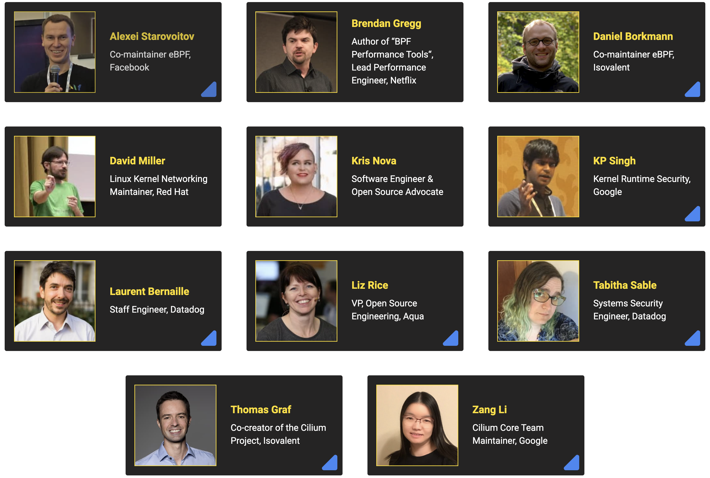

import authors from 'utils/author-data';

The first ever eBPF Summit is just over one week out and we are already well
past 1'000 registrations. We have been blown away by the number of talk and
keynote proposals. This also meant that we had to turn down many fantastic
talks and we hope that our selection provides an interesting and diverse set of
talks. Some of the content that did not make the schedule will be posted as
blog posts on ebpf.io over the coming weeks. In this post, we'll give a quick
preview of what to be excited about and how to plan to attend the event.

If you have not registered for the event, [register
here](https://ebpf.io/summit-2020/). The event is free and held fully virtual.

# What is eBPF Summit?

eBPF is quickly becoming one of the most talked about technologies in our
industry - enabling a new generation of networking, tracing, observability and
security infrastructure. The eBPF Summit is targeted at users and potential
users of this groundbreaking technology - both those looking at leveraging eBPF
directly or via one of the projects leveraging eBPF (e.g. bpftrace, Cilium,
Falco, etc.)

The summit will be held Oct 28-29, 2020 in a fully virtual setting and will
feature a mix of voices from the various eBPF communities. We'll hear from the
eBPF maintainers, various eBPF-based projects, eBPF book authors but most
importantly, we'll hear from a wide set of eBPF users sharing their experience
on how they leverage and utilize eBPF.

# Keynotes

On both days, we will feature a set of 15 min keynotes from interesting people
in the eBPF space. We'll hear from both eBPF Co-Maintainers, eBPF-based project
maintainers, book authors, and otherwise awesome people.

### Day One: Oct 28

- **A beginner’s guide to eBPF programming** 
  Liz Rice, VP, Open Source Engineering, Aqua 
  [See on Youtube.](https://www.youtube.com/watch?v=lrSExTfS-iQ)
- **BPF as a fundamentally better dataplane** 
  Daniel Borkmann, eBPF Co-Maintainer, Isovalent 
  [See on Youtube.](https://www.youtube.com/watch?v=Qhm1Zn_BNi4)
- **Our eBPF Journey at Datadog** 
  Laurent Bernaille, Staff Engineer & Tabitha Sable, Systems Security Engineer Datadog 
  [See on Youtube.](https://www.youtube.com/watch?v=6mTVuZUHLBg)
- **Security Auditing and Enforcement using eBPF** 
  KP Singh, Kernel Runtime Security, Google 
  [See on Youtube.](https://www.youtube.com/watch?v=XFJw37Vwzcc)
- **Topic to be announced** 
  David Miller, Kernel Maintainer, Red Hat

### Day Two: Oct 29

- **Safe programs. The foundation of BPF** 
  Alexei Starovoitov, eBPF Co-Maintainer, Facebook 
  [See on Youtube.](https://www.youtube.com/watch?v=AV8xY318rtc)
- **Topic to be announced** 
  Kris Nova, Software Engineer & Open Source Advocate 
  [See on Youtube.](https://www.youtube.com/watch?v=6E-xA0ZjIGM)
- **Performance Wins with BPF: Getting Started** 
  Brendan Gregg, Author of “BPF Performance Tools“, Lead Performance Engineer, Netflix 
  [See on Youtube.](https://www.youtube.com/watch?v=wyfhjr_ufag)
- **Kubernetes Network Policy Logging with eBPF** 
  Zang Li, Cilium Core Team Maintainer, Google 
  [See on Youtube.](https://www.youtube.com/watch?v=oLS25ztnlMk)
- **The Future of eBPF Networking and Security** 
  Thomas Graf, Co-Creator of the Cilium Project, Isovalent 
  [See on Youtube.](https://www.youtube.com/watch?v=slBAYUDABDA)

## Lightning Talks

We have received numerous submissions for the lightning talk sessions which
will be spread over both days as well. The quality of the submissions has been
overwhelming. We have explicitly chosen to only run lightning sessions to give
a voice to as many members in the community as possible. Despite this, we have
received more than 3 times as many submissions as available speaking slots so
we had to turn down many awesome talks. We will definitely repeat this event
and will consider expanding the scope of it to provide more speaking
opportunities.

The schedule for the lightning talks is still being finalized, as it stands
right now, the following talks will be presented during the lightning talk
session. We will announce the exact speaking times as we receive all title,
abstract and session information from all the speakers.

| Title                                                                                                                             | Speaker                                        |
| --------------------------------------------------------------------------------------------------------------------------------- | ---------------------------------------------- |
| [Using BCC and bpftrace with Performance Co-Pilot](https://www.youtube.com/watch?v=XmMVhvjmD9I)                                   | Andreas Gerstmayr, Red Hat                     |
| [Containers and BPF: twagent story](https://www.youtube.com/watch?v=lO0dYHl3I8Y)                                                  | Andrey Ignatov, Facebook                       |
| [Zero instrumentation monitoring with your first steps in eBPF](https://www.youtube.com/watch?v=GaY2d8e-gk0)                      | Beatriz Martínez, Isovalent                    |
| [eBPF at Adobe](https://www.youtube.com/watch?v=7UQ2CU6UEGY)                                                                      | Brandon Cook, Adobe                            |
| [How and When You Should Measure CPU Overhead of eBPF Programs](https://www.youtube.com/watch?v=b0TxKiGMWpI)                      | Bryce Kahle, Datadog                           |
| [Building a Behavioral Knowledge Graph using eBPF](https://www.youtube.com/watch?v=Sun0bWGVl_o)                                   | Dinesh Venkatesan, Microsoft                   |
| [Can eBPF save us from the data deluge? A case for file filtering in eBPF](https://www.youtube.com/watch?v=qEtDoHWYrhA)           | Giulia Frascaria, Vrije Universiteit Amsterdam |
| [Tracing and detecting malware using eBPF](https://www.youtube.com/watch?v=UD7bF6nWagQ)                                           | Itay Shakury, Aqua Security                    |
| [Steering connections to sockets with BPF socket lookup hook](https://www.youtube.com/watch?v=vCJ8kDYI8ZE)                        | Jakub Sitnicki, Cloudflare                     |
| [rbperf: Understanding Ruby with BPF](https://www.youtube.com/watch?v=oeGom1zl0a8)                                                | Javier Honduvilla Coto, Facebook               |
| [Enabling eBPF super powers on ARM64 with Cilium](https://www.youtube.com/watch?v=Sk_Kn-1pWt8)                                    | Jianlin Lv, Arm                                |
| [How to ship BPF with your Go project](https://www.youtube.com/watch?v=lijS-0da5U8)                                               | Lorenz Bauer, Cloudflare                       |
| [Debugging the eBPF Virtual Machine](https://www.youtube.com/watch?v=W6rgaghycFI)                                                 | Lorenzo Fontana, Sysdig                        |
| [Traffic Control the Rabbit with Rust using RedBPF](https://www.youtube.com/watch?v=s-Tn-xjUnPE)                                  | Lou Xun, CCP Games                             |
| [Implementation of Hardware Breakpoint in BCC](https://www.youtube.com/watch?v=Nw-tTmxIHUA)                                       | Manali Shukla, Cisco Systems India             |
| [Identity Aware Threat Detection and Network Monitoring by using eBPF](https://www.youtube.com/watch?v=JQZQwR57Lmg)               | Natalia Reka Ivanko, Isovalent                 |
| [Scaling a multi-tenant k8s cluster in a Telco](https://www.youtube.com/watch?v=JH3pcmhNEHA)                                      | Pablo Moncada, MasMovil                        |
| [The Tale of Smokey and the Crypto Bandits](https://www.youtube.com/watch?v=tplv3Hjjv2Q)                                          | Ramiro Berrelleza, Okteto                      |
| [Securing Kubernetes Clusters with DevSecOps and GitLab](https://www.youtube.com/watch?v=kwQ0ooO3UM8)                             | Sam White, GitLab                              |
| [From Managed Kubernetes to App Platform: 1.5 Years of Cilium Usage at DigitalOcean](https://www.youtube.com/watch?v=xez34h7EY3A) | Timo Reinmann, DigitalOcean                    |
| [bpfbox: Simple Precise Process Confinement with KRSI and eBPF](https://www.youtube.com/watch?v=evHw9QHElNE)                      | William Findlay, Carleton University           |
| [eBPF in LINE](https://www.youtube.com/watch?v=cxfVpBYlol4)                                                                       | Yutaro Hayakawa, LINE Corporation              |

## Conclusion

I'm personally extremely thrilled about the summit and look forward to it with
excitement. In particular about the diversity of voices that we will hear from.
eBPF is quickly turning into one of the most important technologies and the
broad community pushing it forward is one of the most important factors of
eBPF's success.

- [Conference website & Registartion](https://ebpf.io/summit-2020/)
- [What is eBPF?](https://ebpf.io/what-is-ebpf)

<BlogAuthor {...authors.thomasGraf} />
