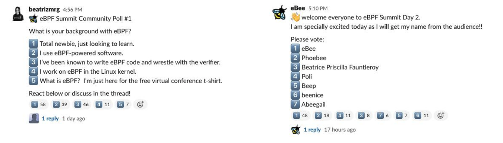

# eBPF Summit Day Two

After an exciting start with the **[first day](/blog/2020/10/28/ebpf-summit-day-1)** of
the **[eBPF Summit](https://ebpf.io/summit-2020)**, the second and also final day of
the summit this year was kicked off with another warm welcome from Thomas Graf, during
which he reminded attendees:

> Bees are nice. Be a bee.

Thomas set the stage for an incredible list of presenters for today's keynote
talks, but not before announcing the winner of yesterday's trivia question
_Which mountain is behind Thomas in the video background?_ The correct answer was
provided by Slack user Bala and they are receiving a cute plush bee as a reward.
Some of the Slack user poll results were also presented and it was great to see
that a lot of participants were completely new to eBPF. Naming suggestions for
the eBPF mascot that we collected from the prior day also found a clear winner:

Full length video of the eBPF Summit, day two:

<YoutubeIframe embedId='jw8tEPP6jwQ?start=35&color=white'/>

## Safe Programs, the Foundation of BPF by Alexei Starovoitov (Facebook)

[See on Youtube.](https://www.youtube.com/watch?v=AV8xY318rtc)

Alexei Starovoitov from Facebook kicked off the keynotes with his talk titled
"Safe programs. The foundation of BPF." Alexei is the co-creator and co-maintainer
of eBPF. Alexei's talk was focused on eBPF as a means of extending and programming
the kernel, a much safer approach than with kernel modules. Thanks to the verifier,
programs are checked for safety, ensuring they will not crash the kernel and bring
the system to a halt.

Guaranteeing that safety isn't always easy. In particular, Alexei discussed how
the compiler and verifier can play a game of cat and mouse. With each new
optimization pass, the compiler obfuscates a little more the original intent of
the programmer, making it harder for the verifier to validate the compiled
bytecode is safe.

Alexei went on to explain how BPF Type Format (BTF) further strenghen that
safety, by providing a form of type safety to the constrained BPF C language.
What's next? Look out for new features in development, including the eBPF linker,
eBPF libraries, and eBPF dynamic linking extensions. Alexei closed with a quote:

> Maximum attention to safety in all aspects of BPF programming that's what makes it unique and that's why BPF is an undoubted choice today for kernel extensions and kernel programming.

## Kernel Tracing in Production with Falco by Kris Nóva (Falco)

[See on Youtube.](https://www.youtube.com/watch?v=6E-xA0ZjIGM)

Following Alexei, Kris Nóva from Falco quickly stole the stage—or rather the
presentation screen—to present her own screen sporting a retro hacker theme.
Kris is a maintainer of the Falco project.
Her talk title changed multiple times throughout the weeks leading up to the summit,
finally landing on "How do we instrument the kernel without a kernel module in GKE?"
Falco uses kernel instrumentation to trace what's happening in the kernel and
publish alerts based on specific rules. To do this, a kernel module loaded on a host
provides the necessary access. But what about GKE where there is no support
for loading kernel modules on a host? This is where eBPF proved to be a natural
solution. Falco developers wrote an emulation device using eBPF and were able to
replace the kernel module. With an eBPF-based engine now able to run in place
of the Linux kernel module, the other parts of Falco were able to plug in easily
without much change. Kris went on to show some examples of Falco in action using
a kernel module, eBPF with clang 9 and clang 10—the main purpose of the examples
being to demonstrate the ease of moving between the different implementations and
how they all work to alert about suspicious activity.

## Performance Wins with BPF: Getting Started by Brendan Gregg (Netflix)

[See on Youtube.](https://www.youtube.com/watch?v=wyfhjr_ufag)

After the break, Brendan Gregg from Netflix presented on "Performance wins with
BPF: Getting started." Brendan's primary goal is to help people find performance
wins with eBPF quickly and easily. Many articles about eBPF aren't for beginners,
but Brendan believes that, by thinking like sysadmins, not like programmers,
everyone can benefit from eBPF. Brendan highlighted some tools we can explore
that are available today, such as _execsnoop_ to find periodic
processes, _opensnoop_ to find misconfigurations or files not found, _tcplife_ to
inspect TCP session details, _ext4slower_ to find slow I/O performance, or _biosnoop_
for finding block I/O performance bottlenecks. These tools are just a few examples
of easily-accessible programs that can help find unusual activity for some quick
wins. Beyond these examples, there is a huge selection of tools included in the
bcc and bpftrace toolkits which can be easily leveraged for even more gains.

In a majority of cases, existing tools can solve the problem, but when they can't
then it's time to think like a programmer and build the solution. If you are just
getting started today, Brendan suggests to start with bpftrace because it is concise
and behaves like pseudo-code. If looking into bcc implementations, Brendan first
recommends to check out libbpf-based tools for an implementation instead. Thanks to
libbpf, Brendan was able to build _opensnoop_ into a single 151KB binary.

Brendan believes the future of eBPF is in development in the form of GUIs which
surface some of the same information, but use eBPF under the hood.
He believes that the ability to surface this data to operators or users, with no
knowledge of the intermediate system relying on eBPF, will open up new avenues.
In closing, Brendan encourages everyone to think like a sysadmin, install bcc and
bpftrace tools, run them, and get some wins. To dive even deeper into eBPF, you
should pick up a copy of Brendan's books, "BPF Performance Tools" and "Systems
Performance 2nd edition".

## Kubernetes Network Policy Logging with eBPF by Zang Li (Google)

[See on Youtube.](https://www.youtube.com/watch?v=oLS25ztnlMk)

Zang Li from Google presented next on "Kubernetes Network Policy Logging with
eBPF." Zang works on GKE and Anthos and is also a Cilium core project member. She started
with an explanation of how Kubernetes network policies are implemented, along with
an example policy and scenario. She went on to highlight how differences in
implementation from one CNI provider to the next directly impact how policies
are implemented, whether that is via iptables, eBPF, Open vSwitch, or some other
implementation. In addition to enforcement, she added that security-conscious
customers will want to be able to log events related to policy decisions.

For Google, it was important this happened with minimal impact to the data path.
During their design phase, they quickly realized that iptables would not scale
to satisfy their complex networking requirements. Cilium provided the flexibility
and programmability they needed. In addition, its implementation of eBPF-based
network policies meant that Google could remove all reliance on iptables from
the data path. These factors ultimately led Google to select Cilium as the CNI
provider for GKE and Anthos.

Zang went on to explain how Google has extended, and makes use of, the Cilium
monitor infrastructure to extract and log useful data about network connections. To
provide visibility and observability into network connectivity, Google uses
Cilium monitor, which runs as a user space application and is able to access data
made available by eBPF programs through a perf ring buffer. This
buffer can contain any information they might need, such as event type, source,
policy verdict, direction, and more. Google further optimized this process by only
generating policy events on new connections, not on every packet observed, allowing
for a detailed policy logging engine.

Thanks to the partnership between Google and Cilium, users can leverage this
functionality on [Google Kubernetes Engine](https://cloud.google.com/blog/products/containers-kubernetes/bringing-ebpf-and-cilium-to-google-kubernetes-engine)
today.

## The Future of eBPF-based Networking and Security by Thomas Graf (Isovalent)

[See on Youtube.](https://www.youtube.com/watch?v=slBAYUDABDA)

Thomas Graf, CTO and co-founder of Isovalent, closed the keynote talks with
"The Future of eBPF-based Networking and Security." Before we can understand why
eBPF is the future, we need to briefly look at history. In the 1990s, networking
was almost entirely physical. It was also the time of dial-up modems. In 1999,
iptables was created as a successor for ipchains. In 2003, VLANs came to be, the Xen
hypervisor was born, and EMC bought VMWare. KVM was merged into the Linux kernel
in 2007, as virtualization era was upon us. However, in the case of networking,
almost nothing had changed. In 2009, the first release of Open vSwitch started
the network virtualization era. In 2010, OpenStack was born. 2013 brought us
Docker, which directly inherited networking from the virtualization layers and
containers were initially treated like miniature VMs. In 2014, Kubernetes was born and
deliberately did not make many networking implementation assumption. Despite this,
Kubernetes was initially heavily based on iptables, a system that literally was designed
15 years prior when modems ruled.

In that same year, 2014, eBPF was initially introduced to the Linux kernel.
2015 saw Linux networking become programmable and, in 2016, XDP was merged into
the kernel—and is now the base for many eBPF-based load balancing solutions.
In 2016, Cilium project was first announced, designed entirely from scratch, with
eBPF at its foundation. The transition was complete. We had moved from
an era first built on top of physical servers, to an era based on virtual
machines where software-defined networking was first born, to nowadays
where the networking and security layers are built specifically for
cloud-native workloads. Google's adoption of the eBPF-based Cilium project for
its flagship Kubernetes products GKE and Anthos is a great example on how eBPF
plays a central role in networking and security for Kubernetes and cloud-native
environments.

What's next? Thomas believes the industry will start to focus on edge load
balancing with eBPF and XDP. He sees continuing opportunities to improve
application awareness by further improving pod-to-pod and socket-to-socket
networking. Similarities between API and system calls will lead to a more
unified approach to network and system
security, with less separation of concerns between policy, enforcement and alerting.
Finally, he sees an opportunity to bridge physical and
virtualized or containerized workloads, as well as eBPF-based service meshes
being implemented more in the kernel.

For the Cilium project, it has been an exciting trip over the past 4 years. It's
almost certain to become more exciting as eBPF opens up additional possibilities,
not just for networking but for all forms of observability, security, tracing,
and so much more.

## Lightning Talks

After another break, we returned for another incredible round of lightning talks,
all of which were just 5 minutes in length but were absolutely full of amazing
content:

- Giulia Frascaria (Vrije Universiteit Amsterdam) - [Can eBPF Save us from the Data Deluge? A Case for File Filtering in eBPF](https://www.youtube.com/watch?v=qEtDoHWYrhA)
- Timo Reimann (Digital Ocean) - [From Managed Kubernetes to App Platform: 1.5 Years of Cilium Usage at DigitalOcean](https://www.youtube.com/watch?v=xez34h7EY3A)
- Zain Asgar (Pixie) - [Debugging Go in Prod with eBPF](https://www.youtube.com/watch?v=Q7mqIB7eatQ)
- Martynas Pumputis (Isovalent) - [North-South Load Balancing of Kubernetes Services with eBPF/XDP](https://www.youtube.com/watch?v=XN3mJF7g8dQ)
- Luan Guimarães (Wildlife Studios) - [Global Gaming Infrastructure with Cilium](https://www.youtube.com/watch?v=_1t3bXzptP0)
- Ramiro Berrelleza (Okteto) - [The Tale of Smokey and the Crypto Bandits](https://www.youtube.com/watch?v=tplv3Hjjv2Q)
- Vlad Ungureanu (Palantir) - [Past, Present, and Future of Cilium and Hubble at Palantir](https://www.youtube.com/watch?v=3K5WJ_h5PhI)
- Itay Shakury (Aqua Security) - [Tracing and Detecting Malware using eBPF](https://www.youtube.com/watch?v=UD7bF6nWagQ)
- Natalia Reka Ivanko (Isovalent) - [Identity Aware Threat Detection and Network Monitoring by using eBPF](https://www.youtube.com/watch?v=JQZQwR57Lmg)
- William Findlay (Carleton University) - [bpfbox: Simple Precise Process Confinement with eBPF and KRSI](https://www.youtube.com/watch?v=evHw9QHElNE)
- Lorenz Bauer (Cloudflare) - [How to Ship BPF with your Go Project](https://www.youtube.com/watch?v=lijS-0da5U8)
- Yutaro Hayakawa (LINE) - [eBPF at LINE's Private Cloud](https://www.youtube.com/watch?v=cxfVpBYlol4)
- Dinesh Venkatesan (Microsoft) - [Building a Behavioral Knowledge Graph using eBPF](https://www.youtube.com/watch?v=Sun0bWGVl_o)
- Andrey Ignatov (Facebook) - [Containers and BPF: twagent story](https://www.youtube.com/watch?v=lO0dYHl3I8Y)

We hope you had as much fun attending the eBPF Summit as we did hosting it.
We'd like to give a huge thanks to everyone who attended, all of our speakers and
the amazing team of people who worked in the background to support the event and
make it a success.

For more information about eBPF, you can visit the [ebpf.io](https://ebpf.io)
website or join us on [Slack](https://ebpf.io/slack).
