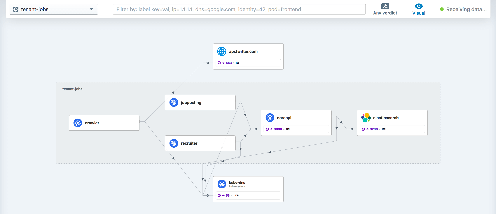

We are excited to announce the Cilium 1.9 release. A total of 2816 commits have
been contributed by a community of 251 developers, many of whom made their first
contributions this cycle. Cilium 1.9 brings with it several brand new features:

- **Maglev Load Balancing**: Maglev provides load balancing with consistent
  hashing for high-availability scenarios by dynamically adapting to
  environments where nodes come and go. Connections are consistently balanced
  to backends even if the packets arrive at different load balancing nodes.
  ([More details](#maglev))
- **Deny Network Policies**: Users can now define network policies that
  explicitly reject traffic from specific sources or to specific destinations.
  These policies may be configured via CiliumNetworkPolicy or
  CiliumClusterwideNetworkPolicy, allowing multi-tenant environments to have
  baseline restrictions on connectivity and also delegate allow policies to
  application teams. ([More details](#deny-policy))
- **VM/Metal Support**: Cilium can now be deployed on any
  VM or baremetal node to connect that node to the Cilium cluster and
  represent external workloads running on such nodes as if the workload was
  running as a Pod inside the Kubernetes cluster. These nodes also gain access to
  Kubernetes services, and the visibility and policy enforcement scope of Cilium
  is extended to cover the VMs and baremetal nodes.
  ([More details](#vmsupport))
- **Bandwidth Manager**: A new bandwidth manager automatically optimizes TCP
  Congestion Control and other network settings for improved latency and
  throughput. Fair queueing is automatically enabled and rate
  limiting can be configured including support for the
  `kubernetes.io/egress-bandwidth` annotation.
  ([More details](#bwmanager))
- **OpenShift Support**: A new guide describes the installation of Cilium on
  OpenShift. Red Hat Universal Base Image (UBI) based builds and an operator
  to simplify installation will become available in the next weeks.
  ([More details](#openshift))
- **Hubble mTLS Automation**: Hubble is now capable of automatically generating
  and distributing TLS certificates between Hubble agents to secure the
  communication between all Hubble components.
  ([More details](#hubble))
- **eBPF-Based Node-Local DNS and KIAM**:
  The new eBPF-based Local Redirect Policies allow to build node-local
  DNS resolvers, KIAM, and other node-local services entirely with eBPF instead
  of relying on iptables. ([More details](#lrp))
- **Datapath Optimizations (iptables bypass)**: We have added two new eBPF
  helpers to the Linux kernel that allow implementing the direct routing
  datapath entirely in eBPF and bypassing netfilter/iptables entirely. This leads
  to significant improvements in throughput and latency, in particular for
  single stream TCP sessions. Cilium automatically enables these optimizations
  on kernel 5.10 or later. ([More details](#veth))
- **Lots of other improvements**: This release brings lots of additional
  improvements such as [High Availability for Cilium Operator](#operator-ha) to
  improve fault tolerance, [Hubble UI improvements](#ui), [Transparent Proxy
  Support](#tproxy) in eBPF, and a new [Performance Testing
  Framework](#perftest).

# What is Cilium?

Cilium is open source software for transparently providing and securing the
network and API connectivity between application services deployed using Linux
container management platforms such as Kubernetes.

At the foundation of Cilium is a new Linux kernel technology called eBPF, which
enables the dynamic insertion of powerful security, visibility, and networking
control logic within Linux itself. eBPF is utilized to provide functionality
such as multi-cluster routing, load balancing to replace kube-proxy,
transparent encryption as well as network and service security. Besides
providing traditional network-level security, the flexibility of eBPF enables
security with the context of application protocols and DNS requests/responses.
Cilium is tightly integrated with Envoy and provides an extension framework
based on Go. Because eBPF runs inside the Linux kernel, all Cilium
functionality can be applied without any changes to the application code or
container configuration.

See the section **[Introduction to Cilium]** for a more detailed general
introduction to Cilium.

# eBPF Summit 2020 - Recordings are now available

We hosted the first ever eBPF Summit in October this year. The recordings
including all keynotes and lightning talks are now available on the [eBPF
Summit website](https://ebpf.io/summit-2020).

<a name="maglev"></a>

# Maglev Load Balancing

_Contributed by Daniel Borkmann and Martynas Pumputis_


In [Cilium 1.8](/blog/2020/06/22/cilium-18#kube-proxy-replacement-at-the-xdp-layer)
we extended Cilium's eBPF-based north-south load balancer to run at the XDP layer and
accelerate handling for Kubernetes service types `NodePort`, `LoadBalancer`, and
services with `externalIPs`. This significantly reduces CPU overhead and supports
handling millions of packets per second efficiently while being co-located with regular
user workloads. The new release complements the north-south load balancer by adding support
for [Maglev](https://storage.googleapis.com/pub-tools-public-publication-data/pdf/44824.pdf)'s
consistent hashing algorithm for the backend selection.

By default, Kubernetes service load balancing implemented by kube-proxy or Cilium
selects service backends randomly and ensures that the traffic remains sticky to the backend.
However, the issue with this scheme is that in case of a node failure, the upstream load
balancer selects a different load balancing node which has no prior context on
which backend is currently serving the connection. This eventually leads to unexpected
disruptions on connection-oriented protocols like TCP as client connections are being reset
by the newly selected backends.

<center>
<div
  style=" max-width: 1225px; height: 530px; margin-top: -40px; margin-bottom: -40px; background: url('/2020-11-cilium-19-random.gif') #fff no-repeat center; background-size: contain;">
</div></center>

Maglev consistent hashing minimizes such disruptions by ensuring that each load balancing node
has a consistent view and ordering for the backend lookup table such that selecting the backend
through the packet's 5-tuple hash will always result in forwarding the traffic to the very
same backend without having to synchronize state with the other nodes. This not only improves
resiliency in case of failures but also achieves better load balancing properties since newly
added nodes will make the same consistent backend selection throughout the cluster.

Aside from that, the Maglev consistent hashing algorithm ensures even balancing among backends
as well as minimal disruptions in the case where backends are added or removed. Specifically,
a flow is highly likely to choose the same backend after adding or removing a backend for a service
as it did before the operation. Upon backend removal, the backend lookup tables are reprogrammed
with minimal changes for unrelated backends, that is, typical configurations
provide the upper bound of at most 1% tolerable difference in the reassignments.

<center>
<div
  style=" max-width: 1225px; height: 530px; margin-top: -25px; margin-bottom: -40px; background: url('/2020-11-cilium-19-maglev.gif') #fff no-repeat center; background-size: contain;">
</div></center>

In order to support Maglev in Cilium's eBPF load balancer, the datapath backend selection
algorithm is now pluggable between `maglev` and `random`. Maglev achieves the better
resiliency by trading off memory consumption for its potentially large lookup tables. Our
implementation optimizes the needed memory overhead by "compressing" the lookup tables into
an eBPF array-in-hash map lookup instead of using a single flat array for all services. This
allows us to scale memory on demand and ensures dynamic provisioning of services as is the
case with Kubernetes. To take memory reduction even further, we also [extended](https://git.kernel.org/pub/scm/linux/kernel/git/torvalds/linux.git/commit/?id=4a8f87e60f6db40e640f1db555d063b2c4dea5f1) the eBPF map-in-map infrastructure in the Linux kernel to enable
dynamic inner array map sizes. This paves the way for the next Cilium release to annotate
Kubernetes service specification with hints on whether a given service has a small or
large number of backends.

Maglev-based backend selection for Cilium's load balancer can be enabled by setting the Helm
option `loadBalancer.algorithm=maglev`. Further information and tunables on Maglev can be
found in its [getting started guide](https://docs.cilium.io/en/v1.9/gettingstarted/kubeproxy-free/#maglev-consistent-hashing-beta).

<a name="deny-policy"></a>

# Deny-based Network Policy

_Contributed by André Martins_

By default, Cilium's behavior, as defined in Kubernetes, allows traffic to and
from Pods until a Kubernetes, or a Cilium, Network Policy selects that
particular Pod. This is powerful because it allows defining which Pods and other
entities can be allowed to communicate with the selected Pod. However,
this does not cover cases where it is useful to explicitly define which network
peers must _not_ be able to communicate.

The 1.9 release brings deny-based network policies to Cilium. These policies
will take precedence over any other rules as they are intended to explicitly
deny traffic. As an example, if a cluster is under attack by an external
entity, operators can immediately deploy the following policy to stop the
attack:

```yaml
apiVersion: 'cilium.io/v2'
kind: CiliumClusterwideNetworkPolicy
metadata:
  name: 'external-lockdown'
spec:
  endpointSelector: {}
  ingressDeny:
    - fromEntities:
        - 'world'
  ingress:
    - fromEntities:
        - 'all'
```


More information about deny policies can be found
[in the relevant documentation](https://docs.cilium.io/en/v1.9/policy/language/#deny-policies).

<a name="vmsupport"></a>

# VM Support / External Workloads

_Contributed by Jarno Rajahalme_

<center>
<div
  style=" max-width: 950px; height: 452px; background: url('/2020-10-cilium-19-vm.png') #fff no-repeat center; background-size: contain;">
</div></center>

A major focus of Cilium 1.9 has been to enable Cilium to run in other
environments where users are already running workloads. VM support, or more
generally speaking, the ability to join any node to the Cilium cluster, allows
integrating non-Kubernetes workloads with Cilium.

In many practical cases it is infeasible to move all service components to a
Kubernetes cluster at once. So far, Cilium has classified ingress from any
non-Kubernetes workload as either `WORLD`, making it impossible to distinguish
your own external nodes from any random Internet host, or as a `fromCIDR` that
allows distinguishing traffic from specific IP addresses or ranges. New support
for external workloads enables non-Kubernetes nodes to join the cluster, allowing
you to apply label-based policies on the traffic between the cluster Pods
and such external nodes. External nodes joining the cluster also get access to
cluster's services and can resolve cluster names using cluster's kube-dns.
This is a beta feature that will be further enhanced in coming releases. For more
information see the new [Setting up Support for External Workloads Getting Started Guide][vmsupport-gsg].

[vmsupport-gsg]: https://docs.cilium.io/en/v1.9/gettingstarted/external-workloads/

<a name="openshift"></a>

# OpenShift Support

_Contributed by Ilya Dmitrichenko_

Support for OpenShift has been requested by many community members for a long
time now. While it was already possible to run on OpenShift, the lack of a good
guide made it challenging to get started. This release introduces a [Getting
Started Guide for OpenShift OKD][okd-gsg], the primary aim being to show
administrators how to install Cilium on new [OKD][] clusters. The guide relies
on `openshift-install` tool and has been tested in most of the major cloud
providers. This documentation has also been made available in the Cilium 1.8 documentation.
At the time of the 1.9.0 release, work is ongoing to enable further integration
with [OpenShift Container Platform][ocp] by automating installation steps with
an operator that will be submitted for RedHat certification.

[okd-gsg]: https://docs.cilium.io/en/v1.9/gettingstarted/k8s-install-openshift-okd/
[okd]: https://www.okd.io/
[ocp]: https://www.openshift.com/products/container-platform

<a name="hubble"></a>

# Making Observability Easier with Hubble

_Contributed by Alexandre Perrin, Robin Hahling, Sebastian Wicki and others_

Hubble, the network and security observability component built into Cilium, has
gained many quality of life improvements with this release, making it even
easier to use and deploy.

In the previous release of Cilium, we [announced initial support for cluster-wide
visibility via _Hubble Relay_](/blog/2020/06/22/cilium-18#hubblerelay).
During the Cilium 1.9 development cycle, we have made continuous improvements to
Hubble Relay to ensure it works reliably. Many of these changes were backported
and have thus already been available in recent minor releases of Cilium 1.8.

In Cilium 1.9, connections from Hubble Relay to nodes is secured using mutual
TLS (mTLS) by default. Hubble Relay has also gained support for optional
TLS/mTLS when serving clients such as the Hubble CLI. Therefore, we are happy to
announce that cluster-wide visibility with Hubble Relay has reached _General
Availability_ (GA) with Cilium 1.9. We are excited for more users to try it out!

We have made many small improvements to ensure deploying and operating Hubble
remains easy. For example, TLS certificates required for mTLS are automatically
generated and distributed by default. Of course, sophisticated users can still
employ [their own certificate
infrastructure](https://docs.cilium.io/en/v1.9/concepts/observability/hubble-configuration/#use-custom-tls-certificates).
This is notably required in a [Cluster Mesh
scenario](https://docs.cilium.io/en/v1.9/concepts/clustermesh/) to get
cross-cluster visibility via Hubble Relay.

As another notable improvement, support for TLS certificates hot reloading was
added. This means that new TLS certificates are automatically picked up by
Cilium agent and Hubble Relay Pods without requiring a restart nor breaking any
existing connection. This allows for painless and frequent TLS certificate
renewals.

<a name="ui"></a>

## Hubble UI

_Contributed by Dmitry Kharitonov and Renat Tuktarov_

_Hubble UI_, the graphical user interface for Hubble, has been fully reworked for
this release. Its backend has been entirely rewritten in Go for overall better
performance, which means it now also scales better with the workload and cluster
size. The frontend and service dependency map interface has been redesigned
to provide better user experience, especially in busy namespaces with lots of
active services.



The new Hubble UI makes it easier to find dropped flows within a namespace by
highlighting them as special edges in the service map.


## Hubble CLI

_Contributed by Glib Smaga, Michi Mutsuzaki, Robin Hahling, Sebastian Wicki and
others_

Cilium 1.9 also coincides with a new release of the Hubble CLI. Hubble CLI 0.7
supports all new additions to the Hubble and Hubble Relay API available in
Cilium 1.9.

One of the most visible changes is that Hubble Relay now reports the number of
nodes to which it is connected. This information is available when using the
`status` subcommand:

```shell-session
$ hubble status
Healthcheck (via localhost:4245): Ok
Current/Max Flows: 81920/81920 (100.00%)
Flows/s: 9.80
Connected Nodes: 20/20
```

In case of connection failures, a list of unavailable nodes is shown. This
provides a good starting point to troubleshoot eventual connectivity issues of
Hubble Relay to nodes:

```shell-session
$ hubble status
Healthcheck (via localhost:4245): Ok
Current/Max Flows: 24576/24576 (100.00%)
Flows/s: 9.80
Connected Nodes: 6/20
Unavailable Nodes: 14
  - kind-worker10
  - kind-worker11
  - kind-worker12
  - kind-worker14
  - kind-worker15
  - kind-worker16
  - kind-worker18
  - kind-worker7
  - kind-worker8
  - kind-worker9
  - and 4 more...
```

Hubble CLI now also supports new flags for HTTP method and path filters:

```shell-session
$ hubble observe --namespace galaxy --http-method POST --http-path /v1/request-landing
TIMESTAMP             SOURCE                                DESTINATION                           TYPE            VERDICT     SUMMARY
Oct 29 15:03:01.839   galaxy/tiefighter:59238               galaxy/deathstar-87c949bbd-gmw98:80   http-request    FORWARDED   HTTP/1.1 POST http://deathstar.galaxy.svc.cluster.local/v1/request-landing
Oct 29 15:03:01.840   galaxy/deathstar-87c949bbd-gmw98:80   galaxy/tiefighter:59238               http-response   FORWARDED   HTTP/1.1 200 1ms (POST http://deathstar.galaxy.svc.cluster.local/v1/request-landing)
```

Another quality of life improvement in the Hubble CLI is the new `hubble config`
sub-command to inspect and edit its config file, allowing users to persist
settings, such as the newly added support for TLS-protected API endpoints.

While most users will want to use the Hubble CLI to submit cluster-wide queries
against Hubble Relay, another notable change in Cilium 1.9 is that the
Cilium Pods now also expose the Hubble API locally by default, making it
easier to [troubleshoot node-local issues](https://docs.cilium.io/en/v1.9/operations/troubleshooting/#observing-flows-with-hubble).

This new version of the Hubble CLI contains many more features
([`jsonpb`](https://developers.google.com/protocol-buffers/docs/proto3#json)
support, support for fish and powershell completion, addition of flows per
second output in the status subcommand, Linux arm and arm64 binaries, and more).
See its [changelog](https://github.com/cilium/hubble/blob/v0.7/CHANGELOG.md) for
the full list of changes.

<a name="lrp"></a>

# Node-Local Redirect Policies

_Contributed by Aditi Ghag and Weilong Cui_

The 1.9 release introduces Cilium Local Redirect Policies, which enable application
Pod traffic destined to an IP address and port/protocol tuple or Kubernetes service
to be redirected locally to a backend Pod within a node. The policies can be
gated by Kubernetes Role-Based Access Control (RBAC) framework.

There are two types of Local Redirect Policies supported. When traffic for
a Kubernetes service needs to be redirected, use the `ServiceMatcher` type.
When traffic matching IP address and port/protocol that does not belong to
any Kubernetes service needs to be redirected, use the `AddressMatcher` type.

```yaml
apiVersion: 'cilium.io/v2'
kind: CiliumLocalRedirectPolicy
metadata:
  name: 'nodelocaldns'
  namespace: kube-system
spec:
  redirectFrontend:
    serviceMatcher:
      serviceName: kube-dns
      namespace: kube-system
  redirectBackend:
    localEndpointSelector:
      matchLabels:
        k8s-app: node-local-dns
    toPorts:
      - port: '53'
        name: dns
        protocol: UDP
      - port: '53'
        name: dns-tcp
        protocol: TCP
```

Local Redirect Policies are in beta. Follow the [local-redirect-policy guide]
to get more details, including how to configure them for use cases like
setting up NodeLocal DNSCache and KIAM proxy.

<a name="operator-ha"></a>

# High Availability for cilium-operator

_Contributed by Deepesh Pathak_

The 1.9 release of Cilium brings High Availability for cilium-operator deployments.
Cilium operator is now an integral part of Cilium installation in Kubernetes environments,
and the agent requires the operator to be running before it can start functioning properly.
This dependency on the operator calls for a more robust deployment of cilium-operator in
the cluster. Cilium operator uses the Kubernetes
[leader election library](https://github.com/kubernetes/client-go/tree/release-1.19/tools/leaderelection)
in conjunction with lease locks to provide a HA cluster of cilium-operator instances.
The capability is supported on Kubernetes versions 1.14 and above and is Cilium's default
behavior for this release.

The number of replicas for the HA deployment can be configured using Helm option `operator.replicas`.

```shell-session
$ helm install cilium cilium/cilium --version 1.9.0 \
    --namespace kube-system \
    --set operator.replicas=3

$ kubectl get deployment cilium-operator -n kube-system
NAME              READY   UP-TO-DATE   AVAILABLE   AGE
cilium-operator   3/3     3            3           46s
```

<a name="bwmanager"></a>

# Bandwidth Manager

_Contributed by Daniel Borkmann_

The new Cilium Bandwidth Manager is responsible for
managing traffic more efficiently with the goal of improving overall application
latency and throughput. This functionality is focused in two areas, that is,
from an upper protocol and from a queueing discipline perspective.

When the Bandwidth Manager is enabled, it switches the TCP congestion
control algorithm by default to [BBR](https://cacm.acm.org/magazines/2017/2/212428-bbr-congestion-based-congestion-control/fulltext)
which achieves higher bandwidths and lower latencies in particular for Internet-facing
traffic. It configures the kernel's networking stack to more server-oriented sysctl
settings that have proven beneficial in production environments. And it reconfigures
the traffic control queueing discipline (Qdisc) layer to use multi-queue Qdiscs with Fair Queue (FQ)
on all external-facing network devices used by Cilium. With switching to
FQ, the Bandwidth Manager also implements support for Earliest Departure Time ([EDT](https://www.youtube.com/watch?v=MAni0_lN7zE))
rate-limiting with the help of eBPF and now natively supports the `kubernetes.io/egress-bandwidth`
Pod annotation.

This also removes the need for chaining the bandwidth CNI plugin which has
scalability limitations given its use of TBF (Token Bucket Filter). With the EDT-based
model, global locking in the Qdisc layer in particular under multi-queue NICs can
be avoided. Cilium's eBPF datapath classifies network traffic into a per-Pod
aggregate which then enforces the user-defined `kubernetes.io/egress-bandwidth`
rate by setting earliest departure timestamps on the network packets on egress,
shortly before passing the packet to the FQ leaf Qdiscs. The latter maintains a per-flow
state and schedules their departure by respecting that packets are not sent
out earlier than their timestamp dictates. Through the flexibility of eBPF, the
classification into the Pod aggregate works not only for direct routing, but also
in case of tunnelling or use of L7 proxies.

<center>
<div
  style=" height: 500px; background: url('/2020-10-cilium-19-edt.png') #fff no-repeat center; background-size: contain;">
</div></center><br/>

Evaluating the application latency under rate-limiting with HTB (Hierarchical Token Bucket) compared
to eBPF with FQ [shows](https://netdevconf.info/0x14/session.html?talk-replacing-HTB-with-EDT-and-BPF)
that the CPU utilization can be reduced significantly while improving transmission latency.
Latency reductions of about 20x have been observed for the 95th percentile as well as reductions of
about 10x for the 99th percentile when eBPF and FQ are used in combination.

Below is an example deployment for an application Pod whose egress bandwidth is
limited to 50 Mbit/s thanks to the `kubernetes.io/egress-bandwidth` annotation:

```yaml
apiVersion: apps/v1
kind: Deployment
metadata:
  name: netperf
spec:
  selector:
    matchLabels:
      run: netperf
  replicas: 1
  template:
    metadata:
      labels:
        run: netperf
      annotations:
        kubernetes.io/egress-bandwidth: '50M'
    spec:
      containers:
        - name: netperf
          image: cilium/netperf
          ports:
            - containerPort: 12865
```

Cilium's Bandwidth Manager can be enabled by setting the Helm option `bandwidthManager=true`.
Further information on the Bandwidth Manager can be found in its [getting started guide](https://docs.cilium.io/en/v1.9/gettingstarted/bandwidth-manager/).

<a name="veth"></a>

# Virtual Ethernet Device Optimization with eBPF

_Contributed by Daniel Borkmann_

During the course of the 1.9 development cycle, we have performed a number of eBPF
datapath performance optimizations. One that stands out in particular is the
improvement of raw performance for network-namespaced Pods connected to the host
namespace through a veth device pair, as is the default operation mode in Cilium. When
Cilium is used in direct routing mode, traffic that is ingressing to or
egressing from Pods is passed up the network stack inside the host namespace in order
to let the routing layer perform the forwarding. Historically, this was a
necessity mainly for letting the netfilter subsystem masquerade egressing Pod
traffic. This masquerading also required the connection tracker to see traffic from both
directions in order to avoid drops from invalid connections (asymmetric visibility
of traffic in the connection tracker would apply here, too).

Thanks to recent advances of Cilium's datapath in
[prior releases](/blog/2020/06/22/cilium-18#voyaging-towards-iptables-free),
we are able to perform masquerading natively in eBPF code. Given that,
in the course of 1.9 development, we have extended the eBPF networking functionality for the
v5.10 kernel ([part1](https://lore.kernel.org/bpf/cover.1601477936.git.daniel@iogearbox.net/)
and [part2](https://lore.kernel.org/bpf/20201010234006.7075-1-daniel@iogearbox.net/))
in order for Cilium to handle forwarding right in the tc eBPF layer instead
of having to push packets up the host stack. This results in significant gains
in single stream throughput as well as significant reductions in latency for request/response-type
workloads. The two helpers `bpf_redirect_peer()` and `bpf_redirect_neigh()` that
we have added to the Linux kernel as well as Cilium 1.9 code base enable the new
packet handling in the host namespace.

The `bpf_redirect_peer()`
enables switching network namespaces from the ingress of the NIC to the ingress of the
Pod without a software interrupt rescheduling point when traversing
the network namespace. The physical NIC can thus push packets up the
stack into the application's socket residing in a different Pod namespace in _one
go_. This also leads to quicker application wake-up for picking up the received
data. Similarly, rescheduling points are reduced from 2 to 1 for local Pod-to-Pod
communication resulting in better latency there as well.

The `bpf_redirect_neigh()` handles a Pod's egress traffic by injecting the traffic
into the Linux kernel's neighboring subsystem, allowing to find the next hop and
resolving layer 2 addresses for the network packet. Performing the forwarding
only in tc eBPF layer and not pushing the packet further up the networking stack also
provides proper back pressure for the TCP stack and feedback for TCP's TSQ (TCP Small
Queues) mechanism to reduce potential excessive queueing of TCP packets. That is,
feedback is given to the TCP stack that the packet has left the node instead of
inaccurately providing it too early when it would be pushed up to the host stack for
routing. This is now possible because the packet's socket association can be kept
intact when it is passed down into the NIC driver.

<center><br/>
<div
  style=" max-width: 1225px; height: 450px; background: url('/2020-10-cilium-19-tcp-combined.png') #fff no-repeat center; background-size: contain;">
</div></center><br/>

As can be seen from initial results, the single stream TCP throughput for a Pod to
remote Pod session under direct routing doubles in throughput for the nodes under test
when using Cilium 1.9's eBPF extensions on a v5.10 kernel as opposed to having
both directions handled by the host stack's forwarding. Similarly, the TCP request/response
transaction performance improved by almost 3x for the Pods under test when avoiding the
host stack.

The underlying kernel is automatically probed from Cilium by default and if available
for the configuration the eBPF kernel extensions will be transparently enabled for new
deployments. The latter requires the use of Cilium's eBPF kube-proxy replacement as
well as eBPF-based masquerading given netfilter in the host namespace is then bypassed.
This behavior can also be opted-out through the Helm `bpf.hostRouting` option.

<a name="tproxy"></a>

# Transparent L7 Proxying in eBPF

_Contributed by Joe Stringer_

A recurring theme that we hear from Cilium users is around the pain that
iptables brings to cluster operators, whether due to the limitations around
scalability, the operational complexity for debugging, or when the existing
functionality provides a 90% solution but the last 10% is too difficult to
achieve. Cilium's datapath is built on eBPF specifically to mitigate these
concerns by building a network forwarding layer designed for the needs of the
network now, not the needs of the 1990s.

Building upon the [eBPF TPROXY] work in the upstream kernel earlier this year,
the Cilium 1.9 release enables L7 policy natively in eBPF on kernel 5.7 or
later. This implementation is now simpler by reducing dependence on iptables
and the packet mark. Earlier this year at Linux Plumbers conference, we
discussed how [network applications need to co-ordinate packet mark
usage](https://www.linuxplumbersconf.org/event/7/contributions/683/) to ensure
that the kernel implements the network forwarding behavior that users desire.
The work on transparently proxying L7 proxy natively in eBPF provides a path to
better integrate Cilium with other CNIs by reducing such packet mark usage. On
the journey to a world free of iptables, this is yet another positive step
forwards.

<a name="perftest"></a>

# Performance Testing Framework

_Contributed by Kornilios Kourtis and Paul Chaignon_

Performance evaluation, and specifically evaluating network performance, is a
nuanced process. Small changes in the environment or setup (e.g., hardware,
kernel version and build options, system configuration, workload) can result in
substantial differences in measured performance. This makes it challenging to
evaluate Cilium's performance and causes confusion when seemingly similar setups
behave differently. Hence, in addition to the many performance improvements
Cilium 1.9 brings, we also developed utilities that enable both developers and
users to easily evaluate Cilium network performance in a reproducible way.

Specifically, we developed a benchmark for Kubernetes networking called
[kubenetbench](https://github.com/cilium/kubenetbench), as well as a [set of
tools](https://github.com/cilium/cilium-perf-networking) that cover the whole
process of performance evaluation: Provisioning machines, installing and
configuring software, and executing benchmarks. These tools not only fully
automate the evaluation, but also encompass best practices for producing
reliable results. Using the above tools, we performed an extensive evaluation
of Cilium network performance that is now [a part of our
documentation](https://docs.cilium.io/en/v1.9/operations/performance/), and
allows users to easily reproduce our results. Looking forwards, we plan to extend
our tools with more benchmarks and add this infrastructure to our CI process.

# Getting Started

New to Cilium? Follow one of the [Getting Started Guides].

# Upgrade Instructions

Follow the [upgrade guide] to upgrade your Cilium deployment. Cilium 1.9
deprecates the use of Helm 2 for managing deployments, as it is reaching
[end of life] on November 13, 2020. Furthermore, this release introduces new
option names for most Helm settings, see the guide for more details.
Feel free to ping us on [Slack] if you have any questions.

# Release

- Release Notes: [1.9.0](https://github.com/cilium/cilium/releases/tag/v1.9.0)
- Container images: `quay.io/cilium/cilium:v1.9.0`, `docker.io/cilium/cilium:v1.9.0`

[slack]: https://cilium.herokuapp.com/
[getting started guides]: https://docs.cilium.io/en/v1.9/gettingstarted
[upgrade guide]: https://cilium.readthedocs.io/en/v1.9/operations/upgrade/#upgrading-minor-versions
[changelog]: https://github.com/cilium/cilium/blob/v1.9/CHANGELOG.md
[introduction to cilium]: https://docs.cilium.io/en/v1.9/intro/
[end of life]: https://helm.sh/blog/helm-v2-deprecation-timeline/
[local-redirect-policy guide]: https://docs.cilium.io/en/v1.9/gettingstarted/local-redirect-policy/
[ebpf tproxy]: /blog/2020/06/22/cilium-18#ebpf-based-tproxy-replacement
