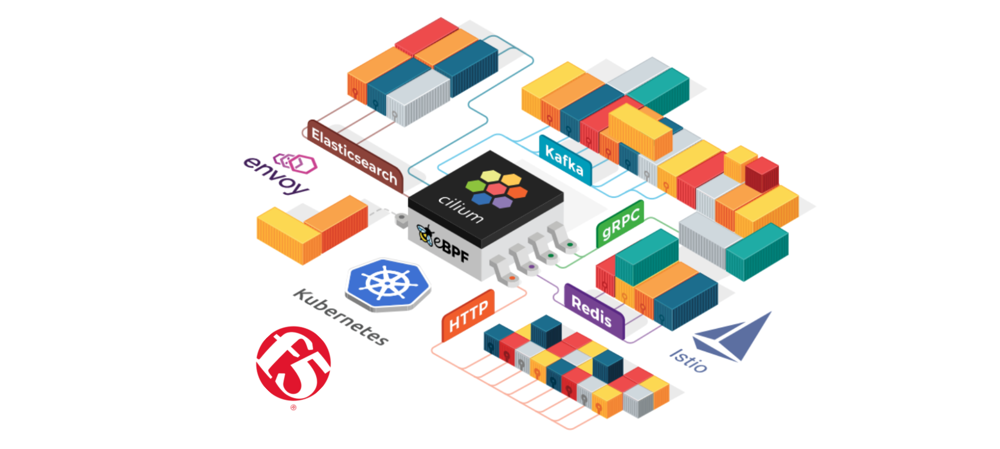
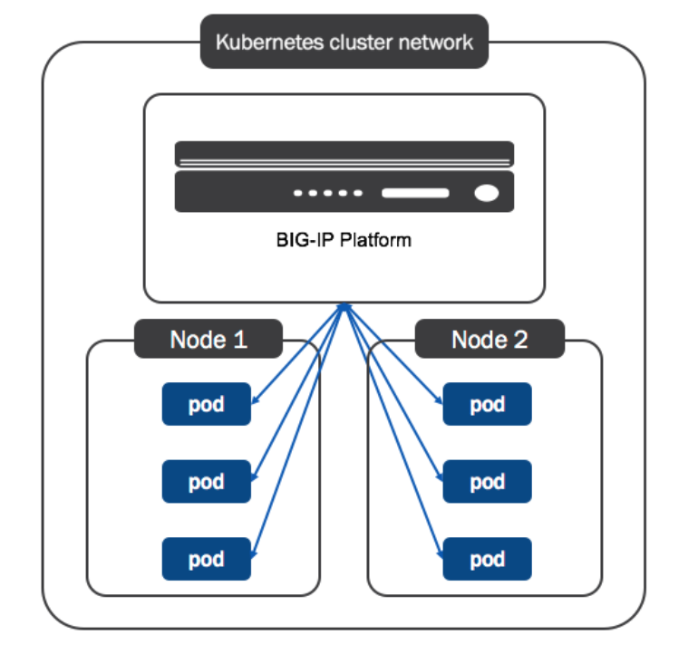

# Kubernetes Networking with Cilium and F5

This is a guest blog by Howard Hao. Howard is working as a Kubernetes
infrastructure SRE for [Ect888.com](http://www.ect888.com). In this post,
Howard will share how Ect888 uses [Cilium](https://cilium.io/) &
[F5](https://www.f5.com/) to build a scalable load-balancing infrastructure for
Ect888's production environment.

[Ect888.com](http://www.ect888.com) was established on January 8, 2015 and is a
chinese financial service provider with more than 200 employees serving more
than 2 million transactions per day in a Kubernetes environment that is hosting
thousands of pods.

## Setting up Cilium and F5 to serve traffic to Kubernetes pods

F5 plays a vital role as a load balancer in Ect888.com, all Internet traffic
flows through the [Global Traffic
Manager(GTM)](https://www.f5.com/pdf/products/big-ip-global-traffic-manager-ds.pdf),
and the [Local Traffic
Manager(LTM)](https://www.f5.com/pdf/products/big-ip-local-traffic-manager-ds.pdf)
subsequently. We want the traffic from the LGTM to be forwarded to pod IPs directly
so that we can take advantage of LTM's advanced functions such as intelligent
caching, extensive connection optimization and management. After a period of
struggle, we found that Cilium which is an awesome CNI solution could achieve
our goal with BIRD, that aims to develop a fully functional dynamic IP routing
daemon and [F5 BIG-IP Controller for
Kubernetes](https://clouddocs.f5.com/products/connectors/k8s-bigip-ctlr/v1.5/).

The following summarizes our environment and configuration.

### Environment Details

#### Hardware

- F5: F5-VPR-LTM-B2150
- Switch: Cisco N5K-C5696Q

#### Software

- OS: CentOS Linux release 7.7.1908
- Kernel: 5.9.3-1.el7.elrepo.x86_64
- F5: BIG-IP 13.3.1.4
- Kubernetes: v1.19.4
- Cilium: 1.8.4
- BIRD: 2.0.7

### Prerequisites

- A Kubernetes cluster with CNI enabled (We used kubeadm)

### Configuration

<b>Step 1</b>. Deploy Cilium on the Kubernetes cluster with [Helm](https://helm.sh/).

```shell-session
$ helm install cilium cilium/cilium --version 1.8.4 \
    --namespace kube-system \
    --set config.ipam=kubernetes \
    --set native-routing-cidr=<no_masquerade_ip_segment> \
    --set global.ipMasqAgent.enabled=true \
    --set global.kubeProxyReplacement=strict \
    --set global.k8sServiceHost=<your_apiserver_ip> \
    --set global.k8sServicePort=6443
```

All parameters above can be found in <i>values.yaml</i>, and it's noteworthy
that <code>native-routing-cidr</code> allows to explicitly specify the CIDR for
[native
routing](https://docs.cilium.io/en/v1.8/concepts/networking/routing/#native-routing),
which disables [IP
masquerading](https://docs.cilium.io/en/v1.9/concepts/networking/masquerading/#masquerading)
executed by Cilium automatically for the traffic sent from Pod to LTM, so that
the traffic can be forwarded to Pods directly.

<b>Step 2</b>. [Use BIRD to run BGP](https://docs.cilium.io/en/v1.9/gettingstarted/bird/#using-bird-to-run-bgp) between Kubernetes nodes and switch.

Configuration of BIRD:

```json
log syslog all;

router id <Node IP>;

protocol device {
        scan time 10;           # Scan interfaces every 10 seconds
}

# Disable automatically generating direct routes to all network interfaces.
protocol direct {
        disabled;               # Disable by default
}

# Forbid synchronizing BIRD routing tables with the OS kernel.
protocol kernel {
        ipv4 {                    # Connect protocol to IPv4 table by channel
                import none;      # Import to table, default is import all
                export none;      # Export to protocol. default is export none
        };
}

# Static IPv4 routes.
protocol static {
      ipv4;
      route <pod_cidr> via "cilium_host";
}

# BGP peers
protocol bgp uplink0 {
      description "BGP uplink 0";
      local <Node IP> as <BGP AS>;
      neighbor <Switch IP> as <BGP AS>;
      ipv4 {
              import filter {reject;};
              export filter {accept;};
      };
}

protocol bgp uplink1 {
      description "BGP uplink 1";
      local <Node IP> as <BGP AS>;
      neighbor <Switch IP> as <BGP AS>;
      ipv4 {
              import filter {reject;};
              export filter {accept;};
      };
}
```

Configuration of switch:

```
router bgp <BGP AS>
  neighbor <Node IP> remote-as <BGP AS>
    update-source loopback0
    address-family ipv4 unicast
```

Then, the switch should know Pod CIDR.

```shell-session
$ # run the following command on the switch.
$ show ip route bgp
IP Route Table for VRF "default"
'*' denotes best ucast next-hop
'**' denotes best mcast next-hop
'[x/y]' denotes [preference/metric]
'%<string>' in via output denotes VRF <string>

10.16.0.0/24, ubest/mbest: 1/0
    *via 10.1.0.1, [200/0], 3w4d, bgp-64512, internal, tag 64512,
10.16.1.0/24, ubest/mbest: 1/0
    *via 10.1.0.2, [200/0], 3w4d, bgp-64512, internal, tag 64512,
10.16.2.0/24, ubest/mbest: 1/0
    *via 10.1.0.3, [200/0], 3w4d, bgp-64512, internal, tag 64512,
10.16.3.0/24, ubest/mbest: 1/0
    *via 10.1.0.4, [200/0], 3w4d, bgp-64512, internal, tag 64512,
10.16.4.0/24, ubest/mbest: 1/0
    *via 10.1.0.5, [200/0], 3w4d, bgp-64512, internal, tag 64512,
10.16.5.0/24, ubest/mbest: 1/0
    *via 10.1.0.6, [200/0], 3w4d, bgp-64512, internal, tag 64512,
```

<b>Step 3</b>. [Deploy F5 BIG-IP Controller](https://clouddocs.f5.com/containers/latest/userguide/kubernetes/#how-to-deploy-kubernetes) on the Kubernetes cluster.

```yaml
apiVersion: apps/v1
kind: Deployment
metadata:
  name: k8s-bigip-ctlr-deployment
  namespace: kube-system
spec:
  # DO NOT INCREASE REPLICA COUNT
  replicas: 1
  selector:
    matchLabels:
      app: k8s-bigip-ctlr-deployment
  template:
    metadata:
      name: k8s-bigip-ctlr-deployment
      labels:
        app: k8s-bigip-ctlr-deployment
    spec:
      # Name of the Service Account bound to a Cluster Role with the required
      # permissions
      serviceAccountName: bigip-ctlr
      containers:
        - name: k8s-bigip-ctlr-standby
          image: f5networks/k8s-bigip-ctlr:latest
          env:
            - name: BIGIP_USERNAME
              value: 'F5 BIG-IP USERNAME'
            - name: BIGIP_PASSWORD
              value: 'F5 BIG-IP PASSWORD'
          command: ['/app/bin/k8s-bigip-ctlr']
          args: [
              # See the k8s-bigip-ctlr documentation for information about
              # all config options
              # https://clouddocs.f5.com/products/connectors/k8s-bigip-ctrl/latest
              '--bigip-username=$(BIGIP_USERNAME)',
              '--bigip-password=$(BIGIP_PASSWORD)',
              '--bigip-url=<ip_address-or-hostname>',
              '--bigip-partition=<name_of_partition>',
              '--pool-member-type=cluster',
              '--insecure=true',
            ]
```

In the <i>deploy.yaml</i> as shown above, the value of
<code>--pool-member-type</code> argument should be <code>cluster</code>, which
is <code>nodeport</code> as default, which integrates the BIG-IP device into
the Kubernetes cluster network.

**Note:** The above is a simple example, you should of course store the F5
BIG-IP password in a Kubernetes secret and refer to it instead.



### Service Exposure

Now we can expose a Service via [F5 BIG-IP Container Ingress Services(CIS)](https://clouddocs.f5.com/containers/latest/userguide/what-is.html).

```yaml
kind: ConfigMap
apiVersion: v1
metadata:
  name: demo-vs
  labels:
    f5type: virtual-server
data:
  schema: 'f5schemadb://bigip-virtual-server_v0.1.7.json'
  data: |
    {
      "virtualServer": {
        "backend": {
          "servicePort": 80,
          "serviceName": "demoservice",
          "healthMonitors": [{
            "interval": 5,
            "protocol": "http",
            "send": "GET /health.html HTTP/1.1\r\nHost:1.1.1.1\r\n\r\n",
            "recv": "server is ok",
            "timeout": 16
          }]
        },
        "frontend": {
          "virtualAddress": {
            "port": 80,
            "bindAddr": "<virtual-server ip>"
          },
          "partition": "K8S",
          "balance": "least-connections-member",
          "mode": "http"
        }
      }
    }
```

CIS watches the Kubernetes API for specially formatted resources such as the
<i>yaml</i> above, and updates the BIG-IP system configuration accordingly.
After the ConfigMap is applied, the virtual-server IP should be created
automatically, and <b>the Service can be reached via the virtual-server IP</b>.

## Summary

Although most people run Kubernetes in a cloud environment, there are still
some companies that could only do this in private data centers. If you have F5
devices and want to integrate the BIG-IP device into your Kubernetes cluster
network, this article may give you some inspiration.

Finally, thanks for the great work of the Cilium teams, who build this
efficient and flexible open source software.

<div class="blog-authors">
  <div class="blog-author">
    <span class="blog-author-header">
      Author: Howard Hao
    </span>
    <span class="blog-author-bio">
    Hi, I have been working as a Site Reliability Engineer for five years at
    Ect888.com since graduating from Shanghai Jiao Tong University. Our team
    consists of 7 members and has been focusing on the construction of
    container orchestration platform like Kubernetes for one and a half years. 
    </span>
  </div>
</div>
