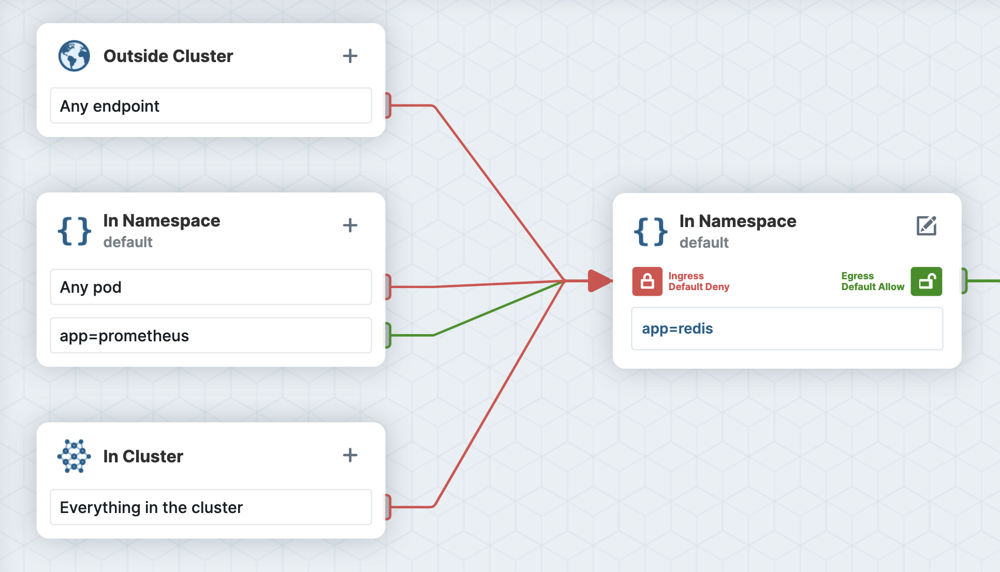
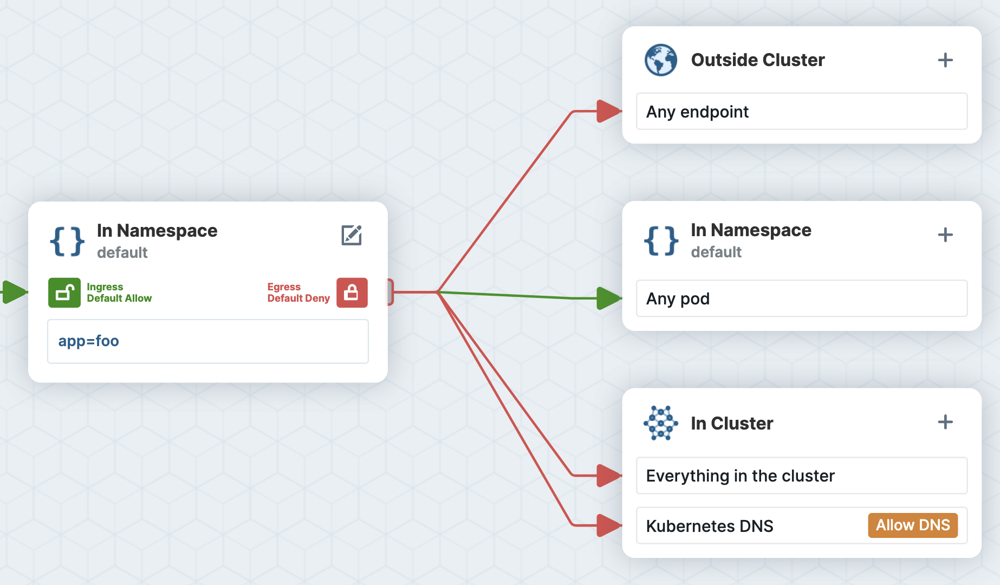
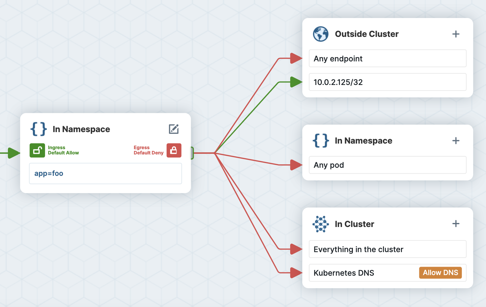
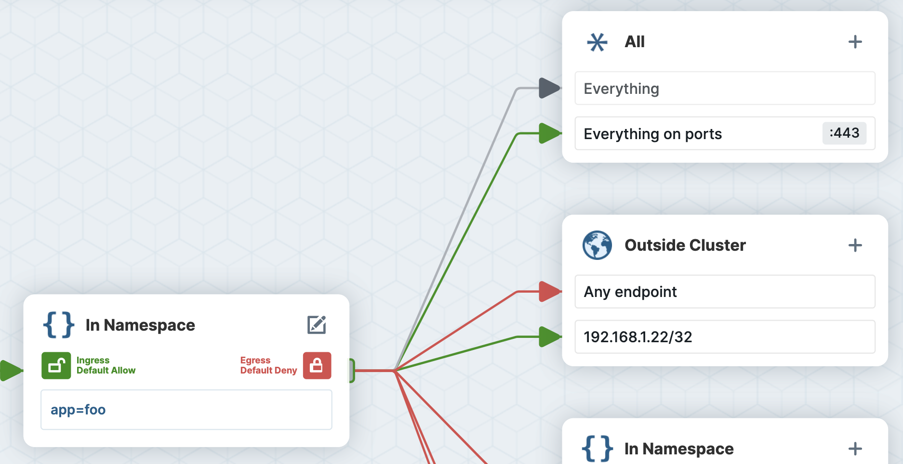

Implementing Network Policy is a critical part of building a secure Kubernetes-based platform, but the learning curve from simple examples to more complex real-world policies is steep. Not only can it be painful to get the YAML syntax and formatting just right, but more importantly, there are many subtleties in the behavior of the network policy specification (e.g. default allow/deny, namespacing, wildcarding, rules combination, etc.). Even an experienced Kubernetes YAML-wrangler can still easily tie their brain in knots working through an advanced network policy use case.

Over the past years, we have learned a lot about the common challenges while working with many of you in the Cilium community implementing Kubernetes Network Policy. Today, we are excited to announce a new free tool for the community to assist you in your journey with Kubernetes NetworkPolicy: <a href="https://editor.cilium.io" target="_blank">editor.cilium.io</a>:

  <iframe width="560" height="315" src="https://www.youtube.com/embed/_ebbAeYT2z8?controls=0&autoplay=1&mute=1&loop=1" frameborder="0" allow="accelerometer; autoplay; clipboard-write; encrypted-media; gyroscope; picture-in-picture" allowfullscreen></iframe>

<div style="padding-top: 30px;">

The <a href="https://editor.cilium.io" target="_blank">Kubernetes NetworkPolicy Editor</a> helps you build, visualize, and understand Kubernetes NetworkPolicies.

- **Tutorial:** Follow the assisted tutorial to go from not using NetworkPolicies yet to a good security posture.
- **Interactive Creation:** Create policies in an assisted and interactive way.
- **Visualize & Update:** Upload existing policies to validate and better understand them.
- **Security score:** Check the security score of polices to understand the level of security they add to your cluster.
- **YAML Download:** Downloading policies as YAML for enforcement in your cluster with your favorite CNI.
- **Sharing:** Share policies across teams via GitHub Gists and create links to visualize your own NetworkPolicies.
- **Automatic Policy Creation:** Upload Hubble flow logs to automatically generate NetworkPolicies based on observed network traffic.

</div>

<p style=" margin-top: 40px; font-size: 120%; font-weight: bold; text-align: center;">
  <a href="https://editor.cilium.io" style=" padding: 8px 12px; color: white; text-align: center; background: #0a53a5; border-radius: 4px;" target="_blank">Try Network Policy Editor</a>
</p>

## How exactly does editor.cilium.io help?

To make this more concrete, let’s explore five common gotchas we see trip up those working with Network Policy, both newbies and sometimes (gulp!) those of us who have been doing this for a while. At the end of each mistake, you’ll find a link to a short (3-5 minute) tutorial in the tool that walks you through each step required to fix the mistake.

### Mistake 1: Not Using a Namespace Selector

Consider a scenario where we want a centralized Prometheus instance running in a `monitoring` namespace to be able to scrape metrics from a Redis Pod running in the `default` namespace. Take a look at the following network policy, which is applied in the `default` namespace. It allows Pods with label `app=prometheus` to scrape metrics from Pods with label `app=redis`:

<div style="display: grid; grid-template-columns: 2fr 3fr; grid-gap: 2rem;">

```yaml
apiVersion: networking.k8s.io/v1
kind: NetworkPolicy
metadata:
  name: allow-ingress-from-prometheus
  namespace: default
spec:
  podSelector:
    matchLabels:
      app: redis
  policyTypes:
    - Ingress
  ingress:
    - from:
        - podSelector:
            matchLabels:
              app: prometheus
```



</div>

As you can see in the editor's visualization, the above network policy will only work if both Pods are in the same namespace. The `podSelector` is scoped to the policy's namespace unless you explicitly use `namespaceSelector` to select other namespaces.

How do you do this right?

🤓 <a href="https://editor.cilium.io/?policy-tutorial=allow-cross-namespace" target="_blank">Click here to see how to easily visualize and fix this policy in the editor.</a>

<a name="mistake-2-there-is-a-no-way-its-dns"></a>

### Mistake 2: "There is no way it’s DNS..."

It is common that workloads must be locked down to limit external access (i.e. “egress” default deny). If you want to prevent your application from sending traffic anywhere except to Pods in the same namespace, you might create the following policy:

<div style="display: grid; grid-template-columns: 2fr 3fr; grid-gap: 2rem; align-items: start; padding-bottom: 20px;">

```yaml
apiVersion: networking.k8s.io/v1
kind: NetworkPolicy
metadata:
  name: allow-kube-dns
  namespace: default
spec:
  podSelector:
    matchLabels:
      app: foo
  egress:
    - to:
        - podSelector: {}
```



</div>

However, once you deploy this network policy, your application connectivity will likely be broken.

Why?

> It’s not DNS<br/>
> There is no way it’s DNS<br/>
> It was DNS

Pods will typically reach other Kubernetes services via their DNS name (e.g., service1.tenant-a.svc.cluster.local), and resolving this name requires the Pod to send egress traffic to Pods with labels `k8s-app=kube-dns` in the `kube-system` namespace.

So how do you solve this?

🤓 <a href="https://editor.cilium.io/?policy-tutorial=allow-kube-dns" target="_blank">Click here to see and fix the mistake in the editor</a>

### Mistake 3: Using Traditional Networking Constructs

If you come from a traditional Networking background, it might be tempting to use a /32 CIDR rule to allow traffic to the IP address of a Pod as shown in the output of `kubectl describe pod`. For example:

<div style="display: grid; grid-template-columns: 2fr 3fr; grid-gap: 2rem; align-items: start; padding-bottom: 20px;">

```yaml
apiVersion: networking.k8s.io/v1
kind: NetworkPolicy
metadata:
  name: allow-egress-to-pod
spec:
  podSelector:
    matchLabels:
      app: foo
  egress:
    - to:
        - ipBlock:
            cidr: 10.0.2.125/32
```



</div>

However, Pod IPs are ephemeral and unpredictable, and depending on a network plugin implementation, ipBlock rules might only allow egress traffic to destinations outside of the cluster. <a href="https://kubernetes.io/docs/concepts/services-networking/network-policies/#behavior-of-to-and-from-selectors" target="_block">Kubernetes documentation</a> recommends using ipBlocks only for IP addresses outside of your cluster. So how do you solve this?

🤓 <a href="https://editor.cilium.io/?policy-tutorial=allow-egress-to-pod" target="_blank">Click to learn how to allow egress to Pod.</a>

### Mistake 4: Misunderstanding How Policy Rules Combine

Let's take a look at another egress policy example, that seeks to allow Pods with label `app=foo` to establish egress connections to an external VM with IP `192.168.1.22` on port `443`.

<div style="display: grid; grid-template-columns: 2fr 3fr; grid-gap: 2rem; align-items: start; padding-bottom: 20px;">

```yaml
apiVersion: networking.k8s.io/v1
kind: NetworkPolicy
metadata:
  name: egress-to-private-vm-443
spec:
  podSelector:
    matchLabels:
      app: foo
  egress:
    - to:
        - ipBlock:
            cidr: 192.168.1.22/32
    - ports:
        - port: 443
```



</div>

Wait... while this is valid YAML and a valid network policy, one extra character in the YAML made a huge difference here, and ended up allowing a lot more connectivity than expected. The additional “-” in front of “ports” meant that this is interpreted as two different rules, one that allows all traffic to the VM IP (on any port) and another that allows all traffic to port 443 (regardless of the destination IP address). The network policy specification dictates that the rules are logically OR'ed (not AND'ed), meaning the Pod workload has significantly more connectivity than intended.

How do you prevent these mistakes?

🤓 <a href="https://editor.cilium.io/?policy-tutorial=combine-policy-rules" target="_blank">Click to inspect the example in the Network Policy Editor</a>

### Mistake 5: Confusing Different Uses for “{}”

In Network Policy, empty curly braces (i.e., “{}”) can have a different meaning in different contexts, leading to a lot of confusion. We’ll use this last example as a quiz. What is the difference between these two similar looking network policy rules that both leverage “{}”? Take a guess, then look at each rule in the Network Policy Editor below to see if you were right.

<div style="display: grid; grid-template-columns: 2fr 3fr; grid-gap: 2rem; padding-bottom: 20px;">

```yaml
ingress:
  - {}
```

```yaml
ingress:
  - from:
      - podSelector: {}
```

</div>

🤓 <a href="https://editor.cilium.io/?policy-tutorial=empty-selectors" target="_blank">Get the answer with the Network Policy Editor</a>

## What's Next?

We hope you found these examples useful, and would love to hear from you if you have other examples of common Network Policy “gotchas” or other interesting policies to share with the community. Feel free to try making your own network policies or dropping in existing ones to visualize and check that they do what you want them to do.

To make sharing network policy examples easy, we have added a simple Share button that leverages Github Gist on the backend, enabling you to convert any example you have created into an easily shared link.

Tweet us at <a href="https://twitter.com/@ciliumproject" target="_blank">@ciliumproject</a> to share your examples, and in the next few weeks we’ll pick a few favorites and send the creators some exclusive Cilium SWAG!

We’d love to hear your feedback and questions on both the editor and Network Policy in the **#networkpolicy** channel of <a href="https://cilium.io/slack" target="_blank">Cilium Slack</a>. See you there!

<div class="blog-authors">
  <div class="blog-author">
    <span class="blog-author-header">
      Author: <a href="https://twitter.com/genbit">Sergey Generalov</a>. 
    </span>
    <span class="blog-author-bio">
      Sergey is a member of the technical staff at Isovalent and focuses on helping Cilium users solve challenges related to network policies, monitoring, and connectivity troubleshooting by building tools like Network Policy Editor, Hubble UI and more.
    </span>
  </div>
</div>
