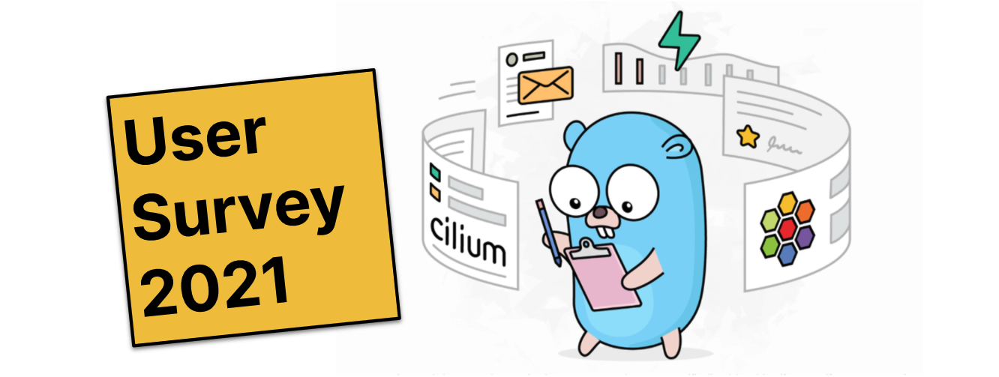

{{preview}}

Welcome to the Cilium User Survey 2021! We are looking to improve Cilium
further and are interested in feedback and guidance from our users. Cilium
has been a community-driven project from the beginning and the majority of our
roadmap has and will continue to be defined by our users. Tell us what you
want. Tell us what you are struggling with. Tell us what we can do better.

As usual, the survey is completely anonymous unless you specifically wish to
identify yourself so we can reach out to you and clarify on specific feature
requests. We will of course publish the results publicly as well.

Thank you so much for spending some of your valuable time in helping us improve
as a community and project.

{{/preview}}

Welcome to the Cilium User Survey 2021! We are looking to improve Cilium
further and are interested in feedback and guidance from our users. Cilium
has been a community-driven project from the beginning and the majority of our
roadmap has and will continue to be defined by our users. Tell us what you
want. Tell us what you are struggling with. Tell us what we can do better.

As usual, the survey is completely anonymous unless you specifically wish to
identify yourself so we can reach out to you and clarify on specific feature
requests. We will of course publish the results publicly as well.

Thank you so much for spending some of your valuable time in helping us improve
as a community and project.

<iframe src="https://docs.google.com/forms/d/e/1FAIpQLSckGK3lB5HcDdn100k8ijlEcS8vMXOIvss19xw800-wKXMP7Q/viewform?embedded=true" width="800" height="2250" frameborder="0" marginheight="0" marginwidth="0">Loading…</iframe>
