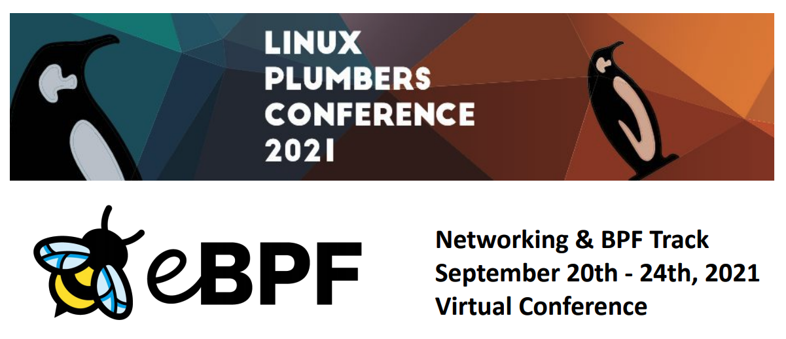

The organizers of the Networking and BPF track at the 2021 edition of the Linux
Plumbers Conference (LPC) are pleased to announce the Call for Proposals (CFP).
The conference is planned to be held virtually on the wider Internet, on
September 20th - 24th, 2021.

This year's Networking and BPF track technical committee is comprised of:

- David S. Miller (Red Hat)
- Jakub Kicinski (Facebook)
- Eric Dumazet (Google)
- Alexei Starovoitov (Facebook)
- Daniel Borkmann (Isovalent)
- Andrii Nakryiko (Facebook)

We are seeking proposals of 40 minutes in length (including Q&A discussion),
optionally accompanied by papers of 2 to 10 pages in length. Any kind of
advanced Linux networking and/or BPF related topic will be considered. Please
submit your proposals through the official LPC website at:

- [Submit Linux Plumbers Conference 2021 Abstract](https://linuxplumbersconf.org/event/11/abstracts/)

Make sure to select "Networking & BPF Summit" in the Track pull-down menu.
Proposals must be submitted by August 13th, and submitters will be notified of
acceptance by August 16th. Final slides and optional papers (as PDF) are due
on the first day of the conference.
