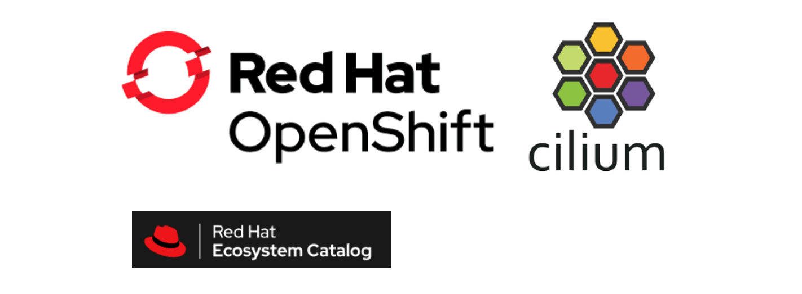
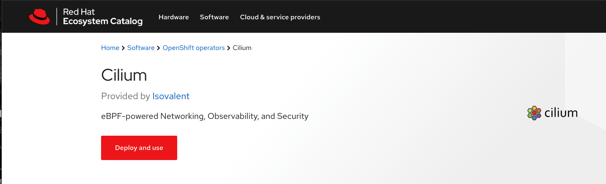
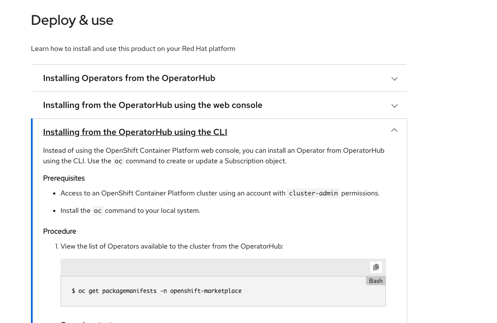

# Certified Red Hat OpenShift CNI Plug-in

We are pleased to introduce the availability of Cilium in the
[Red Hat Ecosystem Catalog](https://catalog.redhat.com/software/operators/detail/60423ec2c00b1279ffe35a68)
as well as the certification of Cilium as a
[Certified OpenShift CNI Plug-in](https://access.redhat.com/articles/5436171).
The Container Network Interface (CNI) badge is a specialization within Red Hat
OpenShift certification available to networking products that integrate with
OpenShift using a CNI plug-in.
Users running OpenShift can feel confident that running Cilium will not negatively impact their Red Hat support experience.

The OpenShift certified version of Cilium is based on
[Red Hat Universal Base Images](https://developers.redhat.com/products/rhel/ubi)
and passes the
[Operator certification](https://redhat-connect.gitbook.io/partner-guide-for-red-hat-openshift-and-container/)
requirements as well as the
[Kubernetes e2e tests](https://github.com/kubernetes/community/blob/master/contributors/devel/sig-testing/e2e-tests.md).

# What is Cilium?

Cilium is open source software for transparently providing and securing the
network and API connectivity between application services deployed using Linux
container management platforms such as Kubernetes.

At the foundation of Cilium is a new Linux kernel technology called eBPF, which
enables the dynamic insertion of powerful security, visibility, and networking
control logic within Linux itself. eBPF is utilized to provide functionality
such as multi-cluster routing, load balancing to replace kube-proxy,
transparent encryption as well as network and service security. Besides
providing traditional network-level security, the flexibility of eBPF enables
security with the context of application protocols and DNS requests/responses.
Cilium is tightly integrated with Envoy and provides an extension framework
based on Go. Because eBPF runs inside the Linux kernel, all Cilium
functionality can be applied without any changes to the application code or
container configuration.

See the section **[Introduction to Cilium]** for a more detailed general
introduction to Cilium.

# Installation

To install Cilium on OpenShift, go to the [Red Hat Ecosystem
Catalog](https://catalog.redhat.com/software/operators/detail/60423ec2c00b1279ffe35a68#deploy-instructions)
and follow the deploy instructions:

If you have any questions regarding running Cilium on OpenShift, don't hesitate
to reach join the [Cilium slack](https://cilium.io/slack) and ask your
questions in `#general` channel.

# Learn More

If you want to learn more about Cilium:

- [Cilium - eBPF-based Networking, Observability, and Security](https://cilium.io/)
- [Cilium on GitHub](https://github.com/cilium/cilium)
- [Cilium 1.9: Maglev, Deny Policies, VM Support, OpenShift, Hubble mTLS, Bandwidth Manager, eBPF Node-Local Redirect, Datapath Optimizations, and more](https://cilium.io/blog/2020/11/10/cilium-19)

[introduction to cilium]: https://docs.cilium.io/en/v1.9/intro/
