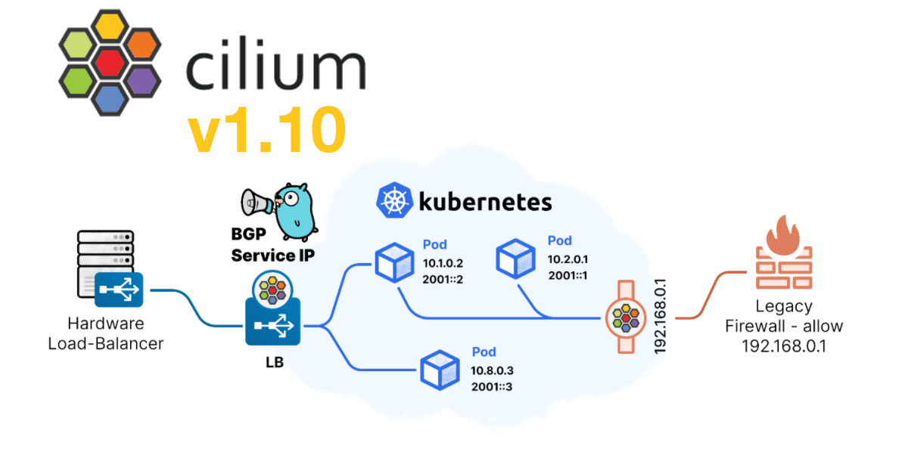

{{preview}}



The Cilium core team are excited to announce the Cilium 1.10 release. A total
of 2042 new commits have been contributed by a growing community of 280
developers. Contributions have come from a wide list of different companies
including Alibaba, Datadog, Google, Isovalent, SuSE, Palantir among many
others. We heard from users who are increasingly interested in better
integration with the broader network, whether you're running Cilium in your own
datacenter environments or in the cloud. Thus, a major focus of this release
was ensuring a seamless integration between the Kubernetes network and
enterprise on-prem infrastructure.

{{/preview}}


The Cilium core team are excited to announce the Cilium 1.10 release. A total
of 2042 new commits have been contributed by a growing community of 280
developers. Contributions have come from a wide list of different companies
including Alibaba, Datadog, Google, Isovalent, SuSE, Palantir among many
others. We heard from users who are increasingly interested in better
integration with the broader network, whether you're running Cilium in your own
datacenter environments or in the cloud. Thus, a major focus of this release
was ensuring a seamless integration between the Kubernetes network and
enterprise on-prem infrastructure.

- **Egress IP Gateway**: When integrating cloud-native applications with legacy
  counterparts operating outside the Kubernetes cluster, IP Address Management
  can be a pain point as Pod IPs are more dynamic than traditional network
  endpoints. Through a new Kubernetes CRD, static IPs can now be associated
  with traffic as the packets egress the Kubernetes cluster. This allows
  external firewalls to see consistent IPs and filter traffic for specific pods
  purely using the assigned static IP address.
  ([More details](#egressgateway))
- **Integrated BGP Support**: We’ve simplified the ability to advertise
  Kubernetes service IPs via BGP to allow workloads outside the Kubernetes
  environment to easily communicate with Cloud Native applications. With 1.10
  we've incorporated BGP service announcement support directly into Cilium
  so that these services can be exposed without the need for any additional
  external components.
  ([More details](#bgp))
- **Standalone Load Balancer**: Cilium's high performance, robust
  load balancing implementation is tuned for the scale and churn of
  cloud native environments. Now you can replace expensive legacy boxes in
  your network with Cilium as a standalone load balancer. This unlocks the
  potential of DSR and Maglev for handling north/south traffic in
  on-premises environments without requiring Kubernetes to manage the network
  border.
  ([More details](#standalonelb))
  - **PCAP Recorder** provides network observability into the
    Standalone Load Balancer by enabling full or partial packet capture for
    traffic matching specific n-tuple filters. ([More details](#pcap))

Beyond the focus on integrating better with the broader network, we’ve invested
in making it **easier to install and run Cilium** regardless of environment,
further **improved performance**, and added a whole set of highly requested
features:

- **WireGuard® Support**: One of the most hotly requested features, Cilium now
  supports encrypting traffic between pods in the cluster using the modern
  WireGuard protocol as an alternative to the existing IPsec implementation.
  ([More details](#wireguard))
- **New Cluster Administration CLI**: An experimental new Cilium command-line
  interface simplifies installation, troubleshooting and feature enablement
  by automatically detecting your environment constraints and configuring
  Cilium with the best set of options.
  ([More details](#cli))
- **Better performance than ever**: Cilium now has the ability to skip
  Netfilter connection tracking where it is not needed, has improved
  North/South service handling, and we've doubled throughput performance
  through improved Linux tunneling. Check all this out together with the new
  [tuning guide][] to help you get the most from your network!
  ([More details](#performance))
- **Lots of other improvements**: This release brings support for [Kubernetes
  Dual-Stack Services](#dualstack), [Native IPAM for Alibaba Cloud](#alibaba),
  and is the first release to distribute [official images for ARM64](#arm64).
  New guides for Rancher and Rancher Kubernetes Engine make it easier
  to deploy Cilium in on-prem Kubernetes environments.

# What is Cilium?

Cilium is open source software for transparently providing and securing the
network and API connectivity between application services deployed using Linux
container management platforms such as Kubernetes.

At the foundation of Cilium is a new Linux kernel technology called eBPF, which
enables the dynamic insertion of powerful security, visibility, and networking
control logic within Linux itself. eBPF is utilized to provide functionality
such as multi-cluster routing, load balancing to replace kube-proxy,
transparent encryption as well as network and service security. Besides
providing traditional network-level security, the flexibility of eBPF enables
security with the context of application protocols and DNS requests/responses.
Cilium is tightly integrated with Envoy and provides an extension framework
based on Go. Because eBPF runs inside the Linux kernel, all Cilium
functionality can be applied without any changes to the application code or
container configuration.

See the section **[Introduction to Cilium]** for a more detailed general
introduction to Cilium.

<a name="egressgateway"></a>

# Egress IP Gateway

_Primary contributors: Yongkun Gui (Google) and Bolun Zhao (Google)_

As Kubernetes became the de facto standard platform to containerize and
modernize application workloads, a significant pain point became connecting
these new services to components in the legacy environments. Traditional
workloads have a fixed and unique IP that can be recognized by a firewall.
Traffic coming from a containerized application will come from many different
IPs as containers spin up and down as needed and will most often present as the
IP of the node on which each container sits. This makes it hard to set up
security boundaries for applications and to audit their behavior.

The 1.10 release brings the egress gateway capability to Cilium. Cilium now
allows users to specify an egress NAT policy, such that egress traffic for the
selected pods will be masqueraded with a consistent, user-defined IP address.
As the following diagram shows, instead of directly egressing via eth0, traffic
from pods running in the worker node egress the cluster via the gateway node.
At this node, SNAT is applied to provide the consistent external IP for
outbound traffic. From there, networking components can be configured to treat
traffic differently depending on the source IP address. For instance, a legacy
firewall is able to filter traffic that originates from pods with particular
labels, by matching purely on the source IP address of the inbound traffic.


As an example, the following policy instructs Cilium to use egress IP
`192.168.33.100` for traffic from all pods in `default` namespace and destined
to the external CIDR `192.168.33.13/32`. That egress traffic will be redirected
to the (gateway) node to which `192.168.33.100` was assigned. More information
about the egress gateway can be found in the
[getting started guide](https://docs.cilium.io/en/v1.10/gettingstarted/egress-gateway/).

```yaml
apiVersion: cilium.io/v2alpha1
kind: CiliumEgressNATPolicy
metadata:
  name: egress-sample
spec:
  egress:
    - podSelector:
        matchLabels:
          # The following label selects default namespace
          io.kubernetes.pod.namespace: default
  destinationCIDRs:
    - 192.168.33.13/32
  egressSourceIP: '192.168.33.100'
```

<a name="bgp"></a>

# BGP for LoadBalancer VIP

_Primary contributors: Chris Tarazi (Isovalent)_

As Kubernetes becomes more pervasive in on-premise environments, users
increasingly have both traditional applications and Cloud Native applications
in their environments. In order to connect them together and allow outside
access, a mechanism to integrate Kubernetes and the existing network
infrastructure running BGP is needed.

The 1.10 release of Cilium brings integrated support for BGP, exposing
Kubernetes to the outside and all the while simplifying users' deployments.
The integration is done via [MetalLB](https://metallb.universe.tf/), leveraging
the effective implementation of the service IP allocator and the L3 protocol
support for BGP. With this, Cilium is now able to allocate service IPs for
services of type `LoadBalancer` and announce them via BGP to their BGP
routers. Now, services are able to be reached externally from traffic outside
of the cluster, without any additional components.


In the future, we plan to support announcing Pod CIDRs and the [Egress
IP Gateway](#egressgateway) via BGP as well. This will further improve the
bridging between Cloud Native and traditional environments.

The following is an example `ConfigMap` that's used to configure Cilium's BGP
feature. The two main aspects of the configuration are `peers` and
`address-pools`. The former is for connecting with the existing BGP routers
in the network, so an IP address and an ASN are required. The latter is the
pool from which Cilium will allocate an IP to a `LoadBalancer` service. For a
bit of background, services of type `LoadBalancer` in Kubernetes rely on
another component to fill the gap of allocating external IPs, which is why
Cilium needs to be configured with that information.

```yaml
apiVersion: v1
kind: ConfigMap
metadata:
  name: bgp-config
  namespace: kube-system
data:
  config.yaml: |
    peers:
    - peer-address: 10.0.0.1
      peer-asn: 64512
      my-asn: 64512
    address-pools:
    - name: default
      protocol: bgp
      addresses:
      - 192.0.2.0/24
```

See the [BGP guide](https://docs.cilium.io/en/v1.10/gettingstarted/bgp/) in the
documentation on how to get started.

<a name="alibaba"></a>

# Alibaba Cloud Integration

_Primary contributors: Bokang Li (Alibaba)_

Cilium has been progressively adding support for allocating IP addresses
directly from cloud APIs, notably from [AWS ENI][] (v1.6) and [Azure][] (v1.8).
This release adds an IPAM mode for Alibaba Cloud, allowing Cilium to utilize
Alibaba Cloud ENI (Elastic Network Interface) for Pod IPs.The architecture
ensures that only a single operator communicates with the Alibaba Cloud APIs
to avoid rate-limiting issues in large clusters.


In this mode, pods are assigned with ENI IPs, which are directly routable in the
AlibabaCloud VPC. This simplifies communication of pod traffic within VPCs and
avoids the need for SNAT. With the cloud-native network solution, user can
easily use cloud resource like Cloud Enterprise Network (CEN) or VPN gateway to
connect to your on-premises data centers.

See the [Alibaba Cloud Getting Started Guide][] for more details.

<a name="wireguard"></a>

# Transparent Encryption with WireGuard

_Primary contributors: Martynas Pumputis (Isovalent) and Sebastian Wicki (Isovalent)_

<div style="padding: 50px 25%;" >
  
</div>

With the 1.10 release, we are adding support for transparent encryption via
the [WireGuard](https://www.wireguard.com/) protocol. Transparent encryption
is a feature which ensures that traffic between Cilium-managed pods is always
sent through a secure tunnel, thereby allowing users to run Kubernetes in
untrusted networks.

Cilium had support for transparent encryption via IPSec already since version
1.4, but we were motivated to add WireGuard as an alternative option for
multiple reasons. Firstly, WireGuard is a very opinionated protocol and does
not allow the tuning of parameters such as the key size and cipher suite,
which makes it very easy to use and simplifies deployment and operations.
The encryption key pair for each node is automatically generated by Cilium and
key rotation is performed transparently by the WireGuard kernel module.

<div style="padding: 25px 10%;" >
  
</div>

WireGuard also has performance advantages over IPSec for certain workloads. In
our recent [CNI performance analysis blog post](https://cilium.io/blog/2021/05/11/cni-benchmark#encryption),
we evaluated both protocols and found that WireGuard can achieve very high
throughput for streaming workloads, but IPSec still can achieve better latency,
and the encryption algorithm can be offloaded to the CPU in certain cases.
The graph above shows a short excerpt from our experiments, make sure
to read the full blog post for more details and explanations.

Another technical advantage of WireGuard is that it integrates well into the
architecture of the Cilium datapath. Because the secure tunnel is exposed as
a Linux network interface, WireGuard makes it very easy to mark packets
originating from containers for encryption and subsequently forward them to
the secure tunnel device. The animation below shows the life of a WireGuard
encrypted packet in Cilium:


WireGuard encryption in Cilium 1.10 is supported both in direct routing and
tunneling mode, and may also be enabled in managed Kubernetes environments if
the underlying Linux kernel supports it. Support for host-level encryption
and Cilium's L7 policy enforcement and visibility features is currently lacking
and will be added in an upcoming Cilium releases.

If you want to know more about the WireGuard integration in Cilium, make sure
to watch to the recording of the [**eCHO episode 3 livestream**](https://www.youtube.com/watch?v=-awkPi3D60E)
and read our [**getting started guide**](https://docs.cilium.io/en/v1.10/gettingstarted/encryption-wireguard/)
in the Cilium documentation.

<a name="dualstack"></a>

# Kubernetes Dual-Stack support

_Primary contributors: Deepesh Pathak (Microsoft), André Martins (Isovalent)_

Cilium has IPv4/v6 dual-stack support since it was created. In fact, in Cilium's
_very early_ prototype, we started out with an IPv6-only implementation. Given
Kubernetes was lacking official dual-stack integration for some time now, the
Cilium IPv6 support for Pods and Services was a bit cumbersome to operate.
With the last Kubernetes stable version that was released this has changed now:
Kubernetes 1.21 introduced [beta support for dual-stack enabled by default](https://kubernetes.io/docs/concepts/services-networking/dual-stack/).
With Cilium 1.10, we integrated the Kubernetes dual-stack support, so that
Pods are now properly integrated to allow for dual-stack IP address allocation
and, similarly, Service IPv4/v6 addressing propagates down into the Cilium
eBPF kube-proxy-replacement.

IPv4/v6 dual-stack operation can be enabled in Cilium using the helm
option `ipv6.enabled`:

```shell-session
$ helm install cilium cilium/cilium --version 1.10.0 \
   --namespace kube-system \
   --set ipv4.enabled=true \
   --set ipv6.enabled=true

$ kubectl get cep -n kube-system
NAME                       ENDPOINT ID   IDENTITY ID   ENDPOINT STATE   IPV4            IPV6
coredns-755cd654d4-msqgm   2205          11023         ready            10.16.115.242   fd02::71cf
```

<a name="arm64"></a>

# Official ARM64 Cilium images

_Primary contributors: André Martins (Isovalent)_

In previous releases, the Cilium core team have made snapshots available on
ARM64 platform for initial testing. However, until now the official images for
Cilium have not yet been prepared for this platform. During this development
cycle, we worked on several improvements to the image build infrastructure for
the project to allow automatic build of multi-arch docker images for both
linux/amd64 and linux/arm64 platforms. Beginning with Cilium 1.10, the official
Cilium repositories on Docker Hub and Quay.io will host these multi-arch
images.

Installing Cilium on ARM64 works similarly to the setup on other platforms,
using the same image tags and digests as the AMD64 docker images. This unlocks the
ability to run Cilium on a range of new hardware including AWS Graviton
instances and Azure Linux/ARM64 pipelines. Cilium has even been spotted in the
wild, running on a smartphone!

<blockquote class="twitter-tweet"><p lang="en" dir="ltr">Armbian trunk on a Snapdragon 835 (OnePlus 5) running k8s and Cilium eBPF <a href="https://twitter.com/armbian?ref_src=twsrc%5Etfw">@armbian</a> <a href="https://twitter.com/ciliumproject?ref_src=twsrc%5Etfw">@ciliumproject</a> <a href="https://twitter.com/kubernetesio?ref_src=twsrc%5Etfw">@kubernetesio</a> 🎉 <a href="https://t.co/QXMCiox12X">pic.twitter.com/QXMCiox12X</a></p>&mdash; Ricardo Pardini (@SilvioSantoZ) <a href="https://twitter.com/SilvioSantoZ/status/1392583793719095296?ref_src=twsrc%5Etfw">May 12, 2021</a></blockquote> <script async src="https://platform.twitter.com/widgets.js" charset="utf-8"></script>

<a name="cli"></a>

# Cilium CLI

A new [CLI](https://github.com/cilium/cilium-cli) is available that can be used
to install and manage Cilium clusters. The CLI talks directly to the Kubernetes
API and offers a variety of functionality to manage different aspects of
Cilium. The CLI is backward compatible to older versions of Cilium.

- Determine the cluster-wide status of a Cilium installation and quickly expose
  failure states.
- Automatically detect the ideal configuration options for a particular
  Kubernetes environment (datapath, IPAM, ...).
- Enable Hubble observability and Relay components.
- Manage multi-cluster connections and status.
- Perform connectivity and conformance tests to validate networking
  capabilities in a cluster.

## Cluster-wide Cilium Status

The `cilium status` command allows to quickly determine the status of any
Cilium installation. It will indicate the number of unhealthy Cilium components
and quickly expose failure states in any of the nodes:

```
$ cilium status
    /¯¯\
 /¯¯\__/¯¯\    Cilium:         OK
 \__/¯¯\__/    Operator:       OK
 /¯¯\__/¯¯\    Hubble:         disabled
 \__/¯¯\__/    ClusterMesh:    disabled
    \__/

Deployment        cilium-operator    Desired: 2, Ready: 2/2, Available: 2/2
DaemonSet         cilium             Desired: 2, Ready: 2/2, Available: 2/2
Containers:       cilium             Running: 2
                  cilium-operator    Running: 2
Image versions    cilium             quay.io/cilium/cilium:v1.10.0: 2
                  cilium-operator    quay.io/cilium/operator-generic:v1.10.0: 2
```

## Connectivity & Conformance Test

A new connectivity test can be run with a single command (`cilium connectivity test`). It ensures correctness in networking, Kubernetes services and
NetworkPolicy enforcement and is ideal to validate whether Cilium has been
correctly installed.

```
$ cilium connectivity test
✨ [gke_cilium-dev_us-west2-a_test-21504] Creating namespace for connectivity check...
✨ [gke_cilium-dev_us-west2-a_test-21504] Deploying echo-same-node service...
[...]
---------------------------------------------------------------------------------------------------------------------
🔌 [pod-to-pod] Testing cilium-test/client-68c6675687-tcw9f -> cilium-test/echo-other-node-588bf78fbb-84fvc...
---------------------------------------------------------------------------------------------------------------------
✅ [pod-to-pod] cilium-test/client-68c6675687-tcw9f (10.96.6.173) -> cilium-test/echo-other-node-588bf78fbb-84fvc (10.96.5.226)
[...]
---------------------------------------------------------------------------------------------------------------------
📋 Test Report
---------------------------------------------------------------------------------------------------------------------
✅ 9/9 tests successful (0 warnings)
```

<a name="performance"></a>

# Improving Cilium Network Performance

_Primary contributors: Gilberto Bertin (Isovalent), Kornilios Kourtis (Isovalent) and Daniel Borkmann (Isovalent)_

Following up
[work from previous releases](https://cilium.io/blog/2020/11/10/cilium-19#performance-testing-framework),
we continued to rigorously evaluate Cilium's networking performance. Our latest
findings were recently summarized in a
[blog post](https://cilium.io/blog/2021/05/11/cni-benchmark) as well as integrated
into Cilium's [documentation](https://docs.cilium.io/en/v1.10/operations/performance/benchmark/),
where we provided numbers for different types of direct routing workloads, showed
how eBPF enables for low-latency as well as high CNI throughput performance, and
compared WireGuard to IPsec.

Guided by our in-depth performance evaluation, Cilium 1.10 includes a number of
datapath improvements, this time mainly focussed on the VXLAN/Geneve tunneling
performance as well as reduction of Netfilter overhead. Most notably:

- [BPF host routing](https://cilium.io/blog/2020/11/10/cilium-19#virtual-ethernet-device-optimization-with-ebpf)
  was extended to support encapsulation. This means that maximizing performance
  using eBPF can now be achieved in both direct routing and tunneling modes. In
  particular, this improves the north-south service handling to be on par with
  the direct routing mode since network traffic does not need to be processed by
  the upper host stack anymore.
- We identified and
  [fixed](https://git.kernel.org/pub/scm/linux/kernel/git/torvalds/linux.git/commit/?id=89e5c58fc1e2857ccdaae506fb8bc5fed57ee063)
  a performance issue in the Linux kernel, where the GRO aggregation of encapsulated
  UDP packets for VXLAN and Geneve was delayed, leading to suboptimal performance
  when using encapsulation with Cilium. The fix has been backported to all stable
  kernels (e.g.,
  [4.9](https://git.kernel.org/pub/scm/linux/kernel/git/stable/linux.git/commit/?h=v4.9.268&id=d04c87722f072a056523d354885a74b41f4d6836))
  as well as integrated into downstream distributions such as Ubuntu LTS variants.
  In our test environment, this more than doubled the Gbit/s TCP single-stream
  throughput rate for traffic subject to VXLAN and Geneve encapsulation.
- Finally, Cilium can now be configured to skip Netfilter conntrack: we introduced a new
  agent option, `--install-no-conntrack-iptables-rules`, which allows to skip
  Netfilter connection tracking whenever possible. You can read more in the
  [tuning guide][].

We will follow-up and publish in-depth results of our performance evaluation for the
tunneling setups in an upcoming blog post. Preliminary results from our [test environment](https://docs.cilium.io/en/v1.10/operations/performance/benchmark/#test-hardware) yield significant improvements as shown below for the three
mentioned areas.

## Case 1: Pod to Pod under tunneling

For the regular Pod to Pod case where traffic needs to traverse through the
VXLAN/Geneve tunnel we were able to significantly improve the bulk performance
for large data transfers, typically benchmarked through netperf TCP_STREAM tests.
We added a small improvement to the Linux kernel's GRO engine which is responsible
to optimize the Linux' stack traversal by aggregating MTU-sized packets up to
64k super-packets in order to reduce the per-packet processing cost for the
stack. We found that the aggregation would happen only inside the VXLAN/Geneve
driver's GRO cell instead of the physical device right upon receive, meaning,
packets had to traverse individually through the UDP stack to only be aggregated
there. Moving the aggregation to the physical device significantly boosted the performance.

<center>
<div
  style=" max-width: 1520px; height: 300px; margin-top: 10px; margin-bottom: 40px; margin-left: -50px; background: url('/2021-05-cilium-110-perf1.png') #fff no-repeat center; background-size: contain;">
</div></center>

## Case 2: Host to Service/Pod under tunneling

For the case where an external client is connecting to a Pod on a Cilium-managed
node, for example, through a NodePort service, then the same improvements can be
applied [as done earlier](https://cilium.io/blog/2020/11/10/cilium-19#virtual-ethernet-device-optimization-with-ebpf)
for the direct routing case. Meaning, forwarding can be performed right in the
tc eBPF layer instead of having to push packets up the host stack. This results
in significant gains in single stream throughput (TCP_STREAM) as well as significant
reductions in latency for request/response-type workloads (TCP_RR and TCP_CRR).
The gains in such scenarios are less visible when packets have to traverse the
tunnel (e.g. for plain Pod to Pod case) since this mandates going through the upper
UDP stack, but this is not the case for services where, for example, the backends
are local on the node. A typical use case is NodePort under `externalTrafficPolicy=Local`.

<center>
<div
  style=" max-width: 1520px; height: 300px; margin-top: 10px; margin-bottom: 40px; margin-left: -50px; background: url('/2021-05-cilium-110-perf2.png') #fff no-repeat center; background-size: contain;">
</div></center>

## Case 3: Pod to Pod under direct routing

For the last case we investigated the direct routing performance when users do
have the constraint of having to pass through the Netfilter subsystem in the host
stack, be it due to running an older kernel or simply due to having Cilium deployed
with custom Netfilter rules. In particular the Netfilter connection tracker can
add a significant cost to the fast-path and might not be needed in all deployment
situations, especially since we added eBPF-based masquerading that can be used as
an alternative already. This traversal cost can then be minimized by disabling the
connection tracking requirement for all Pod traffic, thus bypassing the Netfilter
connection tracker. In particular connect/request/response-type workloads (TCP_CRR)
benefit significantly from this optimization by almost doubling their transaction
rate.

<center>
<div
  style=" max-width: 1520px; height: 330px; margin-top: 10px; margin-bottom: 40px; margin-left: -50px; background: url('/2021-05-cilium-110-perf3.png') #fff no-repeat center; background-size: contain;">
</div></center>

<a name="standalonelb"></a>

# XDP-based Standalone Load Balancer

_Primary contributors: Daniel Borkmann (Isovalent), Martynas Pumputis (Isovalent), Chris Tarazi (Isovalent) and Sebastian Wicki (Isovalent)_

Recent advances of Cilium's eBPF-based load balancer added support for
[Maglev](https://cilium.io/blog/2020/11/10/cilium-19#maglev-load-balancing)
consistent hashing as well as forwarding plane acceleration at the
[eXpress Data Path](https://cilium.io/blog/2020/06/22/cilium-18#kube-proxy-replacement-at-the-xdp-layer) (XDP)
layer, and therefore significantly improving robustness as well as load
balancing efficiency. While those features were targeting a Kubernetes
environment in order to replace kube-proxy, they also paved the way for
supporting a _generically programmable_, high-performance layer 4 load
balancer (L4LB) framework, which we have added as part of the 1.10 release.

The Cilium XDP L4LB comes with full IPv4/v6 dual-stack support that can be deployed
and programmed independently of Kubernetes, for example, at the datacenter
edge in order to direct external traffic into the clusters. The XDP layer
in the Linux kernel which we co-maintain allows for DPDK-like [performance](https://dl.acm.org/doi/10.1145/3281411.3281443)
while at the same time making more efficient use of CPU resources through
running eBPF programs directly inside the driver layer and thus piggy-backing
on Linux' NAPI mechanism. Hence there is also no need for busy-looping on
the driver's receive path if there is no traffic that needs to be processed.
The vast majority of 10G, 40G and 100G+ upstream NIC drivers support XDP
out of the box on modern LTS kernels.

In order to better understand the features and general architecture of
Cilium's XDP L4LB, an outline can be found below:

<center>
<div
  style=" max-width: 1520px; height: 640px; margin-bottom: 10px; margin-left: -60px; background: url('/2021-05-cilium-110-xdp-lb.png') #fff no-repeat center; background-size: cover;">
</div></center>

**Cilium's XDP L4LB** consists of 2 main components:

- The **high-performance forwarding plane** where Cilium installs eBPF
  programs into the driver layer in order to select a backend from the
  service table through Maglev consistent hashing as well as subsequent
  L4 DNAT with IPIP encapsulation to then push the packet back out of the
  node as quickly as possible,
- The Cilium **orchestration API** in order to program and utilize the
  main service table and the wildcarded n-tuple PCAP recorder which can be
  used to filter and observe inbound and corresponding outbound traffic of
  the L4LB.

With the integration into the XDP layer and minimal state-keeping for the
Maglev backend mapping, the L4LB can scale linearly with the number of
NIC receive queues mapped to CPUs. While the L4LB is programmed and
operated independently of Kubernetes, it can still be deployed into an
existing Kubernetes cluster: Given the efficiency and low CPU overhead
of the load balancer design, the Cilium XDP L4LB can also be co-located
with regular workloads.

While the Cilium's XDP L4LB getting started guide is work in progress, please
refer to [the example DaemonSet](https://github.com/cilium/cilium-l4lb-test/blob/master/cilium-lb-example.yaml)
to how to deploy the load balancer. We will update the blog post with the links
once the getting started guide has been published.

<a name="dsr"></a>

## DSR with IPIP Encapsulation and L4 DNAT

Cilium's XDP L4LB implements Direct Server Return (DSR) for forwarding
requests to backend nodes which is achieved by encapsulating the client
request into an IPIP/IP6IP6 packet. The inner IP header contains the
original request, so that the backend node has the full context to send
a reply directly to the client which saves an extra hop for the reverse
path. The L4LB can be configured to either use L4 DNAT to the backend or
the service port in the inner TCP/UDP destination port.

Relying on IPIP/IP6IP6 as the initial DSR dispatcher method for the
standalone LB was the most natural choice for our users in order to replace
existing Netfilter/IPVS-based in-house load balancing with the benefits
of XDP. For upcoming releases we plan to extend this to other
encapsulation mechanisms.

<center>
<div
  style=" max-width: 1520px; height: 350px; margin-bottom: 40px; margin-left: -50px; background: url('/2021-05-cilium-110-xdp-lb-dsr.png') #fff no-repeat center; background-size: cover;">
</div></center>

Not all NICs on the backend nodes might be able to parse the IPIP/IP6IP6
packet deep enough into the L4 layer in firmware/hardware to obtain enough
entropy for **RSS steering** across all receive queues. Therefore, the L4LB
can be configured to generate a custom outer IP header source address. In order to integrate
better with underlying network policies, the outer source IP can be
configured with a custom IPv4/v6 prefix which is followed by hashing the
remaining bits from the L3/L4 layer of the original client request. This
guarantees that i) all packets of the same connection will end up at the
same remote NIC queue, and ii) packets to the same service from the same
client but different sockets will end up being steered among remote NIC
queues. This way good scaling is achieved even when multiple container or
Pods on the same node target a specific service.

Cilium's XDP L4LB also implements **PMTU discovery** support for clients,
meaning, if requests are too large such that the encapsulation header cannot
be added, the LB replies with a ICMP type 3/code 4 (destination unreachable,
fragmentation needed), respectively a ICMPv6 type 2 (packet too big) error
back to the client so that it can adapt and cache the replied desired MTU
in order to reach backends.

<a name="pcap"></a>

## n-Tuple PCAP Recorder

Given a group of Cilium XDP L4LBs where hundreds of millions of packets per
second are continuously being processed, how can one _efficiently_ find the
needle in the haystack to troubleshoot or observe a small
portion of the network traffic? As XDP operates way below the regular networking
stack, existing tooling such as tcpdump is not available. Even if it was,
its internal filter generation would also not be efficient enough for a
larger set of IPs or prefixes since they would need to be processed linearly.

In the Cilium XDP L4LB's datapath we therefore included **two observation points**
in order to filter and record the LB _inbound_ traffic with its corresponding
_outbound_ traffic, that is, the IPIP/IP6IP6 packets shortly before being pushed
out the NIC again. This allows for further correlation to reconstruct the path
taken from the fabric to the L4LB to the subsequent backends, for example,
L7 proxies as a next hop.

The L4LB implements **wildcarded/n-tuple filtering** for IPv4/v6, meaning arbitrary
combinations of source and destination prefixes, ports and protocols are allowed.
While it is not (yet) possible to have native wildcard map lookups in eBPF, we
implemented a filtering mechanism with masked lookups under the assumption that
the number of installed masks are fairly small while the number of filter entries
fitting that mask can be arbitrary large. Inbound traffic matching the filters
is then exported either as full or partial packet capture through a memory-mapped
per CPU ring-buffer that is processed by the agent and subsequently exported as
PCAP files for inspection via Wireshark, tcpdump or other familiar tools.

<center>
<div
  style=" max-width: 950px; height: 550px; margin-bottom: 30px; margin-left: -60px; background-size: cover;">
<br/>

[](https://asciinema.org/a/TIpQRjdAlsQOsbsFtxwLJiVec)

</div></center>

The PCAP recorders can be orchestrated through a **new Hubble Recorder API** which
differs from the existing Hubble Observer API in that it has been optimized for
the high-churn traffic which the XDP datapath has to handle. For convenience
we also added support to the Hubble CLI as one example consumer of the Hubble
Recorder API. The above example shows how to capture L4LB-forwarded TCP service
traffic from _any_ source to destination `192.168.33.11:80` by specifying a
5-Tuple filter in the Hubble CLI.

The PCAP recorder is currently only available in the Cilium's new XDP L4LB mode,
but it is planned to also extend support to regular east-west traffic when running
in Kubernetes CNI mode in an upcoming release.

# Getting Started

New to Cilium? Follow one of the [Getting Started Guides].

# Upgrade Instructions

As usual, follow the [upgrade guide] to upgrade your Cilium deployment.
Feel free to ping us on [Slack] if you have any questions.

# Release

- Release Notes: [1.10.0](https://github.com/cilium/cilium/releases/tag/v1.10.0)

[slack]: https://cilium.herokuapp.com/
[introduction to cilium]: https://docs.cilium.io/en/v1.10/intro/
[getting started guides]: https://docs.cilium.io/en/v1.10/gettingstarted
[changelog]: https://github.com/cilium/cilium/blob/v1.10/CHANGELOG.md
[upgrade guide]: https://cilium.readthedocs.io/en/v1.10/operations/upgrade/#upgrading-minor-versions
[tuning guide]: https://docs.cilium.io/en/v1.10/operations/performance/tuning/#bypass-iptables-connection-tracking
[alibaba cloud getting started guide]: https://docs.cilium.io/en/v1.10/gettingstarted/alibabacloud-eni/
[aws eni]: https://cilium.io/blog/2019/08/20/cilium-16#eni
[azure]: https://cilium.io/blog/2020/06/22/cilium-18#azureipam

<small>
  "WireGuard" is a registered trademark of Jason A. Donenfeld.
</small>
