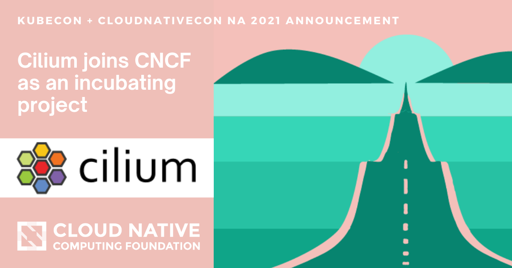
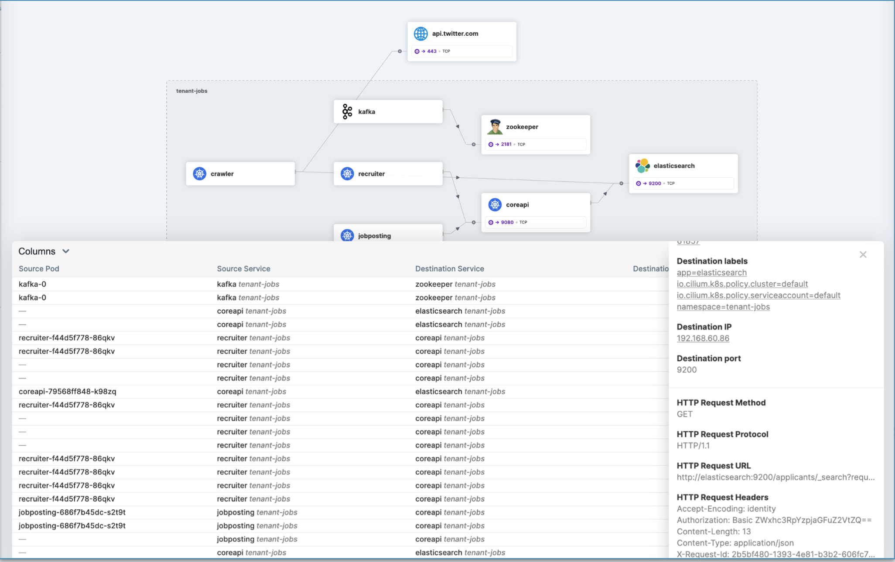

import authors from 'utils/author-data.js';

I'm beyond thrilled that Cilium has joined the CNCF as an Incubation project!
I'm excited about it not just as an advocate for the Cilium project, but also as
an Isovalent team member, and in my role as Chair of the CNCF's Technical
Oversight Committee - and I'd like to share why.

## eBPF as the foundational technology

The first time I heard about Cilium was in [Thomas Graf's presentation at
DockerCon 2017](https://www.youtube.com/watch?v=ilKlmTDdFgk). By using
[eBPF](http://ebpf.io) to hook directly into the path of a network packet, it
seemed clear to me, even back then, that this was bound to bring performance
improvements over a traditional networking stack.

Over the last couple of years I've been telling anyone who'll listen that [eBPF
is creating a revolution](https://youtu.be/qsnR-s4XuGo?t=54) in the way we
instrument applications, especially in cloud native environments.

But until recently the biggest impediment to adoption has been that users need a
Linux kernel that's recent enough to include eBPF capabilities. It takes a while
for kernel releases to make it into the distributions that are commonly used in
production environments. We've now passed a watershed, where even [RHEL users
have 4.18 kernels and can use eBPF
capabilities](https://access.redhat.com/documentation/en-us/red_hat_enterprise_linux/8/html/8.4_release_notes/new-features#enhancement_kernel).
As a result we're seeing Cilium adoption in more and more deployments, with the
field hardening that implies.

## The natural default CNI

The big public cloud providers have taken an interest along the way. Google uses
Cilium for the [GKE data
plane](https://cloud.google.com/blog/products/containers-kubernetes/bringing-ebpf-and-cilium-to-google-kubernetes-engine),
and AWS recently picked Cilium for [networking in EKS
Anywhere](https://www.isovalent.com/blog/post/2021-09-aws-eks-anywhere-chooses-cilium).
With Cilium joining the CNCF as the only Incubation- or Graduation-level CNI
solution, it's rapidly becoming the natural default for Kubernetes clusters
everywhere. It already has well over 9,000 GitHub stargazers. We know that our
current [published list of
users](https://github.com/cilium/cilium/blob/master/USERS.md) is far from
comprehensive - if your organization is also using Cilium we'd be delighted to
see a pull request adding it.

Cilium is, of course, much more than "just" a Kubernetes CNI. In several cases
it's used outside a Kubernetes environment to provide features like high
performance load balancing. And of all the CNIs we believe it has the greatest
range of capabilities for [integrating cloud native and traditional network
environments](https://cilium.io/blog/2021/05/20/cilium-110).

Cilium also includes [Hubble](https://github.com/cilium/hubble), a tool for
providing detailed observability into Kubernetes networking flows, and the
Hubble UI for displaying this information. Add to this the advanced network
policy that Cilium supports, and you can start to see how eBPF enables
networking, observability and security, all in one project. Integrating with
Envoy, Cilium is also poised to offer kernel-based service mesh capabilities.

## A community project at heart

One of the things that attracted me to [Isovalent](http://isovalent.com) when I
first started talking with Dan & Thomas was their inherent understanding of open
source communities, and the way that Cilium has consistently been run as a
community-oriented project even while owned by the company. We do assign
resources to an enterprise distribution, and additional enterprise features -
after all, [you have to have something to
sell](https://youtu.be/2zF-XcDkTiY?t=350) as a business. But this goes hand in
hand with devoting significant efforts into the open source project. By joining
the CNCF, the Cilium project is signaling its intent to remain, forever, a
community project with its core functionality available to all.

As well as Isovalent, we have representation amongst our [maintainers and
committers](https://raw.githubusercontent.com/cilium/cilium/master/MAINTAINERS.md)
from many other organizations including Google, Red Hat, SUSE and Datadog. We
know there are other companies interested to get involved for whom the neutral
ownership by CNCF will be a real encouragement. The project governance already
ensures that [no single
company](https://docs.cilium.io/en/stable/contributing/governance/commit_access/#company-block-vote-limit)
can take control.

Because Cilium has long been run by its community, we don't expect to see any
dramatic overnight changes in the way you use, interact with or contribute to
it.

- The best place to start is our [Slack
  community](https://cilium.herokuapp.com/) where you'll find thousands of
  people and a lot of help, should you need it

- One new initiative is our weekly [Cilium InstallFest](https://cilium.io/learn) - book your place today!

- There is a weekly Cilium developer meeting - find all the [details on
  GitHub](https://github.com/cilium/cilium#community) - and a number of
  [Special Interest Groups](https://docs.cilium.io/en/stable/community/#special-interest-groups)
  for different aspects of Cilium, such as Hubble, Policy or Datapath

Whether you're using or contributing to Cilium, we look forward to welcoming you
in our community!

<BlogAuthor {...authors.lizRice} />
