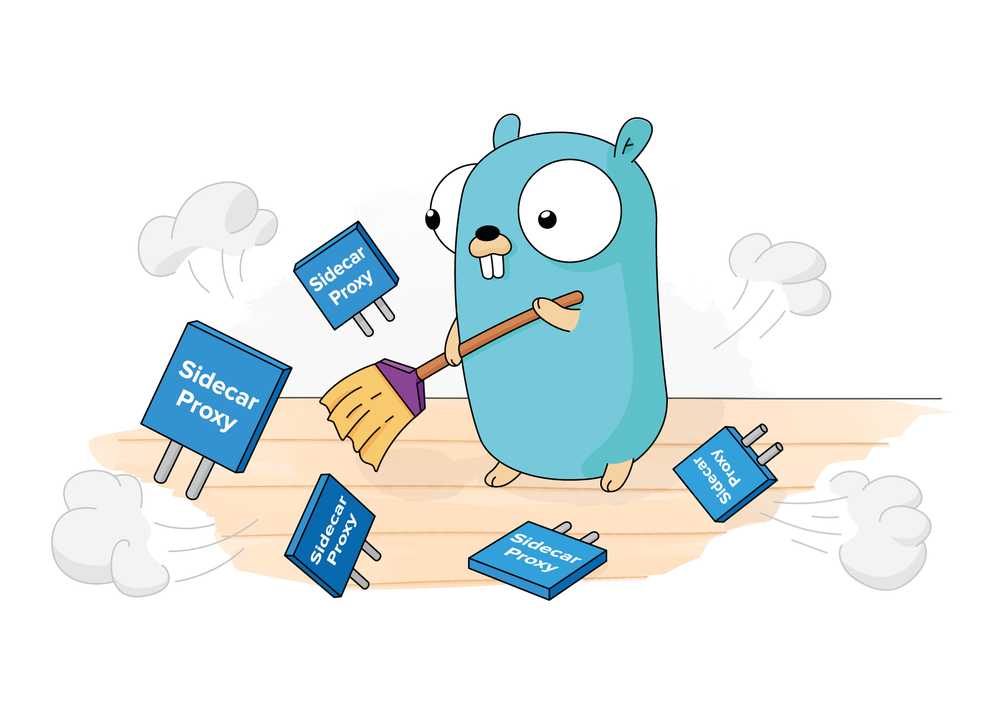
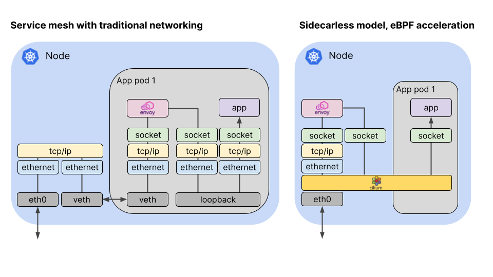

You already know that Cilium accelerates networking, and provides security and
observability in Kubernetes, using the power of eBPF. Now Cilium is bringing
those eBPF strengths to the world of Service Mesh. Cilium Service Mesh features
eBPF-powered connectivity, traffic management, security and observability, and
we’re inviting you to be amongst the first to try out these new capabilities as
part of the [Cilium Service Mesh Beta
Program](https://forms.gle/j9fwhAC6HnHRJQKeA).

# What does Cilium bring to Service Mesh?

The term “Service Mesh” encompasses a wide range of features, including service
discovery, encryption, service authentication, load balancing, observability,
canary roll-outs and more. Some of these features overlap with established
Cilium capabilities - for example, Cilium has offered load balancing, Kubernetes
service awareness, multi-cluster connectivity, and visibility of network traffic
at layer 3-7, for ages. Cilium already uses Envoy for L7 policy and
observability for some protocols, and this same component is used as the sidecar
proxy in many popular Service Mesh implementations. So it's a natural step to
extend Cilium to offer more of the features commonly associated with Service Mesh.

In a typical Service Mesh, all network packets need to pass through a sidecar
proxy container on their path to or from the application container in a Pod. In
Cilium Service Mesh, we’re moving that proxy container onto the host and kernel
so that sidecars for each application pod are no longer required. Because eBPF
allows us to intercept packets at the socket as well as at the network
interface, Cilium can dramatically shorten the overall path for each packet.
(Read more about <a target="_blank"
href="https://thenewstack.io/how-ebpf-streamlines-the-service-mesh/">sidecarless,
eBPF-based Service Mesh</a>.)

Alongside the upcoming Cilium 1.11 release, a new Cilium Service Mesh beta build
will shortly be available that features:

- L7 Traffic Management & Load-balancing (HTTP, gRPC, …)
- Topology Aware Routing across clusters, clouds, and premises
- TLS Termination
- Canary Rollouts, Retries, Rate Limiting, Circuit Breaking, etc, configured
  through Envoy
- Tracing with OpenTelemetry & Jaeger integration
- Built-in Kubernetes Ingress Support

As the beta progresses we'll update participants with the status of new and
improving capabilities.

# Why is there a Beta program?

We’d like feedback from an active group of Cilium users who can try out Cilium
Service Mesh features and help us make sure we're providing a stable, performant
service mesh.

But the beta isn’t just about testing to make sure that connectivity works; we’d love to better understand your use cases, and get your help in prioritizing the service mesh features you need. We want to be sure we’re delivering the right user experience, before committing these features into a Cilium release.

The initial beta build enables service mesh functionality with distributed Envoy configuration available via a CRD, or by configuring standard Kubernetes Ingress and Services objects. However, Cilium’s service mesh architecture is designed so that it can be integrated with any service mesh control plane and specification. We would love to hear from you which ones are of particular interest.

During the beta phase, we’ll develop and maintain Service Mesh capabilities in a separate GitHub branch. This gives us the flexibility to make potentially non-backwards-compatible changes, for example changes to CRDs.

# What do I need to do as a Beta tester?

To join the Beta program we’d first of all like you to [complete this form](https://forms.gle/j9fwhAC6HnHRJQKeA) to tell us a little bit about your service mesh needs.

We’ll send you information about how to get started with Cilium Service Mesh, and we’ll update you on a regular basis about the status of different capabilities. We’ll also send you short surveys to ask for your feedback during the program.

There will be a dedicated Slack channel for Service Mesh so you can share your experiences with each other, and interact directly with the Cilium team members working on implementation.

The intention is that core Cilium Service Mesh features will be ready for production use in Q1 2022.

# Can I help develop Cilium Service Mesh?

Yes! If you haven’t yet contributed to the Cilium Project we’d encourage you to come and say hello in the [Cilium Slack](http://slack.cilium.io) or to join the [weekly community meeting](https://docs.cilium.io/en/stable/community/). We have lots of issues on [Cilium GitHub](http://github.com/cilium/cilium) marked as Good First Issues, and there’s [documentation for developers here](https://docs.cilium.io/en/stable/contributing/development/).

# How do I join the Beta Program?

If you’d like to take part as a Service Mesh user, please [fill out this form](https://forms.gle/j9fwhAC6HnHRJQKeA) and we’ll be in touch soon!
