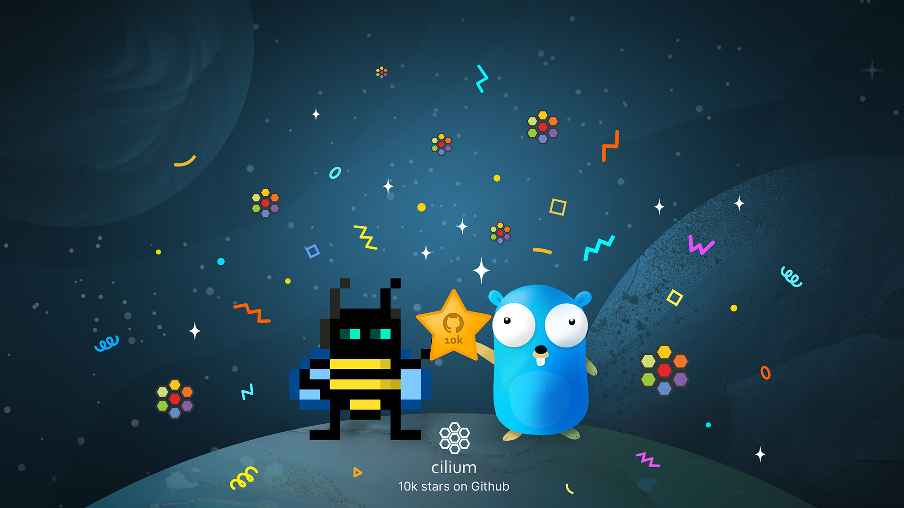
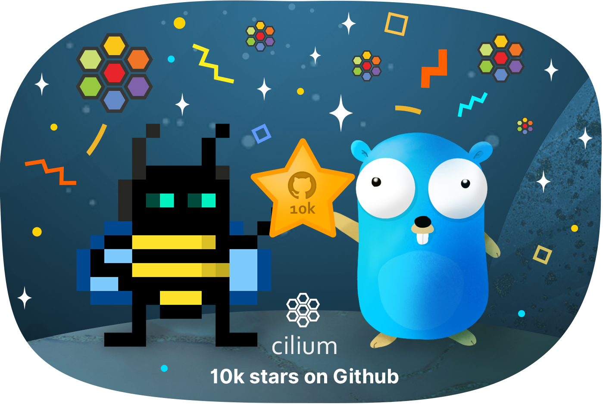

We recently passed an incredible milestone in Cilium’s journey - over 10,000 stars on GitHub. Thanks to each and every one of you who has clicked that star button!

This is a fitting close to a wonderful year for the Cilium project, driven by our fantastic contributors and community. Just to mention a few highlights:

- We [joined the CNCF](https://cilium.io/blog/2021/10/13/cilium-joins-cncf) at Incubation level, finding our home alongside many other great cloud native infrastructure projects

- We delivered two major releases in
  [1.10](https://cilium.io/blog/2021/05/20/cilium-110) and
  [1.11](https://isovalent.com/blog/post/2021-12-release-111), with a range of
  new capabilities too numerous to list here.

- AWS picked Cilium as the [networking and security layer for EKS Anywhere](https://www.isovalent.com/blog/post/2021-09-aws-eks-anywhere-chooses-cilium), and Google’s [Cilium-based GKE Dataplane V2](https://cloud.google.com/blog/products/containers-kubernetes/bringing-ebpf-and-cilium-to-google-kubernetes-engine) went GA

- We’ve welcomed over 9,000 people on [Cilium Slack](http://slack.cilium.io) (and at current growth rates it won’t be long before we need another digit there too!)

- [Cilium Service Mesh is in beta](https://cilium.io/blog/2021/12/01/cilium-service-mesh-beta), with hundreds of people already participating, modernizing the data path in Service mesh implementations.

All of this is possible thanks to every single person who contributes. Whether you’re working full-time on Cilium, raising issues, contributing to the docs, or sharing your knowledge of Cilium and eBPF, you’re playing a valuable part in Cilium’s progress. We hope you’ll join in celebrating this 10,000 star milestone success!

As a small thank you, we have created [downloadable wallpapers](https://drive.google.com/file/d/1HgZn7jxQGSths5Ygmq4fuUt5-kKrV6ox/view?usp=sharing), designed by Vadim
Shchekoldin - the artist behind many of our wonderful graphics - to decorate
your desktop. [Download them free here](https://drive.google.com/file/d/1HgZn7jxQGSths5Ygmq4fuUt5-kKrV6ox/view?usp=sharing).

We’ve also got a special edition T-shirt design in the [Cilium swag store](https://cilium.myspreadshop.com/10k+stars+on+github?idea=61c05a15e41cc92c76d59deb) - check it out!

