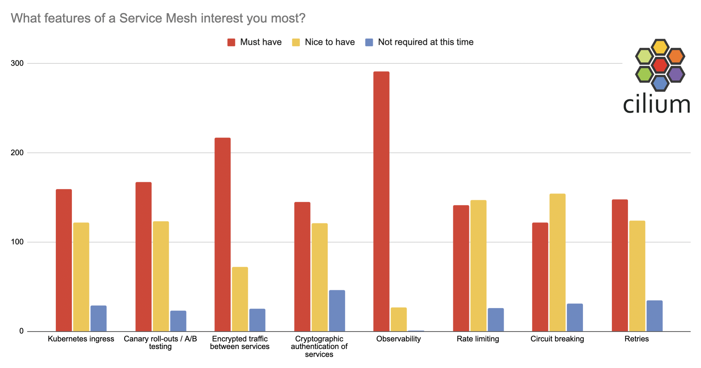

Last month we kicked off beta testing for [Cilium as an efficient data plane implementation for Service Mesh](https://cilium.io/blog/2021/12/01/cilium-service-mesh-beta). Here’s an update on what we’ve learned so far, and some thoughts on next steps. If you’ve tried out the beta already we’d love your feedback in this [short survey](https://docs.google.com/forms/d/e/1FAIpQLScp2TRX63V1Pz0yk4Ec7kN0LnTse6LPDrhBxBV9x2p1IGnDqg/viewform?usp=sf_link).

## Who joined the beta so far?

We’ve had well over 300 responses to the Cilium Service Mesh Beta so far, with
65% of participants already using Cilium. (If you’re a production user and
your organization is happy for this to be public knowledge, we’d love to see you
make a PR to add yourself to the [list of Cilium users](https://github.com/cilium/cilium/blob/master/USERS.md)!)

## What features are most important?

The term “Service Mesh” covers many different features, and there’s not really industry-wide consensus on which of them are absolutely essential for something to call itself a service mesh - ask any vendor and they’ll tell you it’s the set of features their product offers! So we asked beta users what features they are most interested in.

**Visibility** is hands-down the most important feature, according to this survey, with 97% saying it’s a “must have” and not a single person responding that it’s unnecessary.

The second most-requested feature is **traffic encryption**, which over
two-thirds say is essential. In the service mesh world this is often assumed to
be implemented through mTLS (mutual TLS) between services, but mTLS provides not
just encryption but also service authentication. The **authentication** aspect is seen
as essential by a little under half of our beta users. Why doesn't everyone who
needs encryption also need authentication at the service level? Well, if your requirement for
traffic encryption is to ensure that it’s incomprehensible to a bad actor who
managed to compromise your network, this can be achieved using transparent
encryption (IPSec or WireGuard). But if you have legitimate services that are
not all authorized to communicate with each other, an mTLS approach can
make sense. mTLS requires L7 termination at the proxy, whereas transparent
encryption happens within the network layer, so there is likely to be a
performance tradeoff - we hope to bring you measurable benchmarks on that in the coming months.

The next most requested set of features feature is what we described in the
survey as “**Canary roll-outs / A/B testing**”. These might also be termed
“traffic splitting” or “load balancing”. At the moment in the service mesh beta
we have an example of a configuration that [splits
traffic](https://github.com/cilium/cilium-service-mesh-beta/tree/main/l7-traffic-management)
between two instances of a back-end service. This is achieved using a
CiliumEnvoyConfig CRD, which exposes the raw configuration of the Envoy proxy
instance. It seems highly likely that users will want a friendlier, higher level
abstraction for this kind of configuration. We could extend Cilium to accept and
understand control plane configurations that are already in existence, such as
SMI, Istio or Linkerd CRDs - in fact, implementing support for one wouldn't rule
out others in the future. Preliminary discussion in the [#service-mesh-beta Slack
channel](https://cilium.slack.com/archives/C02QKQDTVDX) suggests that SMI would be a popular option - what’s your view?

Kubernetes **Ingress** capabilities are required to get external traffic to your
services, although whether you see them as inherently part of a service mesh or
as a separate entity is a topic for debate. We have examples for HTTP and gRPC
traffic ingress, including TLS support, as [part of the beta](https://github.com/cilium/cilium-service-mesh-beta/tree/main/kubernetes-ingress).

The last group of features that folks are interested in with service mesh
include **rate limiting**, **retries** and **circuit breaking**, with between a
third and half of testers rating these as “must have”. Again, we’re really interested
to hear your thoughts on the best way to configure these kinds of features,
especially as these aren’t included in the SMI Spec. What’s your preferred way
to control these features?

We also offered free-form text for people to tell us about other features they would like to see in a service mesh implementation, and a couple of suggestions stood out as popular.

- **Multi-cluster** support was a popular response. Cilium already supports service routing across multiple clusters through Cilium Clustermesh, so it should be straightforward evolution for Cilium Service Mesh to be easily configured to run across multiple clusters.

- Several people called out **network policy** support. This is another benefit of supporting service mesh capabilities from within the networking data plane - it’s natural to consider service-level network policies when designing how your service mesh should operate.

## What’s next in the Cilium Service Mesh beta?

The biggest open question for Cilium Service Mesh is what the control plane should look like. So far we’re exposing raw Envoy configuration through the CiliumEnvoyConfig CRD, but we need more user-friendly approach, and (as mentioned above) there are several existing de-facto standards that it’s likely we could adopt and be compatible with.

There are several features already supported through Envoy, including mutual TLS support, and additional traffic management features like circuit breaking, that we’d like to make simpler to configure.

As well as consistency with pre-existing control plane configurations, there is work to be done to ensure RBAC controls for service mesh configuration.

There are several other goals in our near-term sights:

- One technical issue that came to light early on is that some of the examples need Cilium in [tunnelling mode](https://github.com/cilium/cilium-service-mesh-beta/issues/9), so that’s being worked on right now.
- Cilium and Hubble export lots of [powerful
  metrics](https://docs.cilium.io/en/stable/operations/metrics/#hubble-exported-metrics)
  to Prometheus and Grafana already, but we want examples specific to service
  mesh. For example, it should be easy to answer questions about service latency,
  and to provide the visibility that our beta users have strongly indicated they
  need.
- Helm chart configuration - the Cilium CLI is a great way to configure Cilium out of the box, but we want to give some Helm chart examples
- Performance benchmarks - the Isovalent team already [shared some initial results](https://isovalent.com/blog/post/2021-12-08-ebpf-servicemesh) on the gains made by removing sidecars, but for certain proof we want to design good tests that can be independently verified.
- Integrating TLS terminations for ingress with automated certificate management

## Get involved!

We’d love to hear what you think should be added to Cilium Service Mesh over the coming months. The easiest way to participate is to [answer our latest survey](https://docs.google.com/forms/d/e/1FAIpQLScp2TRX63V1Pz0yk4Ec7kN0LnTse6LPDrhBxBV9x2p1IGnDqg/viewform?usp=sf_link).

We’d welcome more example configurations in the beta repository, so if you have tried out some additional features, or used the service mesh with interesting sample apps, why not open a PR to share it with the community?

If you’d like to get involved with working on the code itself, we have a
[developer guide](https://docs.cilium.io/en/stable/contributing/development/)
and we’d welcome you at the [weekly developer
call](https://github.com/cilium/cilium#weekly-developer-meeting). And of course
the [Cilium & eBPF Slack channel](http://slack.cilium.io) is online 24/7 for
your questions and comments! Join the \#service-mesh-beta channel for discussions about these
features.
