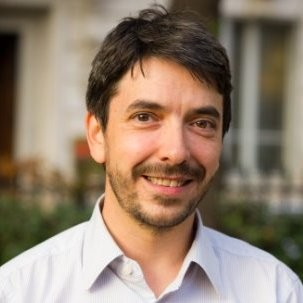

*May 05th, 2022*  
*Interviewed by: Bill Mulligan, Isovalent*

**How did you first get into technology?**

I have always been very curious about computers. I started learning how they do their work and how to use them in middle school and then a lot more in high school. I ended up studying computer science and after that did a PhD in networking.

**What has been your path to Datadog?**

After my PhD, I was a consultant for about ten years. I spent five years working on the infrastructure components used in High Performance Computing and high frequency trading, so it was all about performance. I have a lot of fun stories from that time. We used microwave networks between Frankfurt and London, because they gave us much lower latency than traditional fiber, but were also much more expensive. An interesting constraint was that the microwave networks didn’t work when it was raining so we then had to fall back on fiber. We could also get creative with servers and for instance use overclocked workstations CPUs which you usually aren’t allowed to do in a datacenter.

I spent the following five years helping customers migrate to public cloud. This eventually turned into helping them transition to containers too. I started to dive into the community to figure out how it was all working, in particular from a [networking perspective](https://www.youtube.com/watch?v=b3XDl0YsVsg). Datadog saw my work and reached out to me. We chatted and they described their project to migrate Datadog to Kubernetes. The product looked great and the challenge was really interesting so I joined!

**How did you get into open source?**

I’ve been using open source for a long time, but I only first started really contributing at Datadog. I might have done some while I was a consultant, but I don’t remember anything significant. I got involved at Datadog because we had very large clusters early on in Kubernetes and were running into some problems. A good example is that we decided very early on to use kube-proxy in IPVS mode, as we knew it would struggle in iptables mode at our scale. IPVS support had just been merged and we were finding many small issues. I started fixing some of them and after a few months I ended up becoming a maintainer of kube-proxy because of these contributions.

**How did you first hear about eBPF and Cilium?**

I first heard about eBPF before I even joined Datadog or used kube-proxy. I also saw one of the first demos of Cilium at DockerCon 2017 when Thomas did the Star Wars demo.

The key turning point for us with Cilium was when we were having many problems with our existing CNI plugin and kube-proxy. We started talking to people at KubeCon who were in a similar situation to us, running very large clusters and using a CNI plug-in with deep integration into AWS. We were starting to migrate to Cilium so we chatted with people in the hallway track and we became pretty convinced that Cilium was the way to go. As the integration between Cilium, Kubernetes, and AWS became stronger, it became more obvious that we chose the right path.

**How did you become a maintainer of Cilium?**

There was actually a very specific use case that got me into becoming a maintainer. We wanted to use Cilium to perform IPsec encryption for workloads running in the host network namespace, which was not covered at the time. The Isovalent team was extremely helpful with getting this code developed.  We were running very recent code and as we were testing and discovering subtle and "fun" edge cases (often involving MTU and fragmentation), I started contributing patches to address them. 

**What are you working on right now in Cilium?**

The last few things I've worked on have been related to datapath optimizations. For instance, we found out during an incident that when you try to connect to a pod that has been deleted from the nodes, the packets are just dropped and the client can’t know that this IP is unreachable so it will use the normal retries and timeouts. We made a change to notify the client that this was happening.

And one of the features that I followed very closely, but I didn't directly work on is the support for prefix delegation in AWS. It is a recent feature in AWS and the integration for it was built by someone from our team.

**What advice do you have for people just getting into the Cilium community?**

I think the easiest way to get involved is to be a user of Cilium and if you find things that don't work the way you expect, just create issues and discussions and in some cases, try to propose a solution yourself.

I’ve found the maintainers to be extremely helpful and welcoming of new people, which is amazing because not all open source projects are so welcoming and I think it's a great way to start contributing.

**What is one of your hobbies outside coding?**

I’m very excited about traveling! It's something I've really been missing over the last two years. Just to get out and see other countries again. It’s been hard, but I can’t wait to do it.

Catch his two talks about Cilium at KubeCon EU 2022, [Logs Told Us It Was DNS, It Felt Like DNS, It Had To Be DNS, It Wasn’t DNS](https://sched.co/ytrw) Friday May 20, 2022 11:55 - 12:30 CEST and [Cilium: Welcome, Vision and Updates](https://sched.co/ytq0) Thursday May 19, 2022 15:25 - 16:00 CEST.
