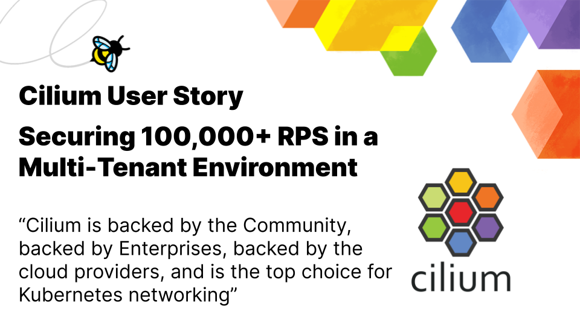

import authors from 'utils/author-data';

_October 13th, 2022_  
_Author: Bill Mulligan, Isovalent_

_This User Story comes from a company in the publishing industry_

With today's technology and new cycles, news "fresh off the press" means something quite different than the days of just printing presses. Publishing companies today need to keep their technology up to speed with the pace the world moves. For one publishing company, Cilium became their solution to connect their worlds together.

To make sure the news gets to you every morning, afternoon, and evening, the publishing platform has a Delivery Engineering Team that provides infrastructure to product engineering teams. Rather than running their own data centers, they have a cloud first strategy where everything should be moved to the cloud. The Delivery Engineering team is responsible for centralized infrastructure that everyone can deploy their services onto and is building out this cloud platform for the product engineering teams. By abstracting the business logic from the infrastructure, the platform allows teams to move more quickly.

Previously, many teams were spinning up their own individual Kubernetes clusters which led to inefficient use of resources and a large operations overhead. Delivery engineering needed to build a “paved road” for the developers to use and decided to build large multi-tenant, multi-region Kubernetes clusters to support their needs. Different business units would be able to deploy into the same clusters and the platform internals would be abstracted away from the teams.

While building out the platform, the Delivery Engineering team needed to balance standardization of infrastructure and the needs of individual teams. Different teams need or like different tools, but as the platform scales, these differences quickly add operational complexity and drain support resources. This fragmentation would mean instead of working through known bugs and edge cases and being able to quickly isolate the problem, the platform team would have to spend time debugging new problems and finding solutions.

“You can create a cluster in any cloud right now in seconds - that’s easy. The Day 2 Operations, scaling it, and keeping it up to date and secure are the real challenges.” - Staff Software Engineer

## Creating a Secure Multi tenant Kubernetes Environment with Cilium

The top two requirements for building out their multi tenant platform were security and performance. Guaranteed isolation between tenants was needed to ensure different teams could safely run on the same platform. In addition, as an organization with breaking news, they needed to plan for massive scale and performance. Just 10 services alone could easily reach 100,000 requests per second.

Isolation was a day one requirement that they needed to support with network policy. When they looked at what other companies were adopting, they found that “Cilium was basically the default everywhere.” On the performance side, they also knew that eBPF would be faster than IP tables.

They start by bringing up Kubernetes clusters, replacing kubeproxy with Cilium and implementing network policies. Once Cilium was up and running, they also installed Hubble for network observability.

“Hubble is useful because sometimes I don’t know why traffic is being denied and it allows me to quickly observe what is happening on the network and drill down to the root cause. I could get this from another platform, but having it integrated with Cilium makes it simple to set up and use.” - Staff Software Engineer

Cilium has already become the one solution that fits multiple problems from networking to observability to security and they don’t even use all of Cilium’s features yet. As the platform continues to grow, the Delivery Engineering team will be able to meet other team’s requirements and features without having to integrate new tools or implement one off features. For example, Cilium supports different styles of deployment allowing them to choose between direct routing and an overlay network as the team requires. “We know that Cilium can support a lot and is flexible enough to handle our use cases both now and in the future.”

From a security and compliance perspective, they are looking at egress filtering and Tetragon for defense in depth. It would allow them to understand which processes are doing what and drop suspicious traffic. As their platform grows to multiple clusters, they are also looking at Cluster Mesh to enable communication across regions and clouds.

“I’m excited to use Cilium because we have a great solution in place for our current needs and flexibility to meet our future needs. Cilium is backed by the Community, backed by enterprises, backed by the cloud providers, and is the top choice for Kubernetes networking.” - Staff Software Engineer

<BlogAuthor {...authors.BillMulligan} />
