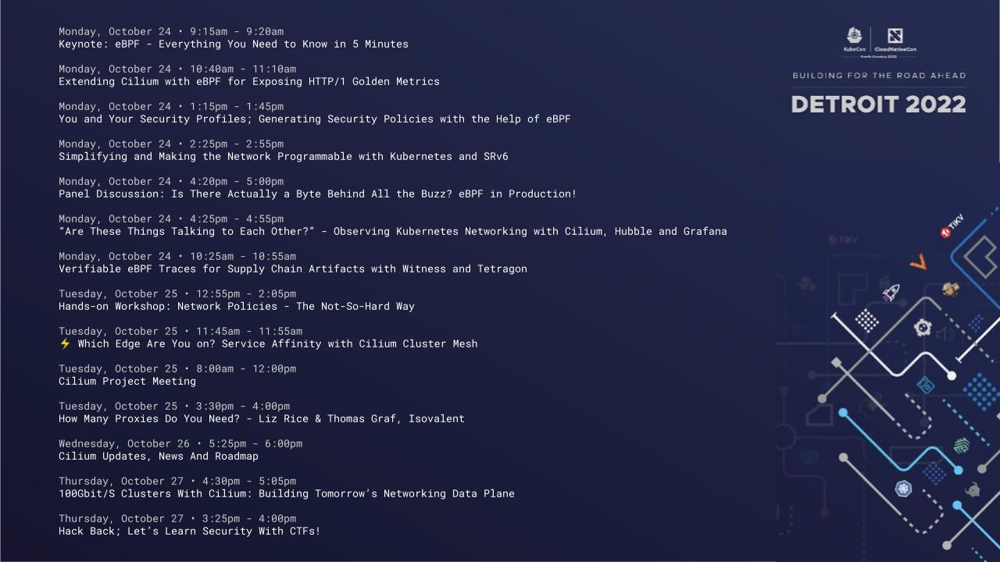

*October 17th, 2022*  
*Author: Bill Mulligan, Isovalent*

KubeCon + CloudNativeCon is already back around upon us and Cilium is represented in full force! There are 12 talks, workshops, and meetings that cover technical talks from Cilium contributors, tutorials to get people started, and end user stories from people putting Cilium into production. You will be able to catch presentations on everything from Cilium NetworkPolicies to Cilium for telco workloads to a tour of the Cilium for security. Let’s dive into each of the talks below.

## Cloud Native eBPF Day

### [Keynote: eBPF - Everything You Need to Know in 5 Minutes - Thomas Graf, CTO, Isovalent](https://sched.co/1Auye)
 
 Monday, October 24 • 9:15am - 9:20am

eBPF has become the key technology for infrastructure software. This session tells you everything you need to know about eBPF in 5 minutes. Why eBPF matters and why it exists. What it can do. What it can’t do. Who uses it for what. And finally, what the future holds.

### [Extending Cilium with eBPF for Exposing HTTP/1 Golden Metrics - Aidan Carson, Solo.io](https://sched.co/1Auyq)

Monday, October 24 • 10:40am - 11:10am

Metrics are table stakes for any modern service mesh, and because of the placement of proxies in a traditional sidecar-based topology, fairly straightforward to retrieve. However, as use cases evolve and the space matures, we have seen an evolution beyond that of traditional sidecar-based implementations. In this talk, Aidan will technically deep dive into the mechanisms through which we may retrieve the most valuable metrics — request count, response code, and latency (the so-called "golden metrics") — in a sidecarless environment with the help of eBPF. Aidan will discuss the hardships of implementing such a solution, and a few tips when operating at a higher protocol layer. All of these metrics will be exportable in Prometheus so that you may integrate a solution like this with toolchains in your existing infrastructure.

### [You and Your Security Profiles; Generating Security Policies with the Help of eBPF - John Fastabend & Natalia Reka Ivanko, Isovalent](https://sched.co/1Auz2)

Monday, October 24 • 1:15pm - 1:45pm

Using eBPF to detect and enforce security events by creating Security Policies continues to rise. This talk's main aim is to provide a hands-on walkthrough on the existing eBPF-based solutions to capture different sets of security events and approaches to create Security Policies. There has been a wide range of options to filter for system calls and generate Security Policies manually with seccomp and seccomp-bpf as well as automatically by using Inspektor Gadget and a Red Hat created seccomp profiler in the form of an OCI hook. Extending security events from capturing system calls to binaries, sockets, file operations, capabilities and namespaces and generating Security Policies automatically has became possible with Tetragon. The audience will learn how to leverage these tools, capture different sets of security events, generate Security Policies via a live demo and will leave with a good understanding of what would be the optimal solution to implement eBPF-based security tooling on their system.

### [Simplifying and Making the Network Programmable with Kubernetes and SRv6 - Daniel Bernier, Bell Canada & Louis De Los Santos, Isovalent](https://sched.co/1AuzH)

Monday, October 24 • 2:25pm - 2:55pm

SRv6 is being rapidly deployed by some of the largest names in the networking industry because it has the potential to simplify existing enterprise, telco, and provider networks while also introducing the idea of “programming the network as a computer.” Networking teams are now looking for ways to bridge the gap between SRv6 and Kubernetes to treat containers as ordinary clients on their networks. This talk will discuss how Cilium and its eBPF data plane was extended to support telco networking requirements in a cloud native way by integrating SRv6 and Kubernetes. It will start with an overview of the SRv6 use cases and network architecture at Bell Canada. We will then demo how Cilum’s SRv6 integration can be utilized with BGP to build a multi-cluster L3VPN topology over native IPv6.

### [Panel Disucssion: Is There Actually a Byte Behind All the Buzz? eBPF in Production! - Frederic Lardinois, TechCrunch; Andrew Sauber, The New York Times; Daniel Bernier, Bell; Purvi Desai, Google & James McShane, SuperOrbital](https://sched.co/1AuzK)

Monday, October 24 • 4:20pm - 5:00pm

eBPF is a revolutionary and very hyped technology which has led some people to ask if there actually is a byte behind all the buzz. This panel brings together end users of eBPF that are actually putting it into production to find out whether it is a painful sting or sweet honey for their infrastructure. The audience won’t learn about futuristic buzzwords. Instead, they will understand how eBPF is changing networking, observability, and security in production today.

## Open Observability Day

### [“Are These Things Talking to Each Other?” - Observing Kubernetes Networking with Cilium, Hubble and Grafana - Anna Kapuścińska, Isovalent](https://sched.co/1Avqp)

Monday, October 24 • 4:25pm - 4:55pm

“Are they even talking to each other”? - asked almost every engineer on the planet when debugging their system. Although the question is being asked forever, the answer isn’t always easy. As the complexity of our systems grows, networking becomes more and more a magic glue: it's hard to understand and even harder to debug. Good observability helps in both understanding and debugging what happens. Nowadays more and more people are looking into eBPF as a solution for networking and observability. That’s what the Cilium project provides: eBPF-based networking, with a visibility layer - Hubble. At the same time, observability in the cloud native world is commonly achieved with Prometheus and Grafana dashboards. We will connect these technologies. Using Hubble metrics, we will visualize how applications talk to each other in a Kubernetes environment, famous for its complex networking. In a real-world scenario, we will discover a mysterious communication problem. It won’t scare us though. Equipped with open source tools, we will quickly debug the system and uncover the underlying issue.

## Cloud Native SecurityCon

### [Verifiable eBPF Traces For Supply Chain Artifacts with Witness and Tetragon - Cole Kennedy, TestifySec](https://sched.co/1AOie)

Monday, October 24 • 10:25am - 10:55am

Until now, validating the build environment and detecting tampered tooling in a build has been very difficult. This talk will show how Cillium Tetragon and Witness integration simplifies this process for developers and security engineers. Witness is a framework for supply chain security that implements the in-toto specification. It has a modular design, easily extendable for various attestors, backends, and key providers (including SPIFFE/SPIRE). This talk will show an attestation plugin that programs Cillum Tetragon to provide detailed eBPF traces of a build step. Additionally, we will create a build policy that verifies the trace and blocks the execution of workload compiled by a malicious compiler when the compiled workload is executed.

### [Hands-on Workshop: Network Policies - The Not-So-Hard Way - Raymond de Jong, Isovalent](https://sched.co/1AOju)

Tuesday, October 25 • 12:55pm - 2:05pm

Many people avoid networking wherever possible because they think it is too complex and don’t even get them started on policy. In this session, we will help overcome these fears for both app developers and operations teams with network policies the not so hard way. In four easy steps we will: Introduce the fundamentals of Cilium Network Policies and the basics of application-aware and Identity-based Security Discuss the default-allow and default-deny approaches and visualize the corresponding ingress and egress connections Use the Network Policy Editor to show how a Cilium Network Policy looks and what they do on a given Kubernetes cluster Walk through examples and demonstrate how application traffic can be observed with Hubble The audience will walk away with the ability to create network policies for their workloads so they can stop worrying and love the secure connections, and show how you can use the Network Policy Editor to apply new Cilium Network Policies for your workloads.

## Kubernetes on Edge Day

### [⚡ Which Edge Are You on? Service Affinity with Cilium Cluster Mesh - Raymond de Jong, Isovalent](https://sched.co/1ARMh)

Tuesday, October 25 • 11:45am - 11:55am

Edge computing can require connecting hundreds of clusters across disparate locations and infrastructures. Without a networking solution to manage this scale and complexity, you will just have a bunch of computers talking to themselves rather than each other and your customers. In this session we will explore how you can leverage the new Service Affinity feature with Cilium Cluster Mesh for providing the correct connectivity for load-balancing, observability, and security between nodes across multiple clusters, enabling simple, high-performance cross-cluster connectivity at the edge. We’ll explore how Cluster Mesh allows endpoints in connected clusters to communicate while providing full security policy enforcement. The audience will walk away with an appreciation for how eBPF can ensure you communicate with the right edge.

## KubeCon + CloudNativeCon

### [Cilium Project Meeting](https://sched.co/1BaT3)

Tuesday, October 25 • 8:00am - 12:00pm

Join us to discuss the future of the Cilium project! [Sign up for what you are interested here](https://docs.google.com/document/d/1GXHNt3JrmvZY_uYI9sO4SHLej2E5SCpLpZsD0fpk3Ms/edit#)

### [Cilium Updates, News And Roadmap - Thomas Graf, Bill Mulligan & Liz Rice, Isovalent; Purvi Desai, Google](https://sched.co/182NR)

Wednesday, October 26 • 5:25pm - 6:00pm

Welcome to Cilium! In this session you'll get an update on how the Cilium project has been progressing on the road towards graduation. You'll hear about the latest developments and future roadmap, including news about some of the largest and most interesting deployments of Cilium. And don't miss this session if you're interested in contributing to the project, as there will be guides on how to get involved and where your help is needed.

### [100Gbit/S Clusters With Cilium: Building Tomorrow’s Networking Data Plane - Daniel Borkmann & Nikolay Aleksandrov, Isovalent](https://sched.co/182DB)

Thursday, October 27 • 4:30pm - 5:05pm

The vast majority of Kubernetes users today are running IPv4-only clusters or transitioning to dual stack deployments as an interim step on the journey towards IPv6-only clusters. The latter are not only an enabler for more IPAM flexibility and larger cluster scale, but also unlock new Linux kernel innovations in networking and eBPF to cater for data intensive workloads. In this talk, we examine what's possible once we arrive at IPv6-only clusters. We present recent advancements in Cilium's networking data plane enabling a low-latency architecture suitable for "BIG TCP"-based workloads requiring IPv6 for 100Gbit/s transfers and beyond for a single socket. In addition, we deep dive our path into achieving host networking performance characteristics for Pods through a new veth driver replacement we specifically developed for the kernel in context of Cilium. With the resulting eBPF forwarding architecture, most unneeded parts of the stack are bypassed, drastically improving networking.

### [Hack Back; Let’s Learn Security With CTFs! - Lewis Denham-Parry, Control Plane & Natalia Reka Ivanko, Isovalent](https://sched.co/182Ej)

Thursday, October 27 • 3:25pm - 4:00pm

Threat actors have always been looking to attack clusters. Do you have the right security in place to detect and defeat if they are targeting yours? Or they are already in? Kubernetes has become the de facto cloud operating system and production environments have increased in maturity. So have the threats. Security Teams don’t necessarily have the expertise to detect state-of-art attack scenarios specific to cloud-native environments, like Kubernetes. So, where do they get started? Capture-The-Flag (CTF) events are a great way to learn about the techniques of both attack (Red Team) and defence (Blue Team). This talk will give you a framework for your own internal CTF events, with Red and Blue Team assessments, as a best practice for improving security in your organisation. We'll give a hands-on, live walkthrough of the top 3 state-of-art attack scenarios as CTF exercises using common open source projects like Simulator and Tetragon. Remember, the best way to learn how to detect is to first know how to attack!

Make sure you stop by the Cilium booth to get your Cilium swag. See you there!
