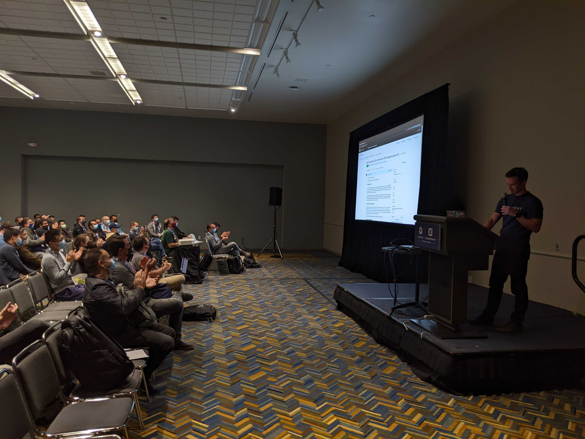

import authors from 'utils/author-data.js';

This week at KubeCon 2022 NA in Detroit, the Cilium community has applied to become a CNCF graduated project by creating a [PR](https://github.com/cncf/toc/pull/952) in the cncf/toc repository.
This is a major milestone for the Cilium community and users. The entire community is grateful to everyone who has helped to get the Cilium this far. We are looking forward to work through the graduation project with the CNCF community.

## What is Cilium?

[Cilium](https://cilium.io) is a networking, observability, and security solution with an eBPF-based dataplane (To learn more about eBPF, visit [eBPF.io](https://www.ebpf.io/)). As a CNI, it provides a simple flat Layer 3 network with the ability to span multiple clusters in either a native routing or overlay mode. Cilium is L7-protocol aware and can enforce network policies on L3-L7 using an identity based security model that is decoupled from network addressing.

Cilium implements distributed load balancing for traffic between pods and to external services, and is able to fully replace kube-proxy, using efficient hash tables in eBPF allowing for almost unlimited scale. It also supports advanced functionality like integrated ingress and egress gateway, bandwidth management and service mesh, and provides deep network and security visibility and monitoring through Hubble and Tetragon.

## Why we are ready to graduate

Cilium has 13,000+ GitHub stars and 500+ contributors across the various repos in the [Cilium GitHub org](https://github.com/cilium) and 13,000+ users registered for the [Cilium community Slack](https://cilium.herokuapp.com/). Cilium was [open sourced in 2015](https://github.com/cilium/cilium/commit/7fa3c60eb7dbe7a5a4caea3aab0396f75a8b10c7), [hit the 1.0 milestone in 2018](https://cilium.io/blog/2018/04/24/cilium-10/), and [joined the CNCF at Incubation level in October 2021](https://www.cncf.io/blog/2021/10/13/cilium-joins-cncf-as-an-incubating-project/). It currently powers production systems at scale all around the world, including at
[Adobe](https://www.youtube.com/watch?v=7UQ2CU6UEGY), [Bell Canada](https://www.youtube.com/watch?v=vJaOKGWiyvU), [CapitalOne](https://www.youtube.com/watch?v=hwOpCKBaJ-w&ab_channel=eBPFSummit), [Datadog](https://www.cncf.io/case-studies/datadog/), [IKEA](https://www.youtube.com/watch?v=sg-F_R-ZVNc), [Nexxiot](https://www.cncf.io/case-studies/nexxiot/) [Sky](https://www.youtube.com/watch?v=u-4naOMfs_w), [Utmost](https://www.cncf.io/case-studies/utmost/), and [many more](https://github.com/cilium/cilium/blob/master/USERS.md). It is also the default CNI for managed Kubernetes on GKE, Anthos, EKS-A, AKS, and other cloud providers.

## How to Help

- If you are a fan of Cilium, we would love a 👍, ❤️, or 🚀on the [PR](https://github.com/cncf/toc/pull/952).
- If you are using Cilium in dev, testing, or production, we would love to hear your feedback in our [User Survey](https://docs.google.com/forms/d/e/1FAIpQLSfL01ttSgzmWQbOHxZu61B99Iw3Yw3irZ1X7CRCQfBJkrN7Rg/viewform?usp=sf_link)
- If you are using Cilium in production, please add your name to the [Users](https://github.com/cilium/cilium/blob/master/USERS.md) doc
- If you do any of the above, share it on the social media platform of your choice

<BlogAuthor {...authors.thomasGraf} />
