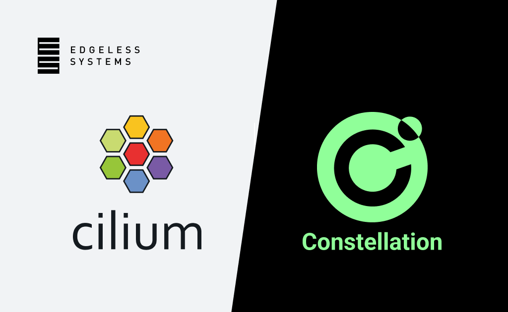

*November 3rd, 2022*
*Author: Leonard Cohnen & Moritz Eckert, Edgeless Systems*

[Constellation](https://github.com/edgelesssys/constellation) is a Kubernetes engine that aims to provide the best possible data security by shielding your entire Kubernetes cluster from the underlying cloud infrastructure. Everything inside a cluster is always encrypted, including at runtime in memory. For this, Constellation leverages a technology called [confidential computing](https://content.edgeless.systems/hubfs/Confidential%20Computing%20Whitepaper.pdf).

From a security perspective, Constellation is designed to prevent any access from the underlying (cloud) infrastructure. This includes access from data center employees, privileged cloud admins, and attackers coming through the infrastructure. Such attackers could be malicious co-tenants escalating their privileges or hackers who managed to compromise a cloud server. From a DevOps perspective, Constellation is designed to work just like what you would expect from a modern Kubernetes engine.

Constellation ensures everything is always encrypted with runtime encryption, transparent key management, and transparent encryption of network and storage. When deciding how to ensure data in transit is safe from malicious actors, we decided to use Cilium for network encryption. This blog dives into why we chose Cilium, how we implemented it, and what we learned along the way. We’ll dive into the technical challenges and difficulties we encountered when leveraging Cilium for Constellation. If you’re all into Kubernetes networking, eBPF, and Cilium, you’re in for a treat. If not, don’t worry, we’ll highlight the important takeaways, and you’ll learn a thing or two about the inner workings of Cilium on the way.

## Encryption vs. Access

Constellation must ensure all communication in a cluster is protected while allowing access to the outside world. This includes the Pod network carrying the application traffic and the Kubernetes communication itself. Simply put, all Node-to-Node traffic must be encrypted. However, the Nodes should still be reachable from the outside world for most applications, supporting LoadBalancer and NodePort services.

Isolating the entire cluster in a VPN on the host level might be the first solution that comes to mind, and it solves the first part of encrypting all traffic. However, it makes the second part quite cumbersome and impractical.

Instead, Constellation addresses this problem on the CNI level. Our CNI solution of choice is [Cilium](https://cilium.io/). It combines great performance with [transparent network encryption](https://docs.cilium.io/en/stable/gettingstarted/encryption/). Cilium supports both [IPSec](https://docs.cilium.io/en/stable/gettingstarted/encryption-ipsec/) and [WireGuard](https://docs.cilium.io/en/stable/gettingstarted/encryption-wireguard/). Essentially, it establishes a VPN network between Nodes while maintaining features allowing access outside the cluster, such as service exposure and load balancing.

## Implementing Transparent Network Encryption in the Real World

As with every security product, we need to strike a balance between security and usability. We need to provide guarantees about what traffic is encrypted while

- A)      Not obstructing the user from their primary work
- B)      Making the default secure
- C)      Minimizing any chance of misconfiguration

Cilium strikes that fine balance very well by making transparent network encryption easy to use. If you’re using the Cilium CLI, it’s just passing another command line flag during installation. Unfortunately, with the latest release, there is still a [known issue](https://docs.cilium.io/en/v1.13/security/network/encryption/#known-issues-and-workarounds) with the effectiveness of said encryption. In essence, to give the guarantee that all Pod-to-Pod traffic is encrypted, the admin would need to disable all Pod-to-Internet communication. While this solution works well in scenarios where a knowledgeable admin can securely configure the needed network policies, we want a secure out-of-the-box experience. Before coming up with a solution, we first need a deeper understanding of the problem.

### The consistency problem

As stated in the GitHub issue description, both the identity-based policy enforcement and encryption rely on an [eBPF map](https://docs.kernel.org/bpf/maps.html) called IPCache to reason about the source and destination identity of packets. If the IPCache indicates that a destination IP is associated with a Kubernetes Pod, the packet is re-routed through the WireGuard interface. This interface then takes care of encapsulating and encrypting the packet and sending it to the Pod's Node.

> Since WireGuard encapsulates the packets, there is not much gained by using [native routing](https://docs.cilium.io/en/v1.13/network/concepts/routing/#native-routing). Luckily, running Cilium in tunneling mode [does not encapsulate WireGuard traffic twice](https://docs.cilium.io/en/v1.13/security/network/encryption-wireguard/).

The IPCache eBPF map is only eventually updated with new endpoints. To reproduce the issue, we need to introduce artificial delay somewhere along the path from the new endpoint creation to the IPCache update.

The flow from a new endpoint (e.g., Pod) to a new IPCache entry on a remote Node is as follows:

1. Endpoint is created
2. Cilium-agent creates a new CiliumEndpoint custom resource
3. Cilium-operator merges CiliumEndpoints with the same identity to one CiliumEndpointSlice
4. Cilium-agent watches and consumes all CiliumEndpointSlices
5. Cilium-agent writes a new entry in IPCache

From this flow, it is obvious that the IPCache is only eventually consistent, and we should be able to reproduce the issue by disabling the Cilium operator.

We can verify that this reproduces the issue by adapting the WireGuard integration test in [`test/k8s/datapath_configuration.go`](https://github.com/edgelesssys/cilium/blob/d465085df155502267589f782801c63f3d08dd40/test/k8s/datapath_configuration.go#L545).  In this test, the execution is explicitly halted until the endpoint has propagated:

```golang
// Due to IPCache update delays, it can take up to a few seconds
// before both nodes have added the new pod IPs to their allowedIPs
// list, which can cause flakes in CI. Therefore wait for the
// IPs to be present on both nodes before performing the test
```

Using this test, we scale the Cilium-operator deployment to 0 before deploying the test DaemonSet. If we now remove the check for the updated WireGuard peers mentioned above, the tests fail since the new endpoints can’t properly propagate to the IPCache and unencrypted traffic is leaked.

In summary, when network traffic is sent to newly created Kubernetes Pods, a short delay in the propagation of routing information can lead to Cilium sending that traffic unencrypted over the wire.

### The strict mode solution (planning phase)

Now that we [have a test case](https://github.com/cilium/cilium/blob/5da5882754569e118e713532b89dc4ca89ab76fd/test/k8s/datapath_configuration.go#L387), we can begin to develop a solution. We call it the strict mode.

With Constellation, we are uniquely positioned to control the whole underlying stack, including the Kubernetes and Cilium bootstrapping process. Therefore, we can automatically deploy and configure Cilium with our strict mode.

We define the following constraints for our strict mode:

- IPv4 only (Pod network still commonly IPv4 only)
- PodCIDR must be known beforehand
- Both vxlan (used for AWS/Azure) and native routing (used for GCP) must be supported

While the IPv4 limitation can be easily solved later, the PodCIDR must be static and known before deploying Cilium. Support for a dynamic PodCIDR is a complex feature to implement because of the same eventual consistency problems we are trying to solve in the first place. Since we support Cilium’s tunneling and native routing capabilities, the strict mode must also work with both. Note that the test we adapted already covers both scenarios.

### The exception

As stated earlier, we only use native routing on GCP and rely on vxlan for AWS and Azure. This is because GCP is the only of the three which implements IPAM in a way in which the PodCIDR is disjoint from the NodeCIDR. This allows us to filter traffic based on the subnet.

Implementing strict mode support for AWS and Azure poses some challenges. When using native routing, Pod IPs are usually allocated out of the same subnet as Node IPs. Therefore, we cannot filter by subnet, as it would also disrupt Node-to-Node communication. 

We can combine our CIDR-based filter with the IPCache to regain Node-to-Node communication. If a packet matches the filter, we can look up the destination's identity in the IPCache. If the destination is a Node, we allow the packet to leave the Node.

This solution has a caveat: The Node could have been terminated, and its IP re-used as a Pod IP while the IP is still associated with the Node in the IPCache. Luckily, this attack is very hard to pull off. An attacker would need to control many different variables. Furthermore, mechanisms such as a cooldown period between IP re-usage should prevent this from happening by chance. 

Similarly, when using VXLAN, multiple IPs are associated with the Node inside the PodCIDR, such as the `CiliumInternalIP`. This IP is used for, e.g., routing traffic originating from one Node to a Pod on another Node. Therefore, we must again employ the same exception by using the IPCache.

Enabling strict mode is still beneficial on AWS and Azure. Also, the upcoming Node-to-Node encryption feature allows us to eliminate the exception.

### The strict mode solution (implementation phase)

The Cilium community was very kind and helpful with our problem. They were quick to respond and helped us with the implementation of the strict mode. In the discussions with the Cilium maintainers, they suggested a location [in the datapath](https://docs.cilium.io/en/v1.13/network/ebpf/lifeofapacket/#life-of-a-packet) where we should add our [IP-based filter](https://github.com/cilium/cilium/pull/21856/files#diff-f1851842acdc4e195dcd1b102c3c2597c293c1bfd04dc7e1bca8e02050102915R110). After some trial and error; we finally found the correct spots in [`bpf/bpf_host.c`](https://github.com/cilium/cilium/pull/21856/files#diff-ff0cc41af3fc733a268ec48f09df41cc2bf321f9191d8df1722b6d195e88e193R1495) and [`bpf/overlay. c`](https://github.com/cilium/cilium/pull/21856/files#diff-01b3b17d448a4cf12c8ce37729576da934f2c3ed8801216b33d4e13a39299193R684), which made our code pass the test. For the eBPF connoisseurs, we’ve listed the actual packet filter code below. If you’re unsure what you see there, it filters packets based on IPv4 subnets. What? We never said it’s rocket science.

```c
/* strict_allow checks whether the packet is allowed to pass through the strict mode. */
static __always_inline bool
strict_allow(struct __ctx_buff *ctx) {
 struct remote_endpoint_info __maybe_unused *dest_info, __maybe_unused *src_info;
 bool __maybe_unused in_strict_cidr = false;
 void *data, *data_end;
#ifdef ENABLE_IPV4
 struct iphdr *ip4;
#endif
 __u16 proto = 0;

 if (!validate_ethertype(ctx, &proto))
  return true;

 switch (proto) {
#ifdef ENABLE_IPV4
 case bpf_htons(ETH_P_IP):
  if (!revalidate_data(ctx, &data, &data_end, &ip4))
   return true;

  /* Allow traffic that is sent from the node:
   * (1) When encapsulation is used and the destination is a remote pod.
   * (2) When the destination is a remote-node.
   */
  if (ip4->saddr == IPV4_GATEWAY || ip4->saddr == IPV4_ENCRYPT_IFACE)
   return true;

  in_strict_cidr = ipv4_is_in_subnet(ip4->daddr,
         STRICT_IPV4_NET,
         STRICT_IPV4_NET_SIZE);
  in_strict_cidr &= ipv4_is_in_subnet(ip4->saddr,
          STRICT_IPV4_NET,
          STRICT_IPV4_NET_SIZE);

#if defined(TUNNEL_MODE) || defined(STRICT_IPV4_OVERLAPPING_CIDR)
  /* Allow pod to remote-node communication */
  dest_info = lookup_ip4_remote_endpoint(ip4->daddr, 0);
  if (dest_info && dest_info->sec_identity &&
      identity_is_node(dest_info->sec_identity))
   return true;
#endif /* TUNNEL_MODE || STRICT_IPV4_OVERLAPPING_CIDR */
  return !in_strict_cidr;
#endif /* ENABLE_IPV4 */
 default:
  return true;
 }
}
```

Description: Basic eBPF IPv4 packet filter based on CIDR.

The full implementation was [merged into Cilium](https://github.com/cilium/cilium/pull/21856) and will be released with v1.15. It is already used and configured automatically by Constellation. 

With the [v1.14 release]([https://github.com/cilium/cilium/milestone/37](https://github.com/cilium/cilium/milestone/42)) Cilium will also introduce [Node-to-Node](https://github.com/cilium/cilium/pull/19401) encryption. We are very excited about this feature since it further increases Constellation's security. We'll evaluate if Constellation can fully switch from Pod-to-Pod encryption + strict mode to Node-to-Node encryption. Moreover, we'll test if our strict mode must be adapted to work with Node-to-Node encryption.

## Conclusion

We’ve seen how Cilium helps Constellation protect data in transit as one of three pillars of always encrypted Confidential Kubernetes. The eventually consistent routing information turned out to be a problem for guarantees about encrypting all workload traffic. With the help of the community and maintainers, we were able to lift Cilium’s capabilities and flexibility to implement a strict mode that solved the problem.

Let us know if you found our deep dive insightful and if you want to learn more about Constellation and Cilium. For example, protecting the Kubernetes API-Server-to-Node communication or integrating Cilium’s Node-to-Node encryption mode into Constellation. In the meantime, you can find everything about Constellation on [GitHub](https://github.com/edgelesssys/constellation) and in our [docs](https://docs.edgeless.systems/constellation).

Thanks to [@benschlueter](https://github.com/benschlueter) for the joint work. Thanks to [@pchaigno](https://github.com/pchaigno), [@brb](https://github.com/brb), and [@gandro](https://github.com/gandro) from Cilium for the helpful hints and discussions.
Thanks to [@xmulligan](https://github.com/xmulligan) for reviewing and helping with the blog post.
