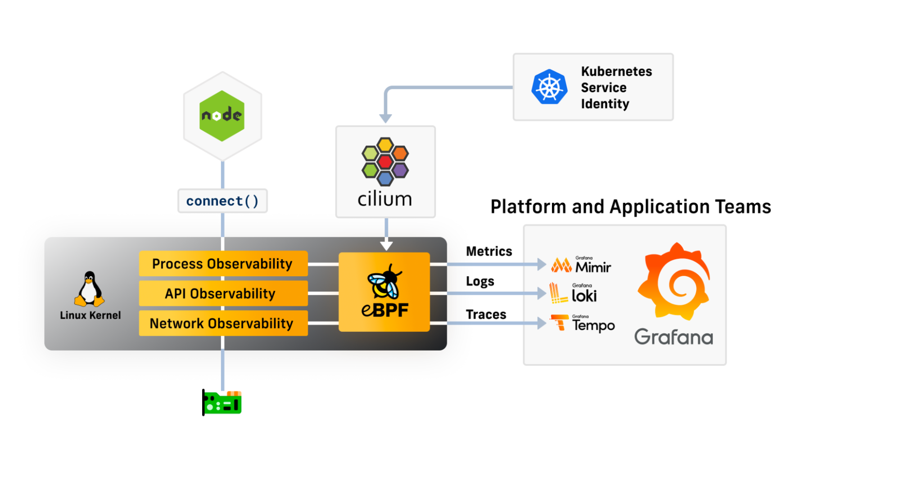
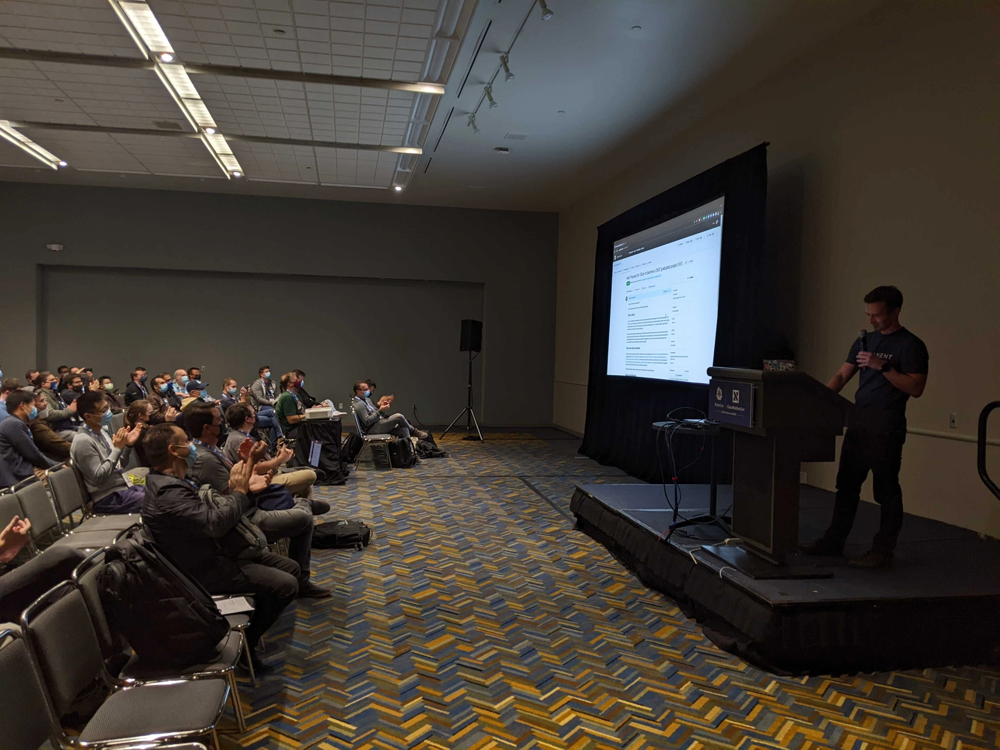
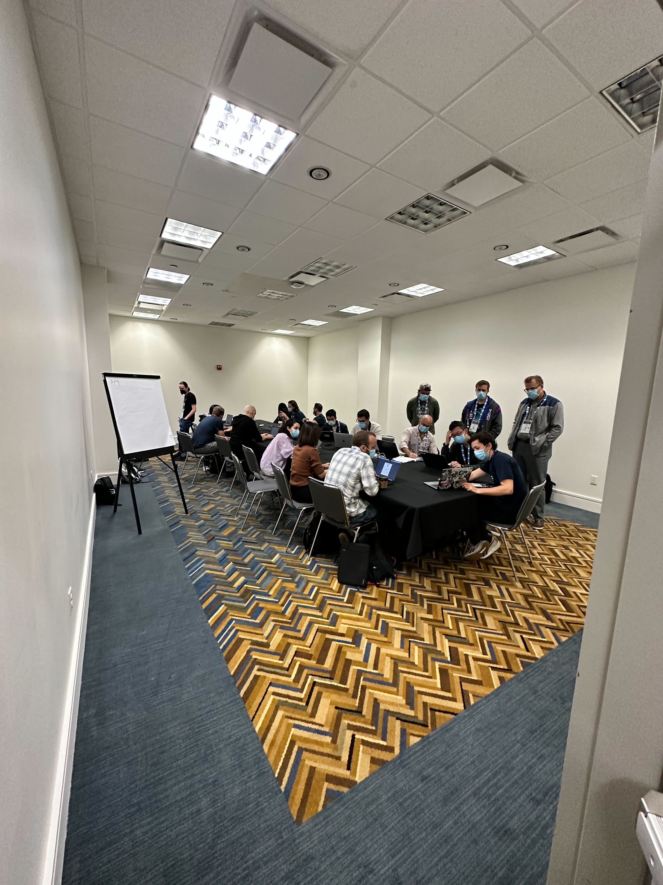
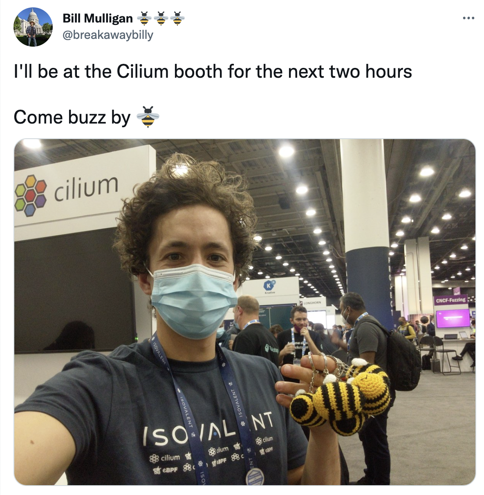

_November 4th, 2022_  
_Author: Bill Mulligan, Isovalent_

KubeCon + CloudNativeCon NA 2022 was a buzz with activity around Cilium. In this post, I will try to sum up all the big annoucements and moments so the people that weren't able to attend in person can feel like they were there too.

### Announcement Microsoft AKS picking Cilium

Cilium is now the default CNI for all major cloud providers. If it wasn't obvious already, Cilium has become the standard networking layer for Kubernetes everywhere. Here's the [announcement](https://azure.microsoft.com/en-us/updates/public-preview-azure-cni-powered-by-cilium/) from Microsoft, [blog](https://techcommunity.microsoft.com/t5/azure-networking-blog/azure-cni-powered-by-cilium-for-azure-kubernetes-service-aks/ba-p/3662341), and [docs](https://learn.microsoft.com/en-us/azure/aks/azure-cni-powered-by-cilium). There's also a blog from Isovalent about it [here](https://isovalent.com/blog/post/azure-cni-cilium/?utm_source=website-cilium&utm_medium=referral&utm_campaign=cilium-blog).

### Grafana + Cilium Integration

eBPF-powered observability for Kubernetes and cloud native infrastructure. What else needs to be said? Cilium, through eBPF, lets you collect all the information you need about your applications and infrastructure while Grafana gives you a great way to visualize it. Cilium + Grafana will be a crucial part of the observability future. I highly recommend [the blog](https://grafana.com/blog/2022/10/24/grafana-and-cilium-deep-ebpf-powered-observability-for-kubernetes-and-cloud-native-infrastructure/) deep diving into how the integration works.

### CNCF Graduation Application

Live on stage, Cilium applied for CNCF Graduation (If you haven’t yet, make sure to :+1: the [pull request](https://github.com/cncf/toc/pull/952)) I'm excited to see it graduate as validation of all the work the community has put in to bring the project this far! There is a [blog post](https://cilium.io/blog/2022/10/27/cilium-applies-for-graduation/) about it too.

### Conference Talks

Cilium was a part of 13 talks all around the conference covering KubeCon, eBPF Day, ServiceMeshCon, Observability Con, Security Con, and Kubernetes on Edge Day. You can read all about them in [blog post](https://cilium.io/blog/2022/10/17/cilium-kubecon-na-talks/) and the videos should be up soon too.

### Cilium Project Meeting

Cilium hosted its first project meeting at KubeCon. I wasn't quite sure what to expect, but I was blown away by the response! We had four hours packed with getting people introduced to Cilium, disucssing issues and development, and diving into service mesh. It was also great to see some faces I have only seen on slack so far.

### Final Thoughts: Ecosystem

Looking back on the show, I think we will see this KubeCon as the kick-off of the ecosystem around Cilium. With the Microsoft announcement, Cilium has cemented its status as the standard way of doing networking in cloud native environments.

Once an ecosystem has a standard, it makes it massively easier to provide integrations and extensions since everyone is using the same thing. We can already see this with the Grafana announcement too. With Cilium everywhere capturing observability data with eBPF, it makes total sense to connect it to Grafana and visualize the data.

Cilium everywhere will also bring the power and functionality of eBPF everywhere. The ecosystem around Cilium can leverage this data and functionality to build better platforms to end users. And this is just the kick-off!

