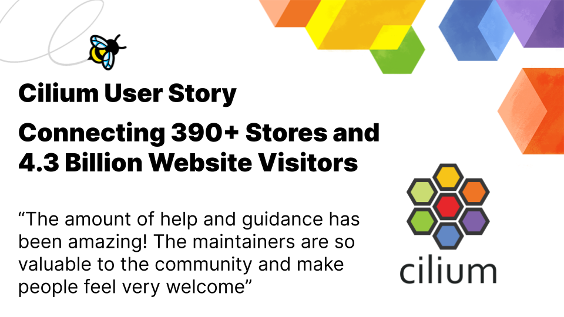

import authors from 'utils/author-data';

_January 05th, 2022_  
_Author: Bill Mulligan, Isovalent_

_This User Story comes from a company in the retail industry_

Retail experiences are increasingly moving online with consumers wanting to be able to buy when and where they want. For one retail company, that meant supporting 392 stores with 657 million visitors, 4.3 billion visits to their website, 23.9 million downloads of their app, and 3,000 co-workers in their Digital Organization.

They needed to modernize to meet the needs of the rapidly changing retail industry. A key part of that strategy was adopting a multi-cloud strategy, across an on-premises private cloud platform and multiple public cloud providers. While their digital presence is incrementally moving to the public cloud, an on-premises environment is still required for the foreseeable future. Their private cloud needed a developer experience similar to what would be offered in the public cloud to keep pace.

## Building a Secure Private Cloud

The Cloud Center of Excellence was tasked with building out a cloud native platform for their private cloud. With a complex set of data centers, stores, and regulated environments they needed to be careful about their technology selection because it could quickly become an unmaintainable stack of tools customized to each environment. They turned towards open source to give them the speed and flexibility that they needed. By working with the projects, they could learn what assumptions were made, what the roadmap is, and how they could influence or even drive feature development. The company took the philosophy that they would look for a CNCF project before actually developing anything on their own.

## Cloud Native Networking Requirements

They selected Kubernetes as the foundation for their private cloud due to its API-first architecture and extensibility. Their private cloud architecture also follows public cloud principles such as region/availability zones, multi-tenancy, and a zero-trust approach to security. However, to meet these demands, they required an advanced cloud native networking platform to provide:

- Multi-cluster connectivity and security across AZs
- Integration with the existing network data center fabric and firewall
- Support for non-Kubernetes workloads such as bare-metal
- High level of observability
- IPv6-readiness for future requirements

## Migrating from Calico to Cilium

The retail company originally started building their network with Calico, but ran into problems. They wanted to run routing daemons on the boxes as routers in their network, outside the CNI and Kubernetes, they also wanted to be able to mesh clusters together, and needed a BGP environment. When looking for alternative solutions, they landed upon Cilium and decided to work with [Isovalent](https://isovalent.com/) to implement it.

They set up a new environment and started to migrate workloads from their existing infrastructure to the new one. This provided the smoothest transition from a consumer point of view because they just had to switch the routing in the back door. With Cilium enabled, they were able to take advantage of many new features including Cilium Cluster Mesh to provide cross cluster service discovery, load balancing, and network policies, integration with their existing firewall and leaf/spine network with Egress Gateway and BGP respectively, and flow observability of their network traffic with Hubble.

## Cilium Benefits and Future Direction

By implementing Cilium, they gained operational simplicity, interoperability, and increased developer trust. BGP on Cilium and Cluster Mesh were significantly simpler to operate than their previous Calico set up and have saved the team countless hours. For interoperability, Cilium not only acts as a bridge between the private cloud and their existing infrastructure with its Egress Gateway Firewall and BGP features but it is also used to connect with non-Kubernetes environments.

With zero trust networking, it can be difficult for developers to understand why their application isn’t working or their connection is dropped. Using Hubble, developers are now able to visualize their workload’s network traffic and see what traffic has been dropped allowing them to implement and verify the network policies they need. The data from Hubble is also connected to their Grafana environment with existing application metrics, logs, and traces.

Besides just consuming open source, the retail company has committed patches and bug fixes to Cilium too. “The amount of help and guidance from opening our first issue to getting our commits merged has been amazing! The maintainers are so valuable to the community and make people feel very welcome” Senior Digital Technology Engineer.

In the future, the retail company would love to run IPv6-only within their data centers, but they have a large legacy estate with limited IPv6 support. Cilium’s [new Nat46/64 feature](https://isovalent.com/blog/post/cilium-release-112/#nat46-nat64) will simplify their IPv6 roll-out. They also want to examine [Cilium sidecarless service mesh](https://isovalent.com/blog/post/cilium-service-mesh/) and are looking at [Tetragon](https://isovalent.com/blog/post/2022-05-16-tetragon/) in collaboration with their security team to improve the security posture across all of their environments.

<BlogAuthor {...authors.BillMulligan} />
