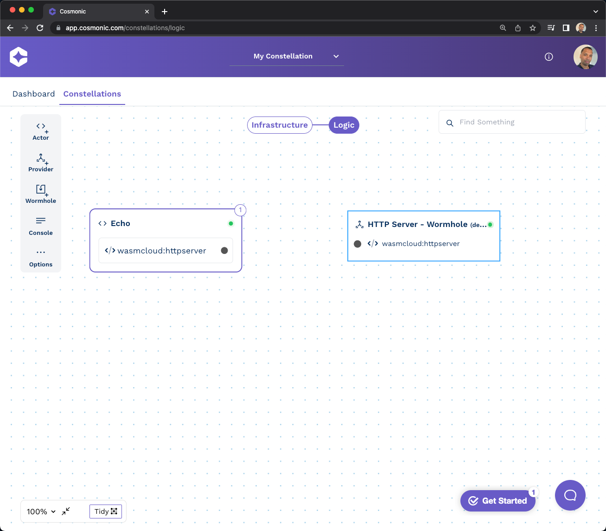

*January 11th, 2023*  
*Author: Bill Mulligan, Isovalent*

An ideal world is where developers can just ship business logic without having to worry about where or how it runs. wasmCloud is the hot new distributed platform for writing portable business logic that can run anywhere.

Founded by the principal maintainers and creators of wasmCloud, Cosmonic created the first, feature-rich WebAssembly (Wasm) PaaS to enable developers to assemble and deploy applications, across any cloud, edge, or device with minimal effort. As they built the Cosmonic platform the team needed a way to connect and secure all of their customer workloads wherever they reside so their customers could just focus on writing business logic. They chose Cilium as the ideal solution.

**What is Wasm?**

Before we dive into Cosmonic’s Wasm PaaS, we need first to understand how the platform works, and the challenges that led Cosmonic to look at Cilium.

“eBPF is to the kernel what Javascript is to the browser” has often been used to explain what eBPF is, but it now might be better finished “what Wasm was to the browser and is now to the cloud”. Both technologies are highly programmable and help overcome the limitations of the platforms they are embedded in. Wasm, as an abstraction, makes it possible to safely and efficiently deploy the same code wherever your business logic is needed without having to worry about the details of the underlying platform. 

Wasm is aimed at providing application developers the ease and accessibility of Javascript but with additional efficiency and safety benefits and the flexibility of using other languages, such as C/C++ just like the kernel verifier improves safety over kernel modules. Because they are compiled, Wasm and eBPF also run much faster than interpreted languages like JavaScript. This means that developers can build complex and computationally intensive applications, such as games or machine learning models, that would be difficult or impossible to run in the browser using JavaScript.

The same features that make Wasm good for the browser make it good for compute workloads in the cloud. Adobe’s engineering team started using Wasm within flagship web browser-based products Photoshop, Lightroom, and Acrobat, but are now running wasmCloud alongside their Kubernetes architecture. They’re seeing significant performance improvements as a result. Find out more on the [CNCF blog](https://www.cncf.io/blog/2022/11/17/better-together-a-kubernetes-and-wasm-case-study/).

Both Wasm and eBPF are extremely portable. Linux runs on billions of devices and most of them support eBPF out of the box while Wasm code can be run on any platform that supports it. They both make it easier for developers to build applications that can be used across a wide range of devices and platforms.

**Building a Wasm PaaS with wasmCloud**

Created by Cosmonic, wasmCloud was designed to “helps developers build, test, scale, deploy, and operate services and functions at scale quickly” which made it the natural foundation for the Cosmonic PaaS.

WasmCloud brings the promise of low-boilerplate, agile application development where engineers solely focus on business logic. For the Cosmonic platform to deliver on this promise, the team needed to carefully choose the abstractions that would be inherent in the PaaS. 

As Dan Norris, Infrastructure Lead at Cosmonic, started designing the architecture behind Cosmonic’s hosted PaaS, he had several major system components to consider. First, he needed a distributed system scheduler to handle jobs. HashiCorp Nomad was chosen over Kubernetes for job scheduling because of its simplicity and versatility (watch [Distributed Flexibility: Nomad and Vault in a Post-Kubernetes World](https://www.youtube.com/watch?v=U1zn5OO8dHs) to learn more).

Running a hosted service for microservices also meant that the team needed a good way to connect, secure, encrypt, separate, and enforce policy for their customers. Cilium was selected as the Container Network Interface (CNI) to help with each of these concerns. Dan comments: “The best CNI is Cilium. Let’s not kid around here. There’s other good ones here, but Cilium ticks all the boxes.”

Initially, integrating Cilium with Nomad was challenging as Cilium is, unsurprisingly given Kubernetes’ omnipresence, better integrated with Kubernetes. Dan and the team at Cosmonic wrote a custom operator, integrated with Cilium and capable of working with Nomad - they are looking at open sourcing it in the future.

**Securing the Network and Platform with Cilium**

On Cosmonic, once a [host](https://cosmonic.com/docs/faq/glossary#host) is launched, a Nomad job is created and Cilium is used to provide network policy and traffic encryption. “Cilium felt like a no-brainer” Dan explains, “especially, with regards to network policy support. We used to allow Internet egress access but needed to prevent internal access or multi-tenancy communications. We want to run thousands of customer workloads so we needed to aggressively multi-tenant from the beginning.”

Cilium is also used for transparent encryption. “With WireGuard, all the internal traffic is encrypted. I don’t have to worry about it and I don’t have to manage a PKI infrastructure. That was the killer feature.” Dan continues, “I don’t have to worry about a service mesh. I’ve run service meshes before. It’s great but that’s yet another system to manage. [With Cilium], you can just toggle that flag and you’re done.”

As customer adoption grows on Cosmonic, Dan knows he will eventually have to deal with abuse and bad actors on the platform. He will need to identify them at a network level and tie that back to a particular account. Cilium (and Hubble once they start using it) gives them forensics insight on network flow logs at a particular moment in time: “without Cilium, we would have had to analyze VPC flow logs and figure out how to tie it back to an individual workload on a particular box, with zero insight.”

The combination of wasmCloud, Nomad, and Cilium has enabled Cosmonic to build a scalable and secure PaaS for running portable business logic across any cloud. Cosmonic is now available in Developer Preview. If you are interested in learning more and to try it out, head out to [Cosmonic](https://cosmonic.com/). If you have any questions on Cilium, join the Slack channel.
