*January 25th, 2023*  
*Author: Pol Arroyo, DevOps Engineer @ Hetzner Cloud*

Hetzner Cloud is a German public cloud provider that supplies a variety of cloud products like load balancers, virtual machines, storage, and firewalls. Hetzner was looking to upgrade the company's current ingress architecture and was looking to upgrade to a Kubernetes native solution that also offers ECMP, firewall, IPv6, and DSR capabilities. Cilium was the best option for their requirements, but we wanted to do performance benchmarking to see what impact it would have on their systems. This blog walks through how the tests were performed and the outcome in terms of RPS, throughput, and CPU usage, ultimately finding that Cilium meets our new requirements and provides a great performance improvement.

## **Architecture**

At Hetzner, we always aim to offer modern and scalable services to our customers and in order to do so, our internal infrastructure needs to follow the same approach. After a recent infrastructure evaluation, we decided to update our ingress architecture. Since we are a cloud provider, we provide our core internal infrastructure on bare metal servers.

Our current ingress architecture consists of 2 bare metal systems with 10g NICs acting as gateways for most of our core internal infrastructure. Currently we run an active-passive load-balancer with BGP and keepalived setup acting as layer 4 ingress layer. Even though this architecture served us well over the years, it was starting to run into its limits.

For our new architecture we decided on the following requirements in order of priority:

* Kubernetes native solution
* ECMP
* Firewall
* IPv6
* DSR

At Hetzner, we are big fans and supporters of Kubernetes, and over the years we have migrated more and more of our core internal systems to it. Currently, above 90% of our Hetzner cloud control plane infrastructure runs on top of Kubernetes. For this reason, one of our top requirement priorities was to have a Kubernetes native solution for our ingress layer.

An ECMP ingress layer will allow us to horizontally scale our ingress capacity in the future. This is also a priority since the current infrastructure can only scale vertically.

Firewall is important because of its close connection to security. We need to be able to firewall certain endpoints to only be accessible to certain identities. Being able to do this natively in Kubernetes will allow us to remove some of the complexity in our current firewall pipeline release setup.

IPv6 usage has been steadily increasing over the years. We want our new ingress layer to have native support for it.

Last but not least, DSR would help us to reduce egress pressure in the L4 ingress layer systems since the L7 systems can then reply directly to the client.

Having listed all these requirements, Cilium seemed to be the perfect match for us since it has support for all the features needed.

## **Testing**

For testing, we deployed diverse Cilium configurations in a Kubernetes cluster to benchmark RPS, throughput, and check the CPU usage as a metric to compare the tests.

All tests were performed on the same hardware in the following setup:

Benchmark systems:

* 3x Hetzner AX101 AMD Ryzen™ 9 5950X 128 GB DDR4 ECC

Target systems (Kubernetes cluster):

* 2x AX41 AMD Ryzen™ 5 3600 64 GB DDR4 as L4LB ECMP BGP systems.
* 2x AX101 AMD Ryzen™ 9 5950X 128 GB DDR4 ECC as workload nodes.

All systems had 10G NICs.

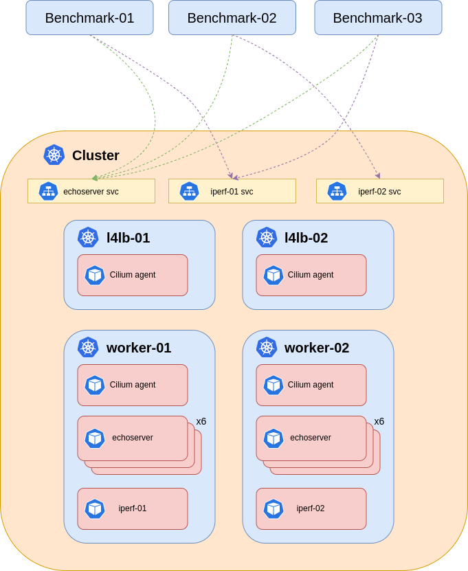

The benchmark systems had the following tuning configuration:

```
ulimit -n 1000000
```

The target system was running the following versions: Kubernetes version: `v1.24.4` and Cilium version: `v1.12.2` Each test, RPS and throughput, was performed separately. Each test was performed 3 times, and in this blog we show the best runs.

### RPS testing:

To test the requests per second (RPS) we used [hey](https://github.com/rakyll/hey) with the following arguments:

```
hey -cpus 4 -c 1000 -z 10m -disable-redirects -disable-keepalive http://[LB_IP]/
```

We were not looking to get the maximum out of this application, but rather see a progression or regression on the different configurations. We ran twelve replicas spread evenly in the worker nodes of the [echoserver](https://github.com/cilium/echoserver) workload, and exposed it via a service `type: LoadBalancer`.

### **Throughput testing:**

For throughput we used the well known [iperf3](https://github.com/esnet/iperf) with the following arguments:

```
iperf3 -c [LB_IP] -t 600 -i 30
```

We deployed two iperf3 workloads independently exposed via two service `type: LoadBalancer`.

## Test 1 (Baseline)

[Here](https://github.com/hetznercloud/cilium-tests) you can find the specific Cilium parameters enabled for all tests, as well as the full output. As a baseline test, we deployed Cilium in the [minimal configuration](https://github.com/hetznercloud/cilium-tests#test-1) and enabled Cilium native BGP and Maglev, kube-proxy, and VXLAN encapsulation.


##### **RPS:**

Total: 64088.5 RPS

P99 latency: 0.0511 - 0.0734 s

It is worth noticing that we had some HTTP timeouts in this test.
Layer 4 Load Balancer

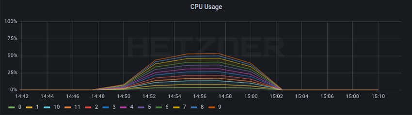

Cilium Worker

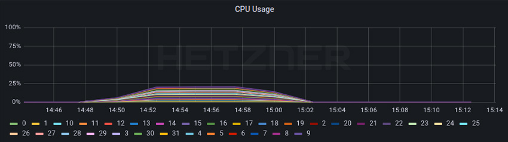

##### **Throughput:**

Total: 12.93 Gbits/sec

Layer 4 Load Balancer

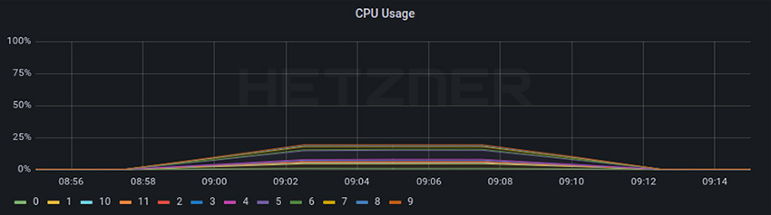

Cilium Worker

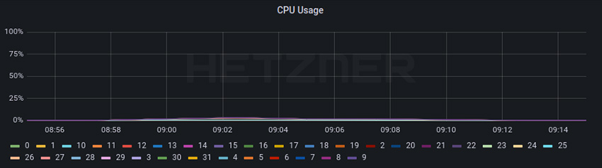

## Test 2

In this test we have deployed Cilium with kube-proxy replacement, VXLAN encapsulation, or Cilium native BGP and Maglev. Exact parameters and test outputs can be found [here](https://github.com/hetznercloud/cilium-tests#test-2).


##### **RPS:**

Total: 77367.8 RPS

P99 latency: 0.0522 - 0.0820 s

Layer 4 Load Balancer

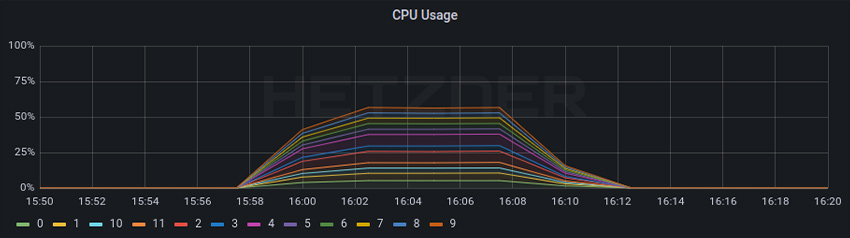

Cilium Worker

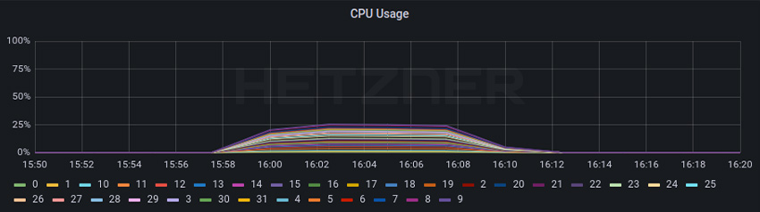

##### **Throughput:**

Total: 13.18 Gbits/sec

Layer 4 Load Balancer

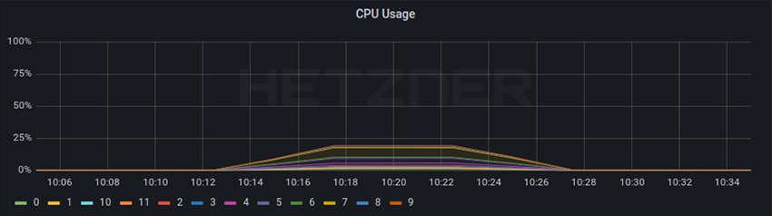

Cilium Worker

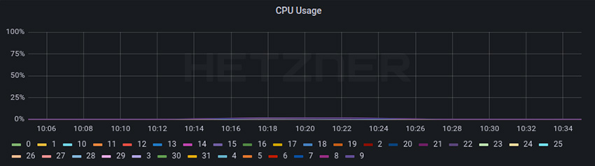

## Test 3

For this test we deployed Cilium with kube-proxy replacement, without encapsulation, Cilium native BGP and maglev. Exact parameters and test output can be found [here](https://github.com/hetznercloud/cilium-tests#test-3).


##### **RPS:**

Total: 85672.3 RPS

P99 latency: 0.0328 - 0.0428 s

Layer 4 Load Balancer


Cilium Worker

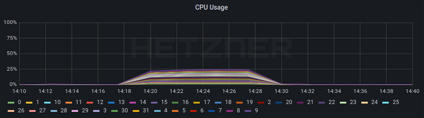

##### **Throughput:**

Total: 16.89 Gbits/sec

Layer 4 Load Balancer

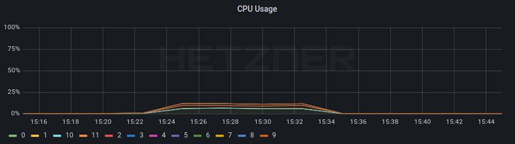

Cilium Worker
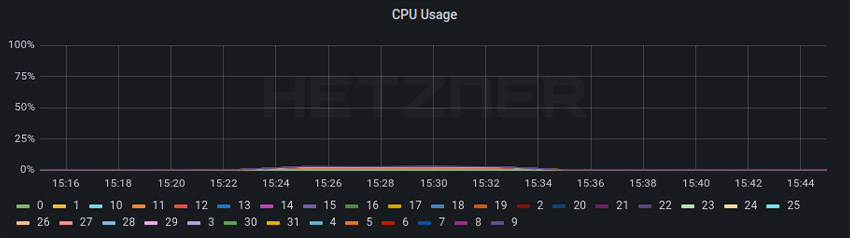

## Test 4A

For this test we deployed Cilium without kube-proxy replacement, without encapsulation, host firewall, DSR, or Cilium native BGP and Maglev. Exact parameters and test output can be found [here](https://github.com/hetznercloud/cilium-tests#test-4a).


##### **RPS:**

Total: 131689.3 RPS

P99 latency: 0.0262 - 0.0266 s


Layer 4 Load Balancer

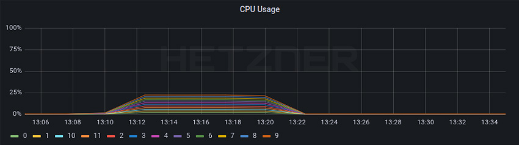

Cilium Worker

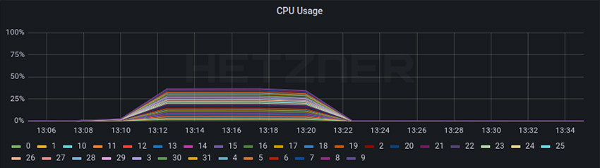

##### **Throughput:**

Total: 18.81 Gbits/sec

Layer 4 Load Balancer

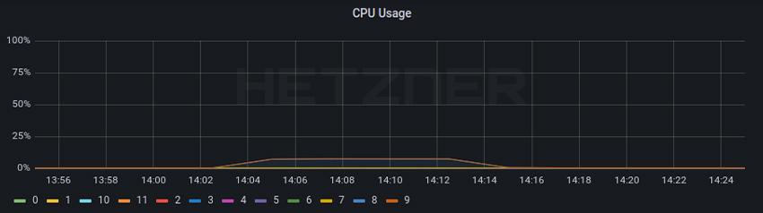

Cilium Worker

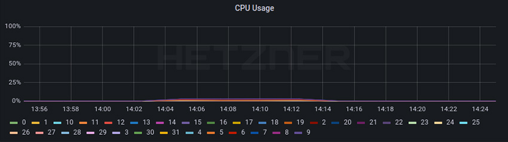

## Test 4B

This test is exactly as 4A, but we deployed a `CiliumNetworkPolicy` to only allow traffic from the two benchmark systems. We have created a third benchmark system, which is firewalled, and we ran the same test to see if there is any noticeable performance regression. Exact parameters and test output can be found [here](https://github.com/hetznercloud/cilium-tests#test-4b).

##### **RPS:**

Total: 131294.4 RPS

P99 latency: 0.0279 - 0.0275 s


Layer 4 Load Balancer

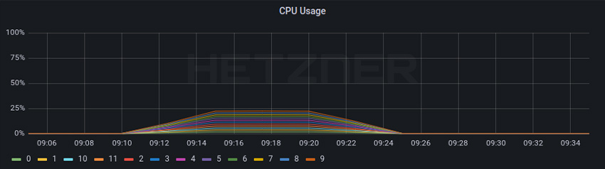

Cilium Worker

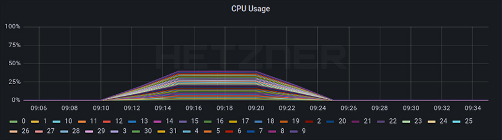

##### **Throughput:**

Total: 18.8 Gbits/sec

Layer 4 Load Balancer

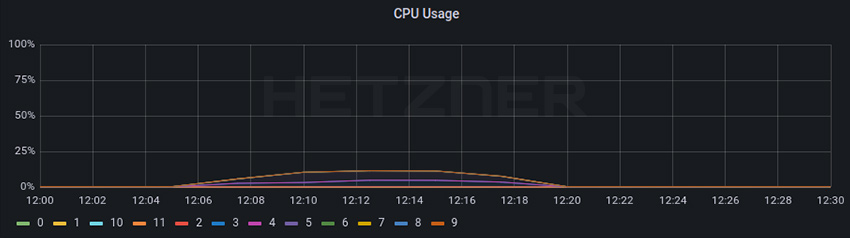

Cilium Worker

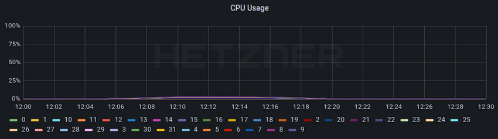

## **Results**

From the baseline to test 4A, the CPU usage for the RPS test decreased from a little bit higher that 50% to a little bit lower that 25% resulting in ~50% less CPU usage even while the RPS increased ~+105%.

For throughput, we can see a CPU usage of ~25% that decreased to ~12% once again resulting in ~50% less CPU usage. We can also see that we started with a throughput of 12,93 Gbits/sec and went to 18,81 Gbits/sec resulting in a ~45% performance increase.

We can see that these improvements were caused by not using VXLAN encapsulation and instead using Direct Routing and DSR.

Enabling firewall (tests 4B) for the RPS test did not seem to have any noticeable impact on CPU or RPS performance in the L4LB nodes, and a nearly unnoticeable higher CPU usage on the worker nodes due to the workload nodes checking for the `CiliumNetworkPolicy` and dropping the packages.

For the throughput (tests 4B), the results are inconclusive. Running the iperf3 test from a third benchmark system firewalled did not actually generate traffic because the first connection was dropped by the firewall rule. Thus we only firewalled the initial iperf3 request to start a test, and not actual traffic generated by the test.

Overall, Cilium provided a massive increase in both RPS and throughput while still reducing CPU usage.  We are looking forward to testing IPv6 once [this bug](https://github.com/cilium/cilium/issues/14509) is fixed. We would like to thank the Cilium team for creating such an amazing Cloud Native Networking solution, and we are looking forward to using more advanced features in the future such as XDP acceleration and Cluster Mesh.

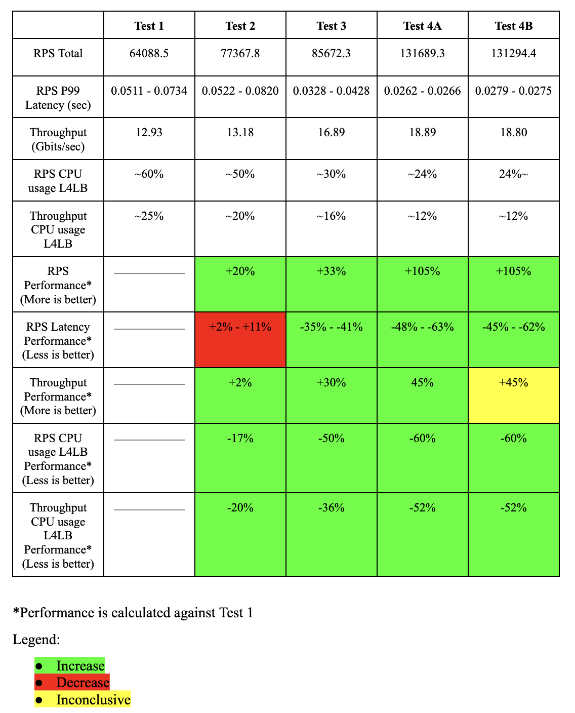
