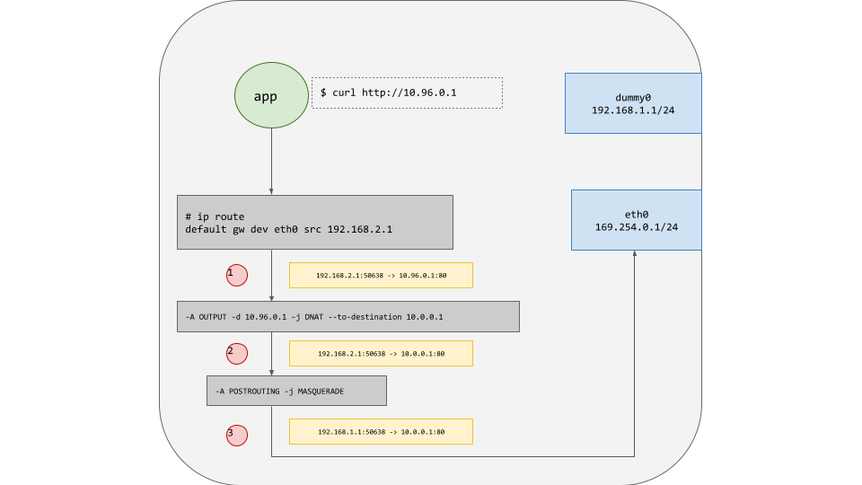
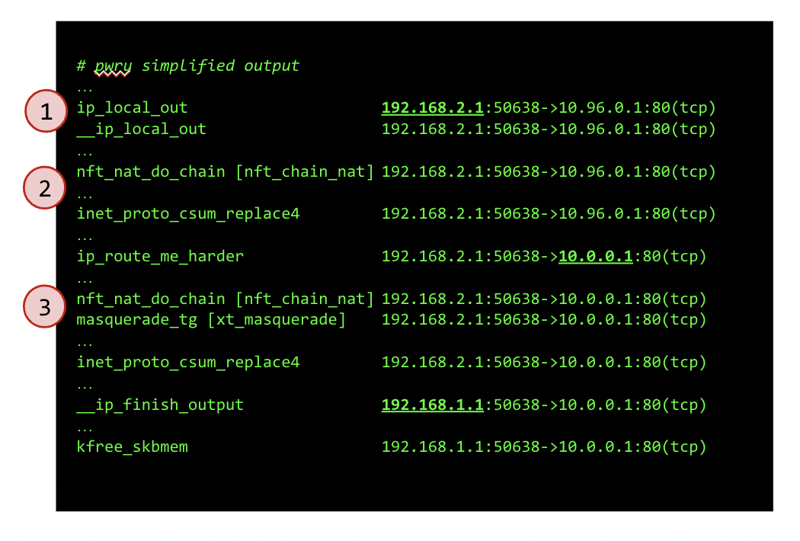

*February 8th, 2023*  
*Authors: Martynas Pumputis and Bill Mulligan, Isovalent*

_This story comes from an open source pwru user_

[pwru](https://github.com/cilium/pwru) is an [eBPF](https://ebpf.io/)-based tool for tracing network packets in the Linux kernel with advanced filtering capabilities. It allows fine-grained introspection of kernel state to facilitate debugging network connectivity issues that are difficult to impossible to solve with traditional tools like iptables TRACE or tcpdump. In this blog, I’ll walk through how pwru solved a networking mystery without having to know everything beforehand.

## Packet Where Aren’t You

We run Kubernetes on Linux hosts where the hosts are themselves BGP routers using BGP unnumbered. Our NICs therefore have IPv6 link local addresses only, but we have routing table entries for IPv4 routes that specify these NICs as next-hops and specify explicit IPv4 source addresses.

This set up works fine for the most part, however we started to have connections that went through kube-proxy getting dropped. The routing would just start to mysteriously fail for a while before starting to work again. Tracing the packets with iptables TRACE, I could see kube-proxy was doing some DNAT and finally a MASQUERADE and then output. The output looked fine, yet the packet never left the box. It was evidently getting dropped somewhere after the iptables stack and before it actually got to the NIC driver.

The natural tendency is to focus on what you can trace, so I was pretty myopic on the idea that iptables was doing something that I wasn't seeing.

_Figure 1. Packet path on the affected system_

## Packet Where Are You

Once I discovered [pwru](https://github.com/cilium/pwru), I just started it up with a filter to match the packets I was losing and got traces of a flow that worked and one that didn't. With that in hand, it was pretty easy to just diff what happened in the cases that worked versus the ones that did not.

It turned out the problem was that IP Masquerade in Linux dynamically chooses the source address to use based on the route the packet is going out. I would have thought IP Masquerade would apply an IPv4 address from the route being used. It does not. 

IP Masquerade only looked for an address on the physical interface the packet was leaving on.   If there is no IPv4 address attached to the next-hop interface, it just picks an IPv4 address at random from the other interfaces that do have an IPv4 address (?!?). In this case, the source address on the next hop route was attached to a dummy interface.

If IP Masquerade unwittingly picked the right interface to borrow an address from, everything worked.  However, if it picked a different one, then it would send the packet with a source address that was on a different interface and the Linux AppArmor and/or reverse path filter code would silently intercept and drop the packet.

To make this more nefarious, when packets are dropped in this way iptables says nothing about it. You can see with the trace that the masquerade rule was applied and then nothing when it is dropped because the following stages never happen. It is just gone. I didn't know there was more code in that path that could decide to drop packets outside of iptables.

_Figure 2. The same packet path from the pwru point of view_

## pwru

That’s the beautiful thing about pwru. Network flow debugging in Linux historically required you to know what you don't know. Because there is no end-to-end-what-happened-to-it facility, you have to know where the packet is getting lost to trace the right thing. pwru provides that end-to-end knowledge and lets you find the culprit even when you didn't know the culprit existed in the first place, which was the case here for me.

pwru is an open source project under the Cilium organization. You can [download it from Github](https://github.com/cilium/pwru) and get started today. If you have any questions, make sure to drop into the #pwru channel on the [Cilium slack](https://cilium.herokuapp.com/).
