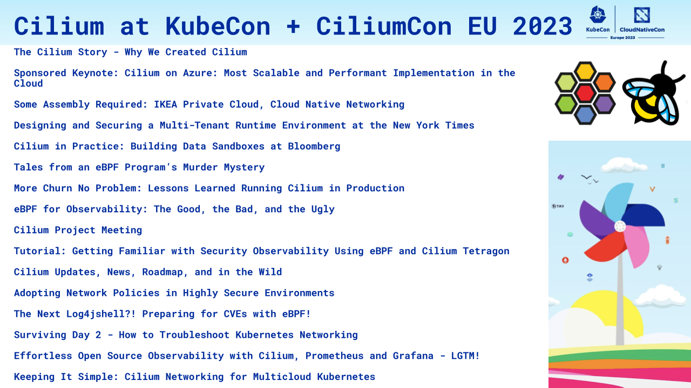

_Author: Bill Mulligan, Isovalent_

KubeCon + CloudNativeCon EU 2023 is right around the corner and it is promising to be a hive of activity around Cilium (all of those tulips won’t pollinate themselves). The first ever [CiliumCon](https://events.linuxfoundation.org/kubecon-cloudnativecon-europe/co-located-events/ciliumcon/) is happening on the Tuesday morning, with talks from users like Bloomberg, New York Times, and Robinhood. Tickets are already completely sold out, but there will be a livestream. You will also be able to join the conversation in the Cilium slack by jumping in the [#ciliumcon channel](https://cilium.slack.com/archives/C0510801E4V).

Head to the [project meeting](https://docs.google.com/document/d/18DjEz8MzvhWkz7Y7ghWYW3Km_wCmmaZ4Z4iurwFgnYk/edit#) on Tuesday afternoon to meet the maintainers and discuss the future of the project.

If that action-packed first day hasn’t already tired you out, there will be 7 other talks about Cilium to catch when the main conference kicks off on Wednesday!

The talks cover networking (and networking gone wrong), deep dives into security observability with Tetragon, and end user stories from people putting Cilium into production. If that isn’t enough, there will also be a Cilium booth in the Project Pavillion where you can get all of your questions answered. Let’s dive into each of the talks below.

[The Cilium Story - Why We Created Cilium - Thomas Graf, Isovalent](https://sched.co/1Jo6C)

Tuesday, April 18 • 09:25 - 09:45

Cilium is well known today but why did we create it? This talk takes us back to the origins of Cilium. Together, we explore the adventure that led to the creation of the first few lines of Cilium source code. What was the vision? How close was it to what Cilium has become today? As we make our way exploring the many Cilium milestones, we look back to Cilium's roots in Switzerland, the many surprises on the way, and the major milestones that put Cilium on the trajectory it is today.

[Sponsored Keynote: Cilium on Azure: Most Scalable and Performant Implementation in the Cloud- Deepak Bansal, Microsoft](https://sched.co/1Jo69)

Tuesday, April 18 • 09:15 - 09:20

Microsoft is thrilled to announce investments we are making to fuse power of Azure Virtual Network stack with Cilium’s eBPF capabilities in close partnership with Isovalent. Cilium in Azure will provide highly efficient load-balancing, extensive network security features, and rich observability integrated well along with robust and scalable Azure CNI IP management and native Azure networking routing, to give the most performant and best-in-class container networking platform available in the cloud.

[Some Assembly Required: IKEA Private Cloud, Cloud Native Networking - Karsten Nielsen, IKEA Retail](https://sched.co/1Jo6F)

Tuesday, April 18 • 09:50 - 10:15

Like any piece of IKEA furniture, cloud-native platforms require some assembly.

Anyone who has built either knows that the most challenging part is connecting all the pieces together correctly. Cilium has become a key piece connecting the vast cloud native estate of IKEA Retail (Ingka Group) encompassing both public and private cloud Kubernetes clusters.

The top three cloud-native networking challenges for IKEA Retail (Ingka Group) were to reduce operational and hardware costs by moving Load Balancing capabilities from dedicated hardware into Kubernetes, scaling and managing clusters to deal with IPv4 exhaustion. Having a predictable IP addresses for outbound traffic.

This session walks through how IKEA Retail (Ingka Group) solved each of these challenges in production with Cilium. Ingress from Cilium Service Mesh and the ability to setup Load Balancers to eliminated the need for expensive hardware load balancers. LB IPAM with BGP provided flexibility in allocating and advertising Service IP's to the physical network. Finally, Egress Gateway predictable connectivity to legacy workloads.

We will examine the IKEA Retail (Ingka Group) business and technical requirements for delivering reliable and scalable applications and how Cilium supported IKEA Retail (Ingka Group) to meet their critical goals, with only some assembly required.

[Designing and Securing a Multi-Tenant Runtime Environment at the New York Times - Ahmed Bebars, The New York Times](https://sched.co/1Jo6I)

Tuesday, April 18 • 10:20 - 10:45

Networking choice matters, especially when building multi-tenant Kubernetes clusters to host thousands of containers. In this session, Ahmed will walk you through the New York Times’s networking Journey from initial drawing to Day 2 and beyond operations., The New York Times team was building multi-tenant Kubernetes clusters to complement the Internal Developer platform and needed networking that could securely scale up to 100+ Nodes. Cilium was a critical choice to increase networking performance while providing identity and application-aware security and visibility for cloud native workloads running on EKS. It was an exciting journey but, of course, not an incident-free one. We faced issues that led us to dive into the Cilium codebase to understand and debug critical production issues, with the fix eventually being contributed to Ciliumupstream. The audience will learn what requirements led us to choose Cilium, the design tradeoffs and security choices we need to make, and the obstacles we faced before and beyond production, and will walk away with a good understanding of how to save time on their own Cilium Journey.

[Cilium in Practice: Building Data Sandboxes at Bloomberg - Anne Zepecki & Sritej Attaluri, Bloomberg LP](https://sched.co/1Jo6L)

Tuesday, April 18 • 10:50 - 11:15

Quant developers and data scientists utilize various data sources in their research workflows. Bloomberg’s quant analytics platform, BQuant Enterprise, is built with Kubernetes, integrates with major public clouds, and allows researchers to seamlessly mix Bloomberg’s comprehensive data sets alongside their own data as they test and deploy new investment strategies. Data vendors typically sell data at different prices tied to different usage terms and limitations. In providing experimentation environments where researchers can build data pipelines without full data license fees, Bloomberg leverages Cilium to construct data sandboxes that restrict users from distributing data outside the sandbox. In this talk, we’ll discuss how in-cluster L7 Cilium policies enable us to create isolated research environments. We hope you will walk away from this talk with an understanding of a unique application of Cilium for an enterprise product and how Cilium could be a valuable solution for you, too!

[Tales from an eBPF Program’s Murder Mystery - Hemanth Malla & Guillaume Fournier, Datadog](https://sched.co/1Jo6O)

Tuesday, April 18 • 11:25 - 11:50

On a beautiful fall evening, when Cilium was busy processing packets, some of its eBPF programs were murdered, leading to connectivity issues across the cluster. Join detectives Hemanth & Guillaume as they narrate tales from a multi-week investigation involving Cilium and eBPF. As eBPF continues to grow in popularity, this talk serves as a cautionary tale with pitfalls to avoid for developers who intend to build systems that need to co-exist with other eBPF-based components. This talk will include a quick overview of the Linux traffic control subsystem and how you can program it with eBPF. You’ll then get a walkthrough of how the speakers identified the root cause of the incident down to a race condition and the function guilty of the murder. You’ll learn to take advantage of bpftrace and its tools for your debugging needs. Lastly, the talk will conclude by discussing some of the ongoing work of eBPF program ownership, how it impacts security use cases and why solving for it is crucial.

[More Churn No Problem: Lessons Learned Running Cilium in Production - Lu Zhang & Madhu C.S., Robinhood Markets](https://sched.co/1Jo6R)

Tuesday, April 18 • 11:55 - 12:20

In this talk, we’ll share Robinhood’s war stories from running Cilium in a high-churn near-production environment, how we have overcome challenges by better understanding and tuning Cilium, and why we now live happily-ever-after™. Robinhood has been running Cilium for over a year in the environment that hosts the entire company’s integration tests and personal development namespaces. The environment is treated with the same seriousness and response SLA as production because it’s critical to our entire company’s engineering and product development. Due to the nature of the workloads, it is a high churn environment and brings many interesting challenges. We moved from the traditional VPC-based CNI model to Cilium overlay networking to improve pod density, scalability and cost efficiency. While we were able to achieve a significantly higher pod density (~6x) and cost efficiency, this has come with its own set of challenges. We ran into Cilium rate limiting challenges, identity garbage collection bugs, loss of internet egress connectivity for pods, bottlenecks in our environment, and many others. The audience will walk away with an understanding of what it takes to run Cilium in production and some of the edge cases they may encounter.

[eBPF for Observability: The Good, the Bad, and the Ugly - Anna Kapuscinska, Isovalent](https://sched.co/1Jo8W)

Tuesday, April 18 • 16:50 - 17:15

eBPF’s promise of zero-instrumentation observability with low performance overhead sounds like a dream and is driving wide adoption in observability tooling. At the same time, as a relatively low-level technology it is often poorly understood or even feared. To bridge this gap, we will dive into how eBPF serves the observability field. Anna will start by introducing eBPF features that let us achieve observability with no code changes. Next, she will examine at a few distinct eBPF use cases in open source tools: _ getting insights from granular system events (e.g. Tetragon) _ continuous profiling (e.g. Pixie) \* distributed tracing auto-instrumentation (OpenTelemetry) Peeking at both eBPF code and user interfaces will help us understand the potential of the technology. Finally, Anna will discuss the limits of using eBPF for observability and how it plays together with other frameworks. The audience will walk away understanding what works and what doesn’t when using eBPF for observability.

[Cilium Project Meeting](https://sched.co/1JWRk)

Tuesday, April 18 • 15:30 - 17:30

Meet the maintainers and learn where Cilium is heading. [Sign up](https://docs.google.com/document/d/18DjEz8MzvhWkz7Y7ghWYW3Km_wCmmaZ4Z4iurwFgnYk/edit#) for what you are interested in!

[Tutorial: Getting Familiar with Security Observability Using eBPF and Cilium Tetragon - Tracy P Holmes & Duffie Cooley, Isovalent](https://sched.co/1HyZg)

Wednesday, April 19 • 16:30 - 18:00

There are many people who are interested in observability but don't understand what data matters or even where to start. There are others who do understand these things, yet have no idea how to spot certain activities (malicious or otherwise!) This is where Security Observability comes into play. Security Observability in general is about providing more context into events involving an incident. However, researching those events does not have to be confusing or difficult. In this session, we will help overcome these doubts by learning more about a good kind of S.O.R.E.ness - the Security Observability and Runtime Enforcement kind! In four steps we will: 1. Introduce the fundamentals of Cilium Tetragon and the basics of Security Observability 2. Discuss the layers where Tetragon can extract data from and provide enforcement 3. Determine exactly what activities to care about and to monitor, and how to spot those activities 4. Walk through a brief deep dive into network connections and the associated events. The audience will walk away with a better understanding of the types of data and activity that should be monitored in order to prevent malicious events, and the ability to detect a container escape step-by-step.

[Cilium Updates, News, Roadmap, and in the Wild - Liz Rice, Isovalent; Andy Allred, EfiCode; Richard Hartmann, Grafana Labs](https://sched.co/1HyTU)

Wednesday, April 19 • 17:25 - 18:00

Welcome to Cilium! In this session you'll get an update on how Cilium has been progressing as a project and on the road towards graduation. You'll hear about the latest developments and future roadmap. We will cover how Cilium is bringin eBPF powered data to the world of observability and why Cilium has become the CNI of choice in the wild. In this session you'll hear from Cilium contributors and users Isovalent, Grafana Labs, and Eficode.

[Adopting Network Policies in Highly Secure Environments - Raymond de Jong, Isovalent](https://sched.co/1HyYr)

Wednesday, April 19 • 17:25 - 18:00

In the world of distributed computing, everything goes over the network, but not everything should be public. Unfortunately, Kubernetes networking is open by default and it is up to you to adopt network policies to secure it. Using our knowledge of implementing network policies in complex regulated environments, we will introduce the fundamentals of Cilium Network Policies and the basics of application-aware and Identity-based Security. With these building blocks in place, we will compare a default-allow with a default-deny policy and how a risk-based approach helps you focus on securing the most sensitive workloads first. We will then discuss various exposure types and strategies for securing your workloads. Applying this theoretical knowledge to the real world, we will explore how observability tools Cilium, Hubble, and Grafana provide you with Network Policy superpowers, like showing how ingress and egress connections are visualized, enabling you to configure the Network Policies using the Network Policy editor. Finally, we will discuss how Network Policy Guardrails allow for keeping control while granting teams self-service management of Network Policies. The audience will learn how to secure their network effectively and efficiently, even for highly sensitive workloads.

[The Next Log4jshell?! Preparing for CVEs with eBPF! - Natalia Reka Ivanko & John Fastabend, Isovalent](https://sched.co/1Hybi)

Friday, April 21 • 11:55 - 12:30

Log4jshell, which has been considered the biggest 0 day vulnerability of this decade, is still affecting thousands of servers worldwide. If you were affected, would it have been any different if you had used eBPF? Could you observe the malicious external connection, the JNDI lookup, the Java class download, or the remote code execution? Or even better, could you prevent it? Since eBPF provides us with a unique visibility directly into any Kubernetes workload on a single shared kernel - the answer is yes. This talk will take Log4jshell as a learning lesson and show you how it could have been detected and blocked in real time inside the kernel using eBPF. We will walk you through how open source eBPF based tools can give full network and process-level visibility to detect and prevent Log4jshell and your next CVE. We’ll finish by showcasing how Security Teams can easily put these tools in place to protect their critical Kubernetes environment and by giving Security best practices on how to prepare for their next CVE with eBPF.

[Surviving Day 2 - How to Troubleshoot Kubernetes Networking - Thomas Graf, Isovalent](https://sched.co/1HydA)

Friday, April 21 • 11:55 - 12:30

Kubernetes is widely deployed. Kubernetes networking is at the core of every platform and then there is DNS. In this talk, we will dive into the inner workings of Kubernetes networking, learn how to troubleshoot it, and most importantly, describe how to monitor it properly to prevent incidents in the first place. In this session, we will walk through the essential toolbox for efficient networking troubleshooting and then set up preventive measures together: - Understanding the Kubernetes networking model - How to troubleshoot and resolve DNS errors - Debugging Kubernetes Services & Ingress and increasing resiliency - Locating the source of networking errors - Is it an app, CNI, or underlying network problem? - Troubleshooting Kubernetes Network Policy drops - How to set up metrics dashboards and alerting to prevent network incidents All troubleshooting steps will be demonstrated in a live Kubernetes cluster and all steps will be found in the presentation slides and on GitHub.

[Effortless Open Source Observability with Cilium, Prometheus and Grafana - LGTM! - Raymond de Jong & Anna Kapuścińska, Isovalent](https://sched.co/1HyYo)

Friday, April 21 • 14:55 - 15:30

Updating applications to include observability can be almost impossible, but the other option is not know if your application is even working. Enter Cilium which leverages eBPF to provide observability data with Prometheus metrics for your applications without having to modify the application itself. In this session we will explain how Cilium powered with Hubble and the Grafana LGTM stack is able to show Service to Service communication, monitor Golden Signals, detect transient network layer issues and identifies problematic API request with transparent tracing. Using a demo application we will demonstrate performance and metrics for that application and how the metrics change with increasing request volumes. We will show how metrics change when a new configuration of our application introduces error rates and increases request duration. Finally, we will show how tracing headers for the application can be exported with Hubble HTTP metrics as Exemplars to link metrics to traces in Grafana, monitoring each request and its duration using Tempo. The audience will walk away with knowledge on how to monitor service connectivity and collect tracing data and golden metrics using standard Prometheus, Grafana, and OpenTelemetry exported from Cilium and eBPF.

[Keeping It Simple: Cilium Networking for Multicloud Kubernetes - Liz Rice, Isovalent](https://sched.co/1Hyaz)

Friday, April 21 • 16:55 - 17:30

Kubernetes promises that we can run containerized workloads in any cloud, and according to a recent article InfoWorld “2023 may [finally] be the year of multicloud Kubernetes”. For this to happen, we need seamless connectivity between workloads across clusters, regardless of the cloud they’re running on. From the perspective of a developer, shouldn’t connectivity across clouds be as simple as connectivity within a cluster? This talk explores - and demonstrates - how Cilium and its ClusterMesh feature can take care of many aspects of connectivity across multiple clusters in a cloud-agnostic way. It will show how just a few additional lines of YAML in your existing Kubernetes resources can enable: - Connectivity between services spread across clouds - Load balancing requests across backends in multiple clusters - Connectivity between Kubernetes and legacy workloads - Mutually-authenticated, encrypted connections between services - Multi-cluster network policies The talk will also discuss some of the challenges related to IP address management, scale, and observability of multi-cluster networks, and how Cilium can help.

Mention this blog post to me at the conference and I’ll even have a special prize. See you there!
